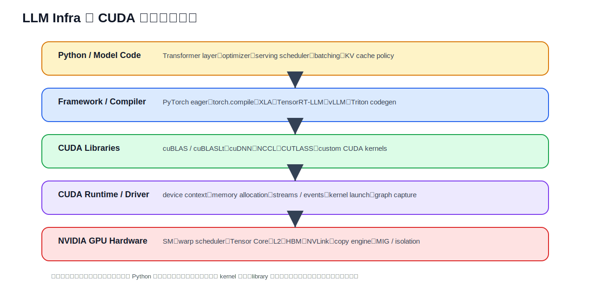
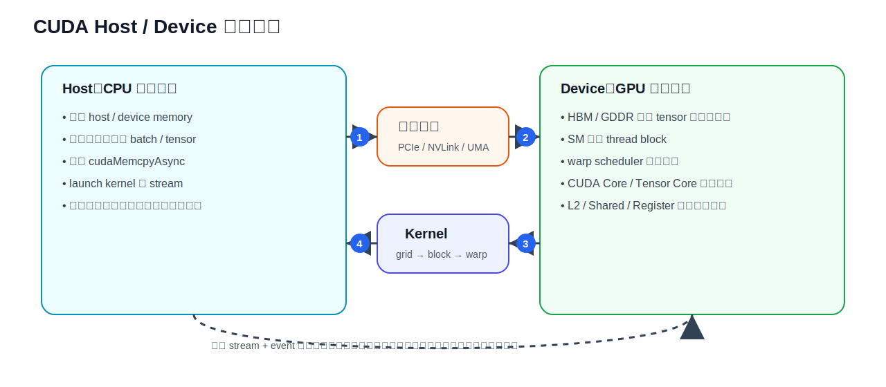
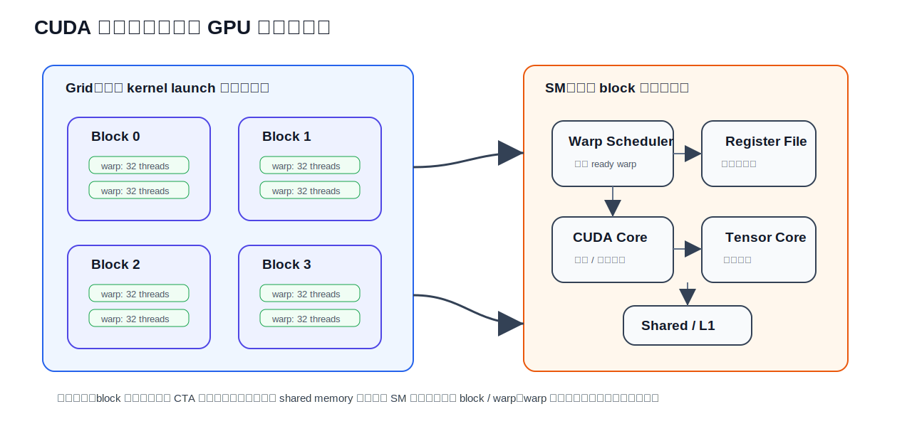
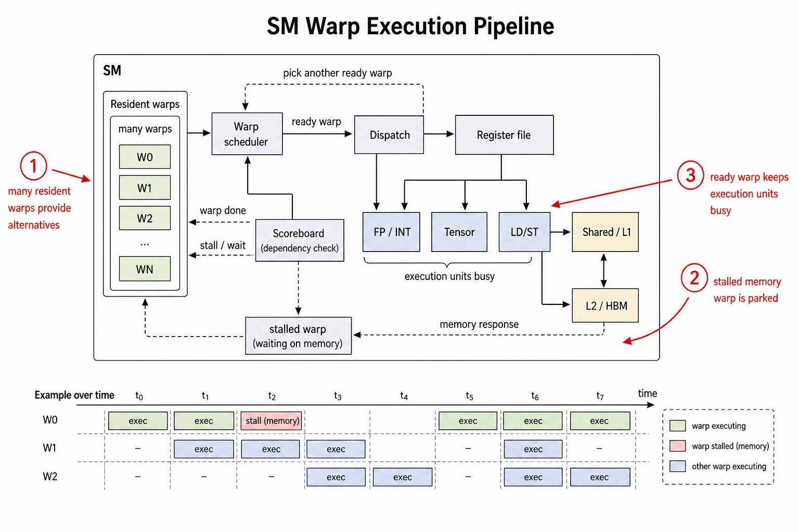
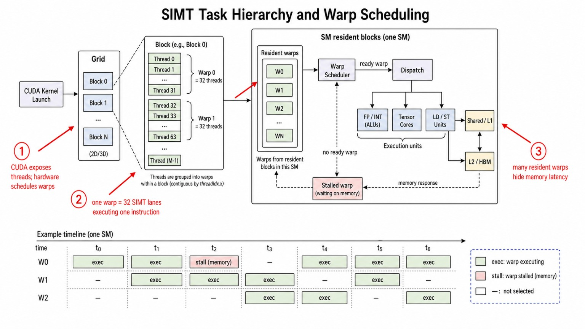
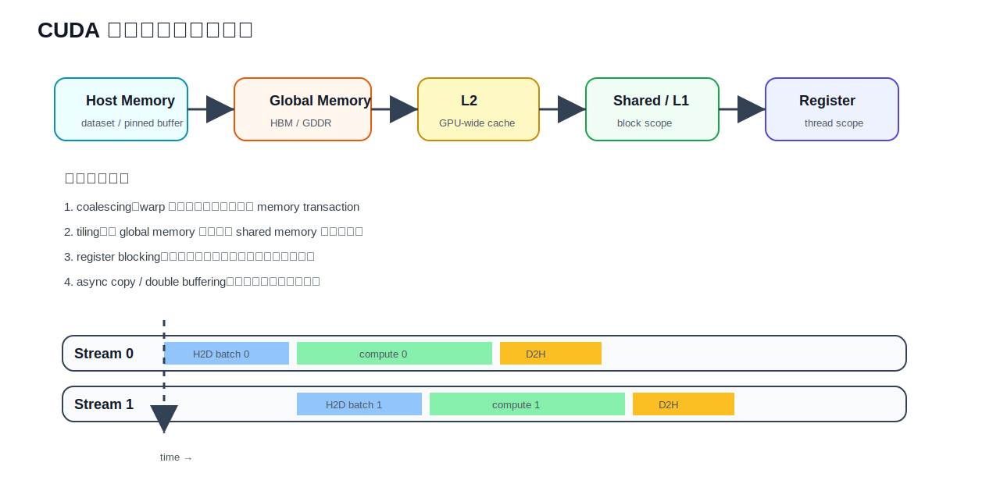
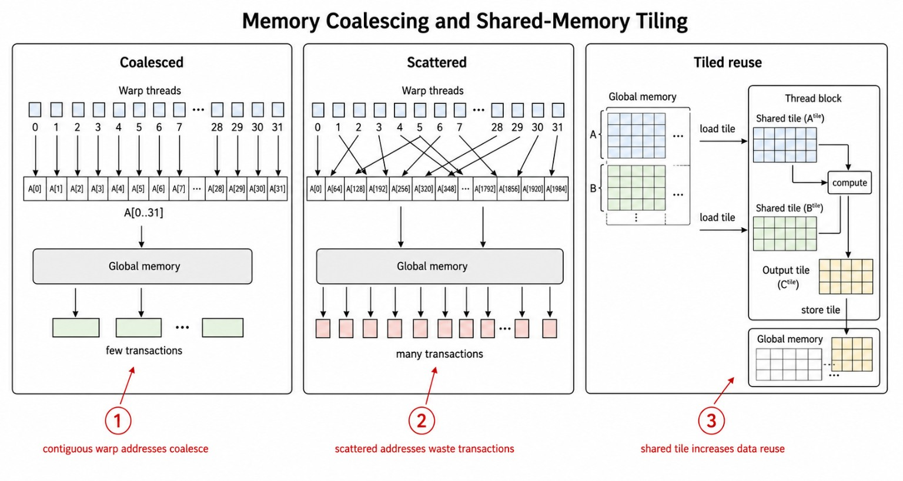
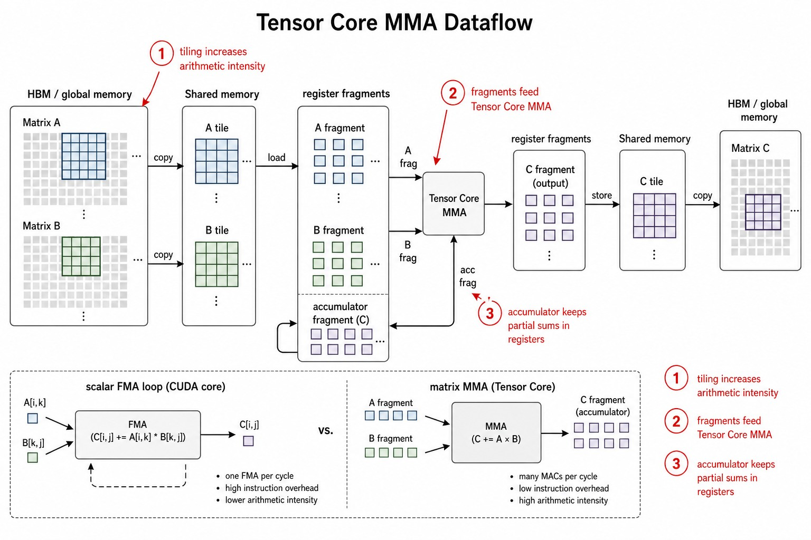
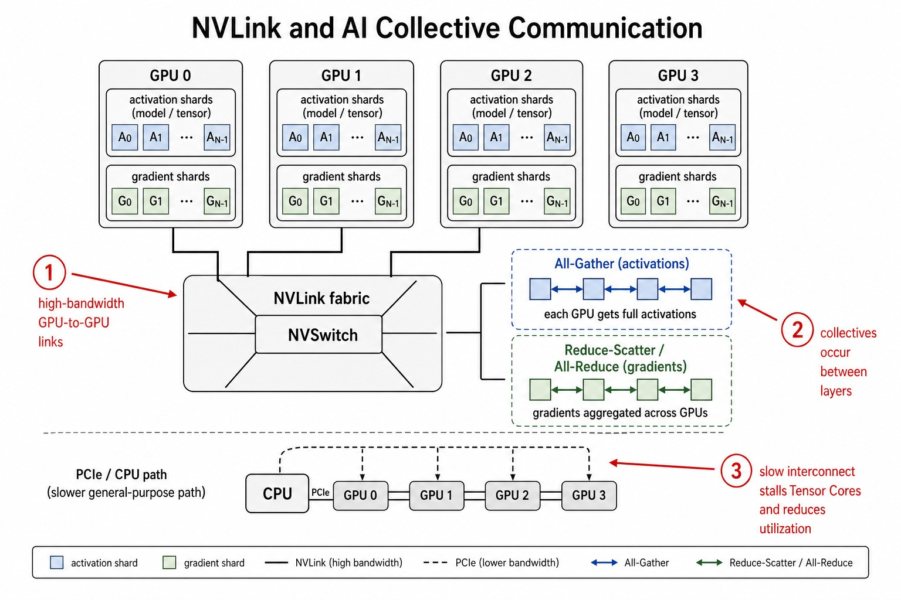

# CUDA 编程模型与 GPU 计算系统深度技术综述

版本日期：2026-06-10

---

## 摘要

CUDA（Compute Unified Device Architecture）是 NVIDIA 把 GPU 从“固定图形管线加速器”推向“通用并行计算平台”的关键软件接口。它不仅是一套 C / C++ 扩展语法，也是一整套围绕 device、context、memory、stream、kernel launch、library 和 profiling 构建起来的计算系统抽象。对 LLM Infra 工程而言，CUDA 是 PyTorch、Triton、cuBLAS、cuDNN、NCCL、TensorRT-LLM、vLLM 等上层系统最终落到 NVIDIA GPU 上执行的共同底座。

本文按“系统问题”而不是“API 词典”展开：先解释 CUDA 为什么需要 Host / Device 分工，再讨论 kernel 如何映射到 grid、block、thread、warp 和 SM；随后把显存层级、stream 异步流水、kernel fusion、Tensor Core、通信和 profiling 串起来，说明一个 LLM 训练或推理任务为什么会表现为若干 compute、memory、communication 和 scheduling bottleneck。读完本文后，读者应能把一次 PyTorch op、一次 Triton kernel、一次 NCCL all-reduce 或一次推理 decode step，映射回 CUDA 的执行模型和性能分析语言。

**文档定位**：本文面向希望理解 LLM Infra 底层执行机制的工程读者。它不是 CUDA API 手册，也不追求覆盖所有 runtime / driver 函数；重点是建立“模型代码 → CUDA 软件栈 → GPU 硬件数据流 → 性能瓶颈”的技术综述框架。

**阅读建议**：可以和同目录的 [NVIDIA GPU 硬件体系结构与架构演进深度技术综述](./nvidia_gpu_architecture_evolution.md) 配合阅读。那篇文章偏硬件演进，本文偏 CUDA 编程模型和系统执行路径。

---

## 目录

**第一部分 CUDA 为什么存在**

- 第 1 章 从 GPU 通用计算问题开始
- 第 2 章 CUDA 软件栈的位置
- 第 3 章 Host / Device 执行闭环

**第二部分 CUDA 执行模型**

- 第 4 章 Kernel、Grid、Block、Thread 与 Warp
- 第 5 章 SM 如何执行 CUDA 线程
- 第 6 章 SIMT、分支和同步

**第三部分 数据与内存系统**

- 第 7 章 CUDA 存储层级
- 第 8 章 数据移动、Pinned Memory 与 Unified Memory
- 第 9 章 Shared Memory、Tiling 与访存合并

**第四部分 性能与工程化**

- 第 10 章 Stream、Event 与异步流水
- 第 11 章 Tensor Core、库函数与自定义 Kernel
- 第 12 章 Kernel Fusion、CUDA Graph 与 Launch Overhead
- 第 13 章 多 GPU：NCCL、NVLink 与通信重叠
- 第 14 章 Profiling：从时间线到瓶颈归因

**第五部分 面向 LLM Infra 的理解框架**

- 第 15 章 训练链路中的 CUDA
- 第 16 章 推理链路中的 CUDA
- 第 17 章 常见性能症状与排查路径

**第六部分 代码示例与实验路线**

- 第 18 章 CUDA C++ 最小工程：从 vector add 到错误检查
- 第 19 章 Shared Memory Tiled Matmul：把 tiling 写成代码
- 第 20 章 Stream Pipeline：Pinned Memory、异步拷贝与事件计时
- 第 21 章 PyTorch / Triton / 自定义 CUDA 的连接方式
- 第 22 章 Profiling Lab：如何用命令把瓶颈定位到代码
- 第 23 章 学习路线与参考资料

---

## 第一部分 CUDA 为什么存在

### 第 1 章 从 GPU 通用计算问题开始

#### 1.1 GPU 的优势不是“单个线程快”

CPU 和 GPU 的根本差异不是一个“高级”、一个“低级”，而是硬件预算投向不同：

| 维度 | CPU 更擅长 | GPU 更擅长 |
|---|---|---|
| 目标 | 低延迟完成复杂控制流 | 高吞吐完成海量相似任务 |
| 典型硬件投入 | 分支预测、大缓存、乱序执行、强单线程 | 大量执行单元、高带宽显存、海量线程驻留 |
| 典型任务 | 操作系统、数据库事务、服务端逻辑 | 矩阵乘法、向量算子、图像处理、深度学习 |
| 性能风险 | cache miss、锁竞争、分支错误预测 | 显存带宽、warp divergence、occupancy、数据复用不足 |

CUDA 的价值在于：它给开发者一个可以显式表达并行任务、显式管理 GPU 数据、显式控制异步执行的接口。没有 CUDA 这样的编程模型，上层框架就很难稳定地把 Transformer 中的大量矩阵乘法、归一化、attention、采样和通信映射到 GPU 上。

#### 1.2 CUDA 把 GPU 暴露成可编程计算设备

早期 GPU 主要通过图形 API 被使用，开发者需要把通用计算“伪装”成图形渲染任务。CUDA 出现后，GPU 被抽象为一个可编程的并行计算设备：

- 开发者写 kernel，描述每个线程要做什么。
- Runtime / Driver 负责把 kernel launch 提交给 GPU。
- GPU 以 block / warp 为单位调度线程。
- 数据显式或半显式地在 CPU 内存与 GPU 显存之间移动。
- 库和编译器把高频模式沉淀成可复用的高性能实现。

因此，CUDA 既是编程接口，也是一个系统边界：它定义了 CPU 如何请求 GPU 工作、GPU 如何接收工作、数据如何跨越主机和设备、性能工具如何观察这些工作。

### 第 2 章 CUDA 软件栈的位置

在 LLM Infra 中，大多数人不会每天手写 CUDA C++。但无论是 PyTorch eager、torch.compile、Triton、cuBLASLt、NCCL，还是 TensorRT-LLM、vLLM、FlashAttention，最终都要落到 CUDA runtime / driver 和 NVIDIA GPU 硬件上。



<small>图 2-1：LLM Infra 中 CUDA 所处的软件栈。模型代码通常不直接调用 CUDA C++，但框架、编译器、库函数、自定义 kernel、runtime / driver 最终都会进入 GPU 硬件执行路径。</small>

#### 2.1 Runtime API 与 Driver API

CUDA 常见接口可以粗略分为两层：

| 接口层 | 典型定位 | 工程直觉 |
|---|---|---|
| CUDA Runtime API | 更接近应用开发，封装 context、module 等细节 | 常见于普通 CUDA C++ 程序和很多框架内部调用 |
| CUDA Driver API | 更底层，显式管理 context、module、function 等对象 | 常见于框架 runtime、JIT、编译器和高级执行系统 |

对 LLM Infra 学习者来说，不必一开始记住每个 API 的函数签名，但需要理解它们共同承担的职责：设备发现、上下文管理、内存分配、数据拷贝、kernel launch、stream / event 同步、错误传播和 profiling 标记。

#### 2.2 CUDA Toolkit、库和编译器

CUDA Toolkit 不只是 `nvcc`。它包含编译器、runtime、调试工具、profiling 工具和大量 GPU 加速库：

| 组件 | 作用 | LLM Infra 中的典型位置 |
|---|---|---|
| nvcc / ptxas | 编译 CUDA C++，生成 PTX / SASS | 自定义 CUDA op、研究 kernel、扩展框架 |
| cuBLAS / cuBLASLt | 高性能 GEMM 和线性代数 | Transformer 中 QKV projection、MLP、logits projection |
| cuDNN | 深度学习算子库 | normalization、attention、卷积模型、部分 fused op |
| NCCL | 多 GPU 通信集合原语 | DDP、FSDP、Tensor Parallel、Pipeline Parallel |
| CUTLASS | CUDA C++ 模板化矩阵计算组件 | 自定义 GEMM、理解 Tensor Core tiling |
| Nsight Systems | 系统级时间线 profiler | 找同步点、CPU launch gap、通信计算重叠问题 |
| Nsight Compute | 单 kernel 指标 profiler | 找内存吞吐、occupancy、stall、Tensor Core 利用率问题 |

这也是为什么“CUDA 性能问题”不一定是手写 kernel 的问题。它可能来自上层框架选择了不合适的库算法，可能来自 shape 导致 GEMM tile 不友好，也可能来自 Python 调度造成 GPU 空泡。

### 第 3 章 Host / Device 执行闭环

CUDA 程序通常被拆成两侧：Host 是 CPU 侧控制面，Device 是 GPU 侧数据面。Host 决定什么时候分配内存、什么时候搬数据、什么时候 launch kernel、什么时候同步；Device 负责执行大量并行线程并写回结果。



<small>图 3-1：CUDA Host / Device 执行闭环。Host 负责调度和提交任务，Device 负责高吞吐执行。异步 stream 和 event 让数据移动、计算与通信可以形成流水。</small>

#### 3.1 典型执行步骤

一个最小 CUDA 任务通常包含以下步骤：

1. Host 准备输入数据。
2. Host 分配 device memory。
3. Host 把输入从 host memory 拷贝到 device memory。
4. Host launch kernel。
5. Device 上的 SM 执行 kernel，把结果写回 device memory。
6. Host 等待 kernel 完成。
7. Host 把结果拷回，或继续交给下一个 GPU kernel。

在深度学习框架中，这些步骤通常被封装为 tensor allocation、operator dispatch、autograd node、library call、stream scheduling 和 allocator bookkeeping。框架隐藏了样板代码，但没有改变底层事实：数据位置、同步点、kernel 数量和执行顺序仍然决定性能。

#### 3.2 同步是性能分析中的高频陷阱

CUDA kernel launch 默认通常是异步提交：Host 发出任务后不一定等待 GPU 完成，而是继续提交后续工作。真正让 Host 等 GPU 的操作包括：

- 显式设备同步，例如 `cudaDeviceSynchronize`。
- 某些阻塞式数据拷贝。
- 从 GPU tensor 取标量到 CPU，例如某些框架中的 `.item()`。
- 跨 stream 依赖处理不当。
- profiler 或 debug 模式插入的同步。

很多训练或推理延迟尖刺并不是 GPU 某个 kernel 突然变慢，而是 Host / Device 同步边界被触发，导致流水线断开。

---

## 第二部分 CUDA 执行模型

### 第 4 章 Kernel、Grid、Block、Thread 与 Warp

#### 4.1 Kernel 是 GPU 上执行的并行函数

CUDA kernel 是由 Host 发起、在 Device 上被大量线程并行执行的函数。每个线程执行同一份 kernel 代码，但通过内置索引变量决定自己处理哪一份数据。

一个最小向量加法示例：

```cpp
__global__ void vector_add(const float* a, const float* b, float* c, int n) {
    int idx = blockIdx.x * blockDim.x + threadIdx.x;
    if (idx < n) {
        c[idx] = a[idx] + b[idx];
    }
}

int threads_per_block = 256;
int blocks = (n + threads_per_block - 1) / threads_per_block;
vector_add<<<blocks, threads_per_block>>>(a_device, b_device, c_device, n);
```

这段代码最重要的不是加法，而是任务映射：`blockIdx.x * blockDim.x + threadIdx.x` 把一个逻辑线程映射到一个数据元素。矩阵乘法、归约、attention、layernorm 也都需要类似的映射，只是它们通常把数据切成 tile，再映射到 block、warp 和 thread。

#### 4.2 线程层级和硬件层级不是同一个概念

CUDA 暴露的逻辑层级是 grid、block、thread；GPU 硬件真正调度时还会引入 warp 和 SM。



<small>图 4-1：CUDA 逻辑线程层级到 GPU 硬件的映射。Grid 表示一次 kernel launch 的整体任务空间，block 被分配到 SM 上执行，thread 在硬件上按 warp 分组调度。</small>

| 层级 | CUDA 视角 | 硬件 / 性能视角 |
|---|---|---|
| Grid | 一次 kernel launch 的所有 block | 提供足够多的任务让 GPU 全局并行 |
| Block / CTA | 一组可协作线程 | 被调度到某个 SM；资源用量影响 occupancy |
| Thread | 执行 kernel 代码的逻辑线程 | 保存寄存器状态，负责一个或多个数据元素 |
| Warp | CUDA 程序员通常不显式创建 | 硬件调度基本单位，NVIDIA 上通常为 32 个线程 |
| SM | CUDA 代码不直接指定具体 SM | 驻留多个 block / warp，通过切换 warp 隐藏延迟 |

#### 4.3 Grid-stride loop

很多生产级 kernel 不假设“一个线程只处理一个元素”，而是使用 grid-stride loop，让同一个线程跨步处理多个元素：

```cpp
__global__ void scale(float* x, float alpha, int n) {
    int tid = blockIdx.x * blockDim.x + threadIdx.x;
    int stride = blockDim.x * gridDim.x;
    for (int i = tid; i < n; i += stride) {
        x[i] *= alpha;
    }
}
```

这种写法的好处是：

- kernel 可以适配不同输入规模。
- grid size 不必等于数据规模。
- 每个线程可以承担多个元素，减少过大的 launch 配置。
- 便于在调试时用较小 grid 运行同一份代码。

### 第 5 章 SM 如何执行 CUDA 线程

SM（Streaming Multiprocessor）是 NVIDIA GPU 中最核心的可编程计算单元。一个 SM 内通常包含 warp scheduler、register file、load/store unit、shared memory / L1、CUDA Core、Tensor Core 等模块。不同架构细节会变化，但核心思想稳定：让大量 warp 常驻，在等待内存或依赖时切换到其他 ready warp。



<small>图 5-1：SM warp 执行流水。一个 SM 中驻留多个 warp；当某个 warp 等待内存或依赖时，调度器切换到其他 ready warp，以隐藏延迟。</small>

#### 5.1 Occupancy 的含义

Occupancy 通常指一个 SM 上活跃 warp 数量相对于理论上限的比例。它受以下因素限制：

- 每个 thread 使用多少 register。
- 每个 block 使用多少 shared memory。
- 每个 block 有多少 thread。
- 每个 SM 支持的最大 block / warp 数量。
- 架构限制和编译器生成代码的资源需求。

高 occupancy 可以帮助隐藏延迟，但并不等于高性能。一个 GEMM kernel 如果已经很好地利用 Tensor Core 和数据复用，未必需要追求最高 occupancy；一个 memory-bound kernel 即使 occupancy 高，也可能被显存带宽限制。

#### 5.2 Register pressure 与 spill

寄存器是每个线程最快的私有存储。如果 kernel 中临时变量太多、展开太激进或编译器无法优化，寄存器压力会升高。压力过高有两个后果：

1. 每个 block 可驻留的 warp 数减少，降低 occupancy。
2. 编译器把部分变量 spill 到 local memory，而 local memory 物理上通常落在显存路径上，访问成本远高于寄存器。

这就是为什么手写 CUDA / Triton kernel 时，tile size、num warps、unroll、向量化和中间变量数量都要一起调。

### 第 6 章 SIMT、分支和同步

#### 6.1 SIMT 模型

NVIDIA GPU 使用 SIMT（Single Instruction, Multiple Threads）执行模型：同一个 warp 内的线程通常执行同一条指令，但每个线程有自己的寄存器和数据。SIMT 比传统 SIMD 更灵活，因为程序员写的是线程代码；但硬件为了效率，仍然希望一个 warp 内的线程走相同控制流、访问相邻内存。



<small>图 6-1：SIMT warp 线程调度。warp 内线程共享指令发射节奏，但每个线程处理不同数据。规则访问和规则控制流能让执行单元利用率更高。</small>

#### 6.2 Warp divergence

如果同一个 warp 内的线程走不同分支，硬件需要分批执行不同路径，并用 mask 控制哪些线程有效。这会导致部分 lanes 空转。例如：

```cpp
if (x[idx] > 0) {
    y[idx] = fast_path(x[idx]);
} else {
    y[idx] = slow_path(x[idx]);
}
```

如果一个 warp 里一半线程走 `fast_path`，一半线程走 `slow_path`，两条路径可能都要执行，实际吞吐下降。对 LLM 来说，dense GEMM 的控制流很规则；采样、稀疏路由、MoE token dispatch、变长序列处理更容易遇到 divergence 或负载不均衡。

#### 6.3 Block 内同步和跨 block 同步

同一个 block 内线程可以使用 `__syncthreads()` 做 barrier，同步 shared memory 的读写。但不同 block 之间通常不能在一个普通 kernel 内直接同步；跨 block 全局同步通常通过拆成多个 kernel、cooperative groups 或其他高级机制实现。

这会影响算法拆分方式：

- block 内归约可以用 shared memory 和 block barrier。
- 全局归约往往需要多阶段 kernel 或 atomic。
- producer / consumer 模式需要谨慎设计同步边界。
- 太多小 kernel 会增加 launch overhead 和 global memory 往返。

---

## 第三部分 数据与内存系统

### 第 7 章 CUDA 存储层级

CUDA 性能优化的核心问题经常不是“做了多少乘加”，而是“数据从哪里来、经过哪里、能复用几次”。



<small>图 7-1：CUDA 存储层级与异步流水。高性能 kernel 通常通过 coalescing、tiling、register blocking 和 async copy 让数据从 global memory 进入更近的存储层级并被多次复用。</small>

| 层级 | 作用域 | 典型特点 | 调优关注点 |
|---|---|---|---|
| Register | thread 私有 | 速度最快，容量有限 | register pressure、spill、occupancy |
| Local Memory | thread 逻辑私有 | 名字像“本地”，物理路径可能很慢 | 避免大局部数组和 spill |
| Shared Memory | block 共享 | 低延迟，可显式管理 | tiling、bank conflict、同步 |
| L1 Cache | SM 附近 | 缓解局部访问 | 访问模式、cache 命中 |
| L2 Cache | GPU 全局 | 跨 SM 缓存、原子操作、通信缓冲 | 数据复用、all-reduce buffer、KV cache locality |
| Global Memory | GPU 显存 | 容量大、带宽高、延迟高 | coalescing、带宽利用率、访问重排 |
| Host Memory | CPU 内存 | 通过 PCIe / NVLink / 平台互联访问 | pinned memory、prefetch、数据加载流水 |

#### 7.1 Global memory：容量大但延迟高

模型权重、activation、gradient、optimizer state、KV cache 主要都在 global memory 中。现代 GPU 显存带宽很高，但访问延迟仍然远高于寄存器和 shared memory。GPU 不是靠单个线程等待显存返回来获得性能，而是靠大量 warp 切换和数据复用隐藏延迟。

#### 7.2 Shared memory：显式管理的数据复用区

Shared memory 是 block 内线程共享的低延迟存储。典型用途包括：

- 矩阵乘法中缓存 A / B tile。
- reduce / scan 中保存 block 内中间结果。
- stencil / convolution 中复用邻域数据。
- attention 中保存局部 tile、统计量或中间累加。

Shared memory 的风险包括容量有限、bank conflict 和同步成本。如果 tile 设计不合理，shared memory 可能从优化手段变成瓶颈。

#### 7.3 L2 cache：现代 LLM 推理中越来越重要

在 LLM decode 阶段，每一步生成新 token 都需要读取历史 KV cache。此时计算规模相对 prefill 小，但内存读取压力很高。KV cache 的布局、分页策略、batch 合并策略和 L2 命中行为会直接影响 token latency 和吞吐。

### 第 8 章 数据移动、Pinned Memory 与 Unified Memory

#### 8.1 Host 到 Device 的数据路径

CPU 内存和 GPU 显存是两个不同的地址 / 物理存储域。数据跨域移动通常通过 PCIe、NVLink 或平台内一致性互联完成。训练中如果 data loader 跟不上 GPU，或者 host-to-device copy 没有和 compute 重叠，就会出现 GPU 空泡。

常见优化包括：

- 使用 pinned host memory，让 DMA 拷贝更高效。
- 使用 non-blocking copy 和 stream 重叠数据传输与计算。
- 预取下一批 batch。
- 减少 CPU 侧小 tensor 频繁拷贝。
- 尽量把后处理留在 GPU 上，避免频繁 device-to-host 往返。

#### 8.2 Unified Memory 的直觉

Unified Memory 提供统一地址空间，降低显式内存管理复杂度。它适合简化开发和处理部分超出显存的场景，但性能并不自动最优。页迁移、缺页、预取策略和访问局部性都会影响真实表现。

对大模型训练 / 推理而言，Unified Memory 不是替代显存规划的万能方案。参数、activation、KV cache 和 optimizer state 的访问模式非常强，通常仍需框架、runtime 或系统层显式规划数据位置。

### 第 9 章 Shared Memory、Tiling 与访存合并

#### 9.1 Memory coalescing

同一个 warp 内线程如果访问连续、对齐的 global memory 地址，硬件可以把它们合并为更少的 memory transaction。反过来，随机访问、跨步访问或 AoS / SoA 布局不合适，都会降低带宽利用率。



<small>图 9-1：访存合并与 shared memory tiling。连续对齐访问提高 global memory transaction 效率；tile 进入 shared memory 后可以被 block 内线程多次复用。</small>

#### 9.2 Tiling 是矩阵计算的核心技术

矩阵乘法 `C = A × B` 的朴素实现会反复从 global memory 读取 A 和 B。高性能实现会把矩阵切成 tile：

1. block 负责一个 C tile。
2. 线程协作把 A tile 和 B tile 从 global memory 搬到 shared memory。
3. 在 shared memory / register 中重复使用这些数据。
4. 把结果累加在 register 中。
5. 最后写回 C tile。

Tensor Core kernel 也是这个思想，只是 tile 层级更复杂：global memory tile、shared memory tile、warp-level MMA tile、register fragment 需要配合。

#### 9.3 Attention 也是数据流问题

Transformer attention 不只是公式：

```text
softmax(QK^T / sqrt(d)) V
```

从 CUDA 视角看，attention 的难点包括：

- Q、K、V tile 如何进入 shared memory。
- `QK^T` 的中间矩阵是否需要落到 global memory。
- softmax 的 max / sum 如何在线维护。
- causal mask 和变长序列如何影响分支与数据布局。
- prefill 和 decode 的 batch / sequence shape 差异很大。

FlashAttention 类算法的关键价值，就是通过重新组织数据流，减少中间 attention matrix 对 global memory 的读写。

---

## 第四部分 性能与工程化

### 第 10 章 Stream、Event 与异步流水

#### 10.1 Stream 是有序任务队列

CUDA stream 可以理解为 GPU 任务队列。同一个 stream 内的任务按顺序执行；不同 stream 之间的任务在依赖允许时可以并发或重叠。

常见 stream 任务包括：

- host-to-device copy。
- device-to-host copy。
- kernel launch。
- memset / memory operation。
- event record / wait。
- NCCL communication kernel。

#### 10.2 Event 是依赖和计时工具

CUDA event 常用于：

- 表示某个 stream 中任务完成。
- 让另一个 stream 等待这个完成点。
- 测量 GPU 侧 elapsed time。
- 构建跨 stream 的 producer / consumer 依赖。

需要注意：event 计时测的是 GPU stream 时间，不等于端到端 wall-clock，也不一定包含 CPU 调度、Python overhead、数据加载、网络等待等。

#### 10.3 重叠的前提是资源不完全冲突

“使用多个 stream”不自动等于并发。真正能否重叠取决于：

- GPU 是否有独立 copy engine。
- kernel 是否已经占满 SM / memory bandwidth。
- copy 和 compute 是否争用同一显存带宽。
- stream 之间是否存在隐式同步。
- host 是否能及时提交任务。
- NCCL 通信是否和计算争用 NVLink / PCIe / HBM。

这就是为什么 profiling 时间线非常重要：只有看见 copy、compute、communication 在时间轴上的相对位置，才能判断流水是否真的建立。

### 第 11 章 Tensor Core、库函数与自定义 Kernel

#### 11.1 Tensor Core 是矩阵乘加专用硬件

Tensor Core 把矩阵乘法中最密集的乘加模式硬件化。现代 LLM 的大部分 FLOPs 来自 GEMM，因此 Tensor Core 利用率通常决定单卡训练吞吐上限。



<small>图 11-1：Tensor Core MMA 数据流。高性能矩阵 kernel 会把 global memory、shared memory、warp-level fragment 和 register accumulation 组织成多级 tile。</small>

#### 11.2 为什么优先用库

高性能 GEMM 涉及 tile shape、pipeline stage、shared memory layout、warp mapping、Tensor Core instruction、epilogue fusion 等大量细节。cuBLAS / cuBLASLt 和 CUTLASS 沉淀了大量架构相关优化，因此工程上通常优先使用成熟库。

适合自定义 kernel 的场景包括：

- 算子组合简单但中间结果读写很贵，适合 fusion。
- shape 很特殊，通用库没有最佳路径。
- 需要把量化 / dequant、bias、activation、mask、layout transform 合并。
- 推理系统中需要把调度策略和数据布局强绑定。
- 研究新算法，需要控制数据流。

#### 11.3 Triton 与 CUDA C++

Triton 提供 Python DSL，让开发者用 tile 级编程方式写 GPU kernel。它降低了手写 CUDA C++ 的门槛，但不会消除底层问题：coalescing、shared memory / SRAM、register pressure、warp mapping、occupancy、num warps、block size 仍然重要。

可以把 Triton 理解为更高层的 kernel 生成接口；理解 CUDA 仍然有助于解释 Triton kernel 为什么快或慢。

### 第 12 章 Kernel Fusion、CUDA Graph 与 Launch Overhead

#### 12.1 为什么小 kernel 会慢

一个 kernel launch 有固定调度成本。对大 GEMM 来说，这个成本相对很小；但对很多 elementwise 小算子来说，launch overhead 和 global memory 往返可能占主导。

例如以下链路如果拆成多个 kernel：

```text
x → bias add → gelu → dropout → residual add → layernorm
```

每一步都可能读写 global memory，并产生一次 launch。Fusion 后可以减少：

- kernel launch 次数。
- 中间结果写回 global memory。
- 读取同一 tensor 的次数。
- CPU 调度压力。

#### 12.2 CUDA Graph

CUDA Graph 允许把一段稳定的 GPU 工作图捕获下来，后续重复 replay，减少 CPU launch overhead。它适合以下场景：

- 模型结构和 shape 稳定。
- 推理服务中重复执行相同 decode step 形态。
- 训练 step 结构稳定，想减少 CPU 提交开销。

限制也很明显：动态 shape、动态控制流、内存地址变化、框架调度和通信依赖都会增加 graph capture 的复杂度。

### 第 13 章 多 GPU：NCCL、NVLink 与通信重叠

单卡 CUDA 主要关注 kernel 和内存；多卡训练还要关注通信。NCCL 提供 all-reduce、all-gather、reduce-scatter、broadcast 等集合通信原语，通常以 CUDA kernel / GPU 侧通信任务的形式进入 stream。



<small>图 13-1：多 GPU 系统中，NCCL collective 会和 compute kernel 一起出现在 CUDA 时间线中。能否重叠通信和计算，是分布式训练吞吐的关键因素。</small>

#### 13.1 分布式训练中的通信模式

| 并行方式 | 常见 CUDA / NCCL 压力 | 性能关注点 |
|---|---|---|
| Data Parallel | gradient all-reduce | bucket 大小、反向计算通信重叠 |
| ZeRO / FSDP | reduce-scatter、all-gather | 参数重建时机、prefetch、显存峰值 |
| Tensor Parallel | layer 内 all-reduce / all-gather | 小粒度通信延迟、NVLink 拓扑 |
| Pipeline Parallel | stage 间 activation 发送 | bubble、micro-batch、跨节点带宽 |
| Expert Parallel | token dispatch / combine | all-to-all、负载均衡、稀疏路由 |

#### 13.2 通信重叠不是自动发生的

通信和计算能否重叠，取决于：

- 通信任务是否放在独立 stream。
- compute kernel 是否占满全部 SM 或 HBM 带宽。
- NCCL 使用的协议和 buffer 大小。
- 梯度 bucket 是否足够早 ready。
- 拓扑是否支持足够带宽。
- 框架是否插入了不必要同步。

在 Nsight Systems 中，如果看到 GPU 时间线上 compute 和 NCCL 串行排列，就需要继续查依赖、stream、bucket 和拓扑。

### 第 14 章 Profiling：从时间线到瓶颈归因

#### 14.1 先看系统时间线，再看单 kernel

性能分析建议分两层：

1. **Nsight Systems / PyTorch Profiler**：看端到端时间线，确认 GPU 是否有空泡、CPU 是否跟不上、通信是否和计算重叠、是否存在同步点。
2. **Nsight Compute**：选中热点 kernel，看 occupancy、memory throughput、SM utilization、Tensor Core utilization、stall reason、shared memory bank conflict 等。

不要一开始就钻进单 kernel 指标。很多“GPU 慢”其实是 CPU launch gap、data loader、同步、通信等待或 shape 选择问题。

#### 14.2 常见瓶颈分类

| 瓶颈类型 | 典型现象 | 可能原因 |
|---|---|---|
| Launch-bound | 很多小 kernel，GPU 时间线碎片化 | 未 fusion、动态图调度、CPU 提交开销 |
| Memory-bound | HBM throughput 高，SM compute 利用低 | 算术强度低、访存不合并、KV cache 读取重 |
| Compute-bound | Tensor Core / FP32 pipe 利用高 | GEMM 大、计算密集，可能接近硬件上限 |
| Latency-bound | decode 单步延迟高，batch 小 | 小 batch、KV cache 读、调度 overhead |
| Communication-bound | NCCL 占比高，compute 等通信 | 拓扑不足、bucket 不合理、并行策略不匹配 |
| Synchronization-bound | 时间线中频繁空泡或 Host 等待 | `.item()`、阻塞 copy、跨 stream 依赖错误 |

#### 14.3 Roofline 直觉

Roofline 模型用 arithmetic intensity（单位数据搬运对应多少计算）判断 kernel 更可能受算力限制还是带宽限制：

- GEMM 通常算术强度高，容易 compute-bound，并受 Tensor Core 利用率影响。
- Elementwise / embedding / KV cache 读取算术强度低，更容易 memory-bound。
- 小 batch decode 可能既 launch-bound 又 memory-bound。

这也是为什么“峰值 TFLOPS”不能单独解释 LLM 推理速度：decode 阶段的瓶颈经常不是矩阵乘法峰值，而是 KV cache、batching、调度和内存系统。

---

## 第五部分 面向 LLM Infra 的理解框架

### 第 15 章 训练链路中的 CUDA

一次 Transformer 训练 step 可以被看成 CUDA 工作图：

```text
DataLoader / H2D
→ forward kernels
→ loss kernels
→ backward kernels
→ gradient communication
→ optimizer kernels
→ next step
```

#### 15.1 Forward / Backward

Forward 中最重的通常是 GEMM 和 attention；Backward 中除了 GEMM，还会产生大量梯度相关 kernel。性能关注点包括：

- GEMM shape 是否对 Tensor Core 友好。
- attention 是否使用高效 fused / flash kernel。
- layernorm、activation、dropout、residual 是否 fusion。
- activation checkpointing 是否改变 compute / memory trade-off。
- AMP / BF16 / FP8 等精度策略是否匹配硬件路径。

#### 15.2 Optimizer step

Adam / AdamW 需要读写 parameter、gradient、一阶矩、二阶矩等状态。它的 FLOPs 不一定很高，但内存读写量大。大模型训练中 optimizer state 可能成为显存容量和带宽压力来源，因此 ZeRO、FSDP、8-bit optimizer、offload 等技术会和 CUDA memory / communication 强相关。

#### 15.3 计算通信重叠

反向传播中，某层梯度 ready 后即可开始 all-reduce 或 reduce-scatter，不必等整个 backward 完成。高效训练系统会把梯度分桶，并尝试让 NCCL 通信和后续 backward compute 重叠。

从 CUDA 角度看，这就是多个 stream 上的 compute kernel 和 communication kernel 的依赖编排问题。

### 第 16 章 推理链路中的 CUDA

LLM 推理通常分为 prefill 和 decode 两个阶段。

| 阶段 | CUDA 形态 | 主要瓶颈 |
|---|---|---|
| Prefill | prompt token 多，GEMM / attention 规模较大 | Tensor Core、attention kernel、batch packing |
| Decode | 每步生成少量 token，反复读 KV cache | KV cache 访存、batching、调度、launch overhead |

#### 16.1 Prefill

Prefill 类似一次较大的 forward pass，矩阵计算更充分，比较容易利用 Tensor Core。优化重点包括：

- 使用高效 attention kernel。
- 合理 batch prompt，减少 padding 浪费。
- 对齐 shape 和 dtype，走高性能 GEMM 路径。
- 避免 CPU 调度和 tokenizer / detokenizer 阻塞 GPU。

#### 16.2 Decode

Decode 阶段每生成一个 token 都要读取历史 KV cache。随着 sequence length 增长，KV cache 读取量增加，而每步新增计算较小。优化重点包括：

- Paged KV cache 和连续块管理。
- Continuous batching，合并多个请求提高 GPU 利用率。
- Speculative decoding，减少主模型 decode 步数。
- CUDA Graph，降低重复 decode step 的 launch overhead。
- Quantized KV cache，降低显存带宽和容量压力。

### 第 17 章 常见性能症状与排查路径

#### 17.1 GPU 利用率低

可能原因：

1. CPU data loader 慢，H2D copy 没有重叠。
2. batch 太小，kernel 太碎。
3. 频繁 Host / Device 同步。
4. shape 导致库函数没有走高性能算法。
5. 通信等待或 pipeline bubble。

排查路径：先看 Nsight Systems / PyTorch Profiler 时间线，确认 GPU 是否真的空闲；再看空闲前后 CPU、copy、NCCL、kernel 的依赖关系。

#### 17.2 单个 kernel 很慢

可能原因：

1. 访存不合并或随机访问。
2. shared memory bank conflict。
3. register pressure 过高导致 occupancy 下降或 spill。
4. warp divergence 严重。
5. Tensor Core 未被使用或利用率低。
6. 算术强度低，天然 memory-bound。

排查路径：用 Nsight Compute 查看 memory throughput、achieved occupancy、stall reason、source counters 和指令类型。

#### 17.3 多卡扩展效率差

可能原因：

1. batch size 或 micro-batch 太小，通信占比高。
2. NCCL 拓扑不友好，跨节点链路慢。
3. gradient bucket 太晚 ready，无法重叠。
4. Tensor Parallel 粒度过细，小通信太多。
5. straggler 或负载不均衡。

排查路径：看 NCCL kernel 在 CUDA 时间线中的位置和占比；结合拓扑、bucket、parallel strategy 和 step breakdown 分析。


---

## 第六部分 代码示例与实验路线

前面的章节主要讲概念和系统路径，但 CUDA 最容易误解的地方往往出现在代码细节中：一个索引写错会造成越界，一个 block size 选择会改变 occupancy，一个同步点会让异步流水失效，一个看似“本地”的数组可能触发 register spill。为了把概念落到可实验对象上，本目录新增了配套示例：[`examples/`](./examples/README.md)。

这些示例遵循三个原则：

1. **单文件**：每个 `.cu` 文件都可以单独用 `nvcc` 编译。
2. **有校验**：示例不只展示 kernel，还包含 CPU 侧结果检查或抽样校验。
3. **对应章节**：每个示例都对应本文一个核心主题，便于读完概念后马上实验。

| 示例 | 对应文件 | 重点概念 | 建议 profiler |
|---|---|---|---|
| 向量加法 | [`examples/vector_add.cu`](./examples/vector_add.cu) | Host / Device memory、kernel launch、grid-stride loop、错误检查 | Nsight Systems |
| Tiled GEMM | [`examples/tiled_matmul.cu`](./examples/tiled_matmul.cu) | shared memory、tiling、block / thread 映射、边界处理 | Nsight Compute |
| 双 stream 流水 | [`examples/stream_pipeline.cu`](./examples/stream_pipeline.cu) | pinned memory、`cudaMemcpyAsync`、stream、event timing | Nsight Systems |

### 第 18 章 CUDA C++ 最小工程：从 vector add 到错误检查

最小 CUDA 程序不应该只包含 kernel。生产代码至少需要包含：错误检查、Host / Device 内存生命周期、kernel launch 后的错误捕获、必要同步和结果校验。配套示例 [`vector_add.cu`](./examples/vector_add.cu) 展示了这条完整路径。

#### 18.1 错误检查宏

CUDA API 的错误不会自动抛异常；kernel launch 也可能因为非法配置、非法地址或异步执行错误而延后暴露。因此示例中使用统一宏检查返回值：

```cpp
#define CUDA_CHECK(call)                                                        \
    do {                                                                       \
        cudaError_t err__ = (call);                                             \
        if (err__ != cudaSuccess) {                                             \
            std::cerr << "CUDA error: " << cudaGetErrorString(err__)           \
                      << " at " << __FILE__ << ":" << __LINE__ << std::endl; \
            std::exit(EXIT_FAILURE);                                            \
        }                                                                      \
    } while (0)
```

这类宏在教学代码和基础库里都很常见。它的核心作用不是“优雅”，而是避免 CUDA 错误被静默吞掉，尤其是避免某个 kernel 的错误在后续无关 API 调用处才暴露，导致排查方向错误。

#### 18.2 Grid-stride loop

[`vector_add.cu`](./examples/vector_add.cu) 中的 kernel 使用 grid-stride loop：

```cpp
__global__ void vector_add_kernel(const float* a, const float* b, float* c, int n) {
    int tid = blockIdx.x * blockDim.x + threadIdx.x;
    int stride = blockDim.x * gridDim.x;

    for (int i = tid; i < n; i += stride) {
        c[i] = a[i] + b[i];
    }
}
```

这种写法比“一个线程只处理一个元素”更通用。它让 grid size 和数据规模解耦，也便于对不同 GPU、不同输入规模复用同一个 kernel。对 elementwise kernel、简单 transform、初始化和后处理逻辑来说，这是最常用的模板之一。

#### 18.3 编译与运行

在有 CUDA Toolkit 的 GPU 节点上，可以运行：

```bash
cd 00-foundations/gpu-architecture/examples
nvcc -O2 -std=c++17 vector_add.cu -o vector_add
./vector_add
```

如果要观察 CPU launch、H2D copy、kernel 和 D2H copy 的端到端时间线：

```bash
nsys profile -t cuda,nvtx -o vector_add_report ./vector_add
```

这个示例通常不会展示复杂性能瓶颈，因为向量加法本身太简单；它的价值是建立 CUDA 工程骨架，后续所有更复杂示例都沿用这条路径。

### 第 19 章 Shared Memory Tiled Matmul：把 tiling 写成代码

GEMM 是 LLM 中最核心的计算模式。真实训练和推理会优先使用 cuBLAS / cuBLASLt / CUTLASS / Triton 等高性能实现，但手写一个小型 tiled matmul 有助于理解这些库为什么需要 tile、shared memory 和 register accumulation。

#### 19.1 朴素 GEMM 的问题

朴素 GEMM 中，每个输出元素 `C[row, col]` 都要遍历 K 维：

```text
C[row, col] = sum(A[row, k] * B[k, col])
```

如果每个 thread 都直接从 global memory 反复读取 A 和 B，同一块数据会被多个 thread 重复加载，global memory traffic 很大。Tiling 的目标是：把一小块 A 和 B 先加载到 shared memory，再让 block 内线程重复使用。

#### 19.2 Tiled kernel 模板

配套 [`tiled_matmul.cu`](./examples/tiled_matmul.cu) 中的核心逻辑如下：

```cpp
constexpr int TILE = 16;

__global__ void tiled_matmul_kernel(const float* A, const float* B, float* C,
                                    int M, int N, int K) {
    __shared__ float tile_a[TILE][TILE];
    __shared__ float tile_b[TILE][TILE];

    const int row = blockIdx.y * TILE + threadIdx.y;
    const int col = blockIdx.x * TILE + threadIdx.x;
    float acc = 0.0f;

    for (int t = 0; t < (K + TILE - 1) / TILE; ++t) {
        const int a_col = t * TILE + threadIdx.x;
        const int b_row = t * TILE + threadIdx.y;
        tile_a[threadIdx.y][threadIdx.x] = (row < M && a_col < K) ? A[row * K + a_col] : 0.0f;
        tile_b[threadIdx.y][threadIdx.x] = (b_row < K && col < N) ? B[b_row * N + col] : 0.0f;
        __syncthreads();

        #pragma unroll
        for (int i = 0; i < TILE; ++i) {
            acc += tile_a[threadIdx.y][i] * tile_b[i][threadIdx.x];
        }
        __syncthreads();
    }

    if (row < M && col < N) {
        C[row * N + col] = acc;
    }
}
```

这里有几个关键点：

- `blockIdx.x / blockIdx.y` 决定当前 block 负责哪个 C tile。
- `threadIdx.x / threadIdx.y` 决定当前 thread 负责 tile 内哪个元素。
- `__shared__` 数组保存 A / B tile，减少 global memory 重复读取。
- `__syncthreads()` 保证 block 内所有线程完成加载后再计算。
- 边界判断让 M、N、K 不必刚好是 TILE 的整数倍。

#### 19.3 为什么这不是高性能 GEMM 的终点

这个示例适合理解 tiling，但它离生产级 GEMM 还很远。真实高性能 GEMM 还需要考虑：

- warp-level tile 和 thread-level register tile。
- shared memory bank conflict 和 swizzle layout。
- Tensor Core MMA 指令。
- double buffering / async copy。
- epilogue fusion，例如 bias、activation、dequant、residual。
- 多 CTA split-K、persistent kernel、cluster / TMA 等架构相关能力。

因此，工程实践中应优先使用 cuBLASLt、CUTLASS、Triton 或框架内置 kernel；手写示例的价值是帮助读者理解 profiler 指标和库实现背后的数据流。

### 第 20 章 Stream Pipeline：Pinned Memory、异步拷贝与事件计时

只写 kernel 不等于会写 CUDA 程序。训练和推理中的性能损失常常发生在 kernel 之外：数据加载没重叠、H2D copy 阻塞、stream 依赖错误、CPU 提交不及时。配套 [`stream_pipeline.cu`](./examples/stream_pipeline.cu) 展示了双 stream 分块流水。

#### 20.1 Pinned memory 为什么重要

`cudaMemcpyAsync` 要想真正和 kernel 重叠，Host buffer 通常需要使用 pinned memory：

```cpp
float *h_x = nullptr, *h_y = nullptr;
CUDA_CHECK(cudaMallocHost(&h_x, bytes));
CUDA_CHECK(cudaMallocHost(&h_y, bytes));
```

Pinned memory 不能被操作系统随意换页，GPU copy engine 可以更稳定地通过 DMA 访问它。代价是 pinned memory 会增加系统内存管理压力，因此不能无限制使用。

#### 20.2 分块流水模板

示例把输入拆成两个 chunk，分别提交到两个 stream：

```cpp
for (int s = 0; s < num_streams; ++s) {
    const int offset = s * chunk;
    const size_t chunk_bytes = this_chunk * sizeof(float);

    cudaMemcpyAsync(d_x + offset, h_x + offset, chunk_bytes,
                    cudaMemcpyHostToDevice, streams[s]);
    cudaMemcpyAsync(d_y + offset, h_y + offset, chunk_bytes,
                    cudaMemcpyHostToDevice, streams[s]);
    saxpy_kernel<<<blocks, threads, 0, streams[s]>>>(d_x + offset, d_y + offset, alpha, this_chunk);
    cudaMemcpyAsync(h_y + offset, d_y + offset, chunk_bytes,
                    cudaMemcpyDeviceToHost, streams[s]);
}
```

同一个 stream 内保持 H2D → kernel → D2H 顺序；不同 stream 之间是否能重叠，取决于 copy engine、SM 占用、显存带宽和隐式同步。也就是说，这段代码表达了“允许重叠”，但最终是否真的重叠，需要用 Nsight Systems 观察。

#### 20.3 Event 计时的边界

示例使用 event 计时：

```cpp
cudaEventRecord(start);
// submit async copies and kernels
cudaEventRecord(stop);
cudaEventSynchronize(stop);
cudaEventElapsedTime(&elapsed_ms, start, stop);
```

Event elapsed time 更接近 GPU 工作队列时间，不等价于完整端到端耗时。端到端耗时还包括数据准备、CPU 调度、框架 graph 构建、服务端排队、网络传输等。训练 benchmark 和推理 benchmark 都需要明确自己测量的是哪一段。

### 第 21 章 PyTorch / Triton / 自定义 CUDA 的连接方式

LLM Infra 中经常同时出现三类 kernel 来源：框架内置 op、Triton 生成 kernel、自定义 CUDA extension。理解它们的边界，可以避免过早手写 CUDA，也可以知道什么时候需要下沉到 CUDA。

#### 21.1 PyTorch 侧最小观察代码

即使不写 CUDA C++，也可以用 PyTorch 观察 CUDA 异步语义：

```python
import torch

x = torch.randn((4096, 4096), device="cuda", dtype=torch.float16)
y = torch.randn((4096, 4096), device="cuda", dtype=torch.float16)

start = torch.cuda.Event(enable_timing=True)
end = torch.cuda.Event(enable_timing=True)

# warmup
for _ in range(10):
    z = x @ y

torch.cuda.synchronize()
start.record()
z = x @ y
end.record()
torch.cuda.synchronize()

print(f"matmul elapsed: {start.elapsed_time(end):.3f} ms")
```

这段代码强调两个点：

- 不同步就读取 wall-clock，通常测到的是 CPU launch 时间，不是 GPU 执行时间。
- `x @ y` 很可能进入 cuBLAS / cuBLASLt，而不是 Python 自己做矩阵乘法。

#### 21.2 Triton kernel 的定位

Triton 适合写 tile 级 GPU kernel，例如 fused elementwise、layernorm、特殊 shape matmul 或定制 attention。一个概念化的 Triton kernel 通常长这样：

```python
import triton
import triton.language as tl

@triton.jit
def add_kernel(x_ptr, y_ptr, out_ptr, n: tl.constexpr, BLOCK: tl.constexpr):
    pid = tl.program_id(0)
    offsets = pid * BLOCK + tl.arange(0, BLOCK)
    mask = offsets < n
    x = tl.load(x_ptr + offsets, mask=mask)
    y = tl.load(y_ptr + offsets, mask=mask)
    tl.store(out_ptr + offsets, x + y, mask=mask)
```

Triton 的 `program_id` 类似 CUDA 中的 block id；`tl.arange` 描述一个 block 内的向量化 lanes；`mask` 处理边界。虽然语法不同，但底层仍然要面对 coalescing、register、shared memory、occupancy 和 launch overhead。

#### 21.3 什么时候需要自定义 CUDA extension

优先级通常是：

1. 先用框架内置 op 和成熟库。
2. 再尝试 `torch.compile` / compiler fusion。
3. 对特定瓶颈使用 Triton。
4. 只有当需要更底层控制、已有 CUDA 代码、特殊硬件特性或极致优化时，再写 CUDA C++ extension。

自定义 CUDA extension 的成本包括 ABI / 编译环境、架构适配、测试矩阵、数值稳定性、profiler 验证和长期维护。对 LLM Infra 来说，只有热点足够明确、收益足够大，才值得承担这些成本。

### 第 22 章 Profiling Lab：如何用命令把瓶颈定位到代码

补充代码示例的最终目的，是能把 profiler 看到的现象映射回代码行和系统决策。

#### 22.1 编译示例

```bash
cd 00-foundations/gpu-architecture/examples
nvcc -O2 -std=c++17 vector_add.cu -o vector_add
nvcc -O2 -std=c++17 tiled_matmul.cu -o tiled_matmul
nvcc -O2 -std=c++17 stream_pipeline.cu -o stream_pipeline
```

#### 22.2 系统时间线：Nsight Systems

```bash
nsys profile -t cuda,nvtx -o stream_pipeline_report ./stream_pipeline
```

重点观察：

- H2D copy、kernel、D2H copy 是否真的重叠。
- Host 是否存在较大 launch gap。
- 是否出现意料之外的同步。
- 多 stream 是否被隐式依赖串行化。

#### 22.3 单 kernel 指标：Nsight Compute

```bash
ncu --set full ./tiled_matmul
```

重点观察：

- Achieved Occupancy 是否被 register / shared memory 限制。
- Memory Workload Analysis 中 global load / store 是否合并。
- Shared memory 是否出现 bank conflict。
- Warp State Statistics 中主要 stall reason 是 memory、barrier、not selected 还是 execution dependency。
- 如果是 Tensor Core kernel，再看 tensor pipe 利用率和 MMA 指令占比。

#### 22.4 从示例迁移到 LLM

把这些命令迁移到真实 LLM 训练 / 推理时，建议按以下顺序：

1. 先用框架 profiler 找 step breakdown。
2. 再用 Nsight Systems 看 CPU、CUDA kernel、memcpy、NCCL 的端到端时间线。
3. 选取最重或最异常的 kernel，用 Nsight Compute 深挖。
4. 对照代码或框架 op 名称，判断是 shape、dtype、layout、fusion、通信还是同步问题。
5. 修改一个变量后重新 benchmark，避免多个改动混在一起导致归因失败。

---
### 第 23 章 学习路线与参考资料

#### 23.1 建议学习路线

1. 理解 Host / Device、kernel launch、grid / block / thread / warp。
2. 写向量加法、矩阵转置、归约，观察 coalescing 和 shared memory 的影响。
3. 学习 SM、warp scheduler、register、shared memory、L2、global memory 的层级关系。
4. 阅读 tiled GEMM 和 Tensor Core MMA 的数据流。
5. 用 Nsight Systems 看 PyTorch 模型时间线，用 Nsight Compute 分析一个热点 kernel。
6. 学习 cuBLASLt、NCCL、Triton、CUDA Graph 在训练 / 推理系统中的位置。
7. 回到 LLM Infra，分析 prefill、decode、all-reduce、optimizer step 和 kernel fusion 的真实瓶颈。

#### 23.2 和 GPU 架构演进的对应关系

| CUDA 概念 | 对应硬件 / 架构主题 | 推荐联动阅读 |
|---|---|---|
| thread / warp / block | SM 调度、SIMT、延迟隐藏 | GPU 架构演进第 1、2、15 章 |
| shared memory / coalescing | 存储层级、带宽利用 | GPU 架构演进第 18、20 章 |
| Tensor Core | 矩阵乘法专用硬件 | GPU 架构演进第 8、16、19 章 |
| stream / async copy | 数据搬运与计算重叠 | GPU 架构演进中 Ampere / Hopper 相关章节 |
| NCCL / NVLink | 多 GPU 通信 | GPU 架构演进第 18、21 章 |
| profiler / roofline | 性能归因 | GPU 架构演进第 20 章 |

#### 23.3 参考资料

- NVIDIA CUDA C++ Programming Guide：https://docs.nvidia.com/cuda/cuda-c-programming-guide/
- NVIDIA CUDA C++ Best Practices Guide：https://docs.nvidia.com/cuda/cuda-c-best-practices-guide/
- NVIDIA CUDA Runtime API：https://docs.nvidia.com/cuda/cuda-runtime-api/
- NVIDIA Nsight Systems Documentation：https://docs.nvidia.com/nsight-systems/
- NVIDIA Nsight Compute Documentation：https://docs.nvidia.com/nsight-compute/
- NVIDIA cuBLAS Documentation：https://docs.nvidia.com/cuda/cublas/
- NVIDIA NCCL Documentation：https://docs.nvidia.com/deeplearning/nccl/
- NVIDIA CUTLASS：https://github.com/NVIDIA/cutlass
- OpenAI Triton Documentation：https://triton-lang.org/main/index.html

---

## 结论

CUDA 可以被理解为 NVIDIA GPU 的“计算系统接口层”：它向上支撑深度学习框架、编译器、库函数和推理服务，向下连接 SM、warp、Tensor Core、显存层级和多 GPU 互联。对 LLM Infra 工程而言，学习 CUDA 的目的不只是会写 kernel，更重要的是建立一套性能解释框架：一个训练 step 为什么慢、一次 decode 为什么延迟高、一次 all-reduce 为什么没重叠、一个 fused kernel 为什么能减少显存读写。

真正的 CUDA 能力，体现在能把上层现象翻译成底层问题：是 launch-bound、memory-bound、compute-bound、communication-bound，还是 synchronization-bound。只有完成这层翻译，才能在模型结构、并行策略、kernel 实现、框架调度和硬件平台之间做出正确权衡。
