# NVIDIA GPU 硬件体系结构与架构演进深度技术综述

版本日期：2026-06-05

---

## 摘要

NVIDIA GPU 的演进不是简单的“核心数量增加”，而是一条围绕数据流、并行调度和专用加速不断展开的工程路线：先将图形流水线改造为统一可编程并行处理器，再通过 CUDA 暴露通用计算接口；随后逐步补齐缓存、可靠性、任务调度、显存带宽和多 GPU 互联；最后把矩阵计算、实时光线追踪、低精度 AI 计算和机架级互联沉淀为专用硬件与系统平台。

本文按硬件问题展开，而不是把术语堆成词典。读者会先看到 GPU 为什么选择吞吐量优先的设计、SM 和 warp 为什么存在、显存层级为什么常比“核心数量”更能决定真实性能；随后沿 NVIDIA 架构路线回看各代里程碑，说明每一代硬件主要解决了什么瓶颈，以及 CUDA、图形 API、AI 库和系统软件如何把这些硬件能力转化为可使用的工程能力。

**文档定位**：本文面向希望系统理解 NVIDIA GPU 架构的工程读者，重点关注硬件设计逻辑、架构演进主线、性能分析方法和软件栈关系。对 Blackwell、Rubin / Vera Rubin 等公开微架构细节仍有限的平台，本文只基于公开信息讨论系统级方向，不推断或编造内部 SM、cache 或 Tensor Core 细节。

---

## 目录

**第一部分 设计基础：GPU 为什么会这样工作**

- 第 1 章 从吞吐量问题开始
- 第 2 章 一颗 NVIDIA GPU 里有什么

**第二部分 架构演进：硬件路线与软件接口一起变化**

- 阶段一：统一并行计算的建立
  - 第 3 章 G80 / Tesla：统一可编程资源的起点
  - 第 4 章 Fermi：GPU 走向严肃通用计算
- 阶段二：利用率、能效与数据供应
  - 第 5 章 Kepler：让上层并行任务真正进到 GPU
  - 第 6 章 Maxwell：把能效问题拆进 SM 内部
  - 第 7 章 Pascal：显存、互联与数据中心 GPU
- 阶段三：专用加速单元进入核心
  - 第 8 章 Volta：矩阵乘法进入专用硬件时代
  - 第 9 章 Turing：实时光追与 RTX 管线
  - 第 10 章 Ampere：AI 云基础设施规模化
  - 第 11 章 Ada Lovelace：神经图形管线成熟
- 阶段四：大模型数据流与系统级 AI 架构
  - 第 12 章 Hopper：面向 Transformer 的数据流架构
  - 第 13 章 Blackwell：双 die、FP4 与 AI Factory
  - 第 14 章 Rubin / Vera Rubin：从 GPU 芯片走向机架系统

**第三部分 横向看现代 GPU 技术体系**

- 第 15 章 SM、warp 与延迟隐藏
- 第 16 章 Tensor Core 与 tile 化
- 第 17 章 RT Core 与图形软件栈
- 第 18 章 显存、缓存与互联
- 第 19 章 低精度计算
- 第 20 章 从峰值到真实性能：Roofline、Occupancy 与 Stall
- 第 21 章 软件栈为什么越来越重要

**第四部分 总结与学习路线**

- 第 22 章 代际总表
- 第 23 章 建议学习路线
- 第 24 章 结论
- 参考资料

---

## 第一部分 设计基础：GPU 为什么会这样工作

GPU 的许多概念只有放回它要解决的问题里才好理解。CPU 追求少数任务尽快完成，GPU 追求海量相似任务持续推进；从这个差异出发，SM、warp、shared memory、cache、ROP、NVLink 这些名字才会有清晰的位置。

### 第 1 章 从吞吐量问题开始

#### 1.1 CPU、GPU 与吞吐量

如果一个任务有很多分支、很多判断、前后步骤强依赖，例如操作系统调度、数据库事务、浏览器脚本，硬件最重要的是让少数执行线程尽快完成。这就是 CPU 的设计方向：复杂控制逻辑、大缓存、分支预测和高单线程性能。

图形渲染、矩阵乘法、图像处理和科学模拟遇到的是另一类问题：同一种操作要对海量数据重复执行。比如一帧画面有数百万像素，一个神经网络层有大量矩阵元素。如果仍然用少数强核心逐个处理，总吞吐会很低。GPU 因此把硬件预算更多用于大量执行单元、海量线程和高带宽显存。

**吞吐量** 就是单位时间完成的总工作量。GPU 接受单个线程可能等待较久的事实，但通过同时驻留大量 warp 来隐藏等待。当一个 warp 等显存返回时，SM 调度另一个 ready warp，执行单元就不会停下来。

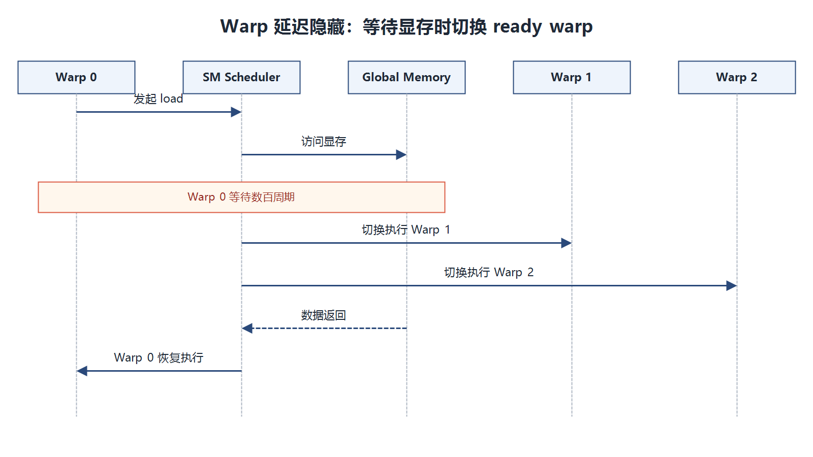

#### 1.2 NVIDIA GPU 的基本层级

GPU 需要同时解决三个问题：如何组织计算资源，如何把数据送到计算资源，如何把单颗 GPU 扩展成多 GPU 系统。因此它不是一个扁平的“核心数组”，而是分层结构。

| 层级 | 为什么需要 | 作用 |
|---|---|---|
| GPU chip | 把计算、缓存、显存接口和互联放在同一芯片系统中 | 完整 GPU 芯片 |
| GPC / TPC | 图形管线和 SM 需要成组复制扩展，不能所有单元都直接挂在一个中心节点上 | 图形与计算资源的组织单元 |
| SM | 大量线程需要一个本地调度、寄存器、shared memory 和执行单元集合 | NVIDIA GPU 最核心的可编程计算单元 |
| Warp | 如果每个 thread 都单独调度，硬件控制成本太高 | 32 个线程组成的硬件调度组 |
| Memory hierarchy | 显存容量大但延迟高，执行单元需要近端缓存和复用机制 | 寄存器、Shared/L1、L2、显存 |

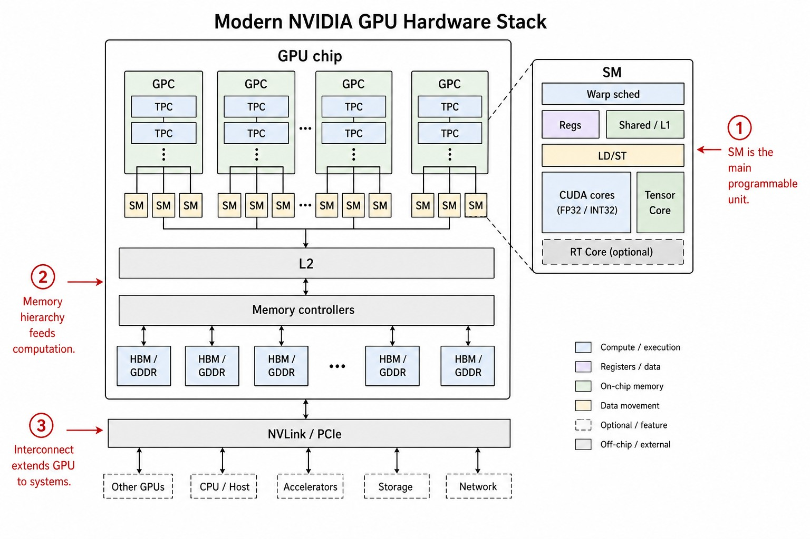

图 1-1：现代 NVIDIA GPU 硬件层级。标注 1 表示 SM 是主要可编程计算单元，标注 2 表示寄存器、Shared/L1、L2、HBM/GDDR 共同构成数据供应路径，标注 3 表示 NVLink/PCIe 将单 GPU 扩展到系统互联。

#### 1.3 CUDA 编程模型

如果开发者必须直接管理每个 SM、每个 warp、每条硬件队列，GPU 编程会非常困难。CUDA 的出现是为了解决“如何把硬件并行能力暴露给普通程序员”的问题。

CUDA 把硬件并行抽象为层级任务：

| CUDA 概念 | 为什么需要 | 硬件直觉 |
|---|---|---|
| Kernel | 一次性启动大量并行工作，避免 CPU 逐个下发任务 | 在 GPU 上运行的并行函数 |
| Grid | 描述一次 kernel 的完整工作范围 | 所有 block 的集合 |
| Block | 让一组线程能共享 shared memory 并同步 | 通常被调度到一个 SM 上 |
| Thread | 让开发者用“每个数据元素一个执行者”的方式写程序 | 程序员看到的最小执行单位 |
| Warp | 降低硬件调度成本，提高 SIMD-like 执行效率 | 硬件实际调度的 32 线程组 |

block 是重要边界：block 内可以同步和共享数据；传统 CUDA kernel 中，block 间通常不能直接同步。这个限制看似麻烦，但它让硬件可以把 block 分配到任意 SM，从而保持可扩展性。

Hopper 之后还需要记住一个例外：CUDA 增加了 **Thread Block Cluster** 这一层级。cluster 中的多个 block 可以被协同调度到同一个 GPC 内，并通过 distributed shared memory 和 cluster 同步进行更紧密协作。因此，本文前半部分讲“block 是基本协作边界”时，指的是经典 CUDA 模型；讨论 Hopper 及之后架构时，会把 cluster 作为更大的协作边界单独说明。

#### 1.4 SIMT、warp divergence 与 occupancy

GPU 不希望程序员手写宽向量指令，但硬件又需要成组执行才能高效。**SIMT** 就是为了解决这个矛盾：程序员写标量 thread，硬件把多个 thread 组成 warp，以类似向量的方式发射指令。

**Warp divergence** 出现是因为真实程序有分支。如果同一 warp 的 32 个线程走不同路径，硬件不能同时执行两条不同指令流，只能先执行一条路径并屏蔽另一部分线程，再执行另一条路径。它解决了“结果正确性”问题，但牺牲了吞吐。

**Occupancy** 出现是因为 GPU 需要用很多活跃 warp 隐藏延迟。occupancy 太低时，一个 warp 等内存，SM 可能没有别的 warp 可切换；occupancy 太高也不一定更快，因为寄存器压力、shared memory 压力和访存模式同样重要。

下面这张图把三层关系放在一起：CUDA 程序员看到的是 grid、block 和 thread；硬件会在每个 block 内按 32 个 thread 形成 warp；SM 真正调度的是已经驻留在本地的 ready warp。当某个 warp 因显存访问停住时，warp scheduler 会选择另一个 ready warp 发射指令，这就是 SIMT 能隐藏内存延迟的根本原因。

图 1-2：SIMT、warp、thread 与 SM 调度关系。标注 1 表示 CUDA 暴露 thread/block/grid 层级，但硬件调度单位是 warp；标注 2 表示一个 warp 由同一 block 内连续 32 个 thread 组成，并以 SIMT 方式执行同一条指令；标注 3 表示多个 resident warp 让 SM 在等待显存时仍能切换到其他 ready warp。

#### 1.5 存储层级

如果所有数据都从显存读取，GPU 的执行单元会大量等待。存储层级的出现就是为了解决“数据离计算太远”的问题。

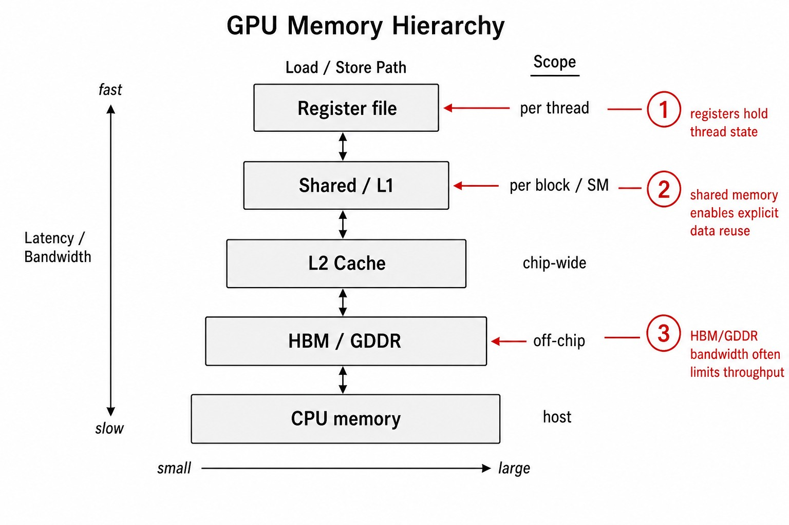

图 1-3：GPU 存储层级。标注 1 表示寄存器保存线程私有状态，标注 2 表示 Shared Memory/L1 支持 SM 内低延迟复用，标注 3 表示 HBM/GDDR 带宽经常决定实际吞吐上限。

| 层级 | 解决的问题 | 代价 |
|---|---|---|
| Register file | 线程私有状态必须极快读取 | 数量有限，占用过多会降低 occupancy |
| Shared memory | block 内线程需要显式共享和复用数据 | 需要程序员或库安排 tile 和同步 |
| L1 cache | 部分局部访问不适合全部手写 shared memory | 容量小，命中率依赖访问模式 |
| L2 cache | 多个 SM 都可能访问同一全局数据 | 延迟仍高于 SM 内存储 |
| HBM / GDDR | 模型、纹理、数组规模远超片上容量 | 高带宽但高延迟 |
| CPU memory | 数据集和应用状态常在主机侧 | 需要 PCIe/NVLink 或统一内存迁移 |

#### 1.6 访存合并与 tile 复用

显存系统擅长搬运连续大块数据，不擅长处理大量离散小访问。**访存合并** 的出现是为了解决 warp 内线程访问相邻地址时如何减少事务数量的问题。

**Tile 复用** 的出现是为了解决矩阵乘法这类任务中的重复读问题。一个矩阵元素常被多个线程使用，如果每次都从显存读，带宽会被浪费；先把小块搬到 shared memory，再让线程反复使用，可以显著提高算术强度。

图 1-4：访存合并与 Shared Memory 分块复用。标注 1 表示连续 warp 地址可合并为较少事务，标注 2 表示离散地址会制造更多显存事务，标注 3 表示把 global memory tile 先搬入 shared memory 可提高数据复用率。

#### 1.7 图形管线中的固定功能术语

后文谈 G80、Turing、Ada 时会出现一些图形管线术语。它们不是 CUDA Core，但对理解 GPU 架构很重要。

| 术语 | 为什么需要 | 作用 |
|---|---|---|
| Raster / Rasterizer | 三角形最终要落到屏幕像素上，必须把几何图元转换成片段/像素覆盖 | 光栅化几何体，生成待着色片段 |
| Texture Unit | shader 经常读取纹理，纹理采样涉及过滤、坐标变换和缓存 | 执行纹理采样和纹理缓存访问 |
| ROP | 像素 shader 计算完颜色后，还要做深度测试、混合、抗锯齿和写 framebuffer；这些操作固定且频繁 | Render Output Unit，负责像素输出、混合、深度/模板相关输出路径 |
| Memory Partition | ROP、缓存切片和显存接口需要分组连接，避免所有输出都挤到单一通道 | 连接 ROP/cache slice/DRAM interface 的显存分区 |
| Framebuffer | 最终图像、深度、模板等结果需要存放位置 | 显存中的渲染目标和相关缓冲区 |

ROP 特别容易被忽略。它不是负责执行通用 shader 的单元，而是负责渲染管线末端的输出处理。没有 ROP，shader 算出的颜色无法高效完成深度测试、混合并写入 framebuffer。

#### 1.8 阅读本文时需要避免的几个误解

GPU 术语很容易被产品名和市场名带偏。后文会反复遇到下面这些边界，先放在这里，读到具体架构时就不容易混淆。

| 容易混淆的说法 | 更准确的理解 |
|---|---|
| Tesla | 在本文早期章节中主要指 G80 之后的 Tesla 架构/计算 GPU 语境，不等同于汽车公司，也不应与后来所有数据中心产品线简单混用 |
| CUDA Core | 不是 CPU core。它更像 SM 内的标量执行 lane，必须放在 warp、scheduler、register file 和 memory hierarchy 中理解 |
| Tensor Core | 不是完整神经网络加速器，而是矩阵乘加专用硬件；模型能否变快还取决于 layout、tile、精度、库和数据搬运 |
| RT Core | 不负责完整渲染，只硬件化 BVH traversal 和 ray intersection；材质、阴影、降噪仍依赖 SM、Tensor Core 和图形软件栈 |
| 核心数量跨代比较 | SM 数、CUDA Core 数、Tensor Core 数不能跨代简单线性比较。调度、频率、缓存、精度格式和软件路径都会改变“一个核心”的实际含义 |
| 产品层次 | GeForce、RTX/Quadro、Tesla/Data Center、HGX、DGX、NVL 是不同产品或平台层次，不应和单个 GPU 微架构混为一谈 |

#### 1.9 架构、芯片、产品与平台

阅读 NVIDIA 资料时还要区分四个层级：架构名、具体芯片、板卡/产品和系统平台。它们常常在新闻、白皮书和开发者讨论中被混用，但含义不同。

| 架构 / 代际 | 代表芯片或 GPU die | 代表产品 / 板卡 | 系统或平台语境 |
|---|---|---|---|
| G80 / Tesla 早期 | G80 | GeForce 8800 GTX | CUDA 起点、统一 shader |
| Fermi | GF100 | Tesla C2050/C2070、GeForce GTX 480 | HPC 与通用计算 GPU |
| Kepler | GK110 | Tesla K20/K40 | Hyper-Q、Dynamic Parallelism、MPI/MPS |
| Maxwell | GM204、GM200 | GeForce GTX 980、Tesla M40 | 图形与能效优先 |
| Pascal | GP100 | Tesla P100 | HBM2、NVLink、数据中心平台化 |
| Volta | GV100 | Tesla V100 | Tensor Core 与混合精度训练 |
| Turing | TU102 | GeForce RTX 2080 Ti、Quadro RTX | RTX 光追与 DLSS |
| Ampere | GA100、GA102 | A100、RTX 3090 | AI 云、MIG、TF32 |
| Ada Lovelace | AD102 | RTX 4090、RTX 6000 Ada | 神经图形、SER、DLSS 3 |
| Hopper | GH100 | H100 | Transformer Engine、TMA、cluster |
| Blackwell | Blackwell GPU | B200、GB200 Grace Blackwell | NVLink 5、GB200 NVL72、AI factory |
| Rubin / Vera Rubin | Rubin GPU、Vera CPU | Vera Rubin Superchip | NVLink 6、Vera Rubin NVL72、POD |

本文中的“架构”主要指硬件设计路线；“芯片”指具体 die 或 GPU 实现；“产品”指实际交付的 GPU/加速卡；“平台”指 HGX、DGX、NVL72、SuperPOD 这类多 GPU、CPU、互联、网络和软件共同组成的系统。后文保留 CUDA、SM、warp、shared memory、Tensor Core、RT Core、NVLink 等英文术语，是为了和官方文档、性能工具和开发者资料保持对应。

### 第 2 章 一颗 NVIDIA GPU 里有什么

有了吞吐量、warp 和存储层级的直觉之后，可以把一颗现代 NVIDIA GPU 看成一个数据流系统：SM 负责执行，显存层级负责供数，专用单元负责把高频模式硬件化，互联负责把多颗 GPU 连接成更大的计算域。

#### 2.1 SM：最重要的可编程单元

SM 负责接收 thread block，组织 warp，调度指令，并驱动执行单元。不同架构 SM 细节不同，但核心组成类似：

- warp scheduler：选择哪个 warp 发射指令。
- dispatch unit：把指令送往对应执行单元。
- register file：保存线程状态和中间值。
- CUDA Core：执行 FP32、INT32 等通用计算。
- Tensor Core：执行矩阵乘加。
- RT Core：部分 RTX 图形架构中用于光线追踪相交与遍历；它不是所有数据中心 GPU 的通用组成。
- load/store unit：处理内存读写。
- Shared memory / L1：SM 内低延迟数据区。

#### 2.2 SM 如何隐藏延迟

图 2-1：SM warp 执行流水。标注 1 表示 SM 内驻留多个 warp，标注 2 表示等待内存的 warp 会被挂起，标注 3 表示调度器切换到 ready warp 以保持执行单元忙碌。

性能取决于：

- 是否有足够多的 ready warp。
- 寄存器和 shared memory 是否限制了 block 数量。
- 内存访问是否合并。
- 计算和数据搬运是否重叠。
- Tensor Core、CUDA Core、RT Core 是否被持续喂满。

#### 2.3 Tensor Core 的数据流

**Tensor Core** 是矩阵乘加专用硬件。它不是简单替代 CUDA Core，而是把矩阵乘法中最重复、最重的乘加模式硬件化。

图 2-2：Tensor Core MMA 数据流。标注 1 表示 tile 化提高算术强度，标注 2 表示 register fragment 送入 Tensor Core MMA，标注 3 表示 accumulator fragment 在寄存器中保留部分和。

核心流程：

1. 大矩阵在 HBM/GDDR 中。
2. block 协作把 tile 搬到 shared memory。
3. warp 把 tile 切成 fragment 放进寄存器。
4. Tensor Core 执行 MMA，即 matrix multiply-accumulate。
5. accumulator fragment 累积部分和，最后写回输出 tile。

#### 2.4 RT Core 的数据流

**RT Core** 用于实时光线追踪。它硬件化的不是完整渲染，而是 BVH traversal 和 ray-box / ray-triangle intersection。

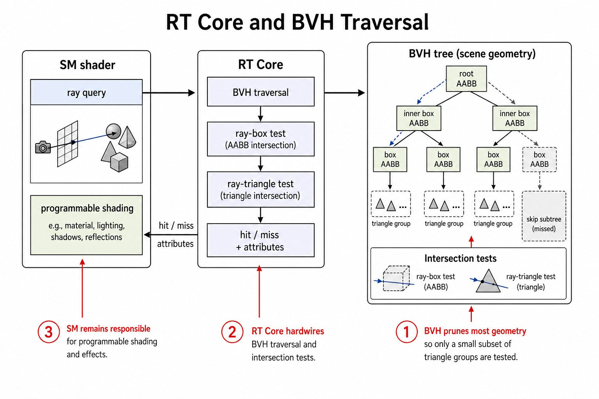

图 2-3：RT Core 与 BVH 遍历。标注 1 表示 BVH 剪枝可跳过大量几何体，标注 2 表示 RT Core 硬件化 traversal 与相交测试，标注 3 表示 SM 仍负责材质和阴影等可编程 shader。

SM 仍然负责可编程 shader。RT Core 只处理高度固定、重复、昂贵的几何查询。

#### 2.5 NVLink 与系统互联

**PCIe** 是通用外设总线。**NVLink** 是 NVIDIA 为 GPU 间高带宽通信设计的互联。大模型训练需要 All-Reduce、All-Gather、Reduce-Scatter 等集体通信。互联带宽不足时，Tensor Core 会等待数据。

图 2-4：NVLink 与 AI 集体通信。标注 1 表示高带宽 GPU-GPU 互联，标注 2 表示 All-Gather、Reduce-Scatter、All-Reduce 等集体通信会出现在训练层间，标注 3 表示互联不足会让 Tensor Core 等待通信结果。

---

## 第二部分 架构演进：硬件路线与软件接口一起变化

从 G80 到 Rubin，NVIDIA GPU 的主线并不是每一代都“更多核心”。更准确的说法是：每一代都把上一代暴露出来的瓶颈下沉为新的硬件机制，再由 CUDA、图形 API、AI 库或系统软件把这些机制变成可用能力。

### 阶段一：统一并行计算的建立

这一阶段的核心问题是：GPU 能不能从固定图形流水线变成可编程并行处理器，并且让普通程序通过 CUDA 使用它。G80 给出统一可编程资源，Fermi 则补上缓存、可靠性和通用计算所需的处理器特征。

#### 第 3 章 G80 / Tesla：统一可编程资源的起点

##### 3.1 从固定管线到统一资源

要理解 G80，先要回到更早的图形 GPU。那时硬件资源往往绑定在固定阶段上，问题不是某个阶段不会算，而是忙闲不均时资源不能流动。

**固定功能流水线** 出现于早期 GPU，是因为图形渲染流程相对固定，可以把顶点处理、纹理采样、像素输出等阶段分别做成专门硬件。它的问题是资源被阶段绑定：如果像素阶段很忙而顶点阶段较空，顶点硬件不能自动帮像素阶段干活。

**统一着色器** 是为了解决固定资源分离导致的利用率问题。它让 vertex shader、pixel shader、geometry shader 等可编程阶段共享同一类执行资源。这样 workload 改变时，硬件可以把更多可编程单元分配给当前更重的阶段。

**Stream Processor，简称 SP**，是 G80 中的标量可编程执行单元。它的出现是为了让 GPU 从宽向量式或固定阶段式设计转向大量标量线程执行。G80 的层级可理解为：8 个 TPC，每个 TPC 2 个 SM，每个 SM 8 个 scalar SP，总计 128 个 SP。

**ROP** 在 G80 图中位于 memory partition 附近。它存在是因为 shader 算出颜色后，还需要固定的输出处理：深度/模板测试、颜色混合、抗锯齿相关处理和写 framebuffer。这些工作固定、频繁，适合放在渲染输出单元中，而不是占用通用 SP。

##### 3.2 G80 的芯片组织

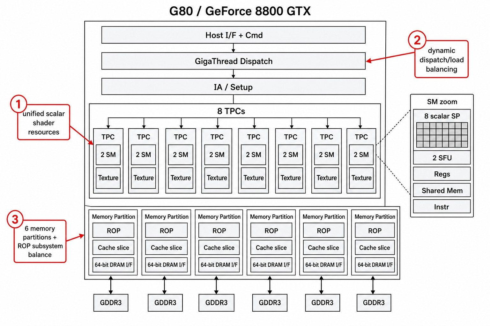

图 3-1：G80 / GeForce 8800 GTX 架构图。相对 GeForce 7 时代的固定/分离 shader 资源，标注 1 表示统一 scalar shader 资源池，标注 2 表示 GigaThread dispatch 对不同 shader workload 的动态分发，标注 3 表示 6 个 memory partition 与 ROP 子系统的带宽平衡。图中将 G80 展开为 8 TPC、16 SM、128 scalar SP 的层级；memory partition 不是后续 Fermi 式统一 L1/L2 层级，而是 ROP、cache slice 与 64-bit DRAM interface 的组合。

##### 3.3 统一 shader 池带来的变化

G80 的关键，是把图形管线中的可编程阶段统一到同一组标量执行资源上。这样，当像素 shader 重而顶点 shader 轻时，更多 SP 可用于像素阶段；反过来亦然。

G80 还建立了 CUDA 所需的基础：

- 大量标量线程。
- 以 warp 为调度单位的 SIMT 执行。
- GigaThread dispatch 负责把大量工作分发到 SM。
- memory partition 与 ROP 子系统提供图形输出带宽。

##### 3.4 统一并不等于没有分工

统一着色器并不是“所有图形阶段都一样”。真正变化是：不同 shader 程序被编译成可在同类标量执行单元上运行的指令流。硬件调度器再按 workload 动态分配执行资源。

这解决了固定资源分离导致的闲置问题，也让 GPU 第一次具备比较清晰的通用并行计算形态。

##### 3.5 CUDA 如何从这里开始

G80 对软件层最重要的影响是 CUDA 出现。CUDA 把 GPU 计算暴露为：

- kernel launch。
- grid / block / thread。
- device memory 分配和拷贝。
- thread-level 并行。

早期 CUDA 程序员必须非常关注内存访问规则，尤其是 coalescing。因为 G80 没有后续 Fermi 那种完整通用 L1/L2 缓存体系，性能高度依赖访问模式。

##### 3.6 仍未解决的问题

G80 证明了统一并行处理器路线，但仍缺少成熟 HPC 所需的缓存、双精度、ECC、并发 kernel 和更完整的软件生态。

---

#### 第 4 章 Fermi：GPU 走向严肃通用计算

##### 4.1 为什么 GPU 需要缓存和可靠性

G80 证明了 GPU 可以跑通用并行程序，但要进入科学计算和数据中心，还需要解决两件更朴素的问题：数据访问不能完全靠程序员手工安排，长时间计算也不能容忍随机 bit 错误。

**L1 cache** 和 **L2 cache** 的出现，是因为只靠 shared memory 会让程序员承担太多数据管理工作。L1 靠近 SM，缓冲局部访问；L2 面向全 GPU，缓冲跨 SM 的全局访问、原子操作和显存流量。缓存不能替代良好访存模式，但能降低不规则访问的惩罚。

**ECC** 是 Error-Correcting Code。它出现是为了解决数据中心和科学计算中的可靠性问题：长时间运行的大规模模拟或训练中，单个 bit 错误也可能破坏结果。ECC 通过校验位检测并纠正部分内存错误。

**Concurrent kernel** 的出现，是因为实际程序常有多个小 kernel 或多个任务流。如果 GPU 一次只能高效执行一个 kernel，资源容易空闲。并发 kernel 让多个 kernel 可以同时占用 GPU 的不同资源，提高利用率。

##### 4.2 Fermi 的芯片组织

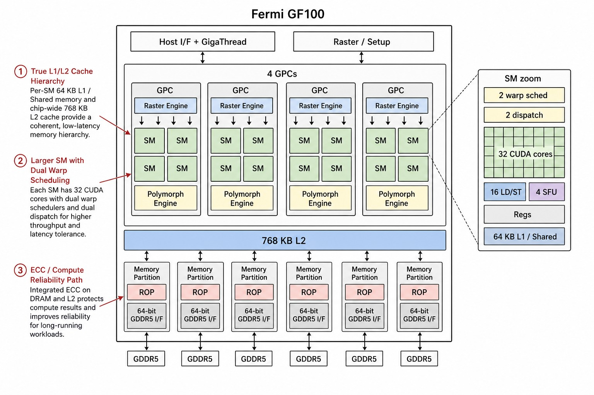

图 4-1：Fermi GF100 架构图。相对 G80，标注 1 表示更明确的 L1/L2 cache hierarchy，标注 2 表示每个 SM 扩展到 32 CUDA cores 并配合双 warp scheduler/dispatch，标注 3 表示 ECC 与可靠性能力进入通用计算路径。Fermi 的关键是把 GPU 从可编程并行阵列推进为带缓存、可靠性和并发执行能力的通用计算处理器。

##### 4.3 从图形处理器到计算处理器

Fermi 让 GPU 更像一颗严肃计算处理器。它的核心变化包括：

- SM 内 CUDA Core 数量和调度能力提升。
- 每个 SM 有可配置的 Shared Memory / L1 区域。
- 全 GPU 统一 L2 cache。
- 支持 ECC。
- 更好的原子操作和并发 kernel。

##### 4.4 缓存和 ECC 改变了可用场景

Fermi 的缓存层级降低了程序员对 shared memory 的完全依赖。L1 可缓冲局部访问，L2 可承接跨 SM 的共享数据、原子操作和显存访问。

ECC 对 HPC 很重要。科学计算中，一个 bit 错误可能破坏长时间模拟结果。Fermi 把可靠性纳入 GPU 计算体系，使 GPU 更适合数据中心。

##### 4.5 Compute capability 2.x 带来的变化

Fermi 对 CUDA 编程的影响主要体现在 compute capability 2.x，而不是简单等同于某一个 CUDA Toolkit 版本：

- 程序可受益于 L1/L2 缓存，不再完全依赖手动 shared memory。
- CUDA 增强了 C++ 支持和更成熟的内存模型。
- 并发 kernel 和更好的 stream 使用方式提高多任务利用率。
- `cudaDeviceSetCacheConfig` 等接口允许在 L1 与 shared memory 偏好之间调整。
- ECC 可通过驱动和管理工具启用、监控，对数据中心部署很关键。

##### 4.6 功能完整带来的代价

Fermi 功能完整，但控制逻辑、缓存和可靠性机制增加面积与功耗。下一阶段的重点转向更高利用率和能效。

---

### 阶段二：利用率、能效与数据供应

当 GPU 已经具备通用计算能力后，新的问题变成如何让资源持续忙碌、如何降低每瓦成本、如何把足够多的数据送到芯片上。Kepler 关注任务供给，Maxwell 关注能效，Pascal 则把显存和多 GPU 互联推到数据中心平台层面。

#### 第 5 章 Kepler：让上层并行任务真正进到 GPU

##### 5.1 宽 SM 之后，瓶颈转向任务供给

Fermi 补齐了通用计算底座。Kepler 面对的新问题是：执行资源已经很宽，如果 CPU 侧提交方式仍把独立任务排成队，GPU 内部再宽也会吃不饱。

**SMX** 是 Kepler 的大号 SM 变体。它出现的直接目标是提高单个多处理器的吞吐：更多 FP32、FP64、load/store 和 SFU 资源放在同一调度域内。但资源变宽后，如何喂满它就成为新问题。

**Hyper-Q** 是为了解决 CPU 侧任务提交把并行工作“假串行化”的问题。多个 CPU 线程或 MPI rank 本来互相独立，如果被挤进少数硬件队列，GPU 看到的就是串行任务。Hyper-Q 提供多个硬件工作队列，让 GPU 更直接地看到上层并行性。

**Dynamic Parallelism** 是为了解决层级任务频繁回到 CPU 调度的问题。自适应网格、递归分治、图遍历等任务常在 GPU 计算过程中产生新任务。允许 GPU 端启动子 kernel，可减少 CPU-GPU 往返。

##### 5.2 Kepler 的芯片组织

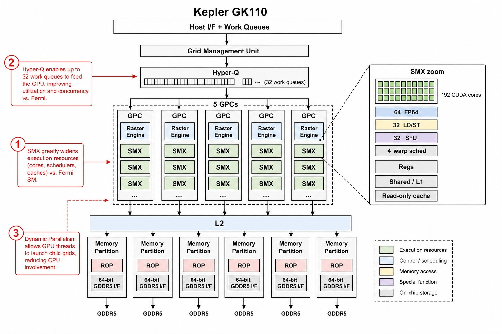

图 5-1：Kepler GK110 架构图。相对 Fermi，标注 1 表示 SMX 内执行资源显著加宽，标注 2 表示 Hyper-Q 多工作队列减少 CPU/MPI 任务假串行，标注 3 表示 Dynamic Parallelism 允许 GPU 端启动子 grid。Kepler 的重点是提高大规模并行任务的实际利用率。

##### 5.3 SMX、Hyper-Q 与 GPU 端任务生成

GK110 的 SMX 大幅加宽，包含更多 FP32、FP64、load/store 和 SFU 资源。资源变宽后，真正难点变成如何让这些资源持续有工作可做。

Hyper-Q 和 Grid Management Unit 的意义就在这里：它们让 GPU 更直接地看到上层软件并行性，减少任务提交端的人为串行。

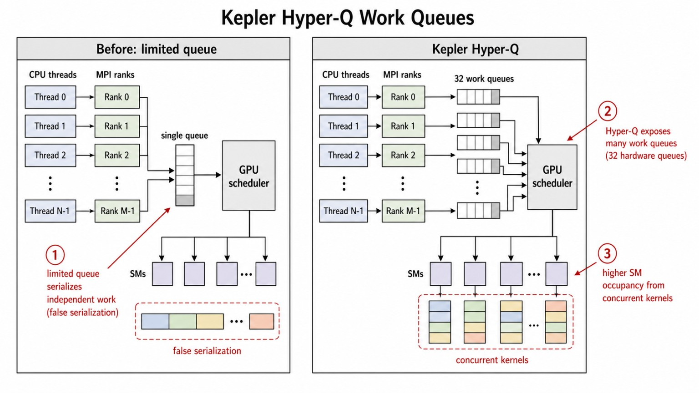

图 5-2：Kepler Hyper-Q 工作队列。标注 1 表示有限队列会把独立 CPU/MPI 工作假串行化，标注 2 表示 Hyper-Q 暴露多个硬件工作队列，标注 3 表示并发 kernel 更容易提高 SM occupancy。

##### 5.4 为什么多队列能提高利用率

如果多个 CPU 线程或 MPI rank 的工作被塞进单一队列，GPU 看到的就是串行工作流。Hyper-Q 通过多个硬件队列让 GPU 同时接收多个独立工作源。

Dynamic Parallelism 则把部分任务生成权交给 GPU。自适应网格、递归分治、图遍历等任务不必每一层都回到 CPU 发起新 kernel。

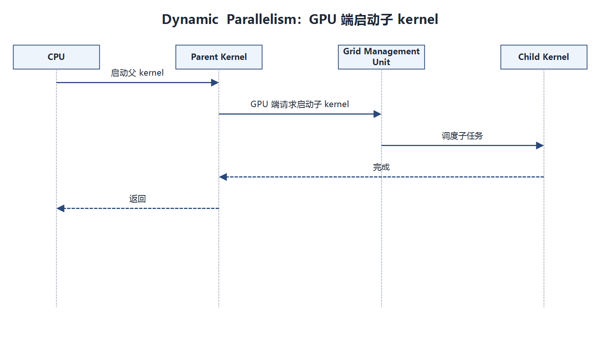

##### 5.5 Streams、shuffle 与 device-side launch

Kepler 对 CUDA 程序员的影响很直接：

- CUDA streams 更能受益于 Hyper-Q。多个 stream 中的 kernel 更容易并发。
- CUDA MPS 让多个进程，尤其是 MPI rank，可以通过一个服务进程共享 GPU，并把进程间并行性映射到 Hyper-Q，减少单进程工作太小导致的 GPU 闲置。
- Dynamic Parallelism 允许在 device code 中启动 kernel，适合层级任务。
- `__shfl` 等 warp shuffle 指令让 warp 内线程交换数据不必绕 shared memory。
- `__ldg` 等只读数据路径帮助利用 read-only cache。
- GPUDirect RDMA 让网卡、采集卡、存储适配器等第三方 PCIe 设备可以直接和 GPU memory 交换数据，减少经 CPU host memory 中转的开销。它不是 SM 内部功能，但对多节点 HPC 和数据中心 I/O 很关键。

##### 5.6 宽资源也需要足够工作量

Dynamic Parallelism 有启动开销，不适合极小子任务。SMX 很宽，也要求程序提供足够并行度和良好数据供应。

---

#### 第 6 章 Maxwell：把能效问题拆进 SM 内部

##### 6.1 能效为什么要从 SM 结构下手

Kepler 通过加宽 SMX 提高峰值，但宽资源池也带来控制、时钟和数据分发成本。Maxwell 的问题意识更直接：同样的 workload，能不能用更少能量完成。

**SMM** 是 Maxwell 的 SM 组织方式。它出现是为了解决 Kepler 大 SMX 调度域过宽、控制和能耗开销较高的问题。SMM 把执行资源拆成更小 partition，让调度器和执行单元关系更局部。

**Clock gating** 是为了解决空闲硬件仍消耗动态功耗的问题。GPU workload 经常不均匀，某些执行单元或 partition 会暂时无事可做。关闭这些区域的时钟，可以提高每瓦性能。

##### 6.2 Maxwell 的芯片组织

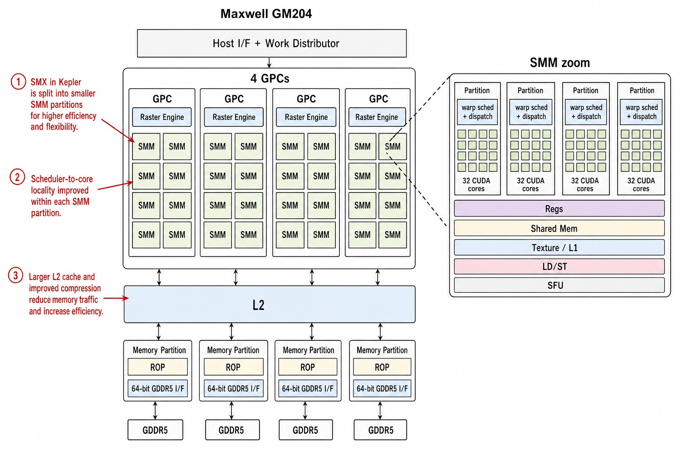

图 6-1：Maxwell GM204 架构图。相对 Kepler，标注 1 表示大 SMX 被拆成更细粒度 SMM，标注 2 表示 scheduler 到 core partition 的局部性增强，标注 3 表示更大的 L2 和更少显存流量服务能效目标。Maxwell 的核心不是峰值堆叠，而是让实际 workload 更稳定地消耗较少能量。

##### 6.3 从大 SMX 到更局部的 SMM

Maxwell 不追求把单个 SM 做得更大，而是重构 SM 内部资源关系。SMM 把调度器、dispatch 和 CUDA Core 组织成更清晰的局部分区。

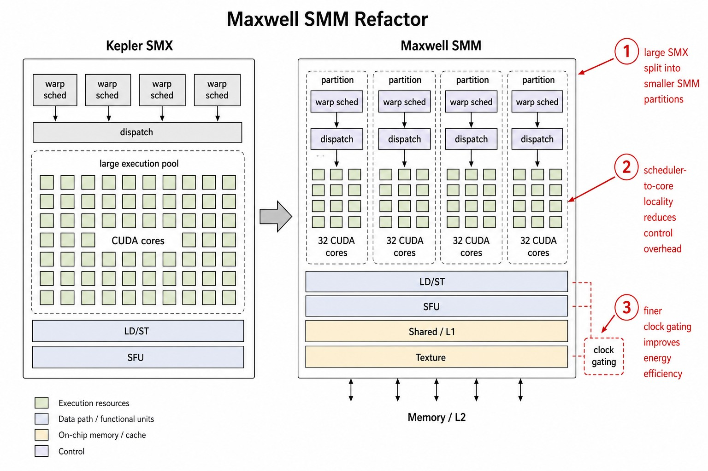

图 6-2：Maxwell SMM 重构。标注 1 表示 Kepler 大 SMX 被拆成更细粒度 SMM partition，标注 2 表示 scheduler 与 core partition 的局部性降低控制开销，标注 3 表示更细粒度 clock gating 改善能效。

##### 6.4 局部分区如何减少无效能耗

大资源池的峰值高，但调度和数据分发成本也高。如果 workload 不能均匀喂满所有执行单元，空闲资源仍会消耗控制和时钟能量。

Maxwell 通过更小 partition 缩短调度路径、减少共享资源竞争，并让空闲部分更容易关闭。

##### 6.5 调优重点的变化

Maxwell 没有像 Kepler 那样引入一个同等醒目的 CUDA API，但它改变了性能调优重点：

- 更重视 occupancy、寄存器压力和 block 尺寸对能效的影响。
- Shared memory 原子操作和图形/计算调度路径改进，使某些并行算法更稳定。
- 更大的 L2 让某些全局内存访问模式受益。
- CUDA 程序仍兼容，但性能最佳实践从“喂满大 SMX”转向“减少无效访存和控制开销”。

##### 6.6 图形能效与 HPC 取舍

Maxwell 对双精度 HPC 不是重点。它展示了 NVIDIA 会根据市场目标在图形能效和数据中心计算之间分化设计。

---

#### 第 7 章 Pascal：显存、互联与数据中心 GPU

##### 7.1 当数据供应追不上算力

到 Pascal 时，数据中心 GPU 的瓶颈已经明显从单芯片算力扩展到数据供应：显存要更快，多 GPU 要更近，低精度要减少搬运量。

**HBM2** 出现是为了解决“算力增长快于显存带宽增长”的问题。传统 GDDR 通过封装外走线连接，继续提高带宽会遇到功耗和布线压力。HBM2 把多层 DRAM stack 放到 GPU 封装内，通过硅中介层提供超宽、短距离接口。

**NVLink** 出现是为了解决多 GPU 通信瓶颈。PCIe 是通用外设总线，但深度学习训练和 HPC 会频繁交换梯度、激活或边界数据。NVLink 用更高带宽、更低延迟连接 GPU，让多 GPU 更像一个协作系统。

**FP16** 在 Pascal GP100 上成为数据中心深度学习的重要加速路径，是因为神经网络对很多计算不需要 FP32 的全部精度。把数据宽度减半，可以降低显存占用、带宽压力和计算能耗。但它必须配合混合精度策略，避免数值不稳定。

##### 7.2 Pascal 的芯片组织

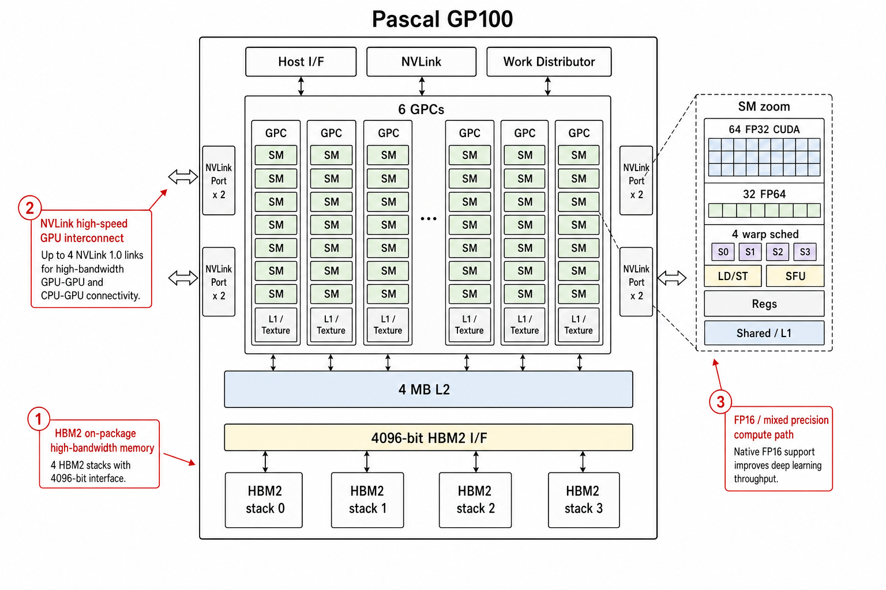

图 7-1：Pascal GP100 架构图。相对 Maxwell，标注 1 表示 HBM2 封装内高带宽显存，标注 2 表示 NVLink 进入 GPU 高速互联路径，标注 3 表示 FP16/mixed precision 为深度学习吞吐服务。Pascal 的主题是数据平台化：显存带宽、GPU 间通信和低精度数据格式共同决定 AI/HPC 效率。

##### 7.3 HBM2 把显存带宽搬进封装

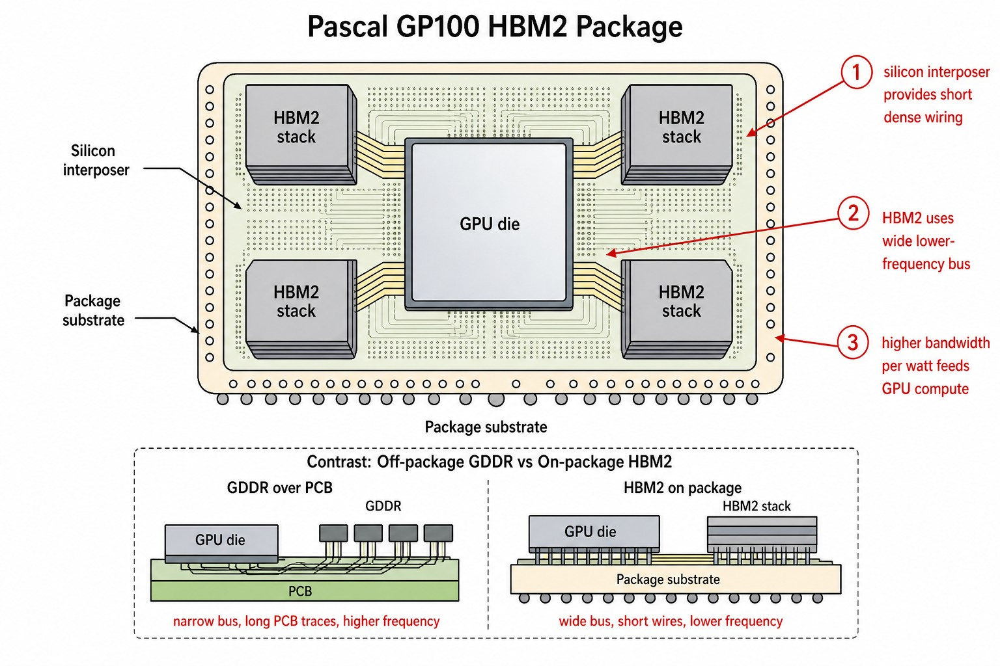

图 7-2：Pascal GP100 HBM2 封装。标注 1 表示 silicon interposer 提供短距离高密度布线，标注 2 表示 HBM2 使用超宽、较低频接口，标注 3 表示更高带宽/瓦帮助 GP100 持续喂给计算单元。

HBM2 的关键不是单个引脚更快，而是总线极宽、距离极短、能效更好。GPU 的矩阵计算、模拟计算和深度学习训练都需要持续读取大量数据。HBM2 让 GP100 的算力更不容易因显存带宽不足而闲置。

##### 7.4 NVLink 让多 GPU 更像协作系统

NVLink 解决多 GPU 通信瓶颈。PCIe 是通用总线，但大模型或 HPC 多卡计算需要频繁交换梯度、激活和边界数据。

图 7-3：NVLink 与 AI 集体通信。标注 1 表示高带宽 GPU-GPU 互联，标注 2 表示 All-Gather、Reduce-Scatter、All-Reduce 等集体通信会出现在训练层间，标注 3 表示互联不足会让 Tensor Core 等待通信结果。

##### 7.5 Unified Memory、FP16 与 NCCL

Pascal 对软件层的影响很大：

- CUDA Unified Memory 更成熟，P100 支持按页迁移和 page faulting，使 CPU/GPU 共享地址空间更实用。
- FP16 数据类型和半精度运算在深度学习框架中开始重要。
- NCCL 等通信库利用 NVLink 提高多 GPU collectives 效率。
- GPUDirect P2P/RDMA、peer-to-peer 访问和统一内存让多 GPU、多网卡程序不再只是“多张独立卡 + CPU 中转”。

##### 7.6 带宽和精度仍要靠软件配合

FP16 需要混合精度策略，否则训练可能不稳定。NVLink 只解决 GPU 间通信的一部分，跨服务器仍依赖网络。

---

### 阶段三：专用加速单元进入核心

这一阶段的 GPU 不再只依赖通用 CUDA Core 扩展吞吐。AI、光追和神经图形暴露出高度重复的热点，于是 Tensor Core、RT Core、SER、DLSS 等机制逐步成为架构中心。

#### 第 8 章 Volta：矩阵乘法进入专用硬件时代

##### 8.1 矩阵乘法为什么值得专用硬件

深度学习把 GPU 的热点推向一个极端：大量时间花在矩阵乘法。Volta 的判断是，既然热点如此集中，就不该继续完全依赖通用标量单元拼装。

**MMA** 是 Matrix Multiply-Accumulate，矩阵乘加。这个概念重要，是因为深度学习最重的计算通常不是孤立加减乘除，而是大规模矩阵乘法和累加。

**Tensor Core** 出现是为了解决用通用 CUDA Core 执行矩阵乘法时效率不够的问题。普通 CUDA Core 擅长标量或较小粒度运算；Tensor Core 直接处理矩阵 fragment，把大量乘加压缩成专用硬件路径。

**Independent Thread Scheduling** 出现是为了解决 warp 内线程在复杂分支、同步和不规则控制流下过度绑定的问题。它给每个线程维护更独立的执行状态，使某些复杂程序更容易表达；但它不是 divergence 的万能解药。

##### 8.2 Volta 的芯片组织

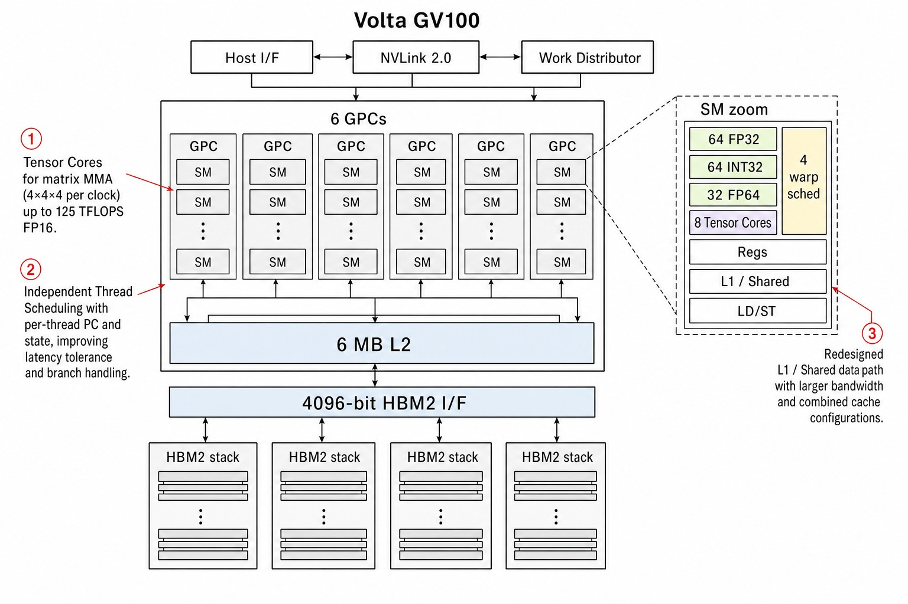

图 8-1：Volta GV100 架构图。相对 Pascal，标注 1 表示 Tensor Core 用矩阵 MMA 取代纯标量 FMA 组合，标注 2 表示 Independent Thread Scheduling 为每线程维护更独立的执行状态，标注 3 表示 L1/shared 数据路径重构以提高 SM 内数据供应。Volta 是 AI 矩阵计算硬件化的分水岭。

##### 8.3 Tensor Core 改变了 SM 的角色

Volta 最大变化是 Tensor Core。过去矩阵乘法由 CUDA Core 执行大量标量 FMA，再通过软件库组合成矩阵运算。Tensor Core 直接执行矩阵 fragment 的乘加。

图 8-2：Tensor Core MMA 数据流。标注 1 表示 tile 化提高算术强度，标注 2 表示 register fragment 送入 Tensor Core MMA，标注 3 表示 accumulator fragment 在寄存器中保留部分和。

##### 8.4 从标量 FMA 到矩阵 MMA

神经网络中的卷积、全连接和 Transformer attention 都可归结为大量矩阵乘法。Tensor Core 把这些乘加模式做成专用阵列，减少通用指令调度开销，提高单位面积和单位能耗吞吐。

Volta 的 Independent Thread Scheduling 让 warp 内线程在复杂控制流下更灵活，但这不意味着 divergence 没有代价。它只是让某些同步和分支模式更容易正确、高效地表达。

##### 8.5 WMMA 与混合精度训练

Volta 带来了非常明确的软件接口变化：

- CUDA 9 引入 WMMA API，即 `nvcuda::wmma`，让程序员可以显式使用 Tensor Core。
- cuBLAS 和 cuDNN 开始大量利用 Tensor Core，深度学习框架通常通过库间接使用。
- 混合精度训练成为主流实践：输入可用 FP16，累加常用 FP32。
- Cooperative Groups 把 thread block、warp tile、grid 等协作范围变成显式对象，让同步和 collective 不再只依赖 `__syncthreads()` 或手写 warp 假设。这和 Volta 的 Independent Thread Scheduling 是同一类变化：程序必须更明确地说明哪些线程在协作。
- Independent Thread Scheduling 使旧代码中隐含 warp 同步的写法变得危险，需要使用 `__syncwarp()` 等显式同步。

##### 8.6 专用硬件需要正确的数据流

Tensor Core 需要数据布局、精度格式和 tile 尺寸配合。硬件很快，但如果内存搬运和 layout 转换做不好，Tensor Core 仍会等待数据。

---

#### 第 9 章 Turing：实时光追与 RTX 管线

##### 9.1 光线追踪为什么不能只靠 shader

Turing 面对的是另一类高度重复但不适合纯通用计算的工作：光线与几何体的查询。shader 可以表达材质和光照，却不适合把所有 BVH 遍历和相交测试都自己扛下来。

**BVH** 是 Bounding Volume Hierarchy。它出现是为了解决光线追踪不能逐个三角形暴力测试的问题。BVH 用层级包围盒快速排除不可能命中的几何体，只把少量候选交给精确相交测试。

**RT Core** 出现是因为 BVH traversal、ray-box test、ray-triangle test 固定、频繁且昂贵。如果全部交给 SM，会挤占 shader 资源。RT Core 把这些几何查询硬件化，让 SM 保留给材质和阴影等可编程逻辑。

**DLSS** 出现是为了解决高分辨率、高光追质量与实时帧率之间的矛盾。它用神经网络从较低成本渲染结果中重建更高质量图像，后续还扩展到帧生成。

##### 9.2 Turing 的芯片组织

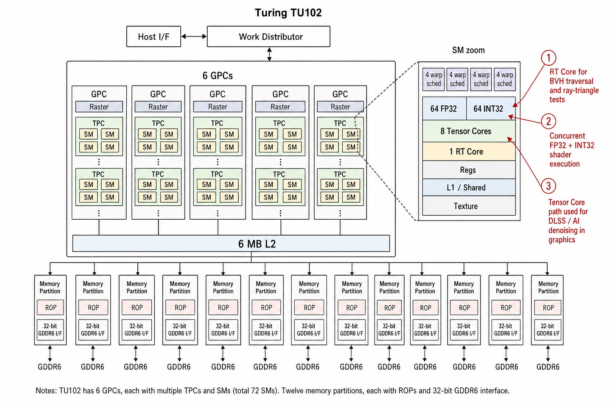

图 9-1：Turing TU102 架构图。相对 Volta，标注 1 表示 RT Core 专门处理 BVH traversal 与 ray-triangle tests，标注 2 表示 FP32 与 INT32 shader 路径可更好并行，标注 3 表示 Tensor Core 进入 DLSS/AI denoising 等图形重建路径。Turing 将实时图形拆成 SM、RT Core、Tensor Core 三条协同硬件路径。

##### 9.3 RTX 管线的三类硬件

Turing 把图形管线拆成三类硬件：

- SM：执行 programmable shader。
- RT Core：执行 BVH traversal 与相交测试。
- Tensor Core：执行 AI 降噪、DLSS 等神经图形任务。

图 9-2：RT Core 与 BVH 遍历。标注 1 表示 BVH 剪枝可跳过大量几何体，标注 2 表示 RT Core 硬件化 traversal 与相交测试，标注 3 表示 SM 仍负责材质和阴影等可编程 shader。

##### 9.4 BVH 查询被硬件化之后

光线追踪的核心问题是：一条光线命中了哪个物体。逐个三角形测试代价太高，所以图形系统构建 BVH。RT Core 加速 BVH 遍历和相交测试，SM 则继续执行材质、阴影和递归光照逻辑。

Turing 还强化了 FP32 与 INT32 并行路径。shader 常常同时包含浮点光照和整数地址/索引计算，并行执行可提高实际吞吐。

##### 9.5 DXR、Vulkan RT 与 OptiX

Turing 对软件层的影响跨越 CUDA、图形 API 和 SDK：

- Microsoft DXR、Vulkan Ray Tracing、NVIDIA OptiX 让开发者描述 ray generation、hit、miss 等 shader 阶段。
- RT Core 通常不是 CUDA 程序员直接调用，而是由图形 API、OptiX 和驱动调度。
- Tensor Core 通过 DLSS、AI denoising、TensorRT 等路径进入图形和推理工作流。
- CUDA Graphs 在 CUDA 10 时代进入任务提交模型。它把一串 kernel、memcpy、event 等操作捕获成依赖图，实例化后可重复 launch，用来减少 CPU 逐个提交小任务的 overhead。它不改变 SM 内部执行方式，但能减少 GPU 等待 host 提交工作的时间。
- 图形开发开始同时考虑 rasterization、ray tracing、neural reconstruction，以及 CUDA runtime 层面的任务提交开销。

##### 9.6 相交加速不等于整帧免费

RT Core 解决相交测试，但不解决所有渲染成本。材质 shader、噪声、递归路径和内存访问仍可能成为瓶颈。

---

#### 第 10 章 Ampere：AI 云基础设施规模化

##### 10.1 云端 GPU 为什么需要可切分、可低精度

Ampere 的 A100 不是只给单个训练任务准备的。云端会同时运行训练、推理、开发和测试任务，因此 GPU 既要快，也要能被隔离、切分和高效调度。

**TF32** 出现是为了解决 FP32 训练代码迁移到 Tensor Core 的门槛问题。它保留类似 FP32 的指数范围，但降低尾数精度，让许多满足条件的 FP32 风格矩阵运算可以在库和框架配置下进入 Tensor Core 快路径。

**结构化稀疏** 出现是为了解决神经网络中大量无效权重计算的问题。随机稀疏虽然理论上能省计算，但索引和访存太不规则。固定模式稀疏让硬件能预测哪些元素跳过，从而真正提高吞吐。

**MIG** 出现是为了解决云端 GPU 资源粒度太粗的问题。大 GPU 适合训练，但很多推理或开发任务只需要一部分资源。MIG 用硬件分区把一颗 GPU 变成多个隔离实例，提高利用率并降低租户干扰。

##### 10.2 Ampere 的芯片组织

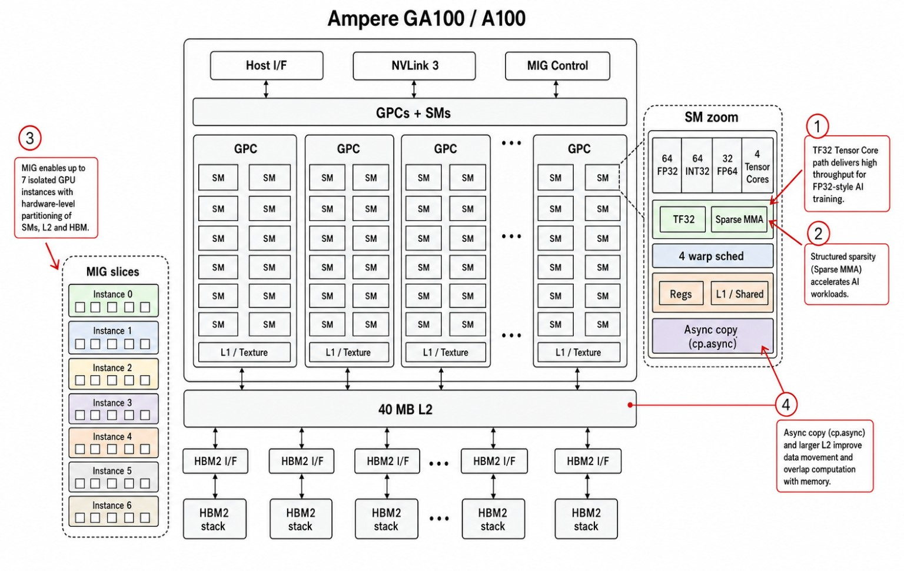

图 10-1：Ampere GA100 / A100 架构图。相对 Volta/Turing，标注 1 表示 TF32 让 FP32 风格 AI 训练进入 Tensor Core 快路径，标注 2 表示结构化稀疏 Sparse MMA，标注 3 表示 MIG 硬件分区，标注 4 表示 async copy 和更大 L2 改善数据搬运。Ampere 的重点是把 AI GPU 变成云端可切分、可规模化基础设施。

##### 10.3 TF32、稀疏、MIG 与异步搬运

Ampere 的数据中心代表 GA100 / A100 面向 AI、HPC 和云多租户：

- 第三代 Tensor Core 支持 TF32、FP16、BF16、INT8 等路径。
- 结构化稀疏 Tensor Core 可跳过特定模式的零值计算。
- MIG 把一颗 GPU 切分为多个隔离实例。
- 更大 L2 与异步 copy 降低数据搬运瓶颈。

##### 10.4 让默认训练路径更接近 Tensor Core

TF32 的价值是降低迁移门槛。很多训练代码原来使用 FP32，Ampere 可在 cuBLAS、cuDNN 和深度学习框架的默认或可配置路径中，把符合条件的矩阵运算映射到 TF32 Tensor Core。数值敏感任务仍应显式验证，必要时关闭 TF32。

结构化稀疏必须“结构化”，因为随机稀疏会带来复杂索引和不规则访存，硬件很难高效跳过。固定 2:4 模式让硬件能用简单控制逻辑获得有效吞吐提升。

异步 copy 让 global memory 到 shared memory 的预取与计算重叠。

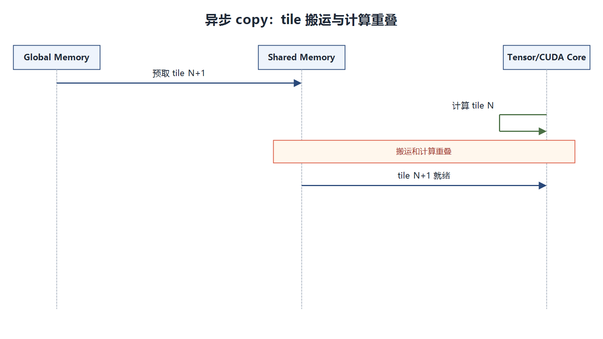

##### 10.5 CUDA 11、MIG 管理与库默认路径

Ampere 的软件接口变化很关键：

- cuBLAS、cuDNN 和深度学习框架可在默认或配置路径中使用 TF32，因此许多模型代码少改甚至不改即可加速。
- cuSPARSELt 等库支持结构化稀疏矩阵路径。
- MIG 通过 `nvidia-smi` 和 CUDA device enumeration 暴露为独立 GPU 实例。
- CUDA 11 引入面向 `cp.async` 的编程能力，后续可通过 CUDA pipeline/libcu++ 等方式表达异步搬运。
- CUDA Graph 在固定训练 step、推理服务和小 kernel 密集流水中更常用。Ampere 的硬件重点是 TF32、MIG 和异步搬运；CUDA Graph 则从软件提交路径减少 CPU launch 抖动，让这些硬件更少空等。
- NCCL 在 A100 多 GPU 系统中利用 NVLink/NVSwitch 做高效通信。

##### 10.6 云能力也有适用边界

TF32 不是严格 FP32。结构化稀疏需要模型剪枝和校准。MIG 提升资源利用率，但被切分后的实例不适合需要整卡显存和带宽的大训练任务。

---

#### 第 11 章 Ada Lovelace：神经图形管线成熟

##### 11.1 光追之后，图形管线开始神经化

Turing 让实时光追可用，Ada 进一步面对光追 workload 的实际形态：光线会发散，材质会分叉，完整帧率还需要神经网络参与重建。

**SER** 是 Shader Execution Reordering。它出现是为了解决光线追踪 workload 发散的问题：不同光线命中不同材质，导致同一 warp 内线程执行路径不一致。SER 尝试把相似 shader 工作重新分组，提高 SIMT 效率。

**Optical Flow** 出现是为了解决帧生成需要知道画面运动的问题。仅靠当前帧和下一帧颜色不够，系统还需要估计物体和像素在时间上的移动。

**Frame generation** 出现是为了解决单纯渲染每一帧成本过高的问题。它不是只提升空间分辨率，而是在时间维度生成中间帧，提高视觉帧率。

##### 11.2 Ada 的芯片组织

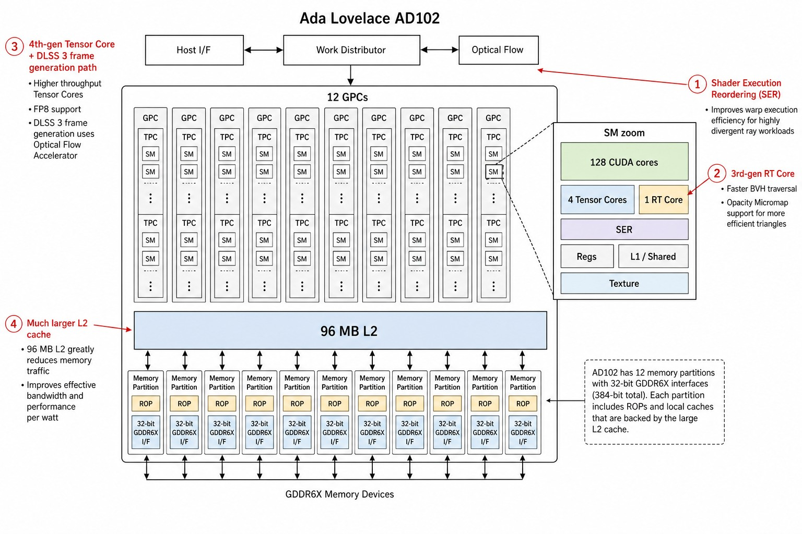

图 11-1：Ada Lovelace AD102 架构图。相对 Ampere/Turing，标注 1 表示 Shader Execution Reordering 用于重排发散光追 workload，标注 2 表示第三代 RT Core 的 traversal/geometry 加速，标注 3 表示第四代 Tensor Core 与 DLSS 3 frame generation，标注 4 表示大幅扩展 L2 降低显存流量。Ada 的核心是神经图形管线。

##### 11.3 SER、RT Core、Tensor Core 与 Optical Flow

Ada 把 Turing 的 RTX 思路进一步系统化：

- 第三代 RT Core 加速复杂光追。
- SER 让发散光线任务重新聚合。
- 第四代 Tensor Core 支持 DLSS 3。
- Optical Flow Accelerator 为帧生成提供运动信息。
- 大 L2 降低外部显存流量。

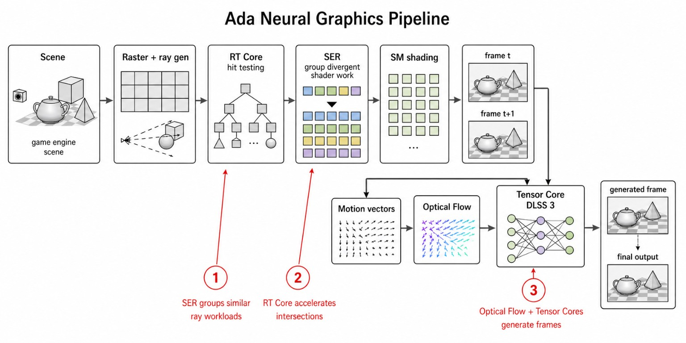

图 11-2：Ada 神经图形管线。标注 1 表示 SER 将相似光追 shader workload 重组，标注 2 表示 RT Core 加速相交查询，标注 3 表示 Optical Flow 与 Tensor Core 支持 DLSS 3 frame generation。

##### 11.4 重排发散任务，生成时间维度的帧

光追天然会制造不规则任务：不同光线命中不同材质，执行不同 shader。SER 通过重排执行顺序，让相似 shader 批次聚在一起，提高 SIMT 效率。

DLSS 3 则说明图形管线已经不再是纯渲染。GPU 先渲染部分帧，再用 Optical Flow、运动向量和 Tensor Core 生成额外帧。

##### 11.5 DLSS SDK、OptiX 与图形 API 扩展

Ada 的软件接口主要在图形和 AI 图形 SDK：

- SER 通过图形 API 扩展、NVAPI、OptiX 等路径暴露给开发者。
- DLSS 3 通过 NVIDIA SDK 接入游戏和应用。
- Ada 的 AV1 编码能力也影响内容创作和流媒体工作流。
- CUDA 层面仍可使用 Tensor Core，但 Ada 的独特价值更多通过图形栈释放。

##### 11.6 视觉帧率与真实延迟的边界

帧生成提高视觉帧率，但会引入延迟和画质评估问题。SER 也不能消除所有发散，只能降低部分发散带来的损失。

---

### 阶段四：大模型数据流与系统级 AI 架构

Hopper 之后，架构问题从“单个 kernel 怎样更快”扩展到“整个大模型系统怎样持续生产 token”。低精度、张量搬运、跨 SM 协作、双 die 封装、NVLink 机架互联和 CPU/DPU/网络协同都进入同一条设计路线。

#### 第 12 章 Hopper：面向 Transformer 的数据流架构

##### 12.1 Transformer 训练需要怎样的数据流

Hopper 的设计背景是 Transformer 成为核心负载。这里的难点不只是矩阵乘法本身，还包括低精度稳定性、多维 tile 搬运、跨 SM 协作和长时间大规模训练效率。

**Transformer Engine** 出现是为了解决大模型训练中“低精度更快，但固定低精度可能不稳定”的矛盾。它通过 FP8 recipe、scaling、casting、累加精度和必要的高精度路径管理张量动态范围，让速度和数值稳定性同时可控。

**FP8** 出现是为了解决 FP16/BF16 仍然占用较多带宽和存储的问题。8 位数据能显著降低搬运成本，但需要 scaling 和校准。

**TMA** 是 Tensor Memory Accelerator。它出现是因为高性能矩阵计算中，线程手写多维 tile 搬运既复杂又占用执行资源。TMA 把 tensor tile 搬运做得更像硬件 DMA。

**Thread Block Cluster** 出现是为了解决单个 block/SM 协作范围有限的问题。更大 tile 和更复杂模型需要多个 block 在相邻 SM 上更紧密协作。

**DPX** 出现是因为动态规划算法中 max/min/add 等状态转移模式非常高频。把这些组合操作做成专用指令，可加速序列比对、图算法等非深度学习任务。

##### 12.2 Hopper 的芯片组织

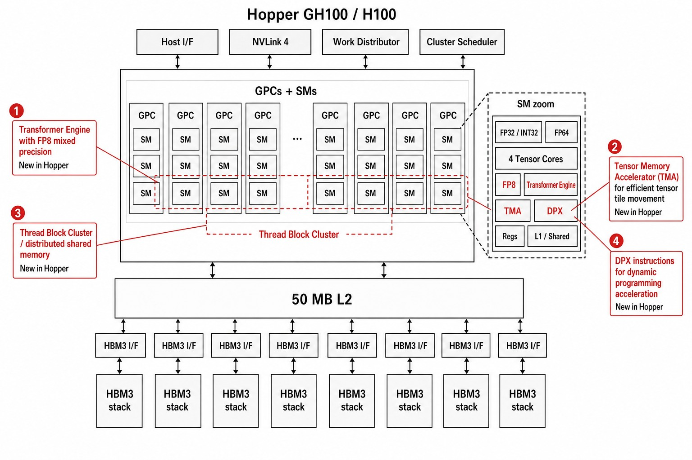

图 12-1：Hopper GH100 / H100 架构图。相对 Ampere，标注 1 表示 Transformer Engine 与 FP8 mixed precision，标注 2 表示 Tensor Memory Accelerator 负责 tensor tile 搬运，标注 3 表示 Thread Block Cluster 与 distributed shared memory 扩展协作范围，标注 4 表示 DPX 指令加速动态规划模式。Hopper 把 Transformer 训练的数据流需求下沉到硬件。

##### 12.3 FP8、TMA、Cluster 与 DPX

Hopper 的核心是让 Transformer 训练更快、更省、更可扩展：

- Transformer Engine 管理 FP8 scaling、casting、累加精度和必要的高精度路径。
- TMA 减少线程手写数据搬运负担。
- Thread Block Cluster 扩大 block 间协作范围。
- DPX 加速动态规划算法。
- NVLink/NVSwitch 继续服务大规模多 GPU。

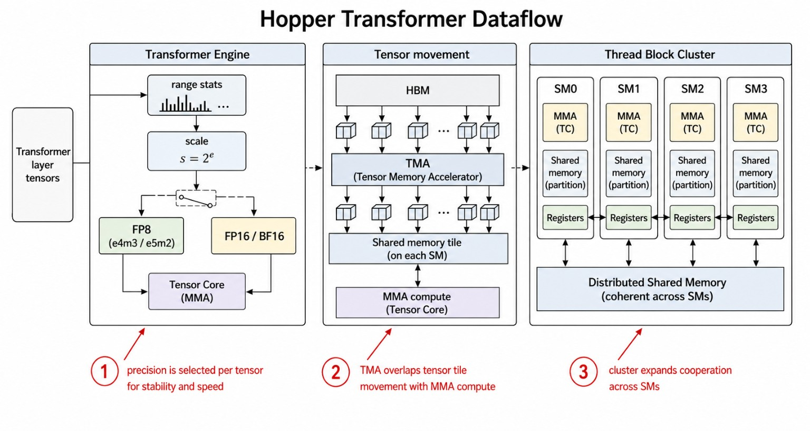

图 12-2：Hopper Transformer 数据流。标注 1 表示 Transformer Engine 用 scaling、casting 和精度策略管理 FP8 mixed precision，标注 2 表示 TMA 将 tensor tile 搬运与 MMA 计算重叠，标注 3 表示 Thread Block Cluster 扩展跨 SM 协作。

##### 12.4 把张量搬运也做成硬件问题

大模型训练中的瓶颈是矩阵乘法、显存带宽、激活/KV 数据和 GPU 间通信。Hopper 把这些问题拆成三类硬件路径：

- 用 FP8 降低数据量。
- 用 TMA 提高 tile 搬运效率。
- 用 cluster 扩大 SM 协作范围。

TMA 的工作方式可以理解为 tensor tile 的专用 DMA：

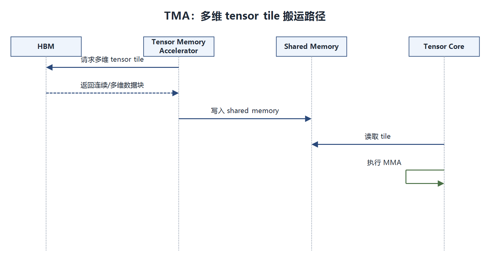

##### 12.5 Transformer Engine 与 CUDA cluster

Hopper 的软件接口变化很深，很多能力通常由库先承接，再逐步进入开发者的手写 kernel：

- NVIDIA Transformer Engine 库让框架使用 FP8 mixed precision。
- CUDA 支持 thread block cluster、distributed shared memory 和相关同步。
- TMA 可通过 CUDA 低层机制和库封装使用，减少手写搬运逻辑。
- DPX 指令通过编译器和 intrinsic 路径服务动态规划算法。
- CUDA Graph 的 graph update、device-side graph launch 等能力让重复但带少量动态选择的 GPU 工作流更容易被重放或从设备侧衔接，适合把大模型推理/训练中的固定子图稳定提交给 GPU。
- NCCL 与 NVLink/NVSwitch 继续支撑多 GPU 大模型训练。

##### 12.6 强数据流能力换来更高编写门槛

FP8 需要 scale、校准和稳定性策略。TMA 与 cluster 能提升性能，但增加 kernel 编写复杂度，通常通过 cuBLAS、cuDNN、Transformer Engine 等库间接使用。

---

#### 第 13 章 Blackwell：双 die、FP4 与 AI Factory

##### 13.1 单颗芯片变大之后的系统问题

Blackwell 继续服务生成式 AI，但它首先面对的是物理边界：单颗裸片不能无限做大，模型推理的数据量也不能无限用高精度搬运。

**Die** 是芯片裸片。这个概念重要，是因为单颗 GPU 继续做大时会遇到良率、reticle、供电和散热限制。

**Reticle limit** 是光刻单次曝光能覆盖的最大面积限制。Blackwell 使用双 die，是为了解决单 die 尺寸继续扩张越来越困难的问题。

**FP4** 出现是为了解决生成式 AI 推理成本问题。模型权重、激活和 KV cache 的数据量巨大，4 位格式可以降低带宽和容量压力，但必须依赖量化和 Transformer Engine 控制误差。

**AI Factory** 出现是因为现代 AI 不再只是跑一次训练任务，而是持续生产 token、服务用户、调度模型、管理网络和能耗的系统工程。

##### 13.2 Blackwell 的公开芯片组织

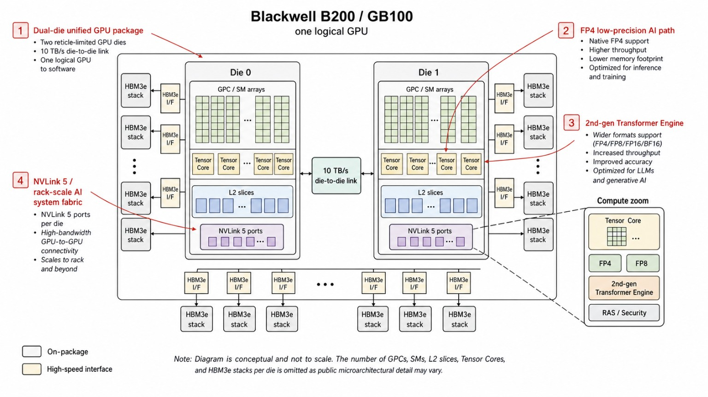

图 13-1：Blackwell B200 / GB200 架构图。相对 Hopper，标注 1 表示 Blackwell GPU 由两个 reticle-limited dies 通过 10 TB/s chip-to-chip interconnect 组成统一逻辑 GPU，标注 2 表示 FP4/NVFP4 低精度 AI 路径，标注 3 表示第二代 Transformer Engine，标注 4 表示 NVLink 5 与 rack-scale AI fabric。因公开微架构细节有限，图中 SM/GPC 采用概念块，避免编造精确 SM 数量。

##### 13.3 双 die、FP4 与 rack-scale 互联

Blackwell 的关键词是系统级生成式 AI：

- 双 die 统一 GPU 封装。
- FP4 与第二代 Transformer Engine。
- 更强 NVLink 和 NVLink Switch。
- RAS、机密计算和数据中心可靠性能力。
- 面向 GB200 NVL72、DGX/SuperPOD 等整机架和集群平台扩展。

##### 13.4 用封装和低精度继续推进生成式 AI

单 die 继续增大受良率、reticle、供电和散热限制。Blackwell 用两个大 die 通过高带宽 die-to-die link 组成统一逻辑 GPU，目标是让软件尽量像使用一颗 GPU 一样使用它。

FP4 的目的不是“越低精度越好”，而是减少模型权重、激活和 KV cache 的带宽/容量压力。它必须依赖 Transformer Engine、量化策略和软件库保证模型质量。

系统层面上，GB200 NVL72 把 72 个 Blackwell GPU 与 36 个 Grace CPU 放进一个 rack-scale NVLink domain。第五代 NVLink/NVLink Switch 的意义，是让多 GPU 在训练、推理和 reasoning workload 中共享更高带宽的数据通路；跨 rack 再通过 InfiniBand 或 Ethernet 做 scale-out。也就是说，Blackwell 的“架构”已经不只是一颗 GPU die，而是 GPU、CPU、NVLink、DPU、网络和软件共同组成的 AI factory 单元。

##### 13.5 TensorRT-LLM、Transformer Engine 与 NCCL

Blackwell 的软件变化主要集中在 AI 库和系统栈：

- Transformer Engine 支持更低精度路径，包括 FP4/NVFP4 等新格式。
- TensorRT-LLM、cuBLAS、cuDNN 和深度学习框架负责把模型映射到低精度 Tensor Core。
- NCCL 和 NVLink/NVSwitch 软件栈负责 rack-scale 通信。
- Confidential Computing 和 RAS 能力通过驱动、管理工具和平台接口进入部署流程。

##### 13.6 公开细节有限，系统依赖更强

公开微架构细节有限，不应编造 SM 数量和内部 cache 细节。Blackwell 的复杂性也意味着性能越来越依赖软件栈、系统拓扑和模型量化策略。

---

#### 第 14 章 Rubin / Vera Rubin：从 GPU 芯片走向机架系统

##### 14.1 GPU 架构边界为什么扩展到机架

Rubin/Vera Rubin 的公开信息显示，NVIDIA 讨论架构时已经不只讨论单颗 GPU。大模型系统的瓶颈会落在 CPU、GPU、NVSwitch、DPU、网络、电力和液冷的共同边界上。

**NVL72** 这个术语出现，是因为单服务器已经不足以描述现代 AI GPU 系统。以 72 个 GPU 为核心的机架级单元，才是大模型训练和推理的基本扩展粒度之一。

**POD** 出现是为了解决多个机架如何组成更大 AI 基础设施的问题。它把 GPU 机架、网络、存储、电力和液冷都纳入同一系统边界。

**DPU** 是 Data Processing Unit。它出现是为了解决 CPU 不应承担所有网络、安全和存储卸载任务的问题。在 AI factory 中，DPU 帮助降低主机 CPU 干扰，让 GPU 系统更稳定地服务计算。

##### 14.2 Rubin / Vera Rubin 的系统组织

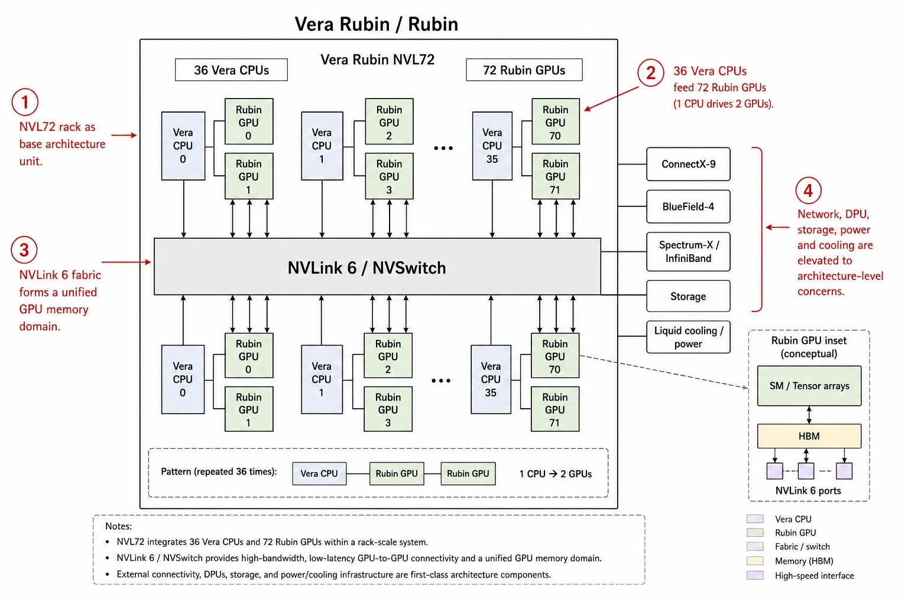

图 14-1：Vera Rubin / Rubin NVL72 系统架构图。由于截至 2026-06-05 公开资料主要是平台与系统级信息，本图不编造 Rubin GPU 内部 SM/cache 微结构。相对 Blackwell，标注 1 表示 NVL72 机架成为基础架构单元，标注 2 表示 36 个 Vera CPU 与 72 个 Rubin GPU 的耦合，标注 3 表示 NVLink 6 / NVSwitch 形成高带宽 GPU memory domain，标注 4 表示 ConnectX-9、BlueField-4、网络、电力与液冷也成为架构设计对象。

##### 14.3 从芯片路线到系统路线

Rubin/Vera Rubin 的公开重点不是单个 SM，而是系统架构：

- 72 个 Rubin GPU、36 个 Vera CPU、NVLink 6、ConnectX-9 SuperNIC 和 BlueField-4 DPU 共同设计。
- 单 GPU 扩展为 NVL72 机架级单元，rack 内通过 NVLink/NVSwitch 做 scale-up。
- POD 级部署把 InfiniBand/Ethernet scale-out、存储、电力和液冷也变成架构问题。

截至本文日期，NVIDIA 公开资料给出的 Vera Rubin NVL72 指标主要是平台级、且标注为 preliminary information，应作为方向和量级理解：

| 项目 | 公开系统级信息 | 说明 |
|---|---|---|
| 机架组成 | 72 个 Rubin GPU、36 个 Vera CPU | NVL72 是 rack-scale 单元，不是单卡产品 |
| GPU 显存 | 整机架 20.7 TB HBM4，单 Rubin GPU 288 GB HBM4 | 说明 Rubin 讨论重点已经包含显存容量与带宽域 |
| GPU 显存带宽 | 整机架 1,580 TB/s，单 Rubin GPU 22 TB/s | 这些是公开平台规格，仍可能随量产配置变化 |
| NVLink 6 | 单 GPU 3.6 TB/s NVLink bandwidth，NVL72 总计 260 TB/s | rack 内 all-to-all scale-up 是核心卖点 |
| Scale-out 网络 | ConnectX-9、BlueField-4、InfiniBand/Ethernet | rack 外扩展依赖网络、DPU 和系统软件 |

这些数字不等于 Rubin GPU 的完整微架构说明。它们更适合用来说明一个趋势：NVIDIA 正把“GPU 架构”从单芯片 SM/cache 设计，扩展为 GPU、CPU、HBM、NVLink、DPU/NIC、液冷、电力和运维软件共同定义的生产单元。

##### 14.4 系统软件成为性能边界

截至 2026-06-05，Rubin GPU 微架构公开资料有限，因此软件接口不宜过度推断。可以确定的是，系统软件会更重要：

- CUDA 仍是底层计算入口。
- NCCL、NVLink/NVSwitch 拓扑感知调度会更关键。
- 推理服务栈需要管理长上下文、KV cache、批处理和多机通信。
- DPU、网络和存储软件会参与 AI factory 的整体吞吐。

##### 14.5 等待后续白皮书补齐微架构

Rubin 的细节仍应以 NVIDIA 后续白皮书为准。本报告只讨论公开系统方向，不编造内部 SM、cache 或 Tensor Core 细节。

---

## 第三部分 横向看现代 GPU 技术体系

前面的章节按时间展开。现在换一个视角，把现代 GPU 中反复出现的机制横向拆开：SM 如何隐藏延迟，Tensor Core 为什么离不开 tile，RT Core 和 shader 怎样配合，显存与互联为什么会成为大模型时代的核心限制。

### 第 15 章 SM、warp 与延迟隐藏

SM 的存在，是为了解决“海量线程如何被局部调度和执行”的问题。一个 GPU 不可能让全芯片共享一个中央调度器，那样控制路径太长、扩展性太差。因此 NVIDIA 把调度器、寄存器、shared memory 和执行单元放进 SM，让每个 SM 成为一个局部并行执行岛。

Warp 的存在，是为了解决“每个 thread 单独调度成本太高”的问题。32 个线程组成一个 warp 后，硬件能以较低控制成本发射同一条指令。

延迟隐藏的关键不是“显存变快了”，而是“等待时不要停工”。一个 warp 等内存，另一个 warp 执行。于是性能不仅看算力，还看：

- 每线程寄存器数量。
- 每 block shared memory 使用量。
- block 尺寸。
- warp divergence。
- 内存合并程度。
- 计算与搬运是否重叠。

### 第 16 章 Tensor Core 与 tile 化

Tensor Core 出现，是因为 AI 计算的热点极其集中：矩阵乘法占据大部分时间。如果继续用通用 CUDA Core 逐条执行标量 FMA，硬件要在指令调度、寄存器读写和数据搬运上付出大量通用性成本。

Tensor Core 把一个小矩阵 fragment 的乘加做成专用路径。但它只有在数据供应跟得上时才快。因此 tile 化不是软件细节，而是 Tensor Core 性能的前提：

1. 大矩阵切成 tile，降低工作集大小。
2. tile 搬入 shared memory，减少 HBM 访问。
3. warp 把 tile 装入 register fragment。
4. Tensor Core 执行 MMA。
5. accumulator 保留部分和，最后写回。

这也是为什么 cuBLAS、cuDNN 和 Transformer Engine 如此重要：它们替开发者安排 layout、tile、精度和流水。

### 第 17 章 RT Core 与图形软件栈

RT Core 出现，是因为光线追踪最重的一部分并不是材质表达，而是几何查询：一条光线到底击中了哪个三角形。这个问题固定、重复、分支多，非常适合专用硬件。

但 RT Core 不直接画出最终图像。完整 RTX 管线需要：

- 图形 API 描述 ray generation、hit、miss shader。
- 驱动和运行时管理 BVH。
- RT Core 执行 traversal/intersection。
- SM 执行材质、阴影和递归逻辑。
- Tensor Core 执行 denoising、super resolution 或 frame generation。

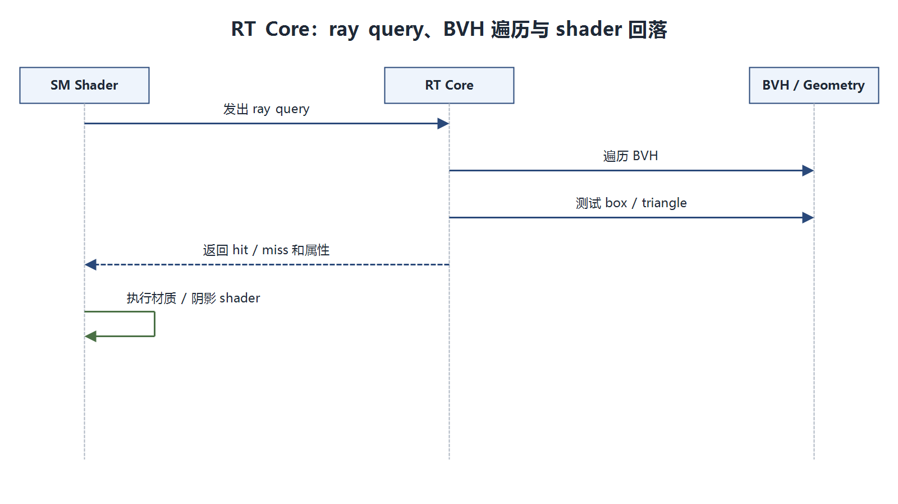

### 第 18 章 显存、缓存与互联

显存和互联技术出现，是因为现代 GPU 的瓶颈经常不在“算”，而在“数据在哪里”。可以按三个尺度看：

| 尺度 | 主要部件 | 解决的问题 | 常见瓶颈 |
|---|---|---|---|
| 单卡内部 | register、shared/L1、L2、HBM/GDDR | 把数据送到 SM/Tensor Core，并尽量在片上复用 | 非合并访问、L2 命中低、HBM 带宽耗尽、同步等待 |
| 单机多卡 / 单 rack | NVLink、NVSwitch、PCIe | 让 tensor parallel、pipeline parallel、expert parallel 在 GPU 间交换激活、梯度和 KV 数据 | All-Reduce、Reduce-Scatter、All-Gather、MoE dispatch 等通信占比上升 |
| 多机集群 | InfiniBand、Ethernet、Spectrum-X、Quantum-X、DPU/NIC | 把多个 rack 连接成 scale-out AI/HPC 系统 | 网络拓扑、拥塞、跨节点延迟、调度和数据加载 |

训练和推理关注点也不同。训练常被 All-Reduce、Reduce-Scatter、All-Gather 和 MoE dispatch 限制；推理则经常被 KV cache 容量、显存带宽、batch size、prefill/decode 比例和请求调度限制。长上下文场景下，KV cache 会随序列长度增长，占用显存并制造持续读写压力；这就是为什么 TensorRT-LLM、推理服务调度器和缓存复用策略会进入 GPU 性能讨论。因此，训练更容易暴露“同步通信”和“跨 GPU 数据重排”瓶颈；推理则更容易在 decode 阶段暴露“小 batch、长上下文、KV cache 读写和调度碎片化”问题。

因此，HBM、L2、NVLink、NVSwitch 和网络不是“外围配置”，而是现代 GPU 数据流的一部分。Tensor Core 再快，如果数据不能按正确粒度、正确时间到达，实际吞吐仍会掉下来。

### 第 19 章 低精度计算

低精度格式出现，是因为 AI 模型对数值误差有一定容忍度，而数据搬运和矩阵乘法成本极高。降低位宽可以同时减少显存容量、显存带宽、通信量和 Tensor Core 能耗。

但低精度不是越低越好：

- FP16 降低数据量，但动态范围可能不足。
- BF16 保留较大指数范围，训练更稳。
- TF32 降低 FP32 训练迁移门槛。
- FP8 需要 scale 和 Transformer Engine 管理。
- FP4 更依赖量化、校准和模型结构适配。

因此低精度计算是硬件、数值算法和软件库共同设计的结果。

| 精度格式 | 主要使用阶段 | 解决的问题 | 风险与代价 |
|---|---|---|---|
| FP32 | 通用训练、图形和科学计算 | 精度和动态范围较稳，是很多算法的默认表达 | 带宽、显存容量和计算能耗成本高 |
| FP64 | HPC、科学模拟、金融和数值稳定性要求高的任务 | 提供更高精度和更小舍入误差 | AI 主流 workload 中性价比较低，硬件吞吐通常远低于低精度路径 |
| FP16 | Pascal/Volta 后深度学习普及 | 降低显存、带宽和计算成本，配合 Tensor Core 提高吞吐 | 动态范围较小，训练常需 loss scaling 或混合精度 |
| BF16 | Ampere 后更常见 | 保留接近 FP32 的指数范围，训练更稳 | 尾数精度低于 FP32，仍需库和框架控制数值误差 |
| TF32 | Ampere | 让 FP32 风格 GEMM 更容易走 Tensor Core 快路径，降低迁移门槛 | 不是严格 FP32，数值敏感任务要显式关闭或验证 |
| FP8 | Hopper | 降低 Transformer 训练/推理的数据搬运和存储成本 | 需要 scale、校准和 Transformer Engine 管理动态范围 |
| FP4 / NVFP4 | Blackwell | 降低生成式 AI 推理成本，减轻权重、激活、KV cache 压力 | 强依赖量化策略、校准数据、模型结构和软件栈 |

如果按 Tensor Core 代际看，低精度不是一条单独的格式列表，而是和硬件 MMA 路径、库默认策略、训练/推理算法一起演进：

| 代际 | 代表架构 | Tensor Core / 低精度重点 | 软件含义 |
|---|---|---|---|
| 第一代 Tensor Core | Volta | FP16 输入、FP32 累加的 mixed precision | WMMA、cuBLAS/cuDNN 开始把深度学习热点映射到 Tensor Core |
| 第三代 Tensor Core | Ampere | TF32、BF16、结构化稀疏 | FP32 风格训练更容易走 Tensor Core，稀疏需要 2:4 等结构化约束 |
| 第四代 Tensor Core | Hopper | FP8 与 Transformer Engine | scaling、casting 和精度 recipe 进入训练栈 |
| Blackwell Tensor Core | Blackwell | FP4/NVFP4、micro-tensor scaling | 生成式 AI 推理和 MoE/LLM 工作流更依赖量化与 TensorRT-LLM |
| Rubin 公开系统规格 | Rubin / Vera Rubin | NVFP4、FP8/FP6、HBM4 平台规格 | 目前更适合按系统吞吐、显存带宽和机架互联讨论 |

这张表也提醒一个常见误区：低精度格式本身不是性能保证。只有当模型数值特性、kernel layout、库路径、显存带宽和通信拓扑都匹配时，低精度才会变成端到端吞吐。

### 第 20 章 从峰值到真实性能：Roofline、Occupancy 与 Stall

GPU 规格表会给出 TFLOPS、显存带宽和互联带宽，但真实性能取决于 workload 落在哪个瓶颈上。一个 kernel 没跑满 Tensor Core，并不一定是“算力不够”；更常见的原因是数据 layout 不合适、tile 复用不足、访存不合并、同步太多、host launch 有空泡，或者多 GPU 通信把计算单元饿住了。

**Roofline** 是把这个问题压缩成一张图的方法。横轴是算术强度，即每搬运一个 byte 数据能做多少次运算；纵轴是实际吞吐。算术强度低时，性能上限通常由 HBM/L2/L1 带宽决定，属于 memory-bound；算术强度高时，性能才可能接近 CUDA Core 或 Tensor Core 的 compute ceiling。Nsight Compute 中的 Roofline 图还可以加入不同层级的 roof，帮助判断瓶颈在 device memory、L2、L1/shared 还是计算单元。

实际分析时，可以按下面顺序看：

| 问题 | 观察指标 | 常见解释 |
|---|---|---|
| 算力是否被喂满 | SM utilization、Tensor Core utilization、achieved FLOP/s | 低利用率不等于硬件弱，可能是访存、同步、launch 或通信让执行单元等待 |
| 是 compute-bound 还是 memory-bound | arithmetic intensity、memory throughput、Roofline 位置 | 低算术强度 kernel 通常应先优化数据复用和访存合并 |
| occupancy 是否足够 | achieved occupancy、active warps、register/shared memory 使用量 | occupancy 太低会缺少 ready warp；太高也可能因为寄存器溢出或缓存压力变慢 |
| warp 为什么停住 | warp stall reason、scoreboard、barrier、memory dependency | stall reason 要和源码、访存模式、同步位置一起看，不能孤立解读 |
| 缓存是否有效 | L2 hit rate、L1/shared 访问、global load/store efficiency | L2 命中低或访问不合并，会让 HBM 成为瓶颈 |
| 多 GPU 是否扩展 | NCCL bandwidth、All-Reduce/All-Gather 时间、通信计算重叠 | 通信慢会让 Tensor Core 等梯度、激活或专家路由结果 |

AI 推理还要多看几项：prefill 阶段通常更像大矩阵计算，decode 阶段常被小 batch、KV cache 读写和调度开销限制；batch size 提高能增加吞吐，但会占用更多 KV cache 并增加排队延迟。服务端的 continuous batching、KV cache 复用、prefill/decode 分离和 CUDA Graph replay，本质上都是在减少 GPU 空等和显存浪费。

可以用一个简化的判断例子把这些指标串起来：

| 现象 | 更可能的瓶颈 | 优先检查 |
|---|---|---|
| GEMM 的 Tensor Core utilization 很低，但 HBM throughput 很高 | 数据复用不足或 layout 不适合 MMA | tile 尺寸、shared memory 复用、矩阵 layout、是否走 cuBLAS/CUTLASS Tensor Core kernel |
| Attention prefill 阶段吞吐高，decode 阶段吞吐低 | 小 batch、KV cache 读写和调度开销 | batch 合并、paged KV cache、CUDA Graph replay、prefill/decode 分离 |
| 单卡 kernel 很快，多卡训练扩展差 | collective 通信或拓扑瓶颈 | NCCL trace、All-Reduce/Reduce-Scatter 时间、NVLink/NVSwitch/网络拓扑、通信计算重叠 |
| Occupancy 高但性能仍低 | 可能是 memory dependency、barrier 或寄存器溢出 | warp stall reason、local memory 访问、barrier 位置、L2 hit rate |

性能分析的关键是把“硬件能力”翻译成“瓶颈假设”：先猜是算力、显存、同步、launch 还是通信；再用 profiler 验证；最后只改最可能的限制项。否则很容易在 CUDA Core 数量、Tensor Core 峰值或显存带宽之间来回猜。

### 第 21 章 软件栈为什么越来越重要

现代 GPU 的很多硬件能力并不直接由应用逐条指令调用，而是通过驱动、编译器、运行时、通信库、AI 库和图形 API 共同释放。软件栈存在，是为了解决“硬件能力过于复杂，不能让每个开发者都从指令级重新组织数据流”的问题。

| 软件层级 | 代表组件 | 主要作用 |
|---|---|---|
| Driver / Runtime | NVIDIA Driver、CUDA Runtime、CUDA Driver API | 管理设备、context、kernel launch、stream、memory、graph、event |
| 编译层 | NVCC、PTX、SASS、JIT、linker | 把 CUDA C++、库调用和中间表示映射到具体架构指令 |
| 计算库 | cuBLAS、cuDNN、cuSPARSE、CUTLASS | 把 GEMM、卷积、稀疏、attention 等热点模式优化到 Tensor Core/CUDA Core |
| 通信库 | NCCL、NVSHMEM、CUDA P2P | 做多 GPU collective、GPU-initiated communication、scale-up/scale-out 通信 |
| 推理/训练栈 | TensorRT-LLM、Transformer Engine、Triton Inference Server、框架 compiler | 管理低精度、KV cache、batching、graph replay、算子融合和部署 |
| 图形栈 | DXR、Vulkan RT、OptiX、DLSS SDK | 释放 RT Core、Tensor Core 和神经图形能力 |

换句话说，CUDA Core 依赖编译器、线程层级和访存模型释放；Tensor Core 依赖 cuBLAS、cuDNN、CUTLASS、Transformer Engine 和 TensorRT 安排 tile、layout、精度和 accumulator；RT Core 依赖 DXR、Vulkan RT 和 OptiX 管理 BVH 与 ray pipeline；NVLink / NVSwitch 依赖 NCCL、NVSHMEM 和调度系统组织 collective 通信。现代 GPU 的实际性能，越来越取决于硬件、库、编译器和服务框架是否协同。

从任务提交看，CUDA 编程模型也经历了一条清晰路线：早期程序由 CPU 逐次 launch kernel；streams 让多个任务流并发；Hyper-Q / MPS 让更多 host-side 并行任务进入 GPU；CUDA Graph 把重复工作流捕获成可重放依赖图；device-side graph launch 和 persistent kernel 则进一步减少 GPU 等待 CPU 的机会。大模型推理服务中的 continuous batching、KV cache 管理和 prefill / decode 分离，本质上也是在软件层面持续喂满 GPU。

因此，现代 GPU 优化不能只问“这颗卡峰值多高”，还要问：框架是否走到了正确库路径，数据 layout 是否适合 Tensor Core，通信拓扑是否被 NCCL 正确利用，推理服务是否避免了小 batch 和频繁 launch 带来的空泡。硬件能力越专用，软件栈就越接近性能边界本身。

## 第四部分 总结与学习路线

这一部分把前文压缩成两件事：一张代际总表帮助回看主线，一条学习路线帮助读者从 CUDA 基础逐步走到 Tensor Core、多 GPU 和图形/AI 软件栈。

### 第 22 章 代际总表

| 架构 | 硬件关键词 | 软件/接口关键词 | 核心意义 |
|---|---|---|---|
| G80 / Tesla | 统一 shader、SP、GigaThread | CUDA 早期模型 | GPU 进入通用并行计算 |
| Fermi | L1/L2、ECC、成熟 SM | compute capability 2.x、cache config、concurrent kernel | 通用计算 GPU 成熟 |
| Kepler | SMX、Hyper-Q、Dynamic Parallelism | CUDA streams、CUDA MPS、device-side launch、`__shfl`、`__ldg`、GPUDirect RDMA | 提高多任务利用率与多进程/多节点数据通路效率 |
| Maxwell | SMM、能效、大 L2 | 性能调优侧重 occupancy 和访存效率 | 每瓦性能提升 |
| Pascal | HBM2、NVLink、FP16 | Unified Memory、NCCL、FP16 库 | 数据中心 GPU 平台化 |
| Volta | Tensor Core、Independent Thread Scheduling | WMMA、Cooperative Groups、cuBLAS/cuDNN Tensor Core、`__syncwarp` | AI 矩阵计算硬件化，同时要求更明确的线程协作表达 |
| Turing | RT Core、Tensor 图形、FP/INT 并行 | DXR、Vulkan RT、OptiX、DLSS、CUDA Graphs | 实时光追与神经图形，同时软件开始优化重复任务提交开销 |
| Ampere | TF32、稀疏、MIG、async copy | CUDA 11、cuSPARSELt、MIG 管理、TF32 库路径、CUDA Graph replay | AI 云基础设施 |
| Ada | SER、第三代 RT、DLSS 3、大 L2 | DLSS SDK、OptiX/NVAPI、图形 API 扩展 | 神经图形管线成熟 |
| Hopper | FP8、Transformer Engine、TMA、Cluster、DPX | Transformer Engine、cluster APIs、TMA/pipeline、DPX intrinsics、device graph launch | Transformer 训练和大模型工作流优化 |
| Blackwell | 双 die、FP4/NVFP4、NVLink 5、RAS | TensorRT-LLM、Transformer Engine、NCCL、系统管理 | AI factory 核心 GPU |
| Rubin | HBM4、NVFP4、Vera CPU、NVLink 6、NVL72/POD | 系统级 CUDA/NCCL/调度栈 | 架构边界扩展到机架/POD |

代际表还需要反向读：每一代的重点并不等于它解决了所有问题。

| 架构 | 不应误解为 |
|---|---|
| G80 / Tesla | 不是成熟 HPC GPU，而是统一 shader 与 CUDA 起点 |
| Fermi | 不是能效优先设计，而是缓存、ECC、双精度和通用计算能力成熟 |
| Maxwell | 不是双精度 HPC 路线，而是以能效和图形/消费级 workload 为主 |
| Pascal | 不是只增加 CUDA Core，而是 HBM2、NVLink、FP16 和数据中心平台化 |
| Turing | 不是 RT Core 让整帧免费，而是把相交测试从 shader 中拆出去 |
| Ampere | 不是 TF32 等于 FP32，而是让 FP32 风格 GEMM 更容易走 Tensor Core |
| Hopper | 不是只有 FP8，而是 Transformer Engine、TMA、cluster 和 DPX 共同服务数据流 |
| Blackwell | 不是简单双 die，而是 FP4、NVLink 5、NVL72 和 AI Factory 共同推进 |
| Rubin | 不能写成已知完整微架构；截至本文日期，应保持系统级描述 |

### 第 23 章 建议学习路线

1. 先写 CUDA 向量加法，理解 grid、block、thread。
2. 写 tiled matrix multiply，理解 shared memory 和 coalescing。
3. 用 Nsight Compute 看 Roofline、occupancy、memory throughput、warp stall 和 L2 hit rate。
4. 学 cuBLAS GEMM，理解 Tensor Core 为什么需要 layout、tile、精度和数据搬运配合。
5. 学 CUDA streams、MPS 与 CUDA Graph，理解 GPU 不只怕算得慢，也怕 host 端提交不连续。
6. 学 NCCL All-Reduce，理解多 GPU 不是简单堆卡。
7. 对图形方向，学习 DXR/OptiX 的 ray generation、hit、miss shader。
8. 对大模型推理方向，学习 TensorRT-LLM、vLLM / SGLang 类 serving 框架中的 continuous batching、KV cache 管理、prefill / decode 分离和 CUDA Graph replay。

---

### 第 24 章 结论

NVIDIA GPU 架构的主线可以概括为：

1. G80/Fermi 让 GPU 从图形流水线变成通用并行计算处理器。
2. Kepler/Maxwell/Pascal 解决利用率、能效、显存带宽和多 GPU 通信。
3. Volta/Turing/Ampere/Ada 把 Tensor Core、RT Core、MIG 和神经图形做成核心能力。
4. Hopper/Blackwell/Rubin 把低精度大模型、机架互联和 AI factory 纳入架构设计。

现代 NVIDIA GPU 不是单纯的“很多核心”，而是一个由 SM、存储层级、专用加速单元、互联和软件栈共同构成的数据流系统。

---

## 参考资料

### 架构白皮书与官方架构介绍

1. NVIDIA, *GeForce 8800 GPU Architecture Technical Brief*. https://www.nvidia.com/content/PDF/Geforce_8800/GeForce_8800_GPU_Architecture_Technical_Brief.pdf
2. NVIDIA, *NVIDIA Fermi Compute Architecture Whitepaper*. https://www.nvidia.com/content/PDF/fermi_white_papers/NVIDIAFermiComputeArchitectureWhitepaper.pdf
3. NVIDIA, *Kepler GK110/GK210 Architecture Whitepaper*. https://www.nvidia.com/content/dam/en-zz/Solutions/Data-Center/documents/NVIDIA-Kepler-GK110-GK210-Architecture-Whitepaper.pdf
4. NVIDIA Developer, *Maxwell Architecture*. https://developer.nvidia.com/maxwell-compute-architecture
5. NVIDIA, *Pascal GP100 Architecture Whitepaper*. https://images.nvidia.com/content/pdf/tesla/whitepaper/pascal-architecture-whitepaper.pdf
6. NVIDIA, *Volta Architecture Whitepaper*. https://images.nvidia.com/content/volta-architecture/pdf/volta-architecture-whitepaper.pdf
7. NVIDIA, *NVIDIA Turing GPU Architecture*. https://www.nvidia.com/en-gb/geforce/news/geforce-rtx-20-series-turing-architecture-whitepaper/
8. NVIDIA, *NVIDIA Ampere Architecture In-Depth*. https://developer.nvidia.com/blog/nvidia-ampere-architecture-in-depth/
9. NVIDIA, *NVIDIA A100 Tensor Core GPU Architecture Whitepaper*. https://www.nvidia.com/content/dam/en-zz/Solutions/Data-Center/nvidia-ampere-architecture-whitepaper.pdf
10. NVIDIA, *NVIDIA Ada GPU Architecture Whitepaper*. https://images.nvidia.com/aem-dam/en-zz/Solutions/technologies/NVIDIA-ADA-GPU-PROVIZ-Architecture-Whitepaper_1.1.pdf
11. NVIDIA, *NVIDIA Hopper Architecture In-Depth*. https://developer.nvidia.com/blog/nvidia-hopper-architecture-in-depth/
12. NVIDIA, *NVIDIA Hopper GPU Architecture*. https://www.nvidia.com/en-us/data-center/technologies/hopper-architecture/
13. NVIDIA, *NVIDIA Blackwell Architecture*. https://www.nvidia.com/en-us/data-center/technologies/blackwell-architecture/
14. NVIDIA, *NVLink and NVLink Switch*. https://www.nvidia.com/en-us/data-center/nvlink/
15. NVIDIA, *GB200 NVL72*. https://www.nvidia.com/en-us/data-center/gb200-nvl72/
16. NVIDIA Developer Blog, *NVIDIA GB200 NVL72 Delivers Trillion-Parameter LLM Training and Real-Time Inference*. https://developer.nvidia.com/blog/nvidia-gb200-nvl72-delivers-trillion-parameter-llm-training-and-real-time-inference/
17. NVIDIA, *Vera Rubin NVL72*. https://www.nvidia.com/en-us/data-center/vera-rubin-nvl72/
18. NVIDIA, *DGX Vera Rubin NVL72*. https://www.nvidia.com/en-us/data-center/dgx-vera-rubin-nvl72/
19. NVIDIA Newsroom, *NVIDIA Vera Rubin Opens Agentic AI Frontier*. https://investor.nvidia.com/news/press-release-details/2026/NVIDIA-Vera-Rubin-Opens-Agentic-AI-Frontier/default.aspx
20. NVIDIA Newsroom, *NVIDIA Vera Rubin Ramps Into Full Production*. https://nvidianews.nvidia.com/news/vera-rubin-full-production-agentic-ai-factory

### CUDA 与编程模型

21. NVIDIA CUDA Toolkit Documentation, *CUDA C++ Programming Guide*. https://docs.nvidia.com/cuda/cuda-c-programming-guide/
22. NVIDIA CUDA Toolkit Documentation, *CUDA Graphs*. https://docs.nvidia.com/cuda/cuda-c-programming-guide/index.html#cuda-graphs
23. NVIDIA Developer Blog, *Getting Started with CUDA Graphs*. https://developer.nvidia.com/blog/cuda-graphs/
24. NVIDIA, *CUDA Multi-Process Service*. https://docs.nvidia.com/deploy/mps/
25. NVIDIA CUDA Toolkit Documentation, *GPUDirect RDMA*. https://docs.nvidia.com/cuda/gpudirect-rdma/
26. NVIDIA CUDA Toolkit Documentation, *Cooperative Groups*. https://docs.nvidia.com/cuda/cuda-c-programming-guide/index.html#cooperative-groups

### 性能分析与工具

27. NVIDIA Nsight Compute Documentation, *Rooflines*. https://docs.nvidia.com/nsight-compute/NsightCompute/index.html
28. NVIDIA Developer Blog, *Accelerating HPC Applications with NVIDIA Nsight Compute Roofline Analysis*. https://developer.nvidia.com/blog/accelerating-hpc-applications-with-nsight-compute-roofline-analysis/

### 多 GPU 通信与大模型系统

29. NVIDIA NVSHMEM Documentation. https://docs.nvidia.com/nvshmem/index.html
30. NVIDIA Developer Blog, *Introducing New KV Cache Reuse Optimizations in NVIDIA TensorRT-LLM*. https://developer.nvidia.com/blog/introducing-new-kv-cache-reuse-optimizations-in-nvidia-tensorrt-llm/
