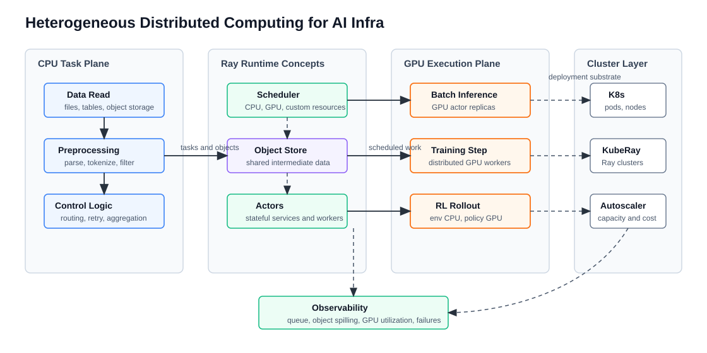

# 面向 AI Infra 的异构分布式计算系统综述

版本日期：2026-06-15

---

## 摘要

AI Infra 中的“分布式系统”不只是多副本一致性和 RPC。训练、推理、数据处理和 RL rollout 更常见的问题是异构分布式计算：CPU 负责读取、解析、tokenization、环境模拟和控制逻辑；GPU 负责训练 step、batch inference、reward model 和 policy rollout；对象存储保存中间数据、checkpoint 和日志；调度器要在 CPU、GPU、内存、网络和队列之间做资源匹配。

本文把 Ray 作为贯穿案例，解释为什么它适合作为 AI workload 的分布式计算抽象：Ray Core 用 task 和 actor 表达无状态与有状态计算，用 object store 连接中间数据，用 CPU / GPU / custom resource 表达调度约束；Ray Data、Ray Train、Ray Serve、KubeRay 又分别把这些底层抽象连接到数据流水线、分布式训练、在线服务和 Kubernetes 集群部署。

**文档定位**：本文是异构分布式计算专题的入口文章。它不试图覆盖所有分布式系统理论，而是建立“AI workload → 异构资源 → Ray 抽象 → 集群部署 → 可观测性”的学习框架。

**前置知识**：读者最好已经了解 CPU / GPU 分工、基本 Python 并发和深度学习训练或推理流程。GPU 执行模型可参考 [CUDA 编程模型](../gpu-architecture/cuda_intro.md)。

---

## 目录

- 第 1 章 为什么 AI Infra 需要异构分布式计算
- 第 2 章 Ray Core：Task、Actor、Object Store 与 Resource
- 第 3 章 CPU-GPU Pipeline：从数据处理到推理和训练
- 第 4 章 KubeRay 与生产集群
- 第 5 章 和 LLM Infra / RL Infra 的连接
- 第 6 章 学习路线与参考资料

---

## 第 1 章 为什么 AI Infra 需要异构分布式计算

**本章主线**：先把问题从“多机通信”收缩到 AI workload 的真实执行形态，再解释为什么 CPU、GPU、存储和网络不能分开学习，最后用一张图建立后续文章的系统地图。

### 1.1 AI workload 很少只有 GPU 计算

很多人理解 AI 系统时会从 GPU 利用率出发，这没有错，但不完整。一个 LLM 或 RL 系统中，GPU 往往只负责最密集的矩阵计算，而 GPU 前后还有大量 CPU 与系统工作：

- 数据读取：从对象存储、文件系统、消息队列或数据库读取样本。
- 数据预处理：解析、过滤、tokenization、拼 batch、压缩和解压。
- 控制逻辑：任务路由、重试、超时、聚合、采样策略和实验状态更新。
- GPU 执行：训练 step、推理 batch、reward model 评分、policy rollout。
- 状态持久化：checkpoint、模型权重、数据血缘、日志和指标。

只优化 GPU kernel，可能仍然看见 GPU 空泡；只扩 GPU，可能被 CPU tokenization、object store spilling、网络传输或调度队列卡住。因此，AI Infra 的分布式系统学习需要从异构资源和数据流开始。

### 1.2 贯穿例子：批量推理与后训练数据流水线

考虑一个后训练数据生产任务：系统从对象存储读取 prompt，CPU worker 完成清洗和 tokenization；GPU worker 批量生成候选回答；另一个 GPU reward model 对回答打分；CPU worker 聚合结果并写回数据集。这个任务既不是单纯训练，也不是纯在线服务，而是 CPU 与 GPU 交替工作的流水线。

如果没有统一的分布式计算抽象，工程上会遇到很多问题：

- 如何表达“这个任务需要 4 个 CPU，而那个 actor 独占 1 张 GPU”？
- 如何让 GPU worker 看到 CPU worker 产生的中间 batch？
- 如何避免上游 CPU 过快生产导致内存爆掉？
- 某个 GPU actor 失败后，哪些中间结果需要重算？
- 任务在 Kubernetes 上如何扩缩容，如何观察 object spilling 和 GPU 利用率？

Ray 的价值就在这里：它不是只提供一个训练框架，而是提供 task、actor、object reference 和 resource scheduling 这些可组合的分布式计算原语。

<small>图 1-1：AI Infra 中的异构分布式计算。CPU task、GPU actor、object store、scheduler 和 Kubernetes 集群层共同决定训练、推理、数据处理和 rollout 的吞吐与稳定性。</small>

**本章小结**：AI Infra 的分布式问题首先是异构计算问题。CPU、GPU、对象存储、网络和调度器之间的数据流，比单独理解某个 GPU kernel 或某个 RPC 框架更接近真实瓶颈。

## 第 2 章 Ray Core：Task、Actor、Object Store 与 Resource

**本章主线**：先定义 Ray 的四个基础抽象，再说明它们如何表达 AI workload 的数据流和资源约束，最后指出这些抽象的边界。

### 2.1 Task 和 Actor 分别表达无状态与有状态计算

Ray Core 的两个核心执行抽象是 **task** 和 **actor**。Task 适合一次性、可并行、相对无状态的函数调用，例如读取文件、解析样本、生成一个 batch 的 embedding。Actor 是有状态的远程对象，适合长期持有模型、连接池、缓存或环境状态，例如一个 GPU 推理 worker、一个参数服务器、一个 RL environment manager。

这一区分对 AI Infra 很重要：

| 抽象 | 适合表达 | AI Infra 例子 |
|---|---|---|
| Task | 短生命周期、可重试、可并行函数 | 数据清洗、tokenization、特征构造、结果聚合 |
| Actor | 长生命周期、有状态服务 | GPU 模型副本、Ray Serve replica、RL 环境池、在线 evaluator |
| Object reference | 远程对象句柄 | batch、embedding、rollout trajectory、评测结果 |
| Object store | 中间数据共享层 | CPU 与 GPU worker 之间传递 batch |

相比手写多进程队列，Ray 的好处是把函数调用、状态对象和数据引用都纳入同一套分布式 runtime。开发者可以先用本地思维写 Python 函数，再逐步把它们分布到集群。

### 2.2 Resource model 让 CPU、GPU 和自定义资源进入调度语言

异构计算最关键的问题是：任务需要什么资源，资源在哪些节点上可用，调度器如何避免过载。Ray 官方文档明确支持给 task 或 actor 声明 CPU、GPU 和 custom resources。这个模型让工程师可以表达：

- 一个 CPU task 需要 2 个 CPU，用于并行 tokenization。
- 一个 GPU actor 需要 1 个 GPU，用于常驻加载 LLM 权重。
- 一个任务需要自定义资源，例如某类加速卡、某个数据本地性标签或某种运行时环境。
- 一组 worker 需要 placement group，尽量被共同调度以满足训练或 serving 拓扑。

这比“启动若干进程，然后在代码里抢 GPU”更清晰，因为资源约束进入了调度器，而不是隐藏在业务逻辑中。

### 2.3 抽象边界：Ray 不是自动解决所有系统问题

Ray 提供的是分布式计算原语，不是让系统问题消失。使用 Ray 仍然要理解：

- Object store 不是无限内存，数据过大可能触发 spilling 或网络传输瓶颈。
- Actor 长期持有状态，失败恢复和幂等逻辑需要业务设计。
- GPU actor 的 batch 大小、排队策略和显存占用仍然要由上层服务控制。
- Kubernetes 上的节点、Pod、GPU device plugin 和 autoscaler 会影响 Ray cluster 的实际容量。

**本章小结**：Ray Core 的价值在于把 task、actor、object 和 resource 放进统一 runtime。它让异构计算可表达、可组合，但不会替代对内存、网络、失败和调度的工程判断。

## 第 3 章 CPU-GPU Pipeline：从数据处理到推理和训练

**本章主线**：先把 AI pipeline 拆成 CPU 阶段和 GPU 阶段，再解释 backpressure 与流水并行，最后连接 Ray Data、Ray Train 和批量推理。

### 3.1 CPU 和 GPU 的速度不匹配是常态

在一个批量推理任务中，CPU 读取和预处理数据，GPU 执行模型 forward。如果 CPU 太慢，GPU 等数据；如果 CPU 太快，中间 batch 堆积导致 object store 或内存压力上升。这个问题不是简单地“多加 worker”就能解决，因为每个阶段的吞吐、batch 大小、对象大小和网络传输成本都不同。

一个可操作的分析方式是按阶段列出吞吐：

| 阶段 | 资源 | 典型瓶颈 | 调优方向 |
|---|---|---|---|
| Read | CPU、存储、网络 | 小文件、远端对象存储、解压 | 合并文件、并发读取、缓存 |
| Preprocess | CPU、内存 | tokenization、解析、Python 开销 | 向量化、批处理、并行 task |
| Transfer | object store、网络 | 大对象复制、spilling | 控制 batch 大小、减少中间对象 |
| GPU execute | GPU、显存 | batch 太小、显存不足、kernel 不友好 | batching、量化、并行、常驻 actor |
| Write | CPU、存储 | 小写入、元数据压力 | 分区写、批量提交、压缩 |

Ray Data 的定位正好覆盖这类问题：它面向 AI workload 的数据处理和流式执行，可以把数据 loading、transform、batch inference 或 training 连接成流水线。

### 3.2 Backpressure 比“越并行越好”更重要

异构 pipeline 中，上游阶段通常应该感知下游容量。否则 CPU task 大量产生对象，GPU actor 来不及消费，object store 就会成为新的瓶颈。这个现象在 LLM batch inference、embedding 生成、reward model 打分和 RL rollout 中都很常见。

Ray 的 task / actor 模型给了实现 backpressure 的基础，但策略仍然要设计：

- 限制 outstanding object reference 数量。
- 控制 batch 大小和每个 actor 的并发请求数。
- 对 GPU actor 使用队列和超时，避免无限堆积。
- 监控 object store memory、spilling、任务等待时间和 GPU utilization。

**本章小结**：CPU-GPU pipeline 的关键不是让每个阶段局部最快，而是让阶段之间的速率匹配。Ray Data、batch inference 和 Ray Train 都要围绕吞吐、缓存、backpressure 和失败恢复设计。

## 第 4 章 KubeRay 与生产集群

**本章主线**：先解释为什么 Ray 最终常部署在 Kubernetes 上，再说明 KubeRay 的边界，最后把调度、弹性和观测拉回生产问题。

### 4.1 Kubernetes 管节点，Ray 管分布式计算

Kubernetes 擅长管理容器、Pod、节点、服务发现和资源配额；Ray 擅长管理分布式 Python task、actor、object store 和应用级资源调度。KubeRay 把 Ray cluster 作为 Kubernetes 上的可管理对象，让团队可以用 Kubernetes 的方式创建、扩缩容和运维 Ray 集群。

这形成一个分层关系：

- Kubernetes 负责底层节点、Pod、GPU device plugin、镜像、网络和服务。
- KubeRay 负责 RayCluster / RayJob / RayService 等 Ray 资源的生命周期。
- Ray runtime 负责 task、actor、object store、resource scheduling 和应用执行。
- 上层应用使用 Ray Data、Train、Serve 或自定义 Ray Core 程序。

### 4.2 弹性扩缩容必须和 workload 语义绑定

对 AI Infra 来说，autoscaling 不是“CPU 高了加机器”这么简单。扩容 GPU 节点可能需要等待云资源、镜像拉取、模型权重加载和 warmup；缩容时如果 actor 持有模型状态、KV Cache、环境状态或中间对象，也不能随意杀掉。

因此，KubeRay 生产化需要关注：

- Head node 和 worker node 的故障影响范围。
- GPU 节点池、CPU 节点池和 spot / on-demand 节点的混合策略。
- Ray object store、日志、metrics、dashboard 和 tracing 的观测。
- 作业型 workload 与服务型 workload 的不同扩缩容策略。
- Kubernetes 调度、Ray 调度和业务调度之间的职责边界。

**本章小结**：KubeRay 让 Ray 更容易进入生产集群，但它不会自动解决容量规划、模型 warmup、GPU 节点稀缺、状态迁移和服务降级。生产层的关键是把 Kubernetes 的资源管理和 Ray 的应用级调度对齐。

## 第 5 章 和 LLM Infra / RL Infra 的连接

**本章主线**：把异构分布式计算映射回本仓库的两个主方向：LLM Infra 和 RL Infra。

### 5.1 对 LLM Infra：数据、训练、推理都需要异构流水

LLM Infra 中，Ray 或类似系统可以出现在多个位置：

- 数据基础设施：大规模读取、清洗、去重、tokenization、embedding 生成。
- 分布式训练：训练 worker、数据加载、checkpoint 管理和弹性恢复。
- 推理服务：Ray Serve 或自定义 actor 管理模型副本、路由和批处理。
- 评测平台：并行运行 benchmark、调用模型、聚合指标和生成报告。
- Agent Runtime：tool worker、环境执行、异步任务编排和状态恢复。

这些场景的共同点是：CPU 与 GPU 的任务边界不固定，很多瓶颈发生在数据流和调度边界，而不是单个模型 forward 内部。

### 5.2 对 RL Infra：环境模拟和 policy 推理天然异构

RL workload 更能体现异构分布式计算的必要性。环境模拟常在 CPU 上运行，policy / value / reward model 常在 GPU 上运行，rollout trajectory 需要在 worker、learner 和 replay / dataset 之间移动。RLHF 或 Agent RL 还会引入 LLM 推理、reward model 打分、工具调用和长程状态。

因此，后续 RL Infra 写作可以复用本专题的概念：

- Actor 表达环境池、policy worker、reward worker。
- Object store 表达 trajectory、prompt、response 和 score。
- Resource model 表达 CPU 环境与 GPU 模型的不同约束。
- Backpressure 表达 rollout 生产速度和 learner 消费速度的匹配。
- KubeRay 表达多节点实验、任务隔离和失败恢复。

**本章小结**：异构分布式计算是 LLM Infra 和 RL Infra 的共同底座。它把 GPU 加速、数据流水、任务调度、状态管理和生产运维连成一条主线。

## 第 6 章 学习路线与参考资料

**本章主线**：把前面的概念转成后续文章顺序，并列出主要资料入口。

### 6.1 推荐学习顺序

1. 先读 Ray Core 的 task、actor、object 和 resource 文档，建立运行时抽象。
2. 再读 Ray Data，理解 streaming execution、batch transform 和 CPU-GPU 数据流水。
3. 接着看 Ray Train 和 Ray Serve，分别连接训练和在线服务。
4. 然后看 KubeRay，理解 Kubernetes 上的 Ray cluster、RayJob、RayService 和 autoscaling。
5. 最后把 RLlib、verl、vLLM / SGLang serving、数据处理平台放进同一张异构计算地图。

## 参考资料

- Ray Team, [Ray Core Documentation](https://docs.ray.io/en/latest/ray-core/walkthrough.html)
- Ray Team, [Resources and Ray Scheduling](https://docs.ray.io/en/latest/ray-core/scheduling/resources.html)
- Ray Team, [Ray Data Documentation](https://docs.ray.io/en/latest/data/data.html)
- Ray Team, [Ray Train Documentation](https://docs.ray.io/en/latest/train/train.html)
- Ray Team, [Ray Serve Documentation](https://docs.ray.io/en/latest/serve/index.html)
- Ray Team, [KubeRay Documentation](https://docs.ray.io/en/latest/cluster/kubernetes/index.html)
- Philipp Moritz et al., [Ray: A Distributed Framework for Emerging AI Applications](https://arxiv.org/abs/1712.05889)
- Kubernetes Documentation, [Kubernetes Concepts](https://kubernetes.io/docs/concepts/)

**全文小结**：这个专题后续不以传统一致性协议为主线，而以 Ray 代表的异构分布式计算为主线。传统分布式系统知识仍然重要，但在本仓库中会服务于资源调度、状态恢复、数据流和生产运维，而不是独立展开成教材。
