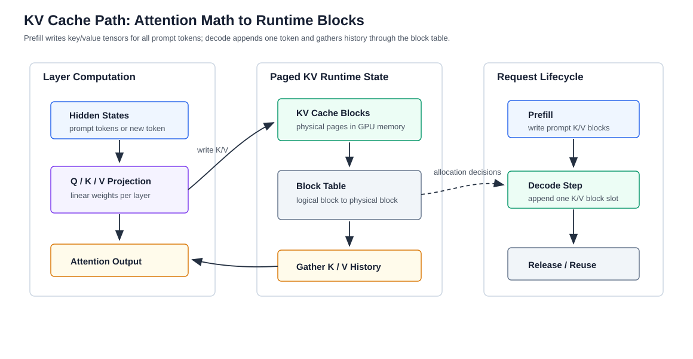

# KV Cache、PagedAttention 与 Prefix Caching

版本日期：2026-06-16

---

## 摘要

KV Cache 是大模型推理服务中最关键、也最容易被低估的运行时状态。模型权重在副本启动后基本固定，KV Cache 却会随请求并发数、prompt 长度、输出长度和生成策略动态增长。它既决定 decode 阶段是否能避免重复计算，也决定 GPU 显存能容纳多少并发请求。

本文从一个多轮对话服务出发，解释 KV Cache 的显存估算、生命周期、碎片化来源和常见管理策略。随后重点分析 PagedAttention 如何用 block table 管理非连续 KV 块，prefix caching 如何复用重复 prompt 前缀，KV offload 与 cache transfer 又为什么会把瓶颈从显存转移到 PCIe、NVLink 或网络。

**阅读定位**：这篇文章是 [大模型推理服务化系统综述](./llm_inference_serving_overview.md) 中 KV Cache 章节的扩展。读完后，应能把一次长上下文请求的显存增长、缓存复用和调度约束连接起来。

---

## 目录

- 第 1 章 为什么 KV Cache 是推理系统状态
- 第 2 章 KV Cache 显存模型
- 第 3 章 PagedAttention：把 KV Cache 当作分页内存
- 第 4 章 Prefix Caching：复用重复前缀
- 第 5 章 Offload、Transfer 与跨引擎缓存
- 第 6 章 工程检查清单与参考资料

---

## 第 1 章 为什么 KV Cache 是推理系统状态

**本章主线**：先解释 KV Cache 解决什么重复计算问题，再说明为什么它不是普通中间 tensor，而是需要被调度器和平台层共同管理的动态状态。

### 1.1 自回归生成为什么需要缓存

Decoder-only Transformer 逐 token 生成文本。生成第 $t$ 个 token 时，模型需要让当前 token attend 到此前所有 token。如果每一步都重新计算历史 token 的 key 和 value，计算量会随上下文长度反复膨胀。

KV Cache 的做法是：在 prefill 阶段为 prompt 中每个 token 计算并保存每层 attention 的 key / value；在 decode 阶段，每生成一个新 token，只追加这个 token 对应的 key / value，并读取历史缓存完成 attention。这样，decode 不再重复计算历史 token 的 K/V。

这带来一个重要变化：推理请求不再是一次无状态 forward，而是一个不断增长的状态对象。请求越长，KV Cache 越大；请求完成或取消后，缓存需要释放；如果请求共享前缀，缓存可能被复用；如果部署分离，缓存还可能要跨进程或跨 GPU 移动。

### 1.2 贯穿例子：企业聊天服务里的系统提示词

考虑一个企业内部聊天服务。每个请求都带有固定系统提示词、权限说明和工具调用格式，后面才是用户问题。这个服务有三个典型请求：

| 请求 | 特征 | KV Cache 行为 |
|---|---|---|
| 短问答 | 固定系统提示词 + 短用户问题 | 系统提示词部分高度可复用 |
| RAG 问答 | 固定模板 + 多段检索文档 | 上下文长，KV Cache 快速增长 |
| Agent loop | 固定工具说明 + 多轮历史 + 工具结果 | 前缀和历史反复出现，缓存生命周期更复杂 |

如果系统没有缓存复用，固定系统提示词会在每个请求中重复 prefill。如果系统没有动态显存管理，RAG 和 Agent 请求会快速吃掉显存，导致短请求也被限流或排队。

### 1.3 从一层 attention 看 KV Cache 写入

KV Cache 之所以是“状态”，可以从单层 attention 的矩阵计算看出来。设第 $l$ 层输入 hidden states 为：

$$
X^{(l)} \in \mathbb{R}^{T \times d_{\text{model}}}
$$

其中 $T$ 是当前上下文长度，$d_{\text{model}}$ 是模型隐藏维度。该层会通过三组投影矩阵得到 query、key 和 value：

$$
Q^{(l)} = X^{(l)} W_Q^{(l)}, \qquad
K^{(l)} = X^{(l)} W_K^{(l)}, \qquad
V^{(l)} = X^{(l)} W_V^{(l)}
$$

在 prefill 阶段，$X^{(l)}$ 包含 prompt 的所有 token，因此系统会一次性生成整段 $K^{(l)}$ 和 $V^{(l)}$，并把它们写入 KV Cache。attention 输出为：

$$
O^{(l)}
=
\operatorname{softmax}
\left(
\frac{Q^{(l)} {K^{(l)}}^\top}{\sqrt{d_h}}
\right)
V^{(l)}
$$

在 decode 第 $t$ 步，输入通常只包含新 token 的 hidden state $x_t^{(l)}$。此时只需要计算这个新 token 的：

$$
q_t^{(l)} = x_t^{(l)} W_Q^{(l)}, \qquad
k_t^{(l)} = x_t^{(l)} W_K^{(l)}, \qquad
v_t^{(l)} = x_t^{(l)} W_V^{(l)}
$$

然后把 $k_t^{(l)}$ 和 $v_t^{(l)}$ 追加到历史缓存中。decode attention 读取的是历史缓存：

$$
o_t^{(l)}
=
\operatorname{softmax}
\left(
\frac{q_t^{(l)} {K_{1:t}^{(l)}}^\top}{\sqrt{d_h}}
\right)
V_{1:t}^{(l)}
$$

这里的 $K_{1:t}^{(l)}$ 和 $V_{1:t}^{(l)}$ 不再来自重新计算，而是来自 KV Cache。这个区别就是 KV Cache 的核心价值：历史 token 的 key / value 从“每步重复算”变成“每步读取状态”。

下图把这条路径展开到 block table 层面。读者应注意：KV Cache 既连接模型层内的矩阵运算，也连接 runtime 的显存分配器。

<small>图 1-1：KV Cache 在每层 attention 中保存历史 key / value。PagedAttention 进一步把逻辑 token 位置映射到物理 KV blocks，使 decode 可以按 block table 读取历史状态。</small>

**本章小结**：KV Cache 既是避免重复计算的性能优化，也是推理服务的动态状态。后续所有管理策略都在回答同一个问题：如何让这个状态占用少、复用多、迁移少、可观测。

## 第 2 章 KV Cache 显存模型

**本章主线**：用一个足够简单的公式建立直觉，再说明实际系统为什么会比公式更复杂。

### 2.1 基本估算公式

对一个 decoder-only Transformer，请求的 KV Cache 大小可以粗略估算为：

$$
M_{\text{KV}}
\approx
2 \times L \times H_{\text{kv}} \times d_h \times T \times b
$$

其中：

- $2$ 表示 key 和 value 两份缓存。
- $L$ 是 Transformer 层数。
- $H_{\text{kv}}$ 是 KV head 数。使用 MQA / GQA 时，它可能小于 query heads。
- $d_h$ 是每个 head 的维度。
- $T$ 是当前请求已经进入上下文的 token 数，包括 prompt 和已生成输出。
- $b$ 是每个元素的字节数，取决于 FP16、BF16、FP8 或更低精度。

这个公式省略了 tensor parallel 分片、block 元数据、padding、allocator 对齐和 framework overhead，但足够说明核心事实：KV Cache 对 token 数和并发数近似线性增长。

### 2.2 为什么模型权重不是唯一显存大头

很多人估算推理显存时只看模型权重。例如 7B 模型用 FP16 权重大约十几 GB。但服务长上下文时，KV Cache 会变成另一个显存大头。特别是当请求并发上升时，权重只加载一份，而每个活跃请求都有自己的 KV Cache。

因此，同一个模型在两种 workload 下表现会完全不同：

| Workload | 显存压力来源 | 典型症状 |
|---|---|---|
| 短 prompt、短输出、高 QPS | 模型权重和 batch 调度 | GPU 利用率、排队、kernel launch |
| 长 prompt、长输出、中等 QPS | KV Cache | 显存不足、batch 变小、decode 变慢 |
| 多轮 Agent / RAG | KV Cache + prefix reuse | cache hit rate、eviction、transfer |

这也是为什么长上下文能力不能只看模型支持的最大 context length。模型能跑 128K context，不代表服务能在高并发下经济地跑 128K context。

### 2.3 生命周期：分配、追加、共享、释放

一个请求的 KV Cache 通常经历以下生命周期：

1. **分配**：请求进入 prefill，系统为初始 prompt 分配缓存空间。
2. **追加**：每个 decode step 生成新 token，追加新的 K/V。
3. **共享**：如果多个请求有相同前缀，部分缓存块可能被复用。
4. **迁移**：在 PD disaggregation 或跨引擎复用时，缓存可能跨 GPU、CPU 或网络移动。
5. **释放**：请求完成、取消或超时后，缓存块归还给 allocator。

失败经常出现在边界处：请求取消后缓存没有及时释放，长请求预留过多空间，prefix cache 命中但 eviction 不合理，或者 cache transfer 把 decode pool 卡住。

**本章小结**：KV Cache 显存模型很简单，但工程生命周期复杂。一个推理引擎是否高效，很大程度取决于它如何管理这个动态生命周期。

## 第 3 章 PagedAttention：把 KV Cache 当作分页内存

**本章主线**：先说明连续显存分配为什么浪费，再解释 PagedAttention 的 block table 抽象，最后讨论它的收益与代价。

### 3.1 连续分配的问题

朴素方案会为每个请求预留一段连续 KV Cache 空间。在线服务中，这会遇到三个问题：

- **预留浪费**：按最大上下文预留，但大多数请求不会用满。
- **内部碎片**：请求实际输出比预估短，已分配空间空着。
- **外部碎片**：不同请求完成时间不同，释放出的显存不连续。

在高并发 serving 中，碎片会直接限制 batch size。batch 小了以后，GPU 利用率下降，吞吐下降，排队时间上升，最后表现为用户延迟变差。

### 3.2 Block table 的直觉

PagedAttention 借鉴虚拟内存分页思想，把请求的 KV Cache 拆成固定大小的逻辑块。逻辑块通过 block table 映射到物理显存块。请求看到的是连续的 token 序列，物理显存却可以是非连续的块集合。

这个抽象带来几件事：

- 新 token 到来时，按需分配新 block。
- 请求结束时，以 block 为单位释放。
- 共享前缀时，多个请求可以引用相同物理块。
- beam search 或 parallel sampling 可以使用 copy-on-write 思路减少重复。

PagedAttention 的系统意义不只是一个 attention kernel，而是把 KV Cache 从“连续 tensor”变成“可分页、可引用、可共享、可回收的运行时对象”。

### 3.3 Block table 如何参与 kernel 读取

把 KV Cache 切成 block 后，attention kernel 不能再假设历史 token 的 K/V 是一段连续内存。对一个请求 $r$，runtime 会维护一个逻辑到物理的映射：

$$
B_r[i] = p
$$

表示请求 $r$ 的第 $i$ 个逻辑 KV block 存在物理 block $p$ 中。若 block size 为 $S$，第 $j$ 个历史 token 对应的逻辑 block 和 block 内 offset 为：

$$
i = \left\lfloor \frac{j}{S} \right\rfloor,
\qquad
o = j \bmod S
$$

kernel 读取该 token 的 key / value 时，需要先查：

$$
p = B_r[i]
$$

再从物理 block $p$ 的 offset $o$ 处读取：

$$
k_j^{(l)} = K_{\text{phys}}^{(l)}[p, o],
\qquad
v_j^{(l)} = V_{\text{phys}}^{(l)}[p, o]
$$

这就是 PagedAttention 和普通连续 attention kernel 的差异：数学上的 attention 公式没有变，变的是 K/V 的物理寻址方式。好的实现要让这层间接寻址尽量不破坏内存 coalescing、cache locality 和 kernel occupancy。

### 3.4 和 vAttention 的对比

PagedAttention 的代价是 attention kernel 需要理解非连续 block 布局，系统也要维护 block table。vAttention 等后续工作提出另一种思路：尽量保持 KV Cache 在虚拟地址空间里连续，再利用 CUDA virtual memory management 推迟物理内存分配。

两者的共同目标都是减少物理显存浪费，但权衡不同：

| 方法 | 核心思路 | 优势 | 代价 |
|---|---|---|---|
| PagedAttention | 非连续物理 block + block table | 显存复用灵活，适合共享和动态请求 | kernel 和 runtime 需要适配分页布局 |
| vAttention | 连续虚拟地址 + 按需物理分配 | 保持 attention kernel 视图更接近连续 tensor | 依赖 CUDA VMM，系统实现也有复杂度 |

对学习者来说，重点不是记住哪个方案永远更好，而是理解 KV Cache 管理有两条路：改变缓存布局，或改变虚拟/物理内存映射。

**本章小结**：PagedAttention 解决的是动态显存管理问题。它让推理引擎能在请求长度不均、生成过程动态变化的情况下减少 KV Cache 浪费。

## 第 4 章 Prefix Caching：复用重复前缀

**本章主线**：先说明哪些请求有共享前缀，再解释 prefix caching 如何降低 prefill 成本，最后讨论命中率、失效和观测。

### 4.1 重复前缀来自哪里

生产系统中重复前缀很常见：

- 所有请求共享相同 system prompt。
- RAG 使用固定提示词模板。
- Tool calling 请求共享工具 schema。
- 多轮对话保留相同历史前缀。
- Agent loop 中角色说明、工具说明、约束反复出现。

如果每次都从头 prefill，GPU 会反复计算相同前缀。Prefix caching 的目标是把这部分已经计算过的 KV Cache 找回来。

### 4.2 命中率决定收益

Prefix caching 并不是无条件加速。它的收益取决于：

- 前缀是否完全一致或能被规范化成一致。
- 前缀长度是否足够长，能覆盖 lookup 和管理开销。
- 缓存容量是否足够，eviction 是否合理。
- 请求分布是否集中在少数模板或多轮会话。

因此，生产系统应至少观测：

| 指标 | 用途 |
|---|---|
| prefix cache hit rate | 判断是否真的复用了缓存 |
| saved prefill tokens | 判断节省了多少计算 |
| cache lookup latency | 判断查找开销是否过高 |
| eviction count | 判断容量和策略是否合理 |
| stale / invalid cache events | 判断模型版本、tokenizer、prompt 模板变化是否破坏缓存 |

### 4.3 和 RadixAttention 的关系

SGLang 的 RadixAttention 把前缀共享组织成 radix tree 形式，用于复用多个 generation call 之间的 KV Cache。它特别适合结构化生成、分支、选择和多轮程序化调用，因为这些 workload 常常有大量共享前缀和分支路径。

可以这样理解：

- PagedAttention 更强调 KV Cache 的 block 级显存管理。
- Prefix caching 强调请求之间重复前缀的复用。
- RadixAttention 更强调在结构化生成程序中管理共享前缀树。

三者不是互斥概念，而是从不同角度管理同一个核心对象：KV Cache。

### 4.4 Prefix cache key、失效和安全边界

Prefix caching 的命中条件比“字符串一样”更严格。一个缓存项通常至少要绑定：

$$
\text{cache\_key}
=
\operatorname{Hash}
\left(
\text{model\_id},
\text{model\_revision},
\text{tokenizer\_id},
\text{chat\_template},
\text{prefix\_token\_ids}
\right)
$$

如果 LoRA adapter、system prompt 模板、tokenizer 或模型版本变化，即使用户看到的文本相似，KV Cache 也不能复用。原因是 KV Cache 存的是每层 attention 的内部状态，而不是原始文本。只要权重或 tokenization 变化，历史 $K^{(l)}$ 和 $V^{(l)}$ 就不再对应当前模型计算路径。

多租户系统还要决定缓存是否跨租户共享。跨租户共享固定公共 system prompt 可能节省成本，但也会引入隔离、审计和缓存污染风险。一个保守设计是：默认只在同模型版本、同 tokenizer、同模板、同租户或同安全域内复用。

**本章小结**：Prefix caching 把重复 prompt 从计算问题变成缓存命中问题。它适合模板化、RAG、多轮和 Agent 场景，但收益必须用命中率和节省的 prefill tokens 验证。

## 第 5 章 Offload、Transfer 与跨引擎缓存

**本章主线**：显存不足时，KV Cache 可以被 offload 或 transfer，但这会引入新的数据移动瓶颈。

### 5.1 KV Offload：容量换带宽

KV offload 把部分 KV Cache 从 GPU 显存移到 CPU DRAM、远端内存或存储。它能支撑更长上下文或更高并发，但代价是访问缓存时要跨 PCIe、NVLink 或网络搬数据。

这类方案适合的场景通常是：

- 长上下文请求数量有限，但单请求上下文很长。
- 业务可以接受更高 TPOT。
- GPU 显存是硬瓶颈，CPU 内存或网络资源相对充足。
- 系统能预测哪些 KV 块近期会被访问。

如果 decode 每一步都频繁等待 offload 数据，GPU 可能因为 I/O 等待而利用率很低。此时瓶颈已经从显存容量转移到数据移动。

### 5.2 Cache Transfer：PD 分离的必要代价

Prefill / decode disaggregation 会把 prefill 和 decode 放到不同 GPU 池。Prefill pool 生成 KV Cache，decode pool 负责逐 token 输出。这要求系统把 KV Cache 从 prefill 侧传到 decode 侧。

Cache transfer 的成本取决于：

- KV Cache 大小。
- 两个池之间的拓扑：同机 GPU、跨机 GPU、CPU 中转还是 RDMA。
- 传输是否能和计算重叠。
- Decode pool 是否因为等 cache 而空转。

因此，PD 分离不是免费优化。它减少 prefill 和 decode 的计算干扰，却引入 cache movement。DistServe 这类系统的关键就在于同时考虑 TTFT、TPOT、资源分配和集群带宽。

### 5.3 传输预算：什么时候 cache movement 会反噬

设需要迁移的 KV Cache 大小为 $M_{\text{KV}}$，有效链路带宽为 $B_{\text{link}}$，协议、排队和同步开销为 $\delta$，则传输时间可以粗略写成：

$$
T_{\text{transfer}}
\approx
\frac{M_{\text{KV}}}{B_{\text{link}}}
+ \delta
$$

PD 分离只有在这个成本能被计算重叠或阶段隔离收益覆盖时才划算。若 decode pool 等待 KV 的时间为：

$$
T_{\text{idle}} \geq T_{\text{transfer}} - T_{\text{overlap}}
$$

那么即使 prefill pool 更高效，用户看到的 TPOT 也可能变差。工程上应同时观测 cache transfer bytes、transfer latency、decode idle time 和 prefill queueing reduction，而不是只看某一侧 GPU 利用率。

### 5.4 LMCache：把 KV Cache 暴露成共享层

LMCache 的思路是把 KV Cache 从单个推理引擎内部状态提升成可跨查询、跨引擎共享和移动的缓存层。它支持 cache offloading、prefix reuse 和 prefill/decode disaggregation 场景下的 cache movement。

这说明推理系统正在出现一个新边界：推理引擎不再只是 token processor，KV Cache 也不再只是引擎内部的临时状态，而是服务集群中需要 API、策略和观测的共享资源。

**本章小结**：Offload 和 transfer 扩大了 KV Cache 的可用空间和部署灵活性，但代价是数据移动、缓存一致性、失效策略和观测复杂度。显存问题常常会被转化为系统 I/O 问题。

## 第 6 章 工程检查清单与参考资料

### 6.1 设计检查清单

评估一个推理系统的 KV Cache 设计时，可以问：

1. KV Cache 是否按请求动态增长和释放？
2. 是否有 block 级或类似机制减少碎片？
3. 是否支持 prefix reuse，命中率如何观测？
4. 长上下文和短请求混部时，是否会互相挤占缓存？
5. 取消、超时、客户端断开后，缓存是否及时回收？
6. PD disaggregation 或跨引擎复用时，cache transfer 是否成为瓶颈？
7. 模型版本、tokenizer、LoRA adapter 变化时，缓存如何失效？

## 参考资料

- Woosuk Kwon et al., [Efficient Memory Management for Large Language Model Serving with PagedAttention](https://arxiv.org/abs/2309.06180)
- vLLM Team, [Automatic Prefix Caching](https://docs.vllm.ai/en/latest/features/automatic_prefix_caching/)
- vLLM Team, [KV Offloading Usage Guide](https://docs.vllm.ai/en/latest/features/kv_offloading.html)
- Ramya Prabhu et al., [vAttention: Dynamic Memory Management for Serving LLMs without PagedAttention](https://arxiv.org/abs/2405.04437)
- Lianmin Zheng et al., [SGLang: Efficient Execution of Structured Language Model Programs](https://arxiv.org/abs/2312.07104)
- LMCache Team, [LMCache: An Efficient KV Cache Layer for Enterprise-Scale LLM Inference](https://arxiv.org/abs/2510.09665)

**全文小结**：KV Cache 是推理服务的核心状态。PagedAttention、prefix caching、offload、transfer 和 LMCache 这些方案的共同目标，是在动态请求、长上下文和高并发下让这个状态更可控。
