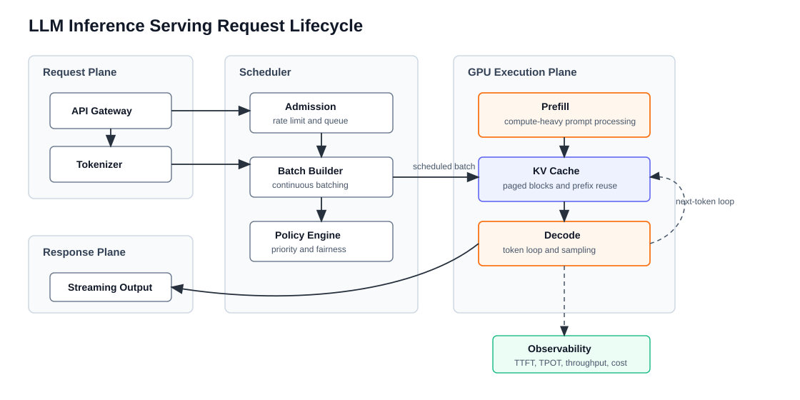
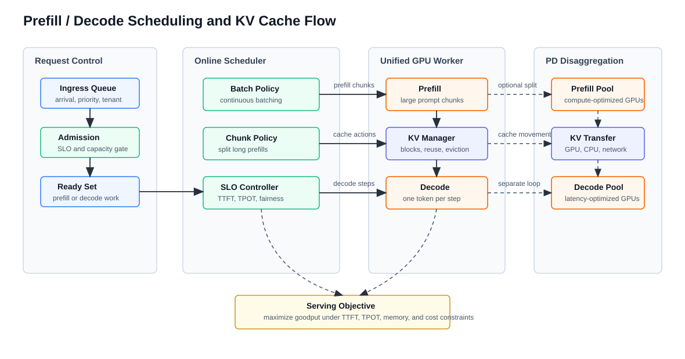

# 大模型推理服务化系统综述

版本日期：2026-06-15

---

## 摘要

大模型推理服务化解决的不是“模型能不能生成下一个 token”，而是“在多用户、多请求、多副本、多 GPU 的环境中，如何稳定、低延迟、低成本地持续生成 token”。训练系统追求长时间高吞吐，推理系统则同时面对用户可感知延迟、请求到达随机性、上下文长度差异、KV Cache 显存压力、调度公平性、在线观测和故障恢复。

本文用一个在线聊天服务作为贯穿例子：用户请求进入 API gateway 后被 tokenizer 转成 token，随后进入调度器；模型先做 prefill 处理完整 prompt，再进入逐 token 的 decode 循环；生成结果以 streaming response 返回。围绕这条链路，本文解释 LLM 推理服务的核心对象、性能模型、KV Cache 管理、continuous batching、prefill / decode 调度、量化、speculative decoding、并行策略和生产服务栈，并把 vLLM、Orca、TensorRT-LLM、SGLang、Hugging Face TGI 等系统放到同一张系统地图中理解。

**文档定位**：本文是推理与服务化专题的入口综述。它不替代某个推理引擎的 API 手册，而是建立“请求生命周期 -> GPU 执行路径 -> KV Cache 状态 -> 在线调度 -> 生产指标”的系统框架。

**前置知识**：读者最好已经了解 Transformer decoder 的自回归生成、GPU 显存与 kernel 执行的基本概念。CUDA 和 GPU 细节可先阅读 [CUDA 编程模型与 GPU 计算系统综述](../../00-foundations/gpu-architecture/cuda_intro.md)。

---

## 目录

- 第 0 章 推理服务问题地图
- 第 1 章 推理服务到底在调度什么
- 第 2 章 Prefill、Decode 与性能模型
- 第 3 章 KV Cache：推理系统的核心状态
- 第 4 章 Continuous Batching、Chunked Prefill 与 PD Disaggregation
- 第 5 章 优化手段：按瓶颈分类，而不是按名词堆叠
- 第 6 章 从单模型引擎到生产服务
- 第 7 章 Benchmark、观测与排障
- 第 8 章 学习路线与参考资料

---

## 第 0 章 推理服务问题地图

**本章主线**：先把“推理优化”拆成 workload、目标函数和系统边界。推理服务不是单个模型 forward 的性能问题，而是一个请求到达、状态增长、资源竞争和 SLO 约束共同作用的在线系统问题。

### 0.1 四类推理 workload 不应该混在一起比较

同样是“跑模型生成结果”，不同 workload 的优化目标差别很大：

| Workload | 输入到达方式 | 用户是否等待 | 主要目标 | 典型例子 |
|---|---|---|---|---|
| Offline inference | 数据集提前给定 | 否 | 总吞吐、成本、完成时间 | 批量打标签、离线评测、embedding 生成 |
| Online serving | 请求实时到达 | 是 | TTFT、TPOT、尾延迟、可用性 | 聊天机器人、代码助手、企业 API |
| Batch API | 用户提交批任务 | 部分等待 | 成本、排队时间、作业完成时间 | 大规模内容生成、离线问答 |
| Agent / RL rollout | 模型调用嵌在循环中 | 取决于任务 | 并发、状态恢复、工具调用延迟 | Agent 环境、RLHF / RLAIF 数据生产 |

如果把这些场景混在一起比较，就会得到错误结论。离线批处理可以为了吞吐牺牲单请求延迟；在线聊天不能让短请求被长 prompt 长时间阻塞；Agent rollout 则可能更关心大量短调用的调度开销和失败恢复。

本文的主线以 **online LLM serving** 为中心，同时说明这些概念如何迁移到 batch inference 和 RL / Agent workload。

### 0.2 推理服务的目标函数不是一个指标

推理系统经常同时优化几类指标：

| 指标 | 英文 | 含义 | 容易误解的地方 |
|---|---|---|---|
| 首 token 延迟 | TTFT, time to first token | 从请求进入系统到第一个 token 返回 | 主要受排队、tokenization、prefill 和调度影响 |
| 每 token 时间 | TPOT / ITL, time per output token / inter-token latency | 流式输出中相邻 token 的间隔 | 主要受 decode 循环、batching、KV Cache 和显存带宽影响 |
| 端到端延迟 | E2E latency | 完整回答返回所需时间 | 和输出长度强相关，不能脱离长度分布比较 |
| 吞吐 | Throughput | tokens/s 或 requests/s | 高吞吐可能来自牺牲短请求延迟 |
| 有效吞吐 | Goodput | 满足 SLO 的吞吐 | 比纯 throughput 更接近线上容量 |
| 成本 | Cost/token | 每生成 token 的 GPU、平台和运维成本 | 受模型大小、batch、量化、利用率和副本数共同影响 |

一个服务如果 GPU utilization 很高，但 TTFT 和 TPOT 都超过用户可接受范围，它不是一个好的在线服务。反过来，极低延迟也可能来自过度冗余，成本不可接受。因此，推理优化应先说明目标：是提高吞吐、降低 TTFT、降低 TPOT、支撑长上下文、降低成本，还是提高 SLO 内 goodput。

### 0.3 推理服务的系统边界

推理服务至少跨越五层：

1. **API 层**：认证、限流、请求 schema、streaming 协议、错误码。
2. **调度层**：排队、优先级、batch 形成、请求取消、超时和 SLO 控制。
3. **执行层**：prefill、decode、sampling、attention kernel、GEMM、CUDA Graph。
4. **状态层**：KV Cache、prefix cache、LoRA adapter、tokenizer state、请求上下文。
5. **平台层**：Kubernetes、Ray Serve、KServe、Triton、GPU 节点池、监控和发布治理。

上层用户看到的是“接口慢了”，底层原因可能是某个租户的长上下文打满 KV Cache，也可能是 prefill 抢占 decode，或者是副本冷启动加载权重过慢。综述文章必须把这些层连接起来。

**本章小结**：推理服务不是单点优化。后续每个技术点都要回到三个问题：它优化哪个指标，改变哪个状态，牺牲什么资源或复杂度。

## 第 1 章 推理服务到底在调度什么

**本章主线**：先把推理服务从“调用模型”改写成“管理一批随时间变化的请求”。然后定义 request、batch、replica、queue 和 streaming response，最后用一张图说明一次请求跨越了哪些系统边界。

### 1.1 在线推理的输入不是一个静态 batch

离线推理通常可以提前准备一个固定 batch：输入长度相近，输出长度可控，系统只需尽量把 GPU 填满。在线 LLM 服务不同，请求按随机时间到达，prompt 长度不同，输出长度也要到生成结束后才知道。一个用户可能只问一句短问题，另一个用户可能带着长上下文生成代码，还有用户可能中途断开连接。

因此，推理服务调度的对象至少包括五类状态：

| 对象 | 含义 | 为什么重要 |
|---|---|---|
| Request | 一个用户请求及其 prompt、生成参数和连接状态 | 决定输入长度、输出预算、优先级和取消逻辑 |
| Queue | 等待进入模型执行的请求集合 | 决定排队延迟、限流和公平性 |
| Batch | 当前一起执行的请求片段 | 决定 GPU 利用率、padding 开销和尾延迟 |
| Replica | 一份可执行模型副本，通常绑定一组 GPU | 决定容量、隔离和故障影响范围 |
| KV Cache | 每个请求已生成上下文的 key / value 状态 | 决定显存占用和 decode 吞吐 |

这也是为什么 LLM serving 不能只看模型结构。它更像一个状态密集型的在线系统：每个请求都在不断增长，每个 decode step 都会改写 KV Cache，每个新请求都可能加入当前执行队列。

### 1.2 贯穿例子：多用户聊天服务

考虑一个面向研发团队的内部聊天服务。它使用一个 decoder-only LLM，提供 OpenAI-compatible API，要求首 token 延迟不要太高，回答过程要流式返回，并且要在夜间批量任务和白天在线请求之间共享 GPU 集群。

一次请求会经历以下步骤：

1. API gateway 接收请求，完成认证、限流和参数校验。
2. Tokenizer 把 prompt 转成 token ids，并估算上下文长度。
3. Scheduler 决定请求进入哪个模型副本、什么时候和哪些请求一起执行。
4. Prefill 阶段一次性处理 prompt，为每一层 attention 写入 KV Cache。
5. Decode 阶段逐 token 生成，每一步读取过去的 KV Cache 并追加新 token 的 KV。
6. Streaming response 把 token 增量返回给用户，同时观测系统记录 TTFT、TPOT、吞吐、错误率和 GPU 使用率。

下图把这条路径拆成请求平面、调度平面、GPU 执行平面和观测平面。

<small>图 1-1：LLM 推理请求生命周期。在线推理的核心不是一次静态 forward，而是让新请求、运行中请求、KV Cache 和 GPU batch 在持续变化的状态中保持可控。</small>

### 1.3 失败模式：短请求被长请求拖慢

在贯穿例子中，假设有两类请求：

- A 类：短 prompt，几十个输入 token，期望几十个输出 token。
- B 类：长 prompt，几千到几万个输入 token，期望较短总结。

如果系统简单按到达顺序把请求组成 batch，B 类请求的 prefill 可能占用很长 GPU 时间，A 类请求虽然很短，也要等长 prefill 结束才能拿到首 token。用户看到的是“短问题也很慢”。这类问题不是模型质量问题，而是调度策略没有区分 prefill 和 decode 的资源画像。

**本章小结**：推理服务的基本单位不是模型 forward，而是随时间变化的 request state。理解后续优化前，必须先把请求、队列、batch、replica 和 KV Cache 看成同一个系统中的状态对象。

## 第 2 章 Prefill、Decode 与性能模型

**本章主线**：先区分 prefill 和 decode 的资源特征，再建立一个足够简单的成本模型，说明为什么 prompt length、output length、batch size 和 KV Cache 会共同决定瓶颈。

### 2.1 Prefill 偏计算，Decode 偏显存带宽和调度

Transformer 自回归生成可以分成两个阶段。**Prefill** 处理完整 prompt，计算所有输入 token 的 hidden states，并为每一层 attention 生成 key / value。这个阶段的矩阵乘法较大，通常更容易把 GPU 算力打满。**Decode** 每次只生成一个或少量新 token，它需要读取已有上下文的 KV Cache，计算新 token 的 attention 和 MLP，再采样得到下一个 token。

这两个阶段的瓶颈不同：

| 阶段 | 输入形态 | 主要状态 | 典型瓶颈 |
|---|---|---|---|
| Prefill | 长 prompt，一次处理多个 token | prompt tokens、临时 activation、初始 KV Cache | GEMM 计算、长上下文 attention、短请求混入导致排队 |
| Decode | 每个请求每步新增 token | 已有 KV Cache、采样状态、输出流 | 显存带宽、batch 动态变化、kernel launch / 调度开销 |

如果系统把 prefill 和 decode 混在同一个简单 FIFO batch 中，长 prompt 可能阻塞正在 decode 的短请求，导致用户看到的 token 间隔变大；反过来，如果系统只追求 decode 的低延迟，GPU 又可能在小 batch 下空转。

### 2.2 一个够用的延迟分解

对一个在线请求，可以把端到端延迟粗略拆成：

`E2E latency = queueing time + tokenization time + prefill time + decode time + streaming / network overhead`

其中：

- **queueing time** 来自 admission control、等待 batch、等待副本空闲。
- **prefill time** 主要受输入长度、模型大小、attention 实现和 GPU compute 影响。
- **decode time** 近似等于输出 token 数乘以每步 decode 时间，但每步时间又取决于 batch、KV Cache 长度和显存带宽。
- **streaming / network overhead** 通常不是主要 GPU 瓶颈，但会影响用户感知和客户端超时。

这个分解有两个用处。第一，TTFT 主要覆盖 queueing、tokenization 和 prefill；第二，TPOT 主要覆盖 decode 循环。因此 DistServe 一类工作会把 TTFT 和 TPOT 当作两个不同 SLO 约束，而不是只看一个平均延迟。

### 2.3 一个够用的 KV Cache 显存估算

对 decoder-only Transformer，KV Cache 大小可以用下面的直觉公式估算：

`KV bytes ~= 2 * layers * kv_heads * head_dim * tokens * bytes_per_element`

这里的 `2` 表示 key 和 value 两份缓存；`tokens` 是当前请求已经 prefill 加 decode 的上下文长度；`bytes_per_element` 取决于 FP16、BF16、FP8 或更低精度。实际系统还要考虑 tensor parallel 分片、paged block 元数据、allocator 对齐和并发请求数量，但这个公式足以解释一个核心事实：**KV Cache 会随并发请求数和上下文长度线性增长**。

这也是为什么长上下文、RAG、多轮对话和 Agent loop 会迅速放大推理显存压力。模型权重是常驻固定成本，KV Cache 是请求驱动的动态成本。

### 2.4 Throughput 和 latency 的张力

提高 batch size 通常能提高 GPU 利用率，但在线服务中 batch 不是免费变大的：

- 等 batch 会增加排队时间。
- 长 prompt 混入会拉高短请求 TTFT。
- 输出长度差异会造成 decode slot 动态变化。
- KV Cache 增大后，decode 可能从算力问题转成显存容量或带宽问题。

因此推理系统常见的策略不是“batch 越大越好”，而是“在 SLO 约束和显存预算内，让 batch 持续保持足够大”。这就是 continuous batching、chunked prefill 和 SLO-aware scheduling 的动机。

**本章小结**：Prefill 和 decode 不是同一种计算。一个好的推理系统必须把 TTFT、TPOT、KV Cache、batch size 和输出长度分开建模，再组合成服务策略。

## 第 3 章 KV Cache：推理系统的核心状态

**本章主线**：先解释 KV Cache 为什么必须存在，再说明它为什么难管理，最后把 PagedAttention、prefix caching、KV offload 和 cache transfer 放到同一个状态管理框架中。

### 3.1 KV Cache 解决重复计算，但制造动态显存问题

KV Cache 保存每层 attention 中历史 token 的 key 和 value。没有 KV Cache，生成第 `t` 个 token 时就要重新计算前 `1 ... t-1` 个 token 的 key / value，成本会随输出长度快速膨胀。使用 KV Cache 后，decode step 只需要计算新 token 的 key / value，再读取历史缓存参与 attention。

但 KV Cache 也带来三个系统问题：

- **容量问题**：上下文越长、batch 越大、层数越多，KV Cache 占用越大。
- **碎片问题**：请求长度不同、完成时间不同，缓存空间会出现不规则空洞。
- **迁移问题**：当请求跨副本、跨 GPU 或发生恢复时，KV Cache 很难像普通参数一样随意搬动。

因此，高性能推理引擎往往把 KV Cache 当成一等公民。vLLM 的 PagedAttention 论文明确把问题定位在 KV Cache 动态增长、收缩和碎片化上，而不是只优化某一个 attention kernel。

### 3.2 从连续分配到分页管理

最朴素的做法是为每个请求预留一段连续显存，长度按最大上下文估计。这个方案简单，但在线服务中浪费严重：

- 用户可能只生成很短输出，预留空间没有用完。
- 不同请求完成时间不同，释放出的空间不连续。
- parallel sampling、beam search 或共享 prompt 会重复保存相同前缀。

PagedAttention 的关键抽象是把每个请求的 KV Cache 切成固定大小的 block。请求看到的是逻辑块序列，物理显存中则由 block table 映射到实际块。这样，请求不需要占用连续物理显存，新 token 只需要按需追加块，多个请求还可以共享相同前缀块。

这更像操作系统虚拟内存，而不是普通 tensor 分配器。它改变的是推理系统如何看待 KV Cache：KV Cache 不再只是 attention 的中间 tensor，而是一个需要分配、回收、共享、迁移和观测的运行时对象。

### 3.3 Prefix caching：当 prompt 本身可以复用

很多生产请求有共享前缀：

- 系统提示词和安全策略固定。
- RAG 模板固定，只是检索片段变化。
- Agent loop 中工具说明和角色说明重复出现。
- 多轮对话中历史上下文大部分相同。

**Prefix caching** 的目标是复用相同前缀已经生成的 KV Cache，减少重复 prefill。vLLM 文档把 automatic prefix caching 作为独立特性；SGLang 的 RadixAttention 也围绕前缀和分支复用构建。它们的共同点是：把 prompt 前缀从“每次重新计算的输入”变成“可查找、可共享、可失效的缓存状态”。

Prefix caching 的收益取决于请求分布。如果请求前缀高度重复，收益很大；如果每个请求完全不同，cache hit rate 低，维护缓存反而会增加复杂度。生产系统要观测 prefix hit rate、缓存大小、eviction 次数和 cache lookup overhead，而不是默认开启就一定更快。

### 3.4 KV offload 和 cache transfer：显存之外还有系统成本

当上下文极长或并发很高时，系统可能把部分 KV Cache 放到 CPU DRAM、远端内存或存储中，这通常称为 **KV offload**。当 prefill 和 decode 分离部署时，prefill 侧生成的 KV Cache 还需要传给 decode 侧，这就是 **KV transfer** 或 cache movement。

这些方案扩大了可服务的上下文和并发，但引入新的瓶颈：

- PCIe、NVLink 或网络带宽可能成为主瓶颈。
- Cache transfer 会拉高 TTFT 或 TPOT。
- Cache eviction 策略会影响命中率和延迟稳定性。
- 故障恢复时，KV Cache 是否可重建、可丢弃、可迁移，需要按业务 SLO 决定。

LMCache 这类系统把 KV Cache 抽象成可跨引擎共享和搬运的层，说明行业正在把 KV Cache 从单引擎内部实现提升到服务集群的状态管理对象。

**本章小结**：KV Cache 是推理服务的核心状态。PagedAttention 解决碎片和共享，prefix caching 解决重复 prefill，offload 和 transfer 解决容量和分离部署，但每个方案都会把复杂度转移到缓存观测、数据移动和调度策略上。

## 第 4 章 Continuous Batching、Chunked Prefill 与 PD Disaggregation

**本章主线**：先说明静态 batching 为什么不适合在线生成，再解释 continuous batching 如何把新请求插入正在运行的 decode 循环；接着讨论 chunked prefill 和 prefill/decode disaggregation 如何缓解 prefill 与 decode 的互相干扰。

### 4.1 静态 batch 会浪费在线请求的时间

传统 batch 推理通常等待一批请求凑齐后一起执行，然后等这批请求全部完成。LLM 生成长度差异很大，如果系统必须等待最长的请求结束，短请求完成后占用的 batch 槽位会被浪费；如果系统频繁开新 batch，又会牺牲 GPU 利用率。

Continuous batching 的直觉是：decode 是一个循环，每一步之后都会有请求完成，也可能有新请求到达。调度器不必等整批请求结束，而是在每个或若干个 decode step 边界更新 batch 成员，让新请求尽快进入执行，同时释放已完成请求的缓存和槽位。

Orca 把这种思想系统化：它不是把一个请求当成不可切分的任务，而是把生成过程拆成 iteration 级别的调度问题。后续 vLLM、TGI、SGLang 等推理系统都围绕类似的在线 batch 管理能力演进。

### 4.2 Chunked prefill：不要让长 prompt 一次占满调度窗口

长 prompt 的 prefill 可能持续较长时间。如果调度器把一个长 prefill 当作不可切分的大任务，decode 请求会被阻塞，TPOT 抖动变大。**Chunked prefill** 把长 prompt 切成多个较小块，让 prefill chunk 和 decode step 可以交错执行。

Sarathi-Serve 的核心思路就是让 decode 请求 piggyback 到 chunked prefill 形成的 batch 上：prefill chunk 提供足够计算量，decode 请求利用同一个 batch 的剩余空间，从而缓解 decode-only batch GPU 利用率低的问题。

这个策略的代价是调度器更复杂。它需要决定 chunk size、decode 优先级、每轮 batch 的组成方式，以及长 prompt 的 TTFT 和已有 decode 请求的 TPOT 之间的权衡。

### 4.3 Prefill / Decode Disaggregation：把两种资源画像拆开

如果 prefill 和 decode 的资源画像差异很大，另一种思路是把它们放到不同 GPU 池：prefill pool 更关注算力和长 prompt 吞吐，decode pool 更关注稳定 TPOT 和低尾延迟。DistServe 将这种思路系统化，目标是在 TTFT 和 TPOT 双重 SLO 下提高 goodput。

PD disaggregation 的难点是 KV Cache 传输。Prefill pool 生成的 KV Cache 必须被 decode pool 读取。如果 prefill 和 decode 不在同一 GPU 上，系统就要处理跨 GPU、跨节点或跨进程的 cache movement。带宽不够时，分离部署可能把计算干扰变成数据移动瓶颈。

### 4.4 调度器的工作流

下面这张图把在线调度的关键对象放到一起：ingress queue 进入 admission control，调度器按 batch policy、chunk policy 和 SLO controller 形成 prefill chunk、cache action 和 decode step；系统可以在统一 GPU worker 内混部，也可以选择 PD disaggregation。

<small>图 4-1：Prefill / Decode 调度与 KV Cache 数据流。推理调度器不是简单凑 batch，而是在 TTFT、TPOT、显存和成本约束下安排 prefill chunk、decode step、KV Cache 管理和可选的 prefill/decode 分离部署。</small>

**本章小结**：Continuous batching 解决“请求何时加入运行中 batch”，chunked prefill 解决“长 prompt 如何不阻塞 decode”，PD disaggregation 解决“prefill 和 decode 是否应该共用同一组 GPU”。三者的共同核心是调度，而不是单个 kernel。

## 第 5 章 优化手段：按瓶颈分类，而不是按名词堆叠

**本章主线**：把常见推理优化按瓶颈分类，说明每种方案改变什么状态、优化什么指标、引入什么代价。

### 5.1 显存瓶颈：模型权重、activation 和 KV Cache

显存瓶颈通常来自三类对象：

- 模型权重：常驻，占用和模型规模、量化方式、并行切分有关。
- 临时 activation：prefill 阶段更明显，和 batch、prompt length、kernel 实现有关。
- KV Cache：动态增长，和并发、上下文长度、输出长度有关。

对应优化包括：

| 方法 | 主要作用 | 代价 |
|---|---|---|
| Weight quantization | 降低权重显存和带宽 | 质量风险、kernel 支持差异 |
| KV quantization | 降低 KV Cache 显存 | attention 质量和精度风险 |
| PagedAttention / block manager | 降低 KV 碎片和预留浪费 | runtime 和 kernel 复杂度 |
| Prefix caching | 复用重复前缀 | 依赖请求分布，需 eviction 策略 |
| KV offload | 扩大可服务上下文 | PCIe / 网络传输开销 |

### 5.2 Decode 延迟瓶颈：一 token 一步的顺序性

自回归 decode 的天然问题是顺序依赖：第 `t+1` 个 token 要等第 `t` 个 token 生成后才能继续。Speculative decoding 的目标是减少目标模型执行的 decode step 数量。它通常让一个更便宜的 draft model 先提出多个候选 token，再让 target model 批量验证。

Speculative decoding 的收益取决于：

- draft model 是否足够快；
- 候选 token 的接受率是否足够高；
- 验证逻辑是否保持目标模型分布或满足业务质量要求；
- draft model 的额外显存和调度复杂度是否可接受。

因此它不是万能加速。对短输出、低接受率或资源紧张场景，收益可能不稳定。vLLM 和 SGLang 文档都把 speculative decoding 作为重要特性，但生产使用仍需按 workload 验证。

### 5.3 单卡放不下或吞吐不够：并行推理

当模型参数、KV Cache 或请求吞吐超过单 GPU 能力时，推理系统需要并行策略：

| 策略 | 解决的问题 | 代价 |
|---|---|---|
| Tensor Parallel | 单层权重和计算切到多 GPU | 每层通信增加，batch 小时通信占比高 |
| Pipeline Parallel | 不同层放到不同 GPU | 流水气泡和跨阶段调度复杂 |
| Context Parallel | 长上下文 attention 沿序列维度切分 | KV 和 attention 通信复杂 |
| Expert Parallel | MoE 模型中按专家分布计算 | 路由、负载均衡和 all-to-all 通信 |
| Replica Parallel | 多份完整模型副本分摊请求 | 参数显存重复，占用更多 GPU |

训练系统中的并行策略不能直接照搬到在线推理。推理更关心单请求尾延迟、batch 动态变化、KV Cache 分布和流式输出，因此并行策略需要和服务调度一起设计。

### 5.4 Runtime 和 kernel 开销：不要忽略 CPU 侧和编译侧

在小 batch、短请求或高 QPS 场景中，瓶颈可能不完全在矩阵乘法。常见优化包括：

- FlashAttention / FlashInfer / fused attention kernels：降低 attention 内存访问和 kernel 数量。
- CUDA Graph：减少重复 kernel launch 的 CPU 侧开销，但对动态 shape 和动态 batch 有约束。
- torch.compile / custom op / kernel fusion：减少框架调度和中间 tensor。
- Fast weight loading：降低冷启动和副本扩容时间。
- Tokenizer 并行和异步化：避免 CPU tokenization 阻塞 GPU。

这些优化的共同风险是工程复杂度和适配成本。模型结构、硬件、dtype、sequence length 和 batch pattern 变化后，最优方案可能变化。

**本章小结**：推理优化必须先定位瓶颈。显存瓶颈看 KV 和量化，decode 顺序瓶颈看 speculative decoding，容量瓶颈看并行，在线波动看调度，runtime 开销看 kernel、CUDA Graph 和 CPU 控制面。

## 第 6 章 从单模型引擎到生产服务

**本章主线**：先区分推理引擎和生产服务，再比较主流推理栈的定位，最后说明线上系统还需要路由、发布、观测和治理。

### 6.1 推理引擎只是服务栈的一层

vLLM、TensorRT-LLM、SGLang 和 TGI 主要解决模型执行与请求调度问题，但生产服务还需要更多层：

- API 层：认证、限流、配额、OpenAI-compatible schema、streaming 协议。
- 路由层：多模型路由、多副本负载均衡、灰度发布和回滚。
- 执行层：推理引擎、GPU kernel、KV Cache、batching 和并行策略。
- 平台层：Kubernetes / Ray Serve / KServe / Triton、GPU 资源池、弹性伸缩和故障恢复。
- 观测层：latency、throughput、error、GPU utilization、queue length、cache usage 和 cost。

如果只评估单机 benchmark，很容易忽略线上系统中真正痛的地方：请求分布变化、长上下文突发、某个租户打满 KV Cache、某个副本尾延迟抬高、回滚后缓存失效、GPU 利用率高但用户仍然等待。

### 6.2 主流推理栈定位

| 系统 | 更适合关注 | 代表能力 | 选型提醒 |
|---|---|---|---|
| vLLM | 通用高吞吐 serving | PagedAttention、continuous batching、OpenAI-compatible server、prefix caching、speculative decoding、metrics、Ray / K8s 集成 | 生态活跃，适合作为默认研究和生产候选 |
| SGLang | 结构化生成和高吞吐 runtime | RadixAttention、structured outputs、speculative decoding、PD disaggregation、native APIs、OpenAI-compatible APIs | 适合 tool calling、structured output 和复杂生成程序 |
| TensorRT-LLM | NVIDIA GPU 深度优化 | TensorRT engine、in-flight batching、paged KV cache、量化、多 GPU / 多节点执行 | 更偏 NVIDIA 生产部署和极致性能，需要考虑 engine 构建与模型支持 |
| Hugging Face TGI | Hugging Face 生态和历史参考 | SSE streaming、continuous batching、tensor parallelism、Prometheus metrics、PagedAttention、quantization | Hugging Face 文档已标注 maintenance mode，后续新项目需评估 vLLM / SGLang |
| Ray Serve / KServe / Triton | 服务编排和平台层 | 多副本、路由、弹性伸缩、模型服务管理 | 它们不是单个 LLM runtime，通常与 vLLM / TensorRT-LLM / SGLang 组合 |

这张表不是排名。更实际的判断方式是：先确定 workload 和约束，再决定 runtime 与平台层组合。

### 6.3 生产服务中的发布和治理问题

推理服务进入生产后，会出现比单机 benchmark 更复杂的问题：

- 模型版本切换：新权重加载、warmup、灰度、回滚。
- 多租户隔离：不同团队或应用共享 GPU，需要配额和优先级。
- 安全与合规：prompt / response 审计、敏感信息处理、访问控制。
- 成本归因：按模型、租户、请求类型或 token 数拆分 GPU 成本。
- 可靠性：副本健康检查、自动重启、请求重试、部分失败处理。

这些问题不一定由推理引擎本身解决，但推理引擎暴露的指标和控制接口会决定平台是否能治理它。例如 SGLang 的 server info、health、flush cache、update weights 等 API，vLLM 的 metrics 和 production stack 文档，都是从“引擎”走向“生产系统”的接口。

**本章小结**：生产推理服务不是单个模型引擎。它需要 API、路由、调度、GPU 执行、观测和治理共同工作。最终目标不是某个 benchmark 最快，而是在目标成本下稳定满足用户体验指标。

## 第 7 章 Benchmark、观测与排障

**本章主线**：把“性能好不好”转成可测量问题，再给出线上排障路径。没有 workload 分布和 SLO 的 benchmark，不能指导生产选型。

### 7.1 Benchmark 必须带 workload 分布

推理 benchmark 至少要说明：

- 输入长度分布：短 prompt、长 prompt、RAG prompt 是否混合。
- 输出长度分布：聊天、代码、摘要、推理题差异很大。
- 请求到达过程：固定并发、Poisson arrival、trace replay 会产生不同排队行为。
- 生成参数：temperature、top-p、beam search、parallel sampling、structured output。
- SLO：TTFT、TPOT、E2E latency 的 p50 / p90 / p99 目标。
- 硬件和部署：GPU 型号、显存、网络、单机/多机、并行策略、runtime 版本。

只报告 tokens/s 容易误导。线上系统更应该报告 goodput：在满足 TTFT / TPOT / 错误率约束下，系统能承载多少请求或 token。

### 7.2 观测指标要能定位层次

推荐把指标按层拆开：

| 层次 | 指标 |
|---|---|
| API / 网关 | QPS、错误率、限流数、客户端取消数、stream 中断数 |
| 队列 / 调度 | queue length、waiting time、admission reject、batch size、prefill/decode mix |
| GPU 执行 | prefill latency、decode step latency、tokens/s、GPU utilization、SM occupancy、HBM bandwidth |
| KV Cache | allocated blocks、free blocks、cache hit rate、eviction、offload bytes、transfer latency |
| 平台 | replica health、cold start time、model loading time、pod restart、node GPU memory |
| 成本 | cost/request、cost/token、GPU hours、tenant cost attribution |

vLLM、SGLang 和 TGI 都提供不同程度的 metrics / tracing / observability 支持；生产系统需要把这些指标接入 Prometheus、Grafana、OpenTelemetry 或内部观测平台。

### 7.3 常见性能症状和排查路径

| 症状 | 可能原因 | 优先排查 |
|---|---|---|
| TTFT 高 | 排队长、prefill 被长 prompt 拖慢、冷启动、tokenization 慢 | queue time、prompt length 分布、prefill latency、model warmup |
| TPOT 抖动 | decode 被 prefill 干扰、batch 变化大、KV transfer 慢 | decode step latency、prefill/decode mix、KV transfer metrics |
| GPU 利用率低 | batch 太小、CPU tokenization 慢、同步点、网络等待 | batch size、CPU profiling、CUDA timeline、request arrival |
| 显存爆 | KV Cache 过大、长上下文、并发过高、fragmentation | KV blocks、context length、active requests、prefix cache |
| tokens/s 高但用户慢 | 长请求吞吐掩盖短请求尾延迟 | 按请求类型分组看 TTFT / TPOT / p99 |
| 扩容后收益低 | 权重加载慢、KV 不可迁移、调度没分流 | cold start、load time、routing、cache locality |

这张表的重点是把“慢”拆到层次。推理服务的难点不在于没有指标，而在于指标没有和请求状态、缓存状态、GPU 执行状态对齐。

**本章小结**：Benchmark 要用 workload 和 SLO 定义，观测要能定位到 API、调度、GPU、KV Cache 和平台层。否则“优化”只能停留在经验调参。

## 第 8 章 学习路线与参考资料

**本章主线**：把前面的系统地图转成后续学习顺序，并列出可继续深入的代表性资料。

### 8.1 推荐学习顺序

1. 先读 vLLM / PagedAttention，理解 KV Cache 管理为什么是系统问题。
2. 再读 Orca，理解 iteration-level scheduling 和 continuous batching。
3. 接着读 Sarathi-Serve 和 DistServe，理解 chunked prefill、decode piggyback 和 prefill/decode disaggregation。
4. 然后看 TensorRT-LLM，理解高性能 GPU runtime、kernel、quantization 和 engine 化部署。
5. 再看 SGLang，理解结构化生成、RadixAttention、prefix / cache reuse 和服务运行时如何结合。
6. 最后结合 Ray Serve、Kubernetes、KServe 或自研平台，看多模型、多副本、多租户、灰度和观测如何落地。

### 8.2 后续拆文建议

这篇综述故意把系统地图铺开，但每个方向都值得拆成独立文章：

- `kv_cache_paged_attention_and_prefix_caching.md`：KV Cache 公式、PagedAttention、prefix caching、offload、cache transfer。
- `prefill_decode_scheduling_and_disaggregation.md`：continuous batching、chunked prefill、PD disaggregation、SLO-aware scheduling。
- `quantization_speculative_decoding_and_parallelism.md`：量化、speculative decoding、并行推理和 kernel/runtime 优化。
- `production_serving_stack_and_observability.md`：vLLM / SGLang / TensorRT-LLM / TGI / Ray Serve / KServe / Triton 的生产组合。

## 参考资料

- vLLM Team, [vLLM Documentation](https://docs.vllm.ai/en/latest/)
- vLLM Team, [Automatic Prefix Caching](https://docs.vllm.ai/en/latest/features/automatic_prefix_caching/)
- vLLM Team, [Speculative Decoding](https://docs.vllm.ai/en/latest/features/spec_decode/)
- Woosuk Kwon et al., [Efficient Memory Management for Large Language Model Serving with PagedAttention](https://arxiv.org/abs/2309.06180)
- Gyeong-In Yu et al., [Orca: A Distributed Serving System for Transformer-Based Generative Models](https://www.usenix.org/conference/osdi22/presentation/yu)
- Amey Agrawal et al., [SARATHI: Efficient LLM Inference by Piggybacking Decodes with Chunked Prefills](https://arxiv.org/abs/2308.16369)
- Yinmin Zhong et al., [DistServe: Disaggregating Prefill and Decoding for Goodput-optimized Large Language Model Serving](https://arxiv.org/abs/2401.09670)
- Yaniv Leviathan et al., [Fast Inference from Transformers via Speculative Decoding](https://arxiv.org/abs/2211.17192)
- NVIDIA, [TensorRT-LLM Documentation](https://docs.nvidia.com/tensorrt-llm/)
- SGLang Team, [SGLang Documentation](https://docs.sglang.io/)
- Lianmin Zheng et al., [SGLang: Efficient Execution of Structured Language Model Programs](https://arxiv.org/abs/2312.07104)
- Hugging Face, [Text Generation Inference Documentation](https://huggingface.co/docs/text-generation-inference/)
- LMCache Team, [LMCache: An Efficient KV Cache Layer for Enterprise-Scale LLM Inference](https://arxiv.org/abs/2510.09665)

**全文小结**：推理服务化的学习主线应从请求状态和 KV Cache 出发，而不是从某个工具的命令行参数出发。工具会迭代，但 prefill / decode、batching、cache、并行、观测和成本之间的关系会长期存在。
