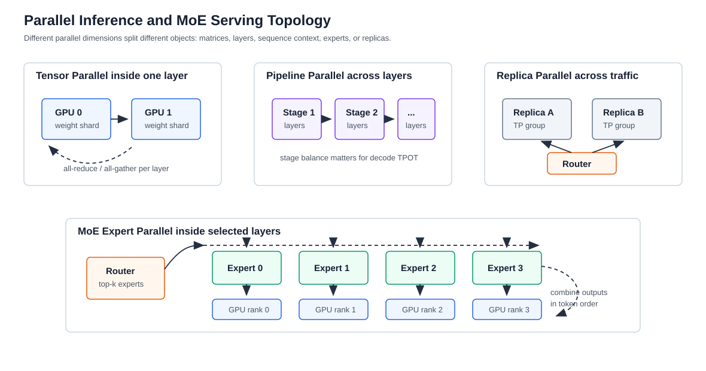

# 多 GPU 并行推理与 MoE Serving

版本日期：2026-06-16

---

## 摘要

并行推理解决的是单个模型副本如何跨 GPU 运行，以及多个副本如何承载在线流量。它不是训练并行的简单复用，因为推理系统还要同时处理 streaming、KV Cache、dynamic batching、SLO、路由和多租户隔离。Tensor parallel、pipeline parallel、context parallel、expert parallel 和 replica parallel 分别切分不同对象，带来的通信模式、显存占用和调度代价也不同。

本文从一个 70B dense 模型扩展到 MoE 模型的部署出发，先解释线性层和 attention 在 tensor parallel 下如何拆分，再讨论 pipeline / context parallel 对 prefill 和 decode 的影响，最后重点展开 MoE expert parallel：router 如何选择 expert、token 如何 all-to-all、负载不均衡如何影响线上 TPOT。

**阅读定位**：本文是 [大模型推理服务化系统综述](./llm_inference_serving_overview.md) 中“并行推理”的扩展篇。建议先读 [Prefill / Decode 调度与分离部署](./prefill_decode_scheduling_and_disaggregation.md)，再阅读本文。

---

## 目录

- 第 1 章 并行推理切分的是什么
- 第 2 章 Tensor Parallel：切矩阵和通信
- 第 3 章 Pipeline、Context 与 Replica Parallel
- 第 4 章 MoE Expert Parallel
- 第 5 章 Serving 拓扑、放置与失败模式
- 第 6 章 检查清单与参考资料

---

## 第 1 章 并行推理切分的是什么

**本章主线**：先建立并行维度和推理阶段之间的对应关系，避免把所有“多 GPU”都混成同一种扩展方式。

### 1.1 贯穿例子：从 dense 70B 到 MoE

假设我们先部署一个 70B dense decoder-only 模型。单卡放不下权重，需要至少 tensor parallel 或 pipeline parallel。之后业务希望换成一个 MoE 模型：总参数更大，但每个 token 只激活部分 expert。此时除了 dense attention 和共享层，还要处理 expert placement 和 all-to-all 通信。

推理并行可以按切分对象分类：

| 并行方式 | 切分对象 | 主要收益 | 主要代价 |
|---|---|---|---|
| Tensor Parallel | 单层矩阵和 attention heads | 单层放入多 GPU，提高大 batch 吞吐 | 每层通信 |
| Pipeline Parallel | Transformer 层 | 降低单卡权重占用 | 流水气泡和跨阶段传输 |
| Context Parallel | 序列维度 / attention 上下文 | 支持极长上下文 | attention 和 KV 分布通信 |
| Expert Parallel | MoE experts | 承载大量 expert 参数 | token all-to-all 和负载不均衡 |
| Replica / Data Parallel | 模型副本 | 扩展 QPS，隔离流量 | 权重重复占用 |

### 1.2 推理和训练并行的差异

训练关注吞吐、梯度同步和 optimizer state；推理关注 TTFT、TPOT、KV Cache 和 request scheduling。一个训练上高效的并行策略，不一定适合在线推理。例如 pipeline parallel 在训练中可以用 micro-batch 填满流水线，但在线 decode 每个 token 的计算粒度很小，流水气泡可能更明显。

**本章小结**：推理并行要先问切分对象是什么，再问通信是否适合 prefill、decode 和线上 batch 形态。

## 第 2 章 Tensor Parallel：切矩阵和通信

**本章主线**：用线性层拆分说明 tensor parallel 为什么每层都可能产生通信。

### 2.1 Column parallel linear

对线性层：

$$
Y = XW
$$

其中 $X \in \mathbb{R}^{B \times d_{\text{in}}}$，$W \in \mathbb{R}^{d_{\text{in}} \times d_{\text{out}}}$。Column parallel 把输出维度切到 $n$ 张 GPU：

$$
W = [W_1, W_2, \dots, W_n]
$$

每张 GPU 计算：

$$
Y_i = XW_i
$$

最后逻辑输出为：

$$
Y = [Y_1, Y_2, \dots, Y_n]
$$

这种方式适合 MLP 的 up projection 或 attention 的 QKV projection，因为输出可以暂时分片保留。

### 2.2 Row parallel linear

Row parallel 把输入维度切分：

$$
X = [X_1, X_2, \dots, X_n], \qquad
W =
\begin{bmatrix}
W_1 \\
W_2 \\
\vdots \\
W_n
\end{bmatrix}
$$

每张 GPU 计算局部结果：

$$
Z_i = X_i W_i
$$

完整输出需要求和：

$$
Y = \sum_{i=1}^{n} Z_i
$$

这通常对应一次 all-reduce。在线小 batch 下，矩阵乘本身变小，all-reduce 的相对成本会上升。

### 2.3 Attention heads 与 GQA

Multi-head attention 天然可以按 head 切分。若 query heads 数为 $H_q$，KV heads 数为 $H_{kv}$，GQA 下常有 $H_{kv} < H_q$。Tensor parallel 切分 attention 时，要同时处理：

- Q heads 如何分布；
- KV heads 如何分布；
- KV Cache block 是否按 rank 分片；
- decode 时每个 rank 是否能读取所需历史 K/V；
- attention 输出是否需要 all-gather 或 all-reduce。

这说明 tensor parallel 不只是“矩阵切一半”。它会改变 KV Cache 布局和 attention kernel 输入。

下图把 dense Transformer block、tensor parallel 和 MoE expert parallel 放在同一视图中，展示不同切分对象对应的通信。

<small>图 2-1：Tensor parallel 切分单层矩阵，pipeline parallel 切分层，expert parallel 切分 MoE experts。不同切分方式带来的通信路径不同。</small>

**本章小结**：Tensor parallel 的核心是矩阵分片和跨 GPU 汇总。它解决单层容量和吞吐问题，但每层通信会直接进入在线延迟。

## 第 3 章 Pipeline、Context 与 Replica Parallel

**本章主线**：并行不只有矩阵切分。层、序列和副本也可以切，但它们解决的是不同问题。

### 3.1 Pipeline Parallel

Pipeline parallel 把层分到不同 GPU。例如 $L$ 层 Transformer 被切成 $s$ 个 stage：

$$
\{1,\dots,L\} =
S_1 \cup S_2 \cup \dots \cup S_s
$$

每个 stage 处理自己的层，然后把 hidden states 传给下一 stage。prefill 阶段 token 多，micro-batch 更容易填流水；decode 阶段每步 token 少，流水气泡更明显。若一个请求流式输出，每个 token 都要走完整流水线，stage 间延迟会影响 TPOT。

### 3.2 Context Parallel

Context parallel 沿序列维度切分 attention。对超长上下文，单 GPU 无法容纳完整 attention 工作集或 KV Cache 时，可以让不同 GPU 负责不同 token block。第 $t$ 个 query 需要 attend 到历史 $1:t$，因此系统要聚合不同 context shard 上的 attention 结果。

如果第 $r$ 个 rank 持有一段 key / value：

$$
K_r, V_r
$$

局部 attention 输出为：

$$
O_r = \operatorname{softmax}\left(\frac{QK_r^\top}{\sqrt{d_h}}\right)V_r
$$

完整 attention 不能简单拼接 $O_r$，还要正确合并 softmax normalization。工程实现需要专门的分布式 attention kernel。

### 3.3 Replica Parallel

Replica parallel 复制完整模型副本，路由层把请求分发到不同副本。它不减少单副本显存，但最适合扩展在线 QPS、隔离租户和做灰度发布。实际生产常见组合是：

$$
\text{Replica} \times \text{Tensor Parallel} \times \text{Expert Parallel}
$$

也就是说，每个副本内部可能由多张 GPU 组成，副本之间再由 router 分流。

**本章小结**：Pipeline、context 和 replica parallel 分别面向层容量、长上下文和服务扩展。它们常与 tensor parallel 组合，而不是互相替代。

## 第 4 章 MoE Expert Parallel

**本章主线**：MoE 推理的关键不只是参数多，而是每个 token 动态选择 expert，这会把模型计算变成路由和通信问题。

### 4.1 MoE 层的基本计算

MoE 层通常先由 router 计算每个 token 到 expert 的得分：

$$
r(x) = \operatorname{softmax}(x W_{\text{router}})
$$

选出 top-$k$ experts：

$$
\mathcal{E}(x) = \operatorname{TopK}(r(x), k)
$$

输出为被选 expert 的加权和：

$$
y =
\sum_{e \in \mathcal{E}(x)}
r_e(x) \cdot E_e(x)
$$

其中 $E_e$ 是第 $e$ 个 expert 的 MLP。和 dense MLP 相比，MoE 的总参数可以很大，但每个 token 只激活少数 expert。

### 4.2 Expert Parallel 的通信

Expert parallel 把不同 expert 放到不同 GPU。若一个 batch 里的 token 被路由到多个 expert，系统需要：

1. 根据 router 结果把 token 分桶。
2. 通过 all-to-all 把 token 发送到 expert 所在 GPU。
3. 每个 GPU 执行本地 expert MLP。
4. 再通过 all-to-all 把结果送回原 rank。
5. 按原 token 顺序合并输出。

这条路径的性能由 token 分布决定。如果某些 expert 被大量请求命中，会出现 expert hotspot；如果 batch 太小，all-to-all 开销可能压过 MoE 的稀疏计算收益。

### 4.3 MoE Serving 的线上难点

MoE 在线服务要额外关注：

- **负载均衡**：router 在真实流量下是否偏向少数 expert。
- **batch shape**：每个 expert 收到的 token 数高度动态，kernel 利用率波动。
- **all-to-all 拓扑**：同机 NVLink、跨机 RDMA、PCIe 拓扑差异很大。
- **KV Cache 与 attention**：MoE 只替换部分 MLP 路径，attention 和 KV Cache 仍要正常并行。
- **PD 分离**：prefill 和 decode 的 expert 负载可能不同，placement 要分别考虑。

MoE 因此更像“模型结构 + 分布式系统”的共同问题，而不是单纯的大模型推理。

**本章小结**：Expert parallel 的收益来自稀疏激活，成本来自动态路由和 all-to-all。MoE serving 的关键指标不只是 tokens/s，还包括 expert load balance 和通信尾延迟。

## 第 5 章 Serving 拓扑、放置与失败模式

**本章主线**：并行策略最终要落到 GPU 拓扑、router 和调度器上，否则理论切分无法变成稳定服务。

### 5.1 放置策略

并行组应尽量匹配硬件拓扑：

- tensor parallel 优先放在高速互联 GPU 之间；
- expert parallel 的 all-to-all 优先避免跨慢链路；
- pipeline stage 应避免把高频相邻 stage 放在高延迟链路两侧；
- replica 应分散到不同节点或故障域，提高可用性；
- PD disaggregation 下 prefill pool 和 decode pool 的网络路径要能承载 KV transfer。

### 5.2 常见失败模式

| 失败模式 | 表现 | 可能原因 |
|---|---|---|
| TP 扩大后不变快 | TPOT 下降不明显或变差 | all-reduce 占比过高，小 batch 不适合 |
| PP 气泡严重 | GPU 利用率交替空闲 | decode 粒度小，stage 不均衡 |
| CP 长上下文变慢 | attention 通信放大 | softmax 合并和 KV shard 通信成本高 |
| EP 热点 | 某些 GPU 延迟异常高 | router 偏斜，expert placement 不合理 |
| Replica 不均衡 | 某些副本队列高 | router 未感知上下文长度或 KV locality |

### 5.3 指标集合

并行推理至少要观测：

- per-rank prefill / decode latency；
- all-reduce、all-gather、all-to-all 时间；
- 每个 rank 的 HBM 使用和带宽；
- KV Cache blocks by rank；
- expert token count 和 expert load balance；
- replica queue length、TTFT、TPOT、E2E latency；
- 跨节点网络吞吐和尾延迟。

**本章小结**：并行推理的瓶颈常出现在通信和放置，而不是矩阵乘本身。生产系统必须把 GPU 拓扑、请求分布和 SLO 放进同一个设计空间。

## 第 6 章 检查清单与参考资料

### 6.1 工程检查清单

1. 模型是 dense、MoE，还是 hybrid attention / state-space 混合结构？
2. 单副本需要多少 GPU，使用哪些并行维度？
3. TP / PP / CP / EP 的通信是否落在高速拓扑内？
4. KV Cache 是复制、分片，还是跨 rank 查询？
5. MoE expert token 分布是否可观测，是否存在热点？
6. router 是否感知上下文长度、prefix locality、租户和副本负载？
7. 扩容时是增加 replica，还是扩大单副本并行组？

## 参考资料

- NVIDIA, [TensorRT-LLM Documentation](https://docs.nvidia.com/tensorrt-llm/)
- vLLM Team, [Parallelism and Scaling](https://docs.vllm.ai/en/latest/)
- SGLang Team, [SGLang Documentation](https://docs.sglang.io/)
- William Fedus et al., [Switch Transformers: Scaling to Trillion Parameter Models with Simple and Efficient Sparsity](https://arxiv.org/abs/2101.03961)
- DeepSeek-AI, [DeepSeek-V3 Technical Report](https://arxiv.org/abs/2412.19437)
- NVIDIA, [NCCL Documentation](https://docs.nvidia.com/deeplearning/nccl/)

**全文小结**：并行推理把模型计算变成拓扑、通信和调度问题。Dense 模型主要关注矩阵和层切分，MoE 模型还要处理 expert 路由、all-to-all 和负载均衡。
