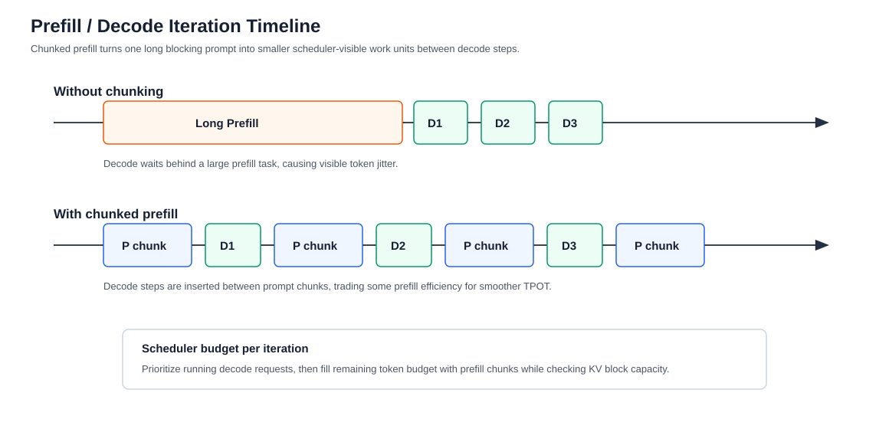

# Prefill / Decode 调度与分离部署

版本日期：2026-06-16

---

## 摘要

大模型推理服务中的 prefill 和 decode 是两种资源画像完全不同的计算。Prefill 一次处理完整 prompt，通常更偏计算密集；decode 每步生成一个 token，通常更受显存带宽、KV Cache 读取和在线调度影响。把两者混在一个简单 FIFO batch 中，会让长 prompt 阻塞短请求，也会让 decode 阶段在小 batch 下浪费 GPU。

本文围绕在线聊天服务和 RAG 请求混部场景，解释 continuous batching、iteration-level scheduling、chunked prefill、decode-maximal batching 和 prefill/decode disaggregation 的动机与权衡。重点不是记住某个系统名，而是理解调度器如何在 TTFT、TPOT、显存、吞吐和成本之间做取舍。

**阅读定位**：这篇文章扩展 [大模型推理服务化系统综述](./llm_inference_serving_overview.md) 中的调度章节，并和 [KV Cache、PagedAttention 与 Prefix Caching](./kv_cache_paged_attention_and_prefix_caching.md) 配合阅读。

---

## 目录

- 第 1 章 调度问题从哪里来
- 第 2 章 Continuous Batching 与 iteration-level scheduling
- 第 3 章 Chunked Prefill 与 decode-maximal batching
- 第 4 章 Prefill / Decode Disaggregation
- 第 5 章 SLO-aware Scheduling 与失败模式
- 第 6 章 工程检查清单与参考资料

---

## 第 1 章 调度问题从哪里来

**本章主线**：先把 prefill 和 decode 的差异讲清楚，再说明为什么在线系统不能只靠静态 batch。

### 1.1 Prefill 和 decode 优化的是不同指标

Prefill 影响首 token 延迟 TTFT。用户请求进入系统后，只有 prompt 被处理完、初始 KV Cache 写好，模型才可能开始输出第一个 token。Decode 影响每 token 时间 TPOT，也就是流式输出是否平滑。

| 阶段 | 对用户指标的影响 | 主要资源 | 常见问题 |
|---|---|---|---|
| Prefill | TTFT | GPU compute、attention、activation | 长 prompt 抢占 GPU，短请求首 token 慢 |
| Decode | TPOT | KV Cache、显存带宽、batch 调度 | batch 小、token 间隔抖动、尾延迟高 |

这意味着一个调度器不能只看“哪个请求先来”。它需要知道某个请求当前处于 prefill 还是 decode，输入长度是多少，输出预算是多少，是否有 SLO，是否可以被 chunk，是否可以被延迟。

### 1.2 贯穿例子：短问答和长 RAG 混部

假设同一个服务中有两类请求：

- 短问答：prompt 100 tokens，输出 100 tokens。
- 长 RAG：prompt 8000 tokens，输出 200 tokens。

如果长 RAG 请求进入 GPU 做完整 prefill，短问答请求可能在队列里等很久，TTFT 明显变差。如果为了短请求频繁打断长 prefill，长 RAG 的吞吐又下降。这个冲突就是调度策略存在的原因。

### 1.3 请求在 runtime 里的状态机

一个在线请求不是直接进入 GPU 一次性完成，而是在 runtime 中经历多个状态。最小状态机可以写成：

$$
\text{Waiting}
\rightarrow
\text{Prefill}
\rightarrow
\text{Decode}
\rightarrow
\text{Finished}
$$

实际系统还会有取消、超时、抢占、等待 KV transfer、等待 prefix cache lookup 等状态。设请求 $r$ 的输入长度为 $P_r$，当前已生成长度为 $D_r$，最大输出预算为 $G_r$，则调度器至少需要维护：

$$
s_r = (P_r, D_r, G_r, \text{phase}_r, \text{deadline}_r, \text{kv\_blocks}_r)
$$

其中 $\text{phase}_r$ 表示请求处于 prefill、decode 还是等待迁移；$\text{kv\_blocks}_r$ 表示它已经占用的 KV blocks。调度器每一轮都在更新这些状态，而不是只处理一个静态 batch。

**本章小结**：Prefill 和 decode 的资源画像不同，TTFT 和 TPOT 也不是同一个目标。推理调度器的核心任务，是让不同阶段的请求在有限 GPU 和 KV Cache 预算下共存。

## 第 2 章 Continuous Batching 与 iteration-level scheduling

**本章主线**：从静态 batch 的问题开始，解释为什么 Orca 把调度粒度推进到 generation iteration。

### 2.1 静态 batch 为什么不适合生成

静态 batch 的思路是：收集一批请求，一起执行，等整批完成后再执行下一批。这在分类模型或固定长度推理中很自然，但对 LLM 生成不适合。

原因有三点：

1. 输出长度未知。短请求很快完成，长请求还在继续生成。
2. 新请求持续到达。等待当前 batch 全部结束会增加排队。
3. 每个 decode step 后 batch 成员都可能变化。完成的请求应释放，新的请求应补入。

### 2.2 Continuous batching 的基本机制

Continuous batching 在 decode step 边界更新 batch。每轮调度器会：

1. 移除已完成、取消或超时的请求。
2. 释放对应 KV Cache 或输出状态。
3. 从等待队列选择新的 prefill 或 decode 工作。
4. 构造下一轮 GPU batch。

Orca 提出的 iteration-level scheduling 就是这类思想的代表：调度单位不再是完整请求，而是 generation iteration。这样系统可以在长请求尚未完成时，把新请求插入后续迭代。

### 2.3 一轮调度如何形成 GPU batch

现代 serving runtime 通常会给每轮调度设置 token budget。设本轮最多处理 $C$ 个 token，decode 请求集合为 $\mathcal{D}$，prefill chunk 集合为 $\mathcal{P}$。如果每个 decode 请求本轮只生成一个 token，则 decode 预算消耗为：

$$
C_{\text{decode}} = |\mathcal{D}|
$$

剩余预算可以用于 prefill chunk：

$$
C_{\text{prefill}} \leq C - C_{\text{decode}}
$$

一个 decode-prioritized scheduler 会先保证已有流式请求的 decode step，再把剩余容量分配给新请求或长 prompt chunk。这样做的目的不是让每轮 token 数最大，而是在 TPOT 稳定的前提下尽量推进 prefill。

这类策略还必须检查 KV Cache 预算。若本轮接纳的新 prefill 或 decode 会让可用 KV blocks 低于阈值，即使 token budget 足够，调度器也应拒绝或延迟请求。

### 2.4 Continuous batching 的边界

Continuous batching 解决了静态 batch 槽位浪费，但没有自动解决所有问题：

- 长 prefill 仍然可能阻塞 decode。
- KV Cache 仍然可能成为显存瓶颈。
- 请求优先级和租户公平性需要额外策略。
- Batch 变化会影响 CUDA Graph、kernel shape 和性能稳定性。

因此，continuous batching 通常要和 PagedAttention、chunked prefill、限流和 SLO controller 组合使用。

**本章小结**：Continuous batching 把在线生成从“请求级调度”变成“迭代级调度”。它是现代 LLM serving 的基础，但仍需要处理 prefill/decode 干扰。

## 第 3 章 Chunked Prefill 与 decode-maximal batching

**本章主线**：长 prefill 不应该总是作为不可切分的大任务进入 GPU。Chunked prefill 把长 prompt 拆成块，让 decode 能和 prefill 交错。

### 3.1 为什么长 prefill 会伤害 TPOT

在统一 worker 中，prefill 和 decode 共享同一组 GPU。如果一个超长 prompt 一次性进入 prefill，它会占用较长 GPU 时间。在这段时间里，已经开始流式输出的请求无法及时执行 decode step，用户看到的是 token 间隔变长。

这类问题对聊天体验影响很大。用户可以接受首 token 稍慢，但一旦回答开始输出，token 间隔剧烈抖动会非常明显。

### 3.2 Chunked prefill 的直觉

Chunked prefill 把长 prompt 切成多个小块。调度器可以在多个轮次中处理这些 prefill chunk，并在每轮 batch 中混入 decode 请求。

Sarathi-Serve 的思路可以概括为：

- 把 prefill 切成固定或近似固定大小的 chunk。
- 构造 decode-maximal batch：优先填入 decode 请求，再加入一个 prefill chunk 提供足够计算量。
- 让 decode 请求 piggyback 在 prefill chunk 上，提高 decode 阶段 GPU 利用率。

这种方法缓解了 decode-only batch 利用率低和长 prefill 阻塞的问题。

下图展示了同一个长 RAG 请求在没有 chunk 和使用 chunked prefill 时，对短问答 decode 的影响。关键差异在于：长 prompt 不再占据一个完整的大时间片，而是被拆成可插入的 prefill chunks。

<small>图 3-1：Chunked prefill 把长 prompt 拆成多个可调度片段，让 decode step 能插入到 prefill 之间，减少流式输出抖动。</small>

### 3.3 Chunk size 是策略问题

Chunk size 太大，仍然会阻塞 decode；chunk size 太小，prefill 总时间和调度开销可能上升。选择 chunk size 时要考虑：

- prompt length 分布；
- 当前 decode 请求数量；
- GPU 型号和 batch shape；
- TTFT 和 TPOT 的 SLO；
- pipeline parallel 或 tensor parallel 下的通信和气泡。

因此，chunked prefill 不是一个简单开关，而是调度器策略的一部分。

### 3.4 用时间预算理解 chunk size

设一个长 prompt 被切成大小为 $c$ 的 chunk，prefill kernel 对该 chunk 的执行时间近似为：

$$
T_{\text{chunk}}(c) = T_{\text{launch}} + T_{\text{attn}}(c) + T_{\text{mlp}}(c)
$$

如果已有流式请求的 TPOT SLO 为 $S_{\text{TPOT}}$，调度器希望每次阻塞 decode 的时间不超过某个预算 $\beta S_{\text{TPOT}}$，其中 $0 < \beta < 1$，则需要满足：

$$
T_{\text{chunk}}(c) \leq \beta S_{\text{TPOT}}
$$

这个约束解释了为什么 chunk size 不能只按吞吐最大化选择。更大的 chunk 可能让 GPU 利用率更高，但会增加 decode jitter；更小的 chunk 能改善流式体验，但会增加调度和 kernel launch 开销。

**本章小结**：Chunked prefill 的价值是把长 prompt 从大块阻塞任务变成可调度的工作单元。它让 prefill 和 decode 可以更细粒度地交错。

## 第 4 章 Prefill / Decode Disaggregation

**本章主线**：如果 prefill 和 decode 干扰严重，可以把它们放到不同 GPU 池，但这会引入 KV Cache 传输。

### 4.1 为什么要分离

Prefill 和 decode 需要的资源不同。Prefill 更适合较大 batch 和高 compute utilization；decode 更需要稳定低延迟和持续读取 KV Cache。统一部署会让两者互相干扰：

- 长 prefill 拉高已有请求 TPOT。
- Decode 小 batch 让 GPU 算力利用率低。
- 两阶段共用同一并行策略，难以分别优化。

DistServe 的思路是把 prefill 和 decode 分配到不同 GPU，并分别为 TTFT 和 TPOT 约束做资源和并行策略优化。

### 4.2 分离部署的系统代价

PD disaggregation 的主要代价是 KV Cache movement。Prefill pool 生成初始 KV Cache 后，decode pool 必须读取这些缓存才能继续生成。这个路径可能经过：

- 同机 GPU 间 NVLink / PCIe；
- 跨机网络；
- CPU DRAM 中转；
- 专门的 KV cache connector 或外部缓存层。

如果 cache transfer 无法和计算重叠，decode pool 会等待数据，TPOT 反而变差。因此，PD 分离要同时看计算干扰和传输开销。

### 4.3 一个请求在 PD 分离下如何流动

在 PD disaggregation 下，一个请求通常经历以下路径：

1. Router 根据输入长度、SLO 和资源状态把请求送入 prefill pool。
2. Prefill worker 完成 prompt forward，生成每层初始 KV Cache。
3. KV connector 把 KV blocks 从 prefill 侧传到 decode 侧。
4. Decode worker 接管请求，开始逐 token 生成。
5. 后续每个 decode step 在 decode pool 内追加新 K/V。

设 prefill 时间为 $T_{\text{prefill}}$，排队时间为 $T_{\text{queue}}$，KV 传输时间为 $T_{\text{transfer}}$，decode 接管开销为 $T_{\text{handoff}}$，则首 token 延迟可以粗略拆成：

$$
T_{\text{TTFT}}
\approx
T_{\text{queue}}
+ T_{\text{prefill}}
+ T_{\text{transfer}}
+ T_{\text{handoff}}
$$

PD 分离减少的是 prefill 和 decode 在同一 GPU 上的互相干扰，但它会把 $T_{\text{transfer}}$ 和 $T_{\text{handoff}}$ 引入 TTFT。只有当队列减少和阶段隔离带来的收益超过传输成本时，它才提高 goodput。

### 4.4 什么时候值得分离

PD disaggregation 更适合：

- 长 prompt 和短 decode 混合明显；
- TTFT 和 TPOT 都有严格 SLO；
- 集群网络或同机互联足够强；
- 请求量足够大，可以维持 prefill pool 和 decode pool 利用率；
- 系统能观测 cache transfer latency 和 decode idle time。

如果请求量小、网络弱、prompt 较短，统一 worker 加 continuous batching 和 chunked prefill 可能更简单。

### 4.5 调度图回顾

下图来自综述文章，展示了调度器如何在 unified worker 和 PD disaggregation 两种形态之间安排 prefill、decode 和 KV Cache。

<small>图 4-1：Prefill / Decode 调度与 KV Cache 数据流。PD 分离把计算干扰转化为缓存传输和资源池协调问题。</small>

**本章小结**：PD disaggregation 是对 prefill/decode 资源差异的结构性回应。它能提高 SLO 内 goodput，但只有在 cache transfer、资源池利用率和调度复杂度可控时才值得。

## 第 5 章 SLO-aware Scheduling 与失败模式

**本章主线**：生产调度器不仅要提高吞吐，还要让满足 SLO 的请求尽量多。

### 5.1 从 throughput 到 goodput

Throughput 统计总 tokens/s，goodput 只统计满足 SLO 的有效请求或 token。在线服务中，goodput 更有意义。一个系统如果靠牺牲 p99 延迟换取平均吞吐，不一定能承载真实用户流量。

SLO-aware scheduler 通常需要同时看：

- 当前队列长度；
- 请求输入长度和输出预算；
- 已等待时间；
- 当前 KV Cache 可用空间；
- prefill 和 decode GPU 池负载；
- 租户优先级和公平性。

### 5.2 常见失败模式

| 失败模式 | 表现 | 可能原因 |
|---|---|---|
| Short request starvation | 短请求 TTFT 很高 | 长 prefill 占用调度窗口 |
| Decode jitter | 流式输出忽快忽慢 | prefill 和 decode 干扰，batch 不稳定 |
| Cache pressure collapse | 系统突然大量限流 | KV Cache 接近显存上限 |
| Over-disaggregation | 分离后更慢 | KV transfer 成为瓶颈 |
| Priority inversion | 高优先级请求被低优先级长请求拖慢 | 调度器没有阶段感知和优先级抢占 |

### 5.3 最小观测集合

调度相关指标至少应包括：

- waiting time by request type；
- TTFT / TPOT p50、p90、p99；
- prefill batch size 和 decode batch size；
- prefill tokens/s 和 decode tokens/s；
- active requests、running requests、waiting requests；
- KV Cache used blocks、free blocks、eviction；
- PD 分离下的 cache transfer bytes 和 latency。

**本章小结**：调度器的目标不是“尽量凑大 batch”，而是在 SLO、显存和成本约束下最大化 goodput。没有阶段感知和 KV Cache 感知的调度，很容易在真实流量下退化。

## 第 6 章 工程检查清单与参考资料

### 6.1 设计检查清单

1. 调度器是否区分 prefill 和 decode？
2. 是否支持 running batch 中动态加入和退出请求？
3. 长 prefill 是否能 chunk？
4. 是否能按 TTFT / TPOT 监控和限流？
5. 是否能按租户或优先级做公平调度？
6. PD 分离时，cache transfer 是否被计入延迟预算？
7. 请求取消、超时和客户端断开后，调度器是否及时释放资源？

## 参考资料

- Gyeong-In Yu et al., [Orca: A Distributed Serving System for Transformer-Based Generative Models](https://www.usenix.org/conference/osdi22/presentation/yu)
- Amey Agrawal et al., [SARATHI: Efficient LLM Inference by Piggybacking Decodes with Chunked Prefills](https://arxiv.org/abs/2308.16369)
- Yinmin Zhong et al., [DistServe: Disaggregating Prefill and Decoding for Goodput-optimized Large Language Model Serving](https://arxiv.org/abs/2401.09670)
- vLLM Team, [Disaggregated Serving examples](https://docs.vllm.ai/en/latest/)
- SGLang Team, [PD Disaggregation](https://docs.sglang.io/)
- Woosuk Kwon et al., [Efficient Memory Management for Large Language Model Serving with PagedAttention](https://arxiv.org/abs/2309.06180)

**全文小结**：Prefill / decode 调度是在线 LLM serving 的核心控制面。Continuous batching、chunked prefill 和 PD disaggregation 都是在不同粒度上减少阶段干扰、提高 SLO 内 goodput。
