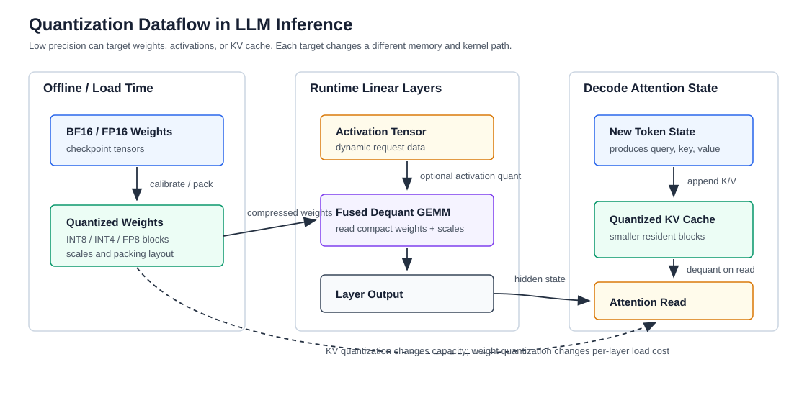

# 量化与低精度推理

版本日期：2026-06-16

---

## 摘要

量化不是一个单独的开关，而是一组把模型权重、激活值或 KV Cache 从高精度表示压缩到低精度表示的系统技术。它的直接目标通常不是“让所有请求都更快”，而是降低显存占用、减少 HBM 带宽压力、提高可驻留 batch 或让更大的模型进入有限 GPU。真正的收益取决于量化对象、硬件指令、kernel 实现、请求长度分布和质量回退。

本文从一个 70B decoder-only 模型服务出发，解释 weight quantization、activation quantization、KV Cache quantization 和 FP8 / INT8 / INT4 等低精度路径。重点不是罗列量化算法名称，而是回答：一次矩阵乘法在低精度下如何近似，scale 和 zero-point 如何进入计算，为什么 KV Cache 量化会影响后续所有 decode step，以及生产系统如何验证质量、延迟和回滚风险。

**阅读定位**：本文是 [大模型推理服务化系统综述](./llm_inference_serving_overview.md) 中“优化手段”的量化扩展篇。建议先理解 [KV Cache、PagedAttention 与 Prefix Caching](./kv_cache_paged_attention_and_prefix_caching.md)，再阅读本文。

---

## 目录

- 第 1 章 量化到底优化什么
- 第 2 章 从矩阵乘法看权重量化
- 第 3 章 Activation 与 KV Cache 量化
- 第 4 章 Kernel、硬件与 serving runtime
- 第 5 章 质量验证、回滚与工程选型
- 第 6 章 检查清单与参考资料

---

## 第 1 章 量化到底优化什么

**本章主线**：先把量化和“模型变小”“推理变快”之间的关系拆开，再用贯穿例子说明量化在推理服务里的真实位置。

### 1.1 贯穿例子：70B 模型的三类压力

假设我们要在线部署一个 70B decoder-only 模型，服务三类请求：

| 请求类型 | 输入 / 输出特征 | 主要压力 |
|---|---|---|
| 短聊天 | 输入 100 tokens，输出 100 tokens | decode 小 batch、CPU 和 kernel launch 开销 |
| 长 RAG | 输入 8000 tokens，输出 200 tokens | prefill 计算、KV Cache 显存 |
| 代码生成 | 输入 2000 tokens，输出 2000 tokens | 长 decode、HBM 带宽、KV Cache 追加 |

如果使用 BF16 权重，70B 参数只算权重就需要约 $70 \times 10^9 \times 2$ bytes，即约 $140$ GB。单张 80 GB GPU 放不下，必须使用多 GPU 并行、权重量化或两者组合。即使权重能放下，长上下文并发也会让 KV Cache 变成显存大头。量化因此有三个不同入口：

1. **Weight quantization**：减少模型权重占用和权重读取带宽。
2. **Activation quantization**：减少中间激活和算子输入输出的存储 / 带宽。
3. **KV Cache quantization**：减少历史 key / value 的驻留显存。

这三者的风险不同。权重量化主要影响每层线性变换的近似误差；activation 量化影响动态范围和 outlier；KV Cache 量化会影响后续所有 decode step 的 attention 分布。

### 1.2 量化收益不是自动等于延迟收益

对单个线性层，未量化的主计算可以写成：

$$
Y = XW^\top
$$

其中 $X \in \mathbb{R}^{B \times d_{\text{in}}}$ 是当前 batch 的输入激活，$W \in \mathbb{R}^{d_{\text{out}} \times d_{\text{in}}}$ 是权重，$Y \in \mathbb{R}^{B \times d_{\text{out}}}$ 是输出。量化的直接变化是把 $W$ 或 $X$ 变成更小的数据类型，但系统收益还要看三件事：

1. **数据搬运是否减少**：如果瓶颈是 HBM 读权重，压缩权重有帮助。
2. **低精度 kernel 是否高效**：如果硬件或 runtime 没有好 kernel，dequantize 开销可能抵消收益。
3. **batch 和 shape 是否适合**：小 batch、动态 shape、MoE 稀疏路由都可能让理论收益打折。

因此，量化应被看作“显存 / 带宽 / kernel 联合优化”，而不是单独的算法技巧。

**本章小结**：量化的第一性问题是表示和带宽，不是抽象地追求“更快”。它是否提升线上服务，要回到模型大小、上下文长度、batch、kernel 和质量约束。

## 第 2 章 从矩阵乘法看权重量化

**本章主线**：用线性层说明 scale、zero-point 和 group-wise quantization 如何进入矩阵计算，再解释为什么工程系统常选择不同粒度的量化。

### 2.1 对称量化和非对称量化

最简单的对称量化把浮点权重 $w$ 映射为整数 $q$：

$$
q = \operatorname{clip}\left(\operatorname{round}\left(\frac{w}{s}\right), q_{\min}, q_{\max}\right)
$$

反量化时再近似恢复：

$$
\hat{w} = s q
$$

这里 $s$ 是 scale，$q_{\min}$ 和 $q_{\max}$ 由整数位宽决定。INT8 通常有更大的动态范围，INT4 压缩更强但误差更大。非对称量化会加入 zero-point：

$$
q = \operatorname{clip}\left(\operatorname{round}\left(\frac{w}{s}\right) + z, q_{\min}, q_{\max}\right)
$$

$$
\hat{w} = s(q - z)
$$

$z$ 用来让整数零点对齐浮点零点，适合分布不对称的数据。但在高性能 GPU kernel 中，非对称量化也可能带来额外偏移处理。

### 2.2 Group-wise quantization

整层共享一个 scale 太粗，逐元素 scale 又太贵。实际系统常使用 group-wise quantization：把权重按输出通道或输入通道切成若干 group，每个 group 使用自己的 scale。若第 $g$ 个 group 的权重向量为 $W_g$，可以写成：

$$
Q_g = \operatorname{round}\left(\frac{W_g}{s_g}\right), \qquad \hat{W}_g = s_g Q_g
$$

group 越小，量化误差通常越低，但 scale 元数据越多，kernel 也更复杂。AWQ、GPTQ 等方法的差异不只在整数位宽，也在于如何选择保留精度、如何处理 outlier、是否需要校准数据以及如何适配矩阵乘 kernel。

### 2.3 低精度 GEMM 的执行路径

权重量化后的线性层大致有三种执行路径：

1. **先反量化再 GEMM**：把 $Q$ 还原为 $\hat{W}$，再执行普通矩阵乘。实现简单，但可能丢掉带宽收益。
2. **边读边反量化**：kernel 从压缩权重读取 $Q$ 和 $s$，在寄存器或 shared memory 中恢复参与计算。
3. **原生低精度计算**：硬件 tensor core 直接支持 FP8、INT8 或部分 INT4 路径。

可以把第二类路径理解为：

$$
Y_i = \sum_g X_g \left(s_g Q_{i,g}\right)^\top
$$

其中 $X_g$ 是输入在第 $g$ 个 group 上的切片，$Q_{i,g}$ 是第 $i$ 个输出通道对应的量化权重切片。这个公式说明：低精度权重不是消除了乘法，而是把“读大权重”变成“读小整数 + scale，并在 kernel 内恢复有效值”。

下图概括了三类量化对象在推理请求中的位置。

<small>图 2-1：量化可以作用在权重、激活和 KV Cache 上。权重量化主要改变线性层读权重路径，KV Cache 量化主要改变 decode attention 读取历史状态的路径。</small>

**本章小结**：权重量化的核心不是把矩阵乘法“变没”，而是改变矩阵乘法的表示和访存路径。scale 粒度、kernel 融合和硬件指令共同决定实际收益。

## 第 3 章 Activation 与 KV Cache 量化

**本章主线**：权重量化处理相对静态的参数，activation 和 KV Cache 量化处理运行时张量；后两者更依赖 workload 和误差传播。

### 3.1 Activation 量化为什么更难

权重在部署前已知，可以离线校准。Activation 来自真实请求，分布会随 prompt、语言、任务和 batch 变化。若第 $l$ 层输入激活为 $X^{(l)}$，activation 量化写成：

$$
\hat{X}^{(l)} = s_x \cdot \operatorname{round}\left(\frac{X^{(l)}}{s_x}\right)
$$

问题在于 $s_x$ 很难固定。若 scale 太小，outlier 会被 clip；若 scale 太大，大量普通值会落在粗粒度整数格上。生产系统因此常见几种折中：

- 只量化部分线性层输入，保留敏感路径为 BF16 / FP16。
- 使用 per-token 或 per-channel scale 降低误差。
- 对 outlier 通道做特殊处理。
- 在 FP8 路径上依赖硬件和 runtime 的动态 scale 管理。

### 3.2 KV Cache 量化的特殊风险

对第 $l$ 层 attention，prefill 或 decode 会生成：

$$
K^{(l)} = X^{(l)} W_K^{(l)}, \qquad V^{(l)} = X^{(l)} W_V^{(l)}
$$

KV Cache 量化把 $K^{(l)}$ 和 $V^{(l)}$ 存成低精度表示。decode 第 $t$ 步读取历史缓存并计算：

$$
a_{t,j}^{(l)} =
\operatorname{softmax}_j
\left(
\frac{
q_t^{(l)} \cdot \hat{k}_j^{(l)}
}{
\sqrt{d_h}
}
\right)
$$

$$
o_t^{(l)} = \sum_{j=1}^{t} a_{t,j}^{(l)} \hat{v}_j^{(l)}
$$

这里 $\hat{k}_j^{(l)}$ 和 $\hat{v}_j^{(l)}$ 是量化后恢复的 key / value。误差不会只影响当前 token，因为新 token 的 hidden state 又会进入下一层和下一步生成。长上下文 RAG、代码生成、数学推理和多轮 Agent 对这种误差更敏感。

### 3.3 KV 量化如何改变容量边界

未量化 KV Cache 的粗略大小为：

$$
M_{\text{KV}} =
2 \times L \times H_{\text{kv}} \times d_h \times T \times b
$$

其中 $L$ 是层数，$H_{\text{kv}}$ 是 KV head 数，$d_h$ 是 head dimension，$T$ 是当前上下文 token 数，$b$ 是每个元素字节数。若从 BF16 的 $b=2$ 降到 FP8 的 $b=1$，理论上 KV Cache 主体显存约减半；如果进一步使用 INT4，主体显存还会下降，但 scale 元数据、block 对齐和 kernel 代价不能忽略。

这会改变调度器的容量边界。更多请求可以同时驻留，但每个 decode step 可能多出反量化和 scale 读取。对吞吐是否有利，要看系统原本是显存容量瓶颈、HBM 带宽瓶颈，还是 compute / kernel launch 瓶颈。

**本章小结**：Activation 和 KV Cache 量化比权重量化更贴近在线请求分布。尤其 KV Cache 量化会改变长上下文容量，但必须用任务质量和 TPOT 一起验证。

## 第 4 章 Kernel、硬件与 serving runtime

**本章主线**：低精度格式只有落到高效 kernel 和硬件指令上，才会变成线上收益。

### 4.1 不同格式对应不同硬件路径

常见格式可以按工程属性理解：

| 格式 | 常见用途 | 工程关注点 |
|---|---|---|
| FP8 | 权重、activation、部分 KV | 依赖硬件支持和 scale 管理，适合新 GPU |
| INT8 | 权重和部分 activation | kernel 生态成熟，质量通常较稳 |
| INT4 | 权重压缩 | 显存收益明显，kernel 和质量更敏感 |
| KV FP8 / INT8 / INT4 | 长上下文 KV Cache | 影响 attention 质量，需按 workload 验证 |
| GGUF 低比特 | 本地 / 边缘推理 | 更偏 llama.cpp 等本地 runtime |

同样叫 INT4，不同 runtime 的 packing layout、group size、scale 存储和 kernel 融合方式可能完全不同。选型时不能只看模型文件大小。

### 4.2 Runtime 支持决定可用性

在生产推理里，量化能力通常由 runtime 暴露。vLLM 支持多种量化后端并将量化与 PagedAttention、continuous batching、prefix caching 等 serving 能力组合；TensorRT-LLM 更强调 NVIDIA GPU 上的 engine 构建和高性能 kernel；SGLang 则把量化与 structured outputs、RadixAttention、PD disaggregation 等 runtime 能力一起放进服务路径；llama.cpp 更适合本地、边缘和多硬件后端。

因此，评估量化时要同时问：

1. 目标模型结构是否被 runtime 支持？
2. 量化格式是否支持当前 GPU？
3. 量化后是否还能使用 tensor parallel、LoRA、MoE、speculative decoding？
4. 是否有对应 metrics 能观察量化后的延迟、错误率和质量回退？

### 4.3 量化和其他优化的耦合

量化经常和其他优化产生耦合：

- **和并行推理**：tensor parallel 会切分权重矩阵，量化 scale 的切分和通信边界要一致。
- **和 MoE**：expert 权重量化可以降低显存，但 token routing 导致的动态 shape 会影响 kernel 效率。
- **和 speculative decoding**：draft model 可以更低精度，但 target verification 的分布校正不能被破坏。
- **和 KV Cache 管理**：PagedAttention 的 block layout 需要和 KV quantization layout 配合。

这也是为什么线上量化通常不是单独上线，而是和 runtime 版本、模型版本、tokenizer、parallel config 一起灰度。

**本章小结**：量化收益由格式、kernel、runtime 和 workload 共同决定。没有 runtime 支持的低精度格式，只是一个离线压缩结果，不是可用的 serving 优化。

## 第 5 章 质量验证、回滚与工程选型

**本章主线**：量化上线的难点不是得到一个低精度模型，而是证明它在真实服务目标下值得使用。

### 5.1 验证顺序

建议按四层验证：

1. **离线质量**：通用 benchmark、领域任务、长上下文任务、代码 / 推理任务。
2. **单机性能**：prefill tokens/s、decode tokens/s、TTFT、TPOT、显存峰值。
3. **在线回放**：真实 prompt / output length 分布、Poisson arrival 或 trace replay。
4. **灰度发布**：小流量比较质量投诉、错误率、fallback、成本和 p99 延迟。

不要只用 perplexity 或短问答判断量化是否可用。长上下文和工具调用任务里，错误可能表现为引用错位、代码细节丢失或推理链断裂。

### 5.2 回滚边界

量化版本应被视为模型版本的一部分。以下变化都可能需要重新验证：

- base model 或 fine-tuned checkpoint 改变；
- tokenizer 或 chat template 改变；
- LoRA adapter 改变；
- runtime 量化 backend 改变；
- GPU 架构或 driver / CUDA 版本改变；
- parallelism、KV quantization 或 speculative decoding 同时改变。

如果量化模型和 BF16 模型共存，路由层需要明确哪些租户、任务和上下文长度可以走量化池。对高价值、低容错任务，可以保留 BF16 fallback。

### 5.3 选型判断

| 现象 | 优先尝试 | 暂缓量化的信号 |
|---|---|---|
| 模型单卡放不下 | Weight INT8 / INT4、FP8、TP | 质量高度敏感且没有校准集 |
| 长上下文并发低 | KV FP8 / INT8、PagedAttention | 任务依赖精确引用和长距离检索 |
| HBM 带宽瓶颈 | Weight-only quantization、fused dequant GEMM | kernel fallback 到慢路径 |
| 成本压力大 | 低精度副本池 + 路由分层 | 缺少线上质量监控和回滚 |
| 冷启动慢 | 更小权重、engine cache | engine 构建时间反而变长 |

**本章小结**：量化应以“可验证的服务收益”为上线标准。模型文件变小只是起点，质量、kernel、SLO 和回滚能力才决定它是否适合生产。

## 第 6 章 检查清单与参考资料

### 6.1 工程检查清单

1. 当前瓶颈是权重显存、KV Cache 显存、HBM 带宽，还是调度 / CPU？
2. 量化对象是 weight、activation、KV Cache，还是混合路径？
3. scale 粒度、group size、zero-point 和 packing layout 是否被 runtime kernel 原生支持？
4. 是否验证了长上下文、代码、RAG、工具调用等真实任务质量？
5. 是否比较了 TTFT、TPOT、goodput、显存峰值和 cost/token？
6. 是否能按租户、模型版本和请求类型路由到量化或非量化副本？
7. 是否有 BF16 / FP16 fallback 和灰度回滚路径？

## 参考资料

- vLLM Team, [Quantization](https://docs.vllm.ai/en/latest/features/quantization/)
- NVIDIA, [TensorRT-LLM Documentation](https://docs.nvidia.com/tensorrt-llm/)
- SGLang Team, [Quantization](https://docs.sglang.io/)
- llama.cpp Team, [llama.cpp GitHub Repository](https://github.com/ggml-org/llama.cpp)
- Tim Dettmers et al., [QLoRA: Efficient Finetuning of Quantized LLMs](https://arxiv.org/abs/2305.14314)
- Ji Lin et al., [AWQ: Activation-aware Weight Quantization for LLM Compression and Acceleration](https://arxiv.org/abs/2306.00978)
- Elias Frantar et al., [GPTQ: Accurate Post-Training Quantization for Generative Pre-trained Transformers](https://arxiv.org/abs/2210.17323)

**全文小结**：量化把推理优化落在数值表示、访存和 kernel 路径上。它能显著改变容量和成本边界，但只有在质量验证、runtime 支持和灰度回滚都成立时，才是生产可用的优化。
