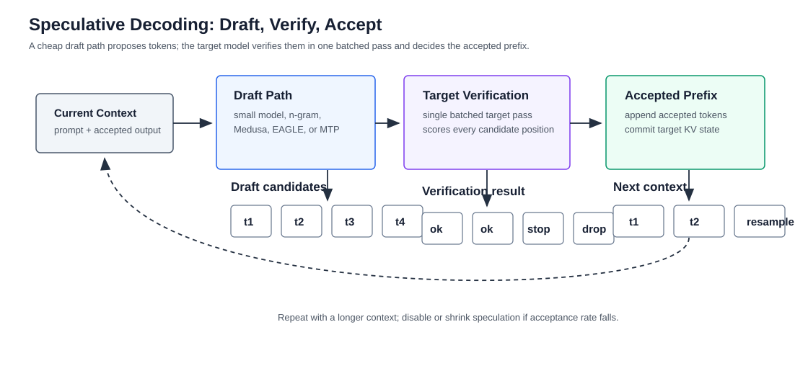

# Speculative Decoding 与解码加速

版本日期：2026-06-16

---

## 摘要

自回归大模型的 decode 阶段天然串行：当前 token 生成之后，下一步才能知道新的上下文。Speculative decoding 的核心思想是让一个便宜的 draft 路径先猜多个 token，再让 target model 批量验证。若猜测被接受，target model 的有效执行步数减少；若猜错，系统仍要保持目标模型原本的输出分布。

本文从一个长代码生成请求出发，解释标准 decode 为什么慢，draft / target verification 如何保持分布正确，接受率如何决定收益，以及 Medusa、EAGLE、n-gram speculation 等变体在系统上改变了什么。重点是把算法概率、KV Cache 增长、batch 调度和 serving runtime 放在同一条链路里看。

**阅读定位**：本文是 [大模型推理服务化系统综述](./llm_inference_serving_overview.md) 中“解码加速”的扩展篇。它应和 [Prefill / Decode 调度与分离部署](./prefill_decode_scheduling_and_disaggregation.md) 配合阅读。

---

## 目录

- 第 1 章 Decode 的顺序瓶颈
- 第 2 章 Draft / Target 验证流程
- 第 3 章 接受率、分布校正与收益模型
- 第 4 章 主要变体：n-gram、Medusa、EAGLE 与 MTP
- 第 5 章 Serving 系统里的调度和 KV Cache 影响
- 第 6 章 检查清单与参考资料

---

## 第 1 章 Decode 的顺序瓶颈

**本章主线**：先说明标准 decode 为什么每步只能产出一个 token，再解释 speculative decoding 试图减少的是 target model 的顺序步数。

### 1.1 标准自回归 decode

给定上下文 $x_{1:t}$，decoder-only 模型在第 $t+1$ 步输出分布：

$$
p_\theta(x_{t+1} \mid x_{1:t})
$$

采样得到 $x_{t+1}$ 后，下一步分布才变成：

$$
p_\theta(x_{t+2} \mid x_{1:t}, x_{t+1})
$$

这意味着生成 $N$ 个 token 至少需要 $N$ 轮目标模型 forward。prefill 可以一次处理整个 prompt，而 decode 只能逐步追加。即使每一步只处理一个新 token，模型仍要读取权重和 KV Cache，并执行每层 attention 与 MLP。

### 1.2 贯穿例子：长代码生成请求

假设用户要求模型生成一个 1500 token 的代码文件。prompt 只有 2000 tokens，prefill 不算极端；真正耗时的是后续长 decode。标准路径是：

1. prefill 处理 prompt，写入初始 KV Cache。
2. decode 第 $1$ 步生成第一个输出 token。
3. 将新 token 的 K/V 追加到每层 KV Cache。
4. 重复 1500 次。

如果 target model 每步平均 TPOT 为 $30$ ms，1500 个 token 的纯 decode 时间就接近 $45$ 秒。Speculative decoding 试图让 target model 每次验证多个候选 token，从而把有效目标模型步数从 $1500$ 降到更小。

**本章小结**：Speculative decoding 针对的是 decode 阶段的顺序步数，而不是 prefill 计算，也不是单个 kernel 的局部优化。

## 第 2 章 Draft / Target 验证流程

**本章主线**：用一次 speculative iteration 展开 draft、verify、accept、fallback 的完整数据流。

### 2.1 两个分布

设 target model 的分布为：

$$
p(x \mid c)
$$

draft 路径的分布为：

$$
q(x \mid c)
$$

其中 $c$ 是当前上下文。draft 路径可以是小模型、n-gram 匹配、额外 decoding heads、EAGLE 这类 feature-level predictor，或 target model 自带的 multi-token prediction heads。关键要求是：它生成候选要便宜，并且候选尽量接近 target model。

### 2.2 一轮 speculative decoding

一轮典型流程如下：

1. draft 根据上下文 $c$ 连续生成 $k$ 个候选：

$$
\tilde{x}_{1:k} \sim q(\cdot \mid c)
$$

2. target 对上下文加候选序列做一次批量验证，得到每个位置的目标分布：

$$
p(\cdot \mid c),\ 
p(\cdot \mid c,\tilde{x}_1),\ 
\dots,\ 
p(\cdot \mid c,\tilde{x}_{1:k})
$$

3. 系统从左到右判断候选是否接受。一旦第 $i$ 个候选被拒绝，就根据校正分布采样替代 token，并停止接受后续候选。

4. 被接受的 token 追加进上下文，并把对应 KV Cache 状态保留下来。

下图展示了这个过程。重点是 target model 不是盲目相信 draft，而是批量验证候选并控制接受边界。

<small>图 2-1：Speculative decoding 用便宜 draft 产生候选，用 target model 批量验证。收益来自一次 target forward 接受多个 token，而不是跳过目标模型的分布约束。</small>

**本章小结**：Speculative decoding 的系统形态是“便宜猜测 + 批量验证 + 分布校正”。draft 只提出候选，target 仍决定最终分布。

## 第 3 章 接受率、分布校正与收益模型

**本章主线**：解释为什么 speculative decoding 可以保持目标分布，以及接受率如何变成系统收益的核心指标。

### 3.1 接受概率

经典 speculative sampling 中，对于 draft 候选 $\tilde{x}_i$，接受概率可写成：

$$
\alpha_i =
\min\left(
1,\ 
\frac{
p(\tilde{x}_i \mid c,\tilde{x}_{1:i-1})
}{
q(\tilde{x}_i \mid c,\tilde{x}_{1:i-1})
}
\right)
$$

如果随机数 $u_i \sim \operatorname{Uniform}(0,1)$ 满足 $u_i \leq \alpha_i$，候选被接受。若被拒绝，需要从修正后的剩余分布采样。直观上，当 draft 对某个 token 的概率不高于 target 太多时，该 token 更容易被接受；如果 draft 过度自信地猜了 target 不认可的 token，就更容易被拒绝。

### 3.2 期望接受长度

若每轮 draft 长度为 $k$，单个候选平均接受概率近似为 $r$，粗略期望接受 token 数为：

$$
\mathbb{E}[A] \approx \sum_{i=1}^{k} r^i
= \frac{r(1-r^k)}{1-r}
$$

这个近似忽略了位置相关性，但能说明系统直觉：接受率 $r$ 是最关键的变量。当 $r$ 高时，一轮 target verification 可以推进多个 token；当 $r$ 低时，经常第一个或第二个 token 就失败，draft 的额外开销会浪费。

### 3.3 粗略速度模型

设标准 target decode 每步成本为 $C_T$，draft 每轮生成 $k$ 个候选成本为 $C_D(k)$，target 批量验证成本为 $C_V(k)$，每轮平均接受 $A$ 个 token。则每生成一个 token 的平均成本近似为：

$$
C_{\text{spec}} \approx \frac{C_D(k) + C_V(k)}{A}
$$

相比标准 decode 有收益的条件是：

$$
C_{\text{spec}} < C_T
$$

这说明 speculative decoding 不是必然加速。若 draft 太贵、verification 随 $k$ 增长太快、接受率低或调度开销高，收益会消失。

**本章小结**：Speculative decoding 的核心指标是接受率和每轮推进 token 数。算法上的分布校正保证正确性，系统上的成本模型决定是否值得上线。

## 第 4 章 主要变体：n-gram、Medusa、EAGLE 与 MTP

**本章主线**：不同变体的共同目标是降低 draft 成本或提高接受率，但它们改变的是不同系统部件。

### 4.1 n-gram speculation

n-gram speculation 不训练额外模型，而是在上下文中寻找重复片段作为候选。它适合代码、模板化文本、重复结构强的任务。优点是成本低、部署简单；缺点是泛化能力有限，遇到开放式生成时接受率可能很低。

### 4.2 Medusa：额外 decoding heads

Medusa 在模型上增加多个预测未来 token 的 heads。它避免单独加载 draft model，但需要模型改造或额外训练。系统上，Medusa 的候选树会增加 verification 的候选组织复杂度，但可以减少独立 draft 模型的显存占用。

### 4.3 EAGLE 与 feature-level draft

EAGLE 类方法不直接从小语言模型生成 token，而是利用 target model 的中间特征预测未来状态或 token。它试图在 draft 质量和成本之间取得更好平衡。系统代价是 runtime 需要支持额外 head、feature cache 或特殊 verification 路径。

### 4.4 Multi-token prediction

部分模型在训练阶段就加入 multi-token prediction heads。推理时可以直接利用这些 heads 给出候选。它的优势是 draft 与 target 更紧密，但要求模型结构本身支持，不能随便套到任意 checkpoint 上。

| 方法 | Draft 来源 | 优点 | 主要代价 |
|---|---|---|---|
| n-gram | 上下文重复片段 | 无额外模型，成本低 | 接受率依赖文本重复 |
| Small draft model | 独立小模型 | 通用性较好 | 额外显存和调度 |
| Medusa | 额外 decoding heads | 避免独立 draft 模型 | 需要模型改造 / 训练 |
| EAGLE | 中间特征预测 | draft 质量可能更好 | runtime 路径更复杂 |
| MTP | 模型内多 token heads | 与模型结构一致 | 依赖预训练或微调设计 |

**本章小结**：这些变体不是简单替代关系。它们分别在 draft 成本、接受率、模型改造和 runtime 复杂度之间做不同权衡。

## 第 5 章 Serving 系统里的调度和 KV Cache 影响

**本章主线**：Speculative decoding 的收益必须放进 continuous batching、KV Cache 和多租户服务里评估。

### 5.1 KV Cache 如何增长

被接受的 token 最终要进入 target model 的上下文，因此它们的 K/V 必须成为正式 KV Cache 的一部分。验证候选时，runtime 可能需要临时 K/V 或候选树状态。若实现不当，会出现两类浪费：

- 候选被拒绝后，临时 KV 没有及时释放。
- 多分支候选复制了大量相同前缀状态。

这也是为什么 speculative decoding 往往要和 PagedAttention、prefix sharing 或专门的 candidate cache 管理一起考虑。

### 5.2 和 continuous batching 的关系

标准 continuous batching 以 decode step 为节奏更新 batch。Speculative decoding 改变了每个请求一轮推进的 token 数。一个请求可能在一轮接受 $4$ 个 token，另一个请求只接受 $1$ 个 token。调度器因此要处理：

- 不同请求的输出进度不一致；
- verification batch 的 shape 变化；
- draft 路径和 target 路径是否共享 GPU；
- speculative 请求和普通请求是否混部；
- 接受率下降时是否动态关闭 speculation。

线上系统通常需要按 workload 启用，而不是全局强制启用。

### 5.3 什么时候值得启用

Speculative decoding 更适合：

- 输出较长的任务，如代码生成、长文写作、批量生成；
- draft 接受率较高的领域；
- target decode 是主要瓶颈；
- GPU 显存仍能容纳 draft 或额外 heads；
- runtime 能观察接受率、回退率和 per-token 成本。

不适合的信号包括：输出很短、请求主要慢在 prefill / queueing、draft 显存挤掉了并发、接受率低且波动大、或者多租户场景下调度复杂度压过收益。

**本章小结**：Speculative decoding 是 decode 阶段的系统优化，不只是采样算法。它必须与 KV Cache、batching、路由和动态降级一起设计。

## 第 6 章 检查清单与参考资料

### 6.1 工程检查清单

1. 当前慢点是否真在长 decode，而不是 prefill、排队或 CPU？
2. draft 来源是什么，小模型、n-gram、额外 heads，还是模型内 MTP？
3. 平均接受 token 数、拒绝率和回退率是否可观测？
4. draft 成本和 target verification 成本是否低于标准 decode？
5. 临时 KV Cache、候选树和拒绝分支是否能正确释放？
6. 是否支持按模型、租户、任务类型动态开启或关闭？
7. speculative decoding 是否和量化、LoRA、MoE、parallelism 兼容？

## 参考资料

- Yaniv Leviathan et al., [Fast Inference from Transformers via Speculative Decoding](https://arxiv.org/abs/2211.17192)
- Charlie Chen et al., [Accelerating Large Language Model Decoding with Speculative Sampling](https://arxiv.org/abs/2302.01318)
- Tianle Cai et al., [Medusa: Simple LLM Inference Acceleration Framework with Multiple Decoding Heads](https://arxiv.org/abs/2401.10774)
- Yuhui Li et al., [EAGLE: Speculative Sampling Requires Rethinking Feature Uncertainty](https://arxiv.org/abs/2401.15077)
- vLLM Team, [Speculative Decoding](https://docs.vllm.ai/en/latest/features/spec_decode/)
- SGLang Team, [Speculative Decoding](https://docs.sglang.io/)

**全文小结**：Speculative decoding 用 draft 候选减少 target model 的顺序 decode 步数。它是否有效，取决于接受率、draft 成本、verification 形状、KV Cache 管理和线上调度。
