# 强化学习基础理论：从 Bellman 方程到 PPO、DPO 与 GRPO

版本日期：2026-06-10

---

## 摘要

强化学习的基础理论可以压缩成一句话：**在一个由状态、动作、奖励和转移概率刻画的交互系统中，寻找能最大化长期回报的策略**。真正困难的地方不在这句话本身，而在于它如何被一步步变成可计算的数学对象：先定义 return 和 value，再用 Bellman 方程刻画 value 的递推结构；先在有模型时用动态规划求解，再在无模型时用样本估计期望；先用表格保存价值，再用函数近似处理大状态空间；最后从 value-based 方法转向直接优化策略，并通过 actor-critic 把策略优化和价值估计合在一起。

本文以 Shiyu Zhao 的 *Mathematical Foundations of Reinforcement Learning* 为主要参考，沿着 MDP、Bellman equation、dynamic programming、Monte Carlo、TD、function approximation、policy gradient 和 actor-critic 的理论主线展开。在这条基础主线之后，文章继续解释 PPO 如何约束策略更新、PPO-based RLHF 如何把人类偏好变成奖励，以及 DPO、GRPO 如何在大语言模型训练中改造策略优化过程。

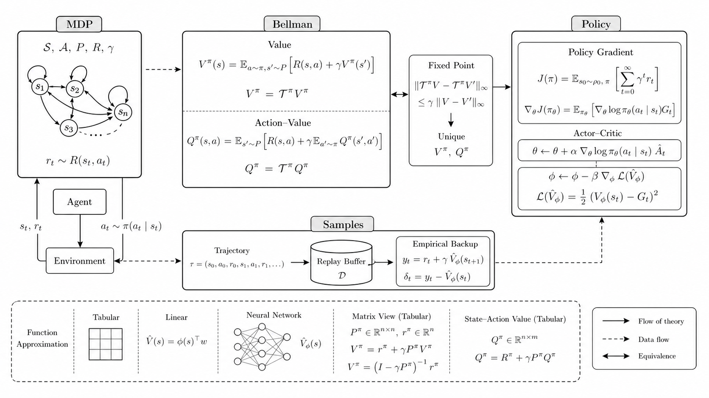

<small>图 0：用 imagegen 生成的论文风格总览图。它只承担路线图作用，关键公式和推导均在正文中给出。</small>

---

## 导入案例：让机器人学会穿过一个 3×3 网格

在进入 Bellman 方程之前，我们先完整走一遍贯穿全文的 grid world。后文出现的 state、action、policy、reward、trajectory、return 和 MDP，都从这个例子自然长出来。

### 这个任务到底要机器人做什么

环境是一个 3×3 网格，共有 9 个格子。机器人从左上角 \(s_1\) 出发，目标格是右下角 \(s_9\)。\(s_6\) 和 \(s_7\) 是禁区，但禁区不是墙：机器人仍然可以进入，只是会受到惩罚。

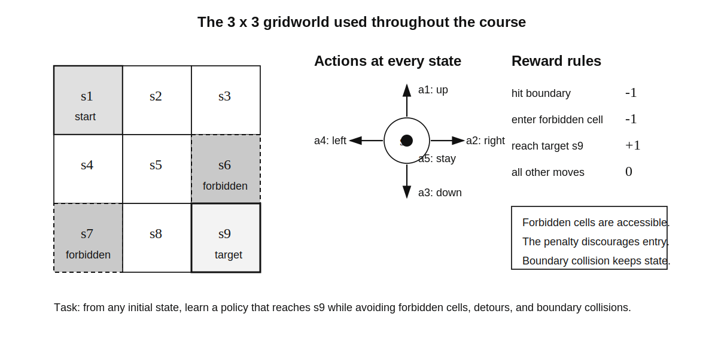

<small>图 0-1：3×3 grid world。禁区可进入但有负奖励；机器人还可能撞击边界并停留在原状态。</small>

我们希望机器人学到一套“好”的行动规则：无论从哪个初始格子出发，都能到达目标，同时尽量避免禁区、无意义绕路和边界碰撞。

如果机器人提前知道整张地图，这只是一个普通规划问题。真正的强化学习问题是：机器人一开始可能不知道地图，也不知道每个动作的后果，只能通过和环境反复交互、观察奖励，逐渐找到好的行动方式。

### 状态：机器人现在在哪里

机器人在一个时刻只能占据一个格子，因此最自然的状态就是它的位置：

\[
\mathcal{S}=\{s_1,s_2,\ldots,s_9\}.
\]

状态不是现实世界的完整描述，而是做当前决策所需的信息。在这个简单环境中，位置足够；在机器人控制中，状态可能还包含速度、姿态和传感器读数；在语言模型 RL 中，状态可能是当前上下文。

### 动作：机器人现在可以做什么

每个状态有 5 个可选动作：

\[
\mathcal{A}=\{a_1,a_2,a_3,a_4,a_5\},
\]

分别表示向上、向右、向下、向左和原地不动。

边界动作仍然允许选择。例如机器人在 \(s_1\) 选择向上，不能离开网格，于是被边界“弹回”：

\[
s_1\xrightarrow{a_1}s_1.
\]

在 \(s_1\) 选择向右，则进入 \(s_2\)：

\[
s_1\xrightarrow{a_2}s_2.
\]

在 \(s_5\) 选择向右会进入禁区 \(s_6\)：

\[
s_5\xrightarrow{a_2}s_6.
\]

这个过程叫作 state transition。禁区仍然可以进入，因此机器人必须通过奖励学习“不要进去”，而不是由环境直接禁止所有错误动作。

如果转移完全确定，可以把每个状态动作对的下一状态写成表格。如果环境中有风，机器人选择向右后也可能被吹向别处，就要用概率描述：

\[
p(s'|s,a).
\]

它读作：“当前在 \(s\) 执行动作 \(a\) 后，下一状态是 \(s'\) 的概率。”

### 策略：机器人在每个状态如何选动作

仅仅定义动作还不够，机器人需要一套覆盖所有状态的行动规则，这就是 policy。

确定性策略会在每个状态指定唯一动作。例如

\[
\pi(a_2|s_1)=1
\]

表示机器人在 \(s_1\) 一定向右，其他动作概率为 0。

策略也可以是随机的。例如

\[
\pi(a_2|s_1)=0.5,
\qquad
\pi(a_3|s_1)=0.5
\]

表示在 \(s_1\) 有一半概率向右、一半概率向下。

这里要区分两种概率：

- \(p(s'|s,a)\) 是环境的转移规律，描述世界如何响应动作。
- \(\pi(a|s)\) 是机器人的策略，描述机器人如何选择动作。

强化学习要优化的是 \(\pi\)，不是 \(p\)。

### 奖励：环境怎样告诉机器人什么行为更好

奖励规则是：

- 尝试越过边界：\(r_{\text{boundary}}=-1\)；
- 尝试进入禁区：\(r_{\text{forbidden}}=-1\)；
- 到达目标 \(s_9\)：\(r_{\text{target}}=+1\)；
- 其他普通移动：\(r_{\text{other}}=0\)。

奖励是执行一个动作后立刻得到的反馈。它更像机器和任务设计者之间的接口：设计者不直接告诉机器人完整路径，而是通过奖励鼓励到达目标、惩罚危险或无效行为。

但机器人不能只选择即时奖励最大的动作。普通移动大多得到 0，看起来没有区别；某一步即使得到 0，也可能把机器人带到离目标更近的位置。强化学习必须考虑动作对未来的长期影响。

### 一条策略会生成一条 trajectory

从 \(s_1\) 出发，假设策略依次选择右、下、下、右，机器人得到：

\[
s_1
\xrightarrow[\ r=0\ ]{a_2}
s_2
\xrightarrow[\ r=0\ ]{a_3}
s_5
\xrightarrow[\ r=0\ ]{a_3}
s_8
\xrightarrow[\ r=1\ ]{a_2}
s_9.
\]

状态、动作和奖励连成的序列叫 trajectory。对这条有限轨迹，把奖励相加得到 return：

\[
G=0+0+0+1=1.
\]

另一套策略先向下，再经过禁区 \(s_7\)：

\[
s_1
\xrightarrow[\ r=0\ ]{a_3}
s_4
\xrightarrow[\ r=-1\ ]{a_3}
s_7
\xrightarrow[\ r=0\ ]{a_2}
s_8
\xrightarrow[\ r=1\ ]{a_2}
s_9,
\]

它的 return 是

\[
G=0-1+0+1=0.
\]

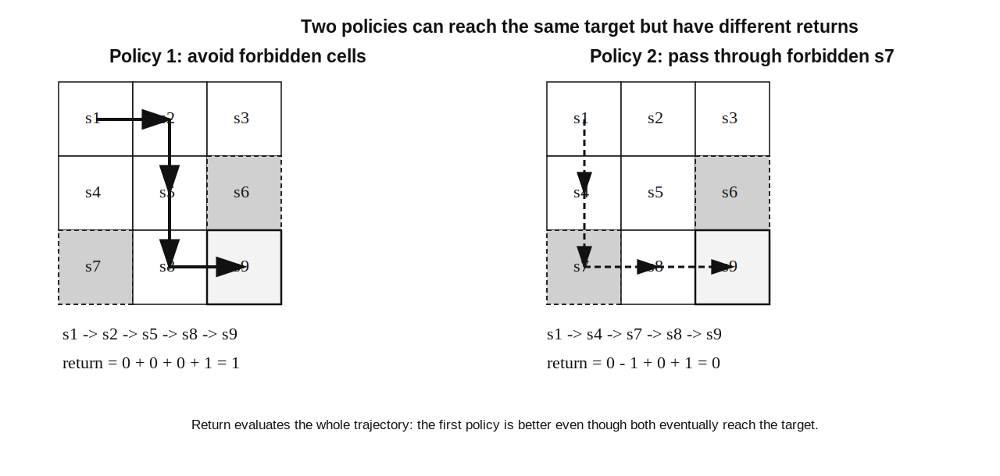

<small>图 0-2：两条策略都能到达目标，但第一条避开禁区，因此 return 更高。return 开始把“好策略”从直觉变成可比较的数值。</small>

这个比较揭示了强化学习最核心的评价原则：**策略的好坏不能只看一个动作的即时奖励，而要看它导致的整条未来轨迹。**

### 为什么还需要 discounted return

机器人到达 \(s_9\) 后不必立即停止。它可以在 \(s_9\) 选择原地不动，并不断获得 \(+1\)：

\[
s_9\xrightarrow[\ r=1\ ]{a_5}s_9
\xrightarrow[\ r=1\ ]{a_5}s_9\cdots
\]

直接累加会得到

\[
1+1+1+\cdots=\infty.
\]

因此对无限长 trajectory，引入折扣因子 \(\gamma\in(0,1)\)：

\[
G_t
=
R_{t+1}
+\gamma R_{t+2}
+\gamma^2R_{t+3}
+\cdots.
\]

折扣一方面使无限和有限，另一方面表达对远期奖励的重视程度。较小的 \(\gamma\) 更重视近期，较大的 \(\gamma\) 更重视长期。

如果交互在终止状态结束，完整的有限 trajectory 叫 episode，这类任务叫 episodic task；如果交互没有终点，就叫 continuing task。折扣 return 可以用同一套数学语言处理二者。

### 到这里，强化学习过程已经完整出现

机器人在状态 \(S_t\) 下按照策略 \(\pi\) 选择动作 \(A_t\)，环境根据转移规律产生奖励 \(R_{t+1}\) 和下一状态 \(S_{t+1}\)。反复交互得到 trajectory，trajectory 的 return 用来评价策略。

把这些元素放在一起，就是 Markov Decision Process：

\[
\mathcal{M}
=
(\mathcal{S},\mathcal{A},p,r,\gamma).
\]

Markov 性质的直觉是：只要当前状态已经包含决策所需的信息，预测下一状态和奖励就不必再回看完整历史。

这个例子还没有解决学习问题。我们仍然不知道：

1. 随机策略或随机环境会产生很多不同 trajectory，怎样用一个稳定数值评价状态？
2. 怎样避免枚举无限多条未来轨迹？
3. 环境模型已知和未知时，算法分别怎样工作？

后文的 value、Bellman equation、Monte Carlo 和 TD，正是依次回答这些问题。

---

## 从案例到全文主线

这篇文章不是把 RL 算法按名字排列，而是在连续回答六个问题：

1. 如何描述一个会持续产生后果的决策问题？
2. 如何判断一个策略到底好不好？
3. 如果知道环境模型，怎样求最优策略？
4. 如果不知道模型，怎样从交互数据中学习？
5. 如果状态空间太大，怎样从表格扩展到函数和神经网络？
6. 如果不想通过 value 间接得到策略，怎样直接优化策略？

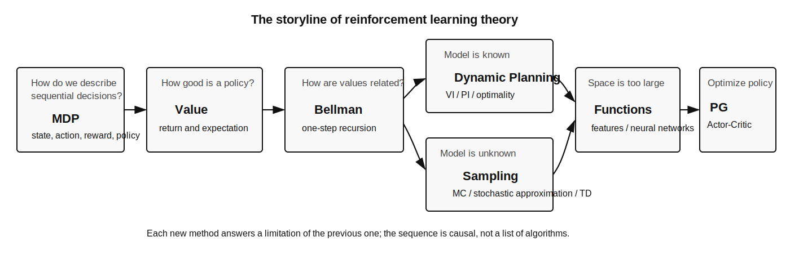

<small>图 0-3：全文故事线。后一个方法不是凭空出现，而是在解决前一个方法暴露出的限制。</small>

第一次阅读时，不必记住所有推导。先确认公式在 grid world 中回答什么问题，再看它如何计算。例如看到

\[
v_\pi(s)=\mathbb{E}_\pi[G_t|S_t=s]
\]

先读成一句话：“从状态 \(s\) 出发，遵循策略 \(\pi\) 时，未来回报的平均值。”只有在这句话清楚以后，公式才有意义。

---

## 可选速查：术语与数学工具

下面内容不要求在继续阅读前一次看完。正文第一次使用重要概念时仍会解释；遇到不熟悉的术语或数学符号时，再回到这里查阅即可。

<details>
<summary>展开术语、概率、矩阵、固定点、梯度与常用符号</summary>

### 强化学习术语

下面这些词会贯穿全文。它们不是彼此独立的定义，而是同一个交互过程的不同部分。

| 术语 | 含义 | 在 grid world 中的例子 |
|---|---|---|
| Agent | 做决策的主体 | 在网格中移动的机器人 |
| Environment | 接收动作并产生下一状态、奖励的外部系统 | 网格地图及其移动规则 |
| State \(s\) | 足以描述当前决策处境的信息 | 机器人当前所在格子 |
| Action \(a\) | Agent 可选择的行为 | 上、下、左、右 |
| Reward \(r\) | 环境对一次转移给出的即时标量反馈 | 到目标 \(+1\)，进禁区 \(-1\) |
| Policy \(\pi\) | 从状态到动作分布的决策规则 | 在某格子以 80% 概率向右 |
| Trajectory | 状态、动作、奖励构成的一条交互序列 | \(s_0,a_0,r_1,s_1,\ldots\) |
| Episode | 从开始到终止的一条完整 trajectory | 从起点走到目标 |
| Return \(G_t\) | 从时间 \(t\) 开始的累计折扣奖励 | 一条路径的长期总收益 |
| Value | 对未来 return 的期望 | 从某格子出发平均能拿多少回报 |
| Model | 环境的转移和奖励规律 | 每个动作会走到哪里、得到什么奖励 |

最容易混淆的是 reward、return 和 value：

- Reward 是**一步**反馈。
- Return 是**一条实际轨迹**从当前开始的累计奖励。
- Value 是在策略和环境随机性下，对许多可能 return 的**期望**。

### 随机变量、概率与期望

随机变量不是“会随机变化的普通变量”，而是把随机结果映射为数值的函数。比如从同一个状态出发，策略可能随机选择不同动作，环境也可能随机转移，因此最终 return \(G_t\) 是随机变量。

若随机变量 \(X\) 可能取 \(x_1,\ldots,x_n\)，对应概率为 \(p_1,\ldots,p_n\)，期望为

\[
\mathbb{E}[X]
=
\sum_i p_i x_i.
\]

期望不是某一次必然得到的结果，而是重复试验后的长期平均。例如动作“向右”有 80% 概率到达目标并得到 1，20% 概率滑入禁区并得到 \(-1\)，则即时奖励的期望是

\[
0.8\times 1+0.2\times(-1)=0.6.
\]

这说明“多数时候成功”不等于“期望收益为正”。

### 条件概率与条件期望

条件概率表示在已知某件事发生后，另一件事发生的概率：

\[
\Pr(S_{t+1}=s'|S_t=s,A_t=a).
\]

它读作：“已经知道当前状态是 \(s\)、动作是 \(a\) 时，下一状态为 \(s'\) 的概率。”

条件期望同理：

\[
\mathbb{E}[G_t|S_t=s].
\]

它不是对所有轨迹平均，而是只对“从状态 \(s\) 出发”的轨迹平均。state value 的定义就是一个条件期望。

### 向量与矩阵

当状态空间有限时，可以把每个状态的 value 排成向量：

\[
v_\pi=
\begin{bmatrix}
v_\pi(s_1)\\
v_\pi(s_2)\\
\vdots\\
v_\pi(s_n)
\end{bmatrix}.
\]

转移矩阵 \(P_\pi\) 的第 \(i,j\) 个元素表示：遵循策略 \(\pi\) 时，从状态 \(s_i\) 转移到 \(s_j\) 的概率。于是

\[
P_\pi v_\pi
\]

可以理解为“对下一状态 value 做概率加权平均”。因此矩阵 Bellman 方程

\[
v_\pi=r_\pi+\gamma P_\pi v_\pi
\]

只是把所有状态的逐元素 Bellman 方程一次写完。

### 固定点与压缩映射

如果一个函数 \(f\) 满足

\[
x=f(x),
\]

那么 \(x\) 称为 \(f\) 的固定点。Bellman 方程就是固定点方程：

\[
v_\pi=\mathcal{T}_\pi v_\pi.
\]

压缩映射可以直觉地理解为：任意两个输入经过映射后，距离会变小。如果

\[
\|f(x)-f(y)\|\le\gamma\|x-y\|,
\qquad 0\le\gamma<1,
\]

那么反复应用 \(f\) 会把不同初始猜测拉向同一个固定点。这是 value iteration 能收敛的核心原因。第一次阅读只需掌握这个直觉，不必先学习完整实分析证明。

### 导数、梯度与梯度下降

导数描述一个标量输入变化时，函数变化有多快。梯度把这个概念推广到参数向量：

\[
\nabla_\theta J(\theta).
\]

梯度指向 \(J\) 增长最快的方向。因此最大化目标时使用梯度上升：

\[
\theta\leftarrow\theta+\alpha\nabla_\theta J(\theta),
\]

最小化 loss 时使用梯度下降：

\[
\theta\leftarrow\theta-\alpha\nabla_\theta J(\theta).
\]

\(\alpha\) 是学习率，控制每次更新走多远。

### Bootstrap、on-policy 与 off-policy

Bootstrap 指更新 target 时使用当前估计。例如 TD target：

\[
r+\gamma v(s')
\]

包含尚未完全准确的 \(v(s')\)，因此它是 bootstrap。Monte Carlo 使用完整真实 return，不依赖当前 value estimate，因此不是 bootstrap。

On-policy 表示“产生数据的策略”和“正在学习的策略”相同。Off-policy 表示可以用一个 behavior policy 产生的数据，学习另一个 target policy。Sarsa 通常是 on-policy，Q-learning 是经典 off-policy 方法。

### 常用符号与运算

| 符号 | 含义 |
|---|---|
| \(t\) | 环境交互的时间步 |
| \(k\) | 算法迭代轮数或样本编号，具体看上下文 |
| \(\pi\) | 策略 |
| \(\gamma\) | 折扣因子 |
| \(\alpha\) | 学习率 |
| \(\mathbb{E}[X]\) | 随机变量 \(X\) 的期望 |
| \(\max_a f(a)\) | \(f(a)\) 在所有动作中的最大数值 |
| \(\arg\max_a f(a)\) | 让 \(f(a)\) 最大的动作 \(a\) |
| \(\|x\|\) | 向量大小或两个估计之间的距离 |
| \(\nabla_\theta J\) | \(J\) 对参数 \(\theta\) 的梯度 |

\(\max\) 返回的是“最大值”，\(\arg\max\) 返回的是“取得最大值的动作”。例如

\[
\max_a q(s,a)=10
\]

表示最佳动作的 value 是 10，而

\[
\arg\max_a q(s,a)=\text{right}
\]

表示最佳动作是向右。

### 学习算法中的常用概念

**Estimate** 是算法当前的近似值。例如 \(v_t(s)\) 是第 \(t\) 步对真实 \(v_\pi(s)\) 的估计。

**Target** 是本次更新希望 estimate 靠近的值。例如 TD target 是

\[
r_{t+1}+\gamma v_t(s_{t+1}).
\]

**Error** 是 target 与当前 estimate 的差。算法通常沿着减小 error 的方向更新。

**Objective function / loss** 是对整体误差的量化。训练神经网络时，算法通常不能直接说“让策略变好”，而要先把目标写成一个可优化的标量函数。

**Bias** 是估计长期、系统性地偏离真实值；**variance** 是估计对不同随机样本非常敏感、波动很大。Monte Carlo 通常偏差较小但方差大，TD 因 bootstrap 引入偏差，却可能降低方差。

**Convergence** 表示随着迭代继续，估计逐渐接近一个稳定值。稳定不一定代表正确，因此理论分析还要证明稳定点正是目标方程的解。

**State distribution** 表示训练数据中不同状态出现的权重。Policy gradient 中的 \(\eta(s)\)、函数近似目标中的状态采样分布，都会影响算法究竟更关注哪些状态。

### 同一条轨迹在不同方法中扮演什么角色

假设机器人在图 0-2 中经历了一条三步轨迹：

\[
s_0
\xrightarrow{a_0,0}
s_1
\xrightarrow{a_1,0}
s_2
\xrightarrow{a_2,+1}
G.
\]

当 \(\gamma=0.9\) 时，从起点观察到的 return 是

\[
G_0
=0+0.9(0)+0.9^2(1)
=0.81.
\]

不同方法会以不同方式使用同一条数据：

| 方法 | 怎样看这条轨迹 |
|---|---|
| Bellman / DP | 如果模型已知，不必真的走这条轨迹，而是对所有可能下一状态求期望 |
| Monte Carlo | episode 结束后，把 \(G_0=0.81\) 当作 \(v_\pi(s_0)\) 的一个样本 |
| TD | 走完第一步就用 \(0+\gamma v(s_1)\) 更新 \(v(s_0)\) |
| Sarsa | 使用 \((s_0,a_0,0,s_1,a_1)\) 更新当前策略的 action value |
| Q-learning | 使用 \(0+\gamma\max_a q(s_1,a)\) 更新 \(q(s_0,a_0)\) |
| Policy gradient | 用 return 或 advantage 作为权重，调整动作 \(a_0\) 的概率 |
| Actor-Critic | Critic 用 TD error 评价这一步，Actor 立即更新策略 |

这张表就是全文的缩略图。后面的算法不是换了一批完全不同的数据，而是在改变“怎样从同一批交互数据中构造学习信号”。

</details>

---

## 目录

- 导入案例：3×3 grid world
- 第 1 节：从 grid world 抽象到 MDP
- 第 2 节：从单条 return 到 state value 与 action value
- 第 3 节：Bellman 方程：策略评价的数学核心
- 第 4 节：Bellman 最优性方程：从评价到最优控制
- 第 5 节：Value Iteration、Policy Iteration 与 GPI
- 第 6 节：Monte Carlo：没有模型时如何估计 value
- 第 7 节：随机逼近：TD 为什么可以这样更新
- 第 8 节：Temporal-Difference：MC 与 DP 的中间点
- 第 9 节：函数近似与 Deep Q-learning
- 第 10 节：Policy Gradient：直接优化策略
- 第 11 节：Actor-Critic：策略梯度和价值学习的合流
- 第 12 节：PPO：给策略更新加一道护栏
- 第 13 节：从 PPO-based RLHF 到 DPO 与 GRPO
- 第 14 节：一张总表与学习路线

---

## 第 1 节：从 grid world 抽象到 MDP

导入案例已经给出了一个完整但具体的强化学习任务。现在要做的不是再讲一次网格，而是把它压缩成一套能迁移到其他任务的数学语言。

网格位置被抽象成状态，移动方向被抽象成动作，地图规则被抽象成转移概率，机器人行动规则被抽象成策略，任务偏好被抽象成奖励。这样一来，后面的算法不再依赖“机器人”和“格子”这些具体对象，而可以同样用于游戏、控制、推荐或语言模型。

形式化地，在时间步 \(t\)，智能体处于状态 \(S_t=s\)，根据策略选择动作 \(A_t=a\)，随后环境返回奖励 \(R_{t+1}\) 和下一状态 \(S_{t+1}=s'\)。策略可以是确定性的，也可以是随机性的：

\[
\pi(a|s)=\Pr(A_t=a|S_t=s).
\]

如果环境满足 Markov 性质，下一步只依赖当前状态和动作，而不依赖更早的历史：

\[
\Pr(S_{t+1}=s',R_{t+1}=r|S_0,A_0,\ldots,S_t=s,A_t=a)
=p(s',r|s,a).
\]

于是一个强化学习问题可以被描述为 Markov Decision Process：

\[
\mathcal{M}=(\mathcal{S},\mathcal{A},p,r,\gamma),
\]

其中 \(\mathcal{S}\) 是状态空间，\(\mathcal{A}\) 是动作空间，\(p\) 是状态转移和奖励模型，\(r\) 是奖励，\(\gamma\in[0,1)\) 是折扣因子。

这个五元组可以按“智能体能选什么、世界会发生什么、怎样评价结果”来记：

- \(\mathcal{S}\)：智能体可能处于哪些情况。
- \(\mathcal{A}\)：智能体能做哪些选择。
- \(p\)：选择动作后，世界如何随机变化。
- \(r\)：世界如何立即评价这次变化。
- \(\gamma\)：未来奖励在当前看来有多重要。

折扣因子的作用有两层。第一，它表达“越近的奖励越重要”；第二，它让无限时域的累计回报在数学上更容易收敛。若 \(\gamma\) 越接近 1，智能体越看重长期结果；若 \(\gamma\) 越接近 0，智能体越短视。

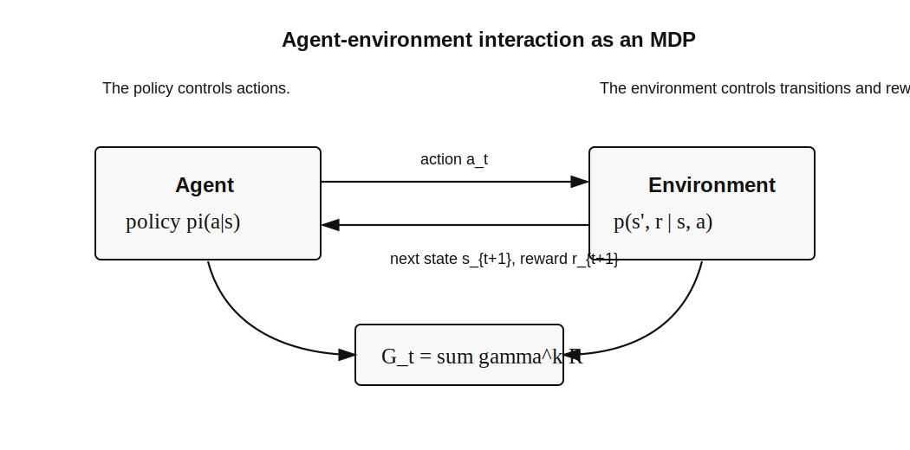

<small>图 1：MDP 把强化学习的交互写成闭环。策略决定动作，环境决定转移和奖励，return 把未来奖励汇总成优化目标。</small>

这里还有一个容易被忽略的点：**环境模型和策略是两种完全不同的概率分布**。环境模型 \(p(s',r|s,a)\) 描述世界怎么回应动作，通常不由智能体控制；策略 \(\pi(a|s)\) 描述智能体如何选择动作，是学习算法要优化的对象。后文的 model-based 和 model-free 区别，也正是围绕环境模型是否已知展开。

在 grid world 中，如果机器人知道完整地图、知道每个动作会走到哪里、知道撞墙和进入禁区的奖励，那么它拥有模型，可以用动态规划。若它一开始不知道这些规则，只能不断试错，从经验中发现哪些格子安全、哪些动作收益高，那么它就需要 model-free 学习。

到这里，我们只完成了“描述问题”。MDP 告诉我们状态、动作和转移是什么，却还没有告诉我们怎样比较两个策略。下一节需要为“长期好坏”定义一个数值尺度。

---

## 第 2 节：从单条 return 到 state value 与 action value

导入案例中，我们用 return 比较了两条确定性轨迹。现在把它写成适用于任意时间步、任意长度 trajectory 的形式。给定一条轨迹，从时间 \(t\) 开始的折扣回报定义为

\[
G_t=R_{t+1}+\gamma R_{t+2}+\gamma^2R_{t+3}+\cdots
=\sum_{k=0}^{\infty}\gamma^kR_{t+k+1}.
\]

逐项阅读这个式子：

- \(R_{t+1}\) 是执行当前动作后立刻得到的奖励。
- \(R_{t+2}\) 是再过一步得到的奖励，因此乘一次 \(\gamma\)。
- 越远的奖励乘越高次幂的 \(\gamma\)。
- \(G_t\) 是一条实际轨迹上的数值，不是期望。

这个定义直接回答了“什么叫长期好”。如果一个策略使得从某状态出发的 \(G_t\) 更大，它就更好。但在随机环境或随机策略下，同一个状态可能产生许多不同轨迹，单条轨迹的 return 不能稳定评价策略。因此需要取期望。

导入案例中的两条策略分别得到 return 1 和 0，因此在确定性环境里，我们已经能比较它们。但如果策略在 \(s_1\) 随机选择向右或向下，或者环境中的风会随机改变下一状态，从同一个状态出发就可能得到不同 trajectory 和不同 return。

这时不能拿某一次偶然 return 评价策略，而要比较大量可能结果的平均表现。这个“平均”在数学上就是期望，也由此引出 state value。

状态价值函数定义为：

\[
v_\pi(s)=\mathbb{E}_\pi[G_t|S_t=s].
\]

它表示：从状态 \(s\) 出发，并一直遵循策略 \(\pi\)，期望能得到多少长期回报。

下标 \(\pi\) 表示 value 依赖策略。同一个状态没有脱离策略的固定价值：如果策略总是走向目标，它的 value 高；如果策略总是撞墙，同一状态的 value 就低。

动作价值函数定义为：

\[
q_\pi(s,a)=\mathbb{E}_\pi[G_t|S_t=s,A_t=a].
\]

它表示：在状态 \(s\) 先执行动作 \(a\)，之后再遵循策略 \(\pi\)，期望能得到多少长期回报。

条件 \(A_t=a\) 只固定第一步动作。执行完这一步后，后续动作仍由 \(\pi\) 决定。因此 \(q_\pi(s,a)\) 不是“动作 \(a\) 自身的固定分数”，而是“先做 \(a\)，以后按 \(\pi\) 行动”的长期结果。

两者的关系很直接。状态价值是在当前策略下对动作价值的加权平均：

\[
v_\pi(s)
=\sum_{a\in\mathcal{A}}\pi(a|s)q_\pi(s,a).
\]

反过来，动作价值可以用一步奖励和下一状态价值表示：

\[
q_\pi(s,a)
=\sum_{r,s'}p(r,s'|s,a)\left[r+\gamma v_\pi(s')\right].
\]

这两个公式是后续所有 value-based 方法的地基。

state value 和 action value 的分工可以这样理解。\(v_\pi(s)\) 适合回答“这个位置总体上好不好”；\(q_\pi(s,a)\) 适合回答“在这个位置采取这个动作好不好”。如果只是评价一个固定策略，state value 已经够用；如果要改进策略，就必须比较同一状态下不同动作的好坏，因此 action value 更直接。

action value 需要借助 state value 理解：先执行动作 \(a\)，获得即时奖励并进入下一状态，然后未来的好坏由下一状态的 \(v_\pi(s')\) 承担。这种“当前动作 + 下一状态价值”的拆分，正是 Bellman 思想的雏形。

这一节定义了 value，但还留下一个最关键的问题：value 是对无数未来轨迹取期望，难道必须真的枚举所有轨迹才能算出来吗？Bellman 方程给出了否定答案。

---

## 第 3 节：Bellman 方程：策略评价的数学核心

如果只记一个 RL 公式，应该记 Bellman 方程。它的作用不是又定义了一个新量，而是揭示 value 的内部结构：一个状态的价值，可以被拆成“一步之后发生什么”和“之后继续遵循同一个策略会怎样”。这让无限长的未来不再需要一次性展开，而可以通过递推关系求解。

Bellman 方程的推导从 return 的递推开始：

\[
\begin{aligned}
G_t
&=R_{t+1}+\gamma R_{t+2}+\gamma^2R_{t+3}+\cdots\\
&=R_{t+1}+\gamma(R_{t+2}+\gamma R_{t+3}+\cdots)\\
&=R_{t+1}+\gamma G_{t+1}.
\end{aligned}
\]

对给定状态 \(S_t=s\) 取条件期望：

\[
\begin{aligned}
v_\pi(s)
&=\mathbb{E}_\pi[G_t|S_t=s]\\
&=\mathbb{E}_\pi[R_{t+1}+\gamma G_{t+1}|S_t=s]\\
&=\mathbb{E}_\pi[R_{t+1}+\gamma v_\pi(S_{t+1})|S_t=s].
\end{aligned}
\]

展开策略和环境模型，得到 Bellman expectation equation：

\[
v_\pi(s)
=\sum_{a}\pi(a|s)\sum_{r,s'}p(r,s'|s,a)
\left[r+\gamma v_\pi(s')\right].
\]

这个式子从内向外读最容易：

1. 假设当前选择动作 \(a\)。
2. 环境可能产生不同的 \(r,s'\)，用 \(p(r,s'|s,a)\) 加权平均。
3. 每种结果的价值是即时奖励 \(r\) 加未来价值 \(\gamma v_\pi(s')\)。
4. 策略可能选择不同动作，再用 \(\pi(a|s)\) 对动作加权平均。

所以两层求和分别对应两种随机性：外层是策略选择动作的随机性，内层是环境转移的随机性。

这就是策略评价的核心：**一个状态的价值，等于当前一步的期望奖励，加上下一状态价值的折扣期望**。

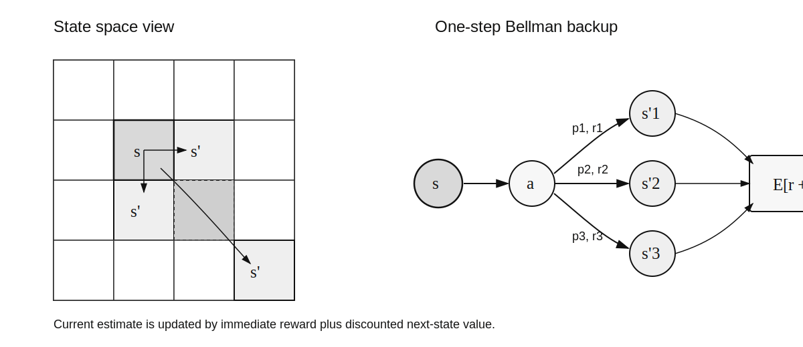

<small>图 2：Bellman backup 的信息流。当前状态 \(s\) 经过动作 \(a\) 分支到多个下一状态 \(s'\)，每条分支带有转移概率和即时奖励，最后汇总成 \(V(s)\)。</small>

图中的 backup 一词很形象：我们不是从起点一路模拟到无限远，而是把下一层状态的价值“备份”回当前状态。这个过程在动态规划里是显式求和，在 TD 里会变成用一个实际样本近似求和，在神经网络版本里会变成用 loss 让预测值靠近 backup target。

为了让这个方程不只是符号，可以看一个两状态例子。假设策略固定，状态 \(s_1\) 下一步一定得到奖励 0 并进入 \(s_2\)，状态 \(s_2\) 每一步得到奖励 1 并留在 \(s_2\)。则

\[
v_\pi(s_1)=0+\gamma v_\pi(s_2),
\]

\[
v_\pi(s_2)=1+\gamma v_\pi(s_2).
\]

第二个方程解得

\[
v_\pi(s_2)=\frac{1}{1-\gamma},
\]

代回第一个方程：

\[
v_\pi(s_1)=\frac{\gamma}{1-\gamma}.
\]

这就是 Bellman 方程的直观用法：不是枚举所有未来轨迹，而是把每个状态的价值看成未知数，写出状态之间的递推关系，然后求解。

在有限状态空间中，可以把所有状态的 Bellman 方程写成矩阵形式。定义

\[
r_\pi(s)=\sum_a\pi(a|s)\sum_r p(r|s,a)r,
\]

\[
P_\pi(s,s')=\sum_a\pi(a|s)p(s'|s,a).
\]

则

\[
v_\pi=r_\pi+\gamma P_\pi v_\pi.
\]

移项可得闭式解：

\[
v_\pi=(I-\gamma P_\pi)^{-1}r_\pi.
\]

这说明如果模型 \(P_\pi\) 和 \(r_\pi\) 已知，策略评价可以转化为线性方程组求解。现实中我们常常不显式求逆，而用迭代：

\[
v_{k+1}=r_\pi+\gamma P_\pi v_k.
\]

只要 \(\gamma<1\)，这个迭代会收敛到 \(v_\pi\)。这里已经埋下了动态规划和 TD 学习的共同结构：不断把当前估计推向 Bellman target。

策略评价在 RL 中非常基础，因为“改进策略”之前必须先知道当前策略哪里好、哪里坏。后续的 policy iteration、Monte Carlo control、Sarsa、actor-critic，本质上都包含某种形式的策略评价，只是评价方式从精确模型求解逐渐变成样本估计和函数近似。

普通 Bellman 方程只能评价一个已经给定的策略。RL 的目标还不是“知道当前策略多好”，而是“找到最好的策略”。因此下一节要把策略评价方程改造成最优性方程。

---

## 第 4 节：Bellman 最优性方程：从评价到最优控制

Bellman expectation equation 解决的是“给定策略 \(\pi\)，它有多好”。强化学习最终要解决的是“什么策略最好”。因此需要定义最优状态价值：

\[
v_*(s)=\max_\pi v_\pi(s).
\]

对应的最优动作价值是：

\[
q_*(s,a)=\max_\pi q_\pi(s,a).
\]

如果知道 \(q_*(s,a)\)，最优策略就很自然：

\[
\pi_*(s)\in\arg\max_a q_*(s,a).
\]

也就是说，在每个状态选择最优动作价值最大的动作即可。

从 grid world 角度看，策略改进非常朴素。假设当前策略在某个格子选择向右，但向右会进入禁区；通过 Bellman 方程评估后，我们发现“向下”对应的 action value 更高。那么只要把这个状态下的动作从向右改成向下，策略就会变好。Bellman optimality equation 把这种局部贪心改进推广到所有状态，并将它与全局最优价值联系起来。

这里的关键不是“贪心总是对的”。如果随便拿一个短视指标贪心，当然可能错。但 Bellman 最优性方程中的贪心不是对即时奖励贪心，而是对

\[
r+\gamma v_*(s')
\]

贪心。这个量已经把未来最优价值包含进来了。因此它是“一步前瞻 + 未来最优”的贪心。

现在把这个思想写成方程。对任意状态 \(s\)，最优价值应该满足：

\[
v_*(s)
=\max_a \sum_{r,s'}p(r,s'|s,a)
\left[r+\gamma v_*(s')\right].
\]

和普通 Bellman 方程相比，唯一但决定性的变化是：动作不再按照当前策略求平均，而是取最大值。环境转移仍然要按概率求平均，因为智能体可以选择动作，却不能选择随机环境最终落到哪个下一状态。

这就是 Bellman optimality equation，简称 BOE。它和普通 Bellman 方程的区别是：普通 Bellman 方程对动作按策略 \(\pi(a|s)\) 加权平均，BOE 对动作取最大值。

普通 Bellman 方程：

\[
v_\pi(s)
=\sum_a\pi(a|s)\sum_{r,s'}p(r,s'|s,a)
\left[r+\gamma v_\pi(s')\right].
\]

Bellman 最优性方程：

\[
v_*(s)
=\max_a\sum_{r,s'}p(r,s'|s,a)
\left[r+\gamma v_*(s')\right].
\]

在矩阵和算子形式下，BOE 可以写成：

\[
v=f(v)=\max_{\pi\in\Pi}(r_\pi+\gamma P_\pi v),
\]

其中最大化是逐状态进行的。这个方程是非线性的，因为包含 \(\max\)。但它有一个非常重要的性质：当 \(\gamma<1\) 时，Bellman optimality operator 是压缩映射：

\[
\|f(u)-f(v)\|_\infty\le \gamma\|u-v\|_\infty.
\]

压缩映射定理告诉我们，它有唯一不动点，而且反复迭代

\[
v_{k+1}=f(v_k)
\]

会收敛到这个不动点。这个不动点就是 \(v_*\)。这就是 value iteration 的理论来源。

这一节容易抽象，换成算法语言就是：先随便猜一个价值表；然后在每个状态，用当前价值表估算“每个动作的一步后果”；选择最好的动作，把当前状态价值改成这个动作对应的值；重复很多次。只要折扣因子小于 1，Bellman operator 会不断缩小估计之间的差距，最终收敛到唯一的最优价值。

奖励设置和 \(\gamma\) 会直接影响最优策略。如果禁区惩罚不够大，最优策略可能穿过禁区；如果 \(\gamma\) 小，智能体可能更关心近处奖励；如果每走一步都有惩罚，智能体会偏好短路径。这一点在实际 RL 系统中非常重要，因为很多“学坏了”的策略并不是算法错了，而是 reward 和约束没有表达真实目标。

BOE 给出了最优 value 必须满足的方程，但方程本身还不是算法。下一节要把固定点和策略改进思想变成可执行的 value iteration 与 policy iteration。

---

## 第 5 节：Value Iteration、Policy Iteration 与 GPI

有了 BOE，就可以在有模型的情况下通过动态规划求最优策略，代表方法包括 value iteration、policy iteration 和 truncated policy iteration。

### 5.1 Value Iteration

Value iteration 直接迭代 BOE：

\[
v_{k+1}=\max_{\pi\in\Pi}(r_\pi+\gamma P_\pi v_k).
\]

逐状态写成：

\[
v_{k+1}(s)=\max_a\sum_{r,s'}p(r,s'|s,a)
\left[r+\gamma v_k(s')\right].
\]

这里的 \(k\) 不是环境时间步，而是算法迭代轮数。\(v_k\) 是第 \(k\) 轮的价值猜测，右侧用它构造一步 lookahead，得到下一轮猜测 \(v_{k+1}\)。

每次迭代隐含两件事：

1. 用当前 \(v_k\) 计算每个动作的一步前瞻价值。
2. 选择最大动作并更新 \(v_{k+1}\)。

当 \(v_k\) 收敛后，根据

\[
\pi_*(s)\in\arg\max_a\sum_{r,s'}p(r,s'|s,a)
\left[r+\gamma v_*(s')\right]
\]

即可得到最优策略。

Value iteration 的特点是“评价很浅，改进很频繁”。每一轮只用当前 \(v_k\) 做一步 lookahead，并不完整评估某个固定策略。但由于它直接使用 BOE 的最优 backup，每次都把价值估计往最优不动点推。

如果用伪代码表达，它是：

```text
初始化 v(s)
重复：
  对每个状态 s：
    对每个动作 a：
      计算 sum_{r,s'} p(r,s'|s,a)[r + gamma v(s')]
    取最大动作对应的值，更新 v(s)
收敛后：
  对每个状态选择使上式最大的动作
```

它适合模型已知、状态动作空间不太大的情况。缺点也很明显：每次更新都要枚举动作、奖励和下一状态。如果环境模型未知，或者状态空间巨大，就不能直接这样做。

### 5.2 Policy Iteration

Policy iteration 则显式区分两个步骤。

第一步是策略评价：

\[
v_{\pi_k}=r_{\pi_k}+\gamma P_{\pi_k}v_{\pi_k}.
\]

第二步是策略改进：

\[
\pi_{k+1}
=\arg\max_{\pi}(r_\pi+\gamma P_\pi v_{\pi_k}).
\]

逐状态看，策略改进就是：

\[
\pi_{k+1}(s)\in
\arg\max_a \sum_{r,s'}p(r,s'|s,a)
\left[r+\gamma v_{\pi_k}(s')\right].
\]

这其实就是“先评估当前策略，再贪心地让策略变好”。

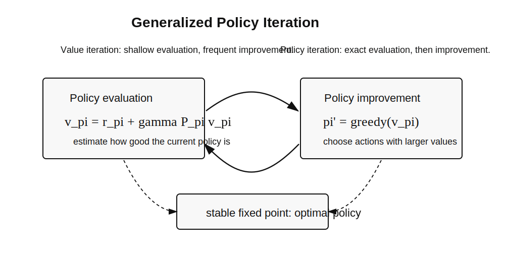

<small>图 3：Generalized Policy Iteration。许多 RL 算法都可以看成 value estimate 和 policy improvement 的相互追赶。</small>

Policy iteration 的特点是“评价很深，改进较少”。它先尽可能准确地知道当前策略 \( \pi_k \) 的价值，再基于这个价值做一次贪心改进。理论上，策略改进定理保证新策略不会比旧策略差：

\[
v_{\pi_{k+1}}(s)\ge v_{\pi_k}(s),\quad \forall s.
\]

这也是为什么 policy iteration 很有启发性。它把“学习一个好策略”拆成两个更容易理解的问题：如何评价一个策略，如何基于评价改进它。后面的 MC control 和 Sarsa control 都是在没有模型的情况下复刻这两个步骤。

### 5.3 Truncated Policy Iteration

Value iteration 和 policy iteration 的差别可以理解为“策略评价做多深”。

Policy iteration 每轮几乎完整求解 \(v_{\pi_k}\)，评价很充分，但每轮代价较大。Value iteration 每轮只做一步浅评价，随后立刻改进策略，每轮便宜但可能需要更多轮。Truncated policy iteration 介于两者之间：每轮只做有限次策略评价，再做策略改进。

这引出一个贯穿全书的视角：**强化学习算法大多可以看成 generalized policy iteration**。value 和 policy 不断互相校正，直到抵达稳定点。

GPI 也是连接理论和工程的桥。真实系统中，我们很少把某个阶段做到数学上完全精确。比如 actor-critic 中，critic 的 value 估计还没完全收敛，actor 就已经在更新策略；DQN 中，Q 网络也只是近似满足 Bellman optimality target。尽管如此，只要两个过程互相推动而不是互相破坏，系统仍可能朝更好的策略前进。

到这里的所有方法都依赖环境模型：算法需要知道每个动作可能到达哪些下一状态以及对应概率。现实中这个条件通常不成立。下一节开始，文章从“根据模型计算”转向“根据交互数据估计”。

---

## 第 6 节：Monte Carlo：没有模型时如何估计 value

动态规划需要模型，也就是 \(p(r,s'|s,a)\)。但很多问题中，智能体不知道环境模型，只能通过交互得到样本。Monte Carlo 是最直接的 model-free 起点。

这里的逻辑转折非常重要：**如果没有模型，就必须有数据；如果既没有模型也没有数据，就什么也学不了**。Monte Carlo 是最直接的数据使用方式。它不试图估计转移概率，也不求解 Bellman 方程，而是把每次 episode 的实际 return 当作 value 的样本。

核心思想来自均值估计。若 \(X\) 是随机变量，期望为 \(\mathbb{E}[X]\)，没有分布模型时可以用样本平均估计：

\[
\mathbb{E}[X]\approx \frac{1}{n}\sum_{i=1}^n x_i.
\]

这和掷硬币估计均值完全同构。只不过硬币样本是 \(x_i\)，RL 中的样本是从某个状态或状态动作对出发得到的整条 return。样本越多，平均 return 越接近真实期望。区别在于，RL 的样本不是独立从固定分布中轻松抽取的，而是由当前策略和环境交互产生的，因此探索问题会立刻出现。

状态价值和动作价值本质上也是 return 的期望：

\[
v_\pi(s)=\mathbb{E}_\pi[G_t|S_t=s],
\]

\[
q_\pi(s,a)=\mathbb{E}_\pi[G_t|S_t=s,A_t=a].
\]

所以，如果我们能收集很多从 \((s,a)\) 开始的 episode，就可以用这些 episode 的平均 return 来估计 \(q_\pi(s,a)\)：

\[
q_\pi(s,a)\approx
\frac{1}{N(s,a)}
\sum_{i=1}^{N(s,a)}G^{(i)}(s,a).
\]

\(G^{(i)}(s,a)\) 表示第 \(i\) 条从 \((s,a)\) 开始或访问 \((s,a)\) 的轨迹 return，\(N(s,a)\) 是样本数量。这个估计没有使用转移概率，只依赖真实采样结果。

### 6.1 MC Basic

MC Basic 可以看成 model-free 版本的 policy iteration。

策略评价不再解 Bellman 方程，而是采样很多 episode，用平均 return 估计 action value：

\[
q_{\pi_k}(s,a)\approx q_k(s,a).
\]

策略改进仍然是 greedy：

\[
\pi_{k+1}(s)\in\arg\max_a q_k(s,a).
\]

这一步和有模型的 policy iteration 完全同构，只是 value 的来源从“模型计算”变成了“样本平均”。

MC Basic 适合理解思想，但它的采样方式很笨：为了估计每个 \((s,a)\)，它要求从这个 pair 出发收集足够多 episode。这在 grid world 里可以人为指定起点，在真实机器人、游戏或在线推荐系统中却很难做到。比如真实机器人不能随时被传送到任意状态，推荐系统也不能随意把用户置于某个历史状态。

因此 MC 方法后续的改进重点不是公式，而是如何让样本采集更现实、更高效。

### 6.2 MC Exploring Starts

MC Basic 的问题是样本使用不够高效。MC Exploring Starts 改进了这一点：每个 episode 从某个 \((s_0,a_0)\) 开始，要求所有 state-action pair 都有机会被选为起点。对一个 episode

\[
s_0,a_0,r_1,\ldots,s_{T-1},a_{T-1},r_T,
\]

从后往前计算 return：

\[
G_t=r_{t+1}+\gamma G_{t+1}.
\]

然后累加：

\[
\text{Returns}(s_t,a_t)
\leftarrow
\text{Returns}(s_t,a_t)+G_t,
\]

\[
\text{Num}(s_t,a_t)
\leftarrow
\text{Num}(s_t,a_t)+1,
\]

\[
q(s_t,a_t)
\leftarrow
\frac{\text{Returns}(s_t,a_t)}
{\text{Num}(s_t,a_t)}.
\]

最后对当前状态做贪心策略改进。

“倒序计算”是 MC Exploring Starts 的一个小技巧，但很关键。episode 结束时 \(G_T=0\)，从最后一步往前递推：

\[
G_t=r_{t+1}+\gamma G_{t+1}.
\]

这样一条 episode 可以同时更新多个访问过的 state-action pair。相比每次只为一个起点服务，这显著提高了样本利用率。

不过 exploring starts 仍然要求每个 \((s,a)\) 都能作为起点被采到。这个条件在理论上干净，在应用中苛刻，因此需要 soft policy 和 \(\epsilon\)-greedy。

### 6.3 MC \(\epsilon\)-Greedy

Exploring starts 在很多真实环境中不现实，因为我们不能任意指定初始 state-action pair。替代方法是使用 soft policy，让每个动作始终有非零概率被探索。

\(\epsilon\)-greedy 策略定义为：

\[
\pi(a|s)=
\begin{cases}
1-\dfrac{|A(s)|-1}{|A(s)|}\epsilon,
& a=a^*,\\[6pt]
\dfrac{\epsilon}{|A(s)|},
& a\ne a^*,
\end{cases}
\]

其中

\[
a^*=\arg\max_a q(s,a).
\]

它同时包含 exploitation 和 exploration：大部分时间选择当前最优动作，小部分时间探索其他动作。

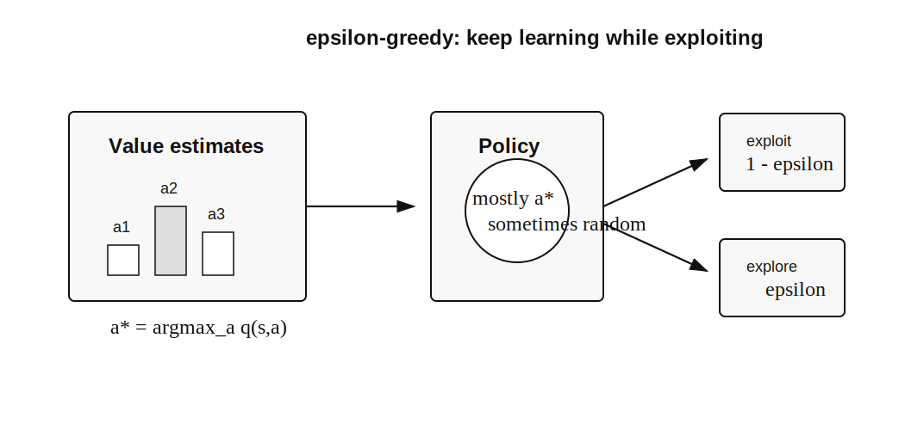

<small>图 4：\(\epsilon\)-greedy 用大概率利用当前最优动作，同时保留小概率探索其他动作，避免过早锁死在错误估计上。</small>

为什么必须探索？因为 action value 是从样本估计来的，早期估计可能很不准。如果某个动作一开始碰巧得到低 return，纯 greedy 策略可能永远不再选择它，也就永远没有机会修正这个错误估计。\(\epsilon\)-greedy 通过给每个动作保留非零概率，让“看起来不优”的动作也有机会被重新评估。

这也是 RL 和普通优化的一个差异：学习算法不仅要利用当前知识，还要主动收集能改善知识的数据。exploration 和 exploitation 的张力贯穿整个 RL。

Monte Carlo 已经摆脱模型，但必须等到 episode 结束才能计算 return，而且每次更新依赖整条轨迹。要做到真正边交互边学习，需要把样本平均改写成增量形式，这就是随机逼近和 TD 的入口。

---

## 第 7 节：随机逼近：TD 为什么可以这样更新

Monte Carlo 方法是非增量的。它必须等到 episode 结束，才能计算完整 return。TD learning 则可以每走一步就更新一次。为了理解 TD，需要先理解随机逼近。

Stochastic approximation 回答了一个常见困惑：TD update 看起来像一个启发式公式，为什么可以相信它会朝正确方向走？如果一个方程的精确期望不可得，但可以获得带噪声的样本估计，就可以用逐步缩小的学习率逼近它的根或不动点。

从均值估计开始。给定样本 \(x_1,\ldots,x_n\)，样本均值是：

\[
\bar{x}_n=\frac{1}{n}\sum_{i=1}^n x_i.
\]

它可以写成增量形式：

\[
w_{k+1}=w_k-\frac{1}{k}(w_k-x_k).
\]

更一般地，Robbins-Monro 算法用于求解方程

\[
g(w)=0.
\]

如果只能观察到带噪声的 \(g(w_k)\)：

\[
\hat{g}(w_k)=g(w_k)+\eta_k,
\]

则更新为：

\[
w_{k+1}
=w_k-\alpha_k[g(w_k)+\eta_k].
\]

典型收敛条件是：

\[
\sum_{k=1}^{\infty}\alpha_k=\infty,
\qquad
\sum_{k=1}^{\infty}\alpha_k^2<\infty.
\]

第一条保证学习率总量足够大，不会太早停下；第二条保证噪声影响最终会被压下去。

这就是 TD 的数学准备：Bellman 方程可以看成一个待求根的问题，样本提供带噪声的估计，随机逼近给出增量更新框架。

把这个思想套到 Bellman 方程上。对固定策略 \(\pi\)，Bellman 方程可以写为：

\[
v_\pi(s)-\mathbb{E}[R_{t+1}+\gamma v_\pi(S_{t+1})|S_t=s]=0.
\]

如果模型已知，可以精确计算右侧期望；如果模型未知，可以用一次实际转移

\[
r_{t+1}+\gamma v(s_{t+1})
\]

作为带噪声的样本。于是更新目标就从“求精确期望”变成“用样本噪声下的随机逼近逐步靠近 Bellman 方程的解”。

这里也能看出学习率为什么不是随便选的。学习率太大，样本噪声会让估计不断震荡；学习率太小，早期错误会很难修正。理论收敛条件给出的是渐近要求，实际深度 RL 中常用常数学习率和优化器，但背后的直觉仍是平衡“跟随新样本”和“抑制噪声”。

随机逼近提供的是通用工具。下一节把这个工具具体用在 Bellman 方程上，就得到 TD、Sarsa 和 Q-learning。

---

## 第 8 节：Temporal-Difference：MC 与 DP 的中间点

TD learning 结合了 Monte Carlo 和 dynamic programming 的思想。

它像 MC 一样不需要模型，只使用经验样本；又像 DP 一样使用 bootstrap，也就是用当前 value estimate 来构造 target。

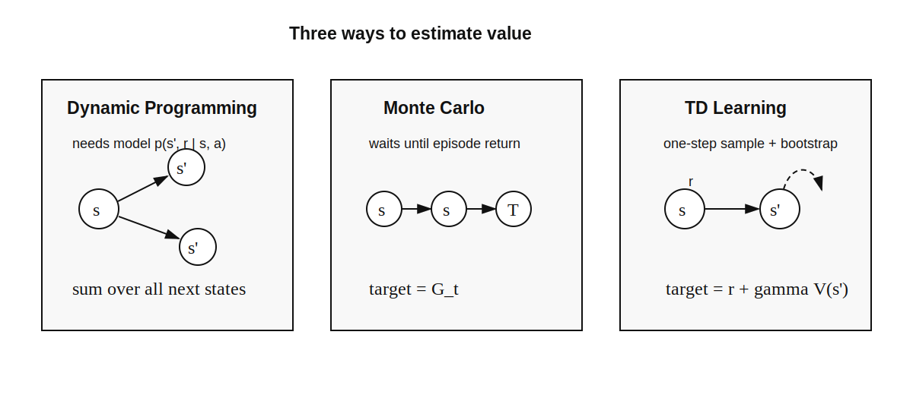

<small>图 5：DP 使用模型对所有下一状态求和，MC 等完整 return，TD 使用一步样本和下一状态的当前估计。</small>

### 8.1 TD state-value learning

给定策略 \(\pi\)，TD 用样本

\[
(s_t,r_{t+1},s_{t+1})
\]

更新状态价值：

\[
v_{t+1}(s_t)
=v_t(s_t)
+\alpha_t
\left[
r_{t+1}+\gamma v_t(s_{t+1})-v_t(s_t)
\right].
\]

可以把它读成统一的增量更新模板：

\[
\text{new estimate}
=
\text{old estimate}
+\alpha
\left(
\text{target}-\text{old estimate}
\right).
\]

其中 target 是

\[
r_{t+1}+\gamma v_t(s_{t+1}).
\]

如果 target 比当前估计大，value 上调；如果 target 更小，value 下调。学习率决定只修正一部分，避免被单个随机样本完全带走。

其中

\[
\bar{v}_t=r_{t+1}+\gamma v_t(s_{t+1})
\]

称为 TD target，

\[
\delta_t
=r_{t+1}+\gamma v_t(s_{t+1})-v_t(s_t)
\]

称为 TD error。

这个公式可以从 Bellman expectation equation 推出。Bellman 方程写作：

\[
v_\pi(s)=
\mathbb{E}_\pi[R_{t+1}+\gamma v_\pi(S_{t+1})|S_t=s].
\]

把右侧的期望换成单步样本，再用当前估计 \(v_t\) 近似 \(v_\pi\)，就得到 TD target。更新方向就是把 \(v_t(s_t)\) 推向这个 target。

TD 和 MC 的体验差别很大。MC 必须等 episode 结束，因此不能自然处理没有终止状态的 continuing task。TD 只需要下一步样本，因此可以边走边学。代价是 TD 使用了 bootstrap：target 中的 \(v_t(s_{t+1})\) 本身也是估计值，可能有偏。MC 使用真实 return，偏差较小，但方差通常更大。这个 bias-variance tradeoff 是理解 TD 家族的关键。

### 8.2 Sarsa

如果估计 action value，就得到 Sarsa。给定样本

\[
(s_t,a_t,r_{t+1},s_{t+1},a_{t+1}),
\]

更新为：

\[
q_{t+1}(s_t,a_t)
=q_t(s_t,a_t)
+\alpha_t
\left[
r_{t+1}
+\gamma q_t(s_{t+1},a_{t+1})
-q_t(s_t,a_t)
\right].
\]

名字 Sarsa 来自这五元组：

\[
S_t,A_t,R_{t+1},S_{t+1},A_{t+1}.
\]

Sarsa 是 on-policy 的：用于更新的下一动作 \(a_{t+1}\) 来自当前正在执行的策略。因此它学习的是当前策略的 action value。

这带来一个实际后果：Sarsa 会把探索策略的风险也纳入学习。如果 \(\epsilon\)-greedy 策略有一定概率走进危险区域，Sarsa 的 value 会反映这种风险，因此可能学到更保守的路径。Q-learning 的 target 使用 \(\max_a q(s',a)\)，更像是假设下一步会执行贪心最优动作，因此在同样探索行为下可能更激进。

### 8.3 n-step Sarsa

一步 TD 的 target 是：

\[
r_{t+1}+\gamma q(s_{t+1},a_{t+1}).
\]

Monte Carlo 的 target 是完整 return。n-step Sarsa 位于二者之间：

\[
G_{t:t+n}
=r_{t+1}
+\gamma r_{t+2}
+\cdots
+\gamma^{n-1}r_{t+n}
+\gamma^n q(s_{t+n},a_{t+n}).
\]

当 \(n=1\) 时，就是 Sarsa；当 \(n\) 延伸到 episode 终止时，就接近 MC。这个统一视角很重要：MC 和 TD 不是两套割裂的方法，而是 bootstrap 深度不同。

### 8.4 Q-learning

Q-learning 直接学习最优 action value。它的更新为：

\[
q_{t+1}(s_t,a_t)
=q_t(s_t,a_t)
+\alpha_t
\left[
r_{t+1}
+\gamma\max_a q_t(s_{t+1},a)
-q_t(s_t,a_t)
\right].
\]

Q-learning 的三个部分分别是：

- 当前预测：\(q_t(s_t,a_t)\)。
- 最优性 target：\(r_{t+1}+\gamma\max_aq_t(s_{t+1},a)\)。
- TD error：target 减当前预测。

它是在用单个转移样本随机逼近 Bellman optimality equation。

与 Sarsa 的区别只在 TD target：

Sarsa：

\[
r_{t+1}+\gamma q_t(s_{t+1},a_{t+1}).
\]

Q-learning：

\[
r_{t+1}+\gamma\max_a q_t(s_{t+1},a).
\]

Sarsa 评估当前行为策略，Q-learning 则在 target 中直接使用贪心动作，因此对应 Bellman optimality equation：

\[
q_*(s,a)
=\mathbb{E}
\left[
R_{t+1}+\gamma\max_{a'}q_*(S_{t+1},a')
\,\middle|\,S_t=s,A_t=a
\right].
\]

这也是为什么 Q-learning 可以 off-policy：行为策略可以负责探索，更新目标却指向贪心最优策略。

一个常见总结是：

| 算法 | target | 学到的对象 | 策略属性 |
|---|---|---|---|
| TD state value | \(r+\gamma v(s')\) | 当前策略的 \(v_\pi\) | policy evaluation |
| Sarsa | \(r+\gamma q(s',a')\) | 当前行为策略的 \(q_\pi\) | on-policy |
| Q-learning | \(r+\gamma\max_{a'}q(s',a')\) | 最优 \(q_*\) | off-policy |

这张表比公式本身更能说明 TD 家族的分化：差异几乎全部集中在 target 怎么构造。

表格 TD 方法已经能在未知模型中学习，但它仍假设每个状态或状态动作对都有独立表项。状态变成图像、连续向量或复杂上下文后，这个假设会彻底失效。下一节需要把 value table 换成参数化函数。

---

## 第 9 节：函数近似与 Deep Q-learning

到目前为止，value 都被表格保存。表格方法在小状态空间中清晰，但在大规模问题中不可行。比如图像状态、连续控制状态或语言交互状态，状态空间巨大甚至连续，无法为每个状态单独保存一个 value。

函数近似的思想是：不用表格保存每个状态的值，而是用参数化函数表示 value。

\[
\hat{v}(s,w)\approx v_\pi(s).
\]

也可以表示 action value：

\[
\hat{q}(s,a,w)\approx q_\pi(s,a).
\]

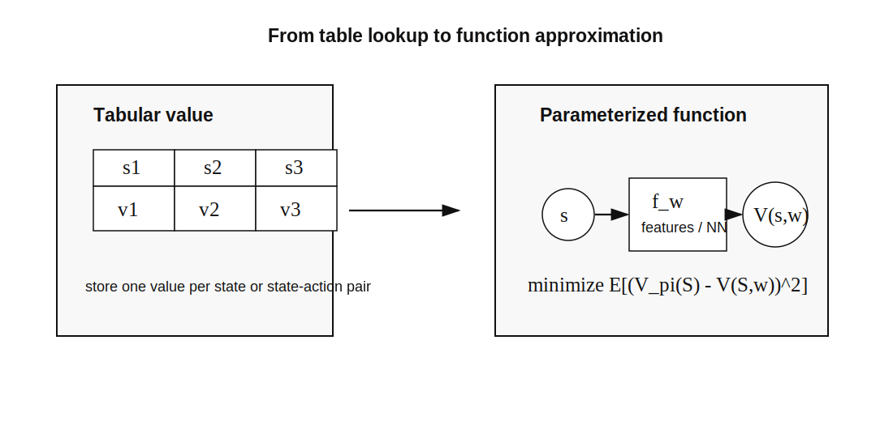

<small>图 6：从 tabular representation 到 function approximation。代价是引入近似误差，收益是泛化和存储效率。</small>

函数近似不仅是节省存储。更重要的是它带来泛化：在某些状态上学到的参数，会影响相似状态的价值估计。比如 grid world 中，如果用坐标特征表示状态，模型可能学到“离目标越近价值越高”这样的规律，而不必分别访问每一个格子无数次。

但泛化也是风险来源。表格方法中，更新 \(q(s,a)\) 不会影响其他 state-action pair；函数近似中，更新参数 \(w\) 会同时改变许多状态的预测值。如果特征选择不好或神经网络训练不稳定，某些状态的 value 可能被错误泛化污染。这就是为什么函数近似章节不仅讲公式，也强调 objective function、feature selection 和 theoretical analysis。

### 9.1 目标函数

状态价值函数近似的自然目标是最小化均方误差：

\[
J(w)
=\mathbb{E}
\left[
\left(v_\pi(S)-\hat{v}(S,w)\right)^2
\right].
\]

如果用梯度下降，需要

\[
\nabla_w J(w)
=
\mathbb{E}
\left[
-2
\left(v_\pi(S)-\hat{v}(S,w)\right)
\nabla_w\hat{v}(S,w)
\right].
\]

因此梯度更新方向可以写为：

\[
w_{t+1}
=w_t+\alpha_t
\left(v_\pi(s_t)-\hat{v}(s_t,w_t)\right)
\nabla_w\hat{v}(s_t,w_t).
\]

问题是 \(v_\pi(s_t)\) 未知。于是有两种替代。

MC 替代：

\[
v_\pi(s_t)\approx G_t.
\]

TD 替代：

\[
v_\pi(s_t)\approx r_{t+1}+\gamma\hat{v}(s_{t+1},w_t).
\]

于是 TD with function approximation：

\[
w_{t+1}
=w_t+\alpha_t
\left[
r_{t+1}
+\gamma\hat{v}(s_{t+1},w_t)
-\hat{v}(s_t,w_t)
\right]
\nabla_w\hat{v}(s_t,w_t).
\]

与表格 TD 相比，方括号仍然是 TD error。新增的

\[
\nabla_w\hat{v}(s_t,w_t)
\]

负责把“当前状态的预测应该增大或减小”转换成“参数向量 \(w\) 应该往哪个方向移动”。表格更新只改一个格子，函数近似更新的是共享参数。

方括号中仍然是 TD error。

### 9.2 Sarsa 和 Q-learning 的函数近似

Sarsa with function approximation：

\[
w_{t+1}
=w_t+\alpha_t
\left[
r_{t+1}
+\gamma\hat{q}(s_{t+1},a_{t+1},w_t)
-\hat{q}(s_t,a_t,w_t)
\right]
\nabla_w\hat{q}(s_t,a_t,w_t).
\]

Q-learning with function approximation：

\[
w_{t+1}
=w_t+\alpha_t
\left[
r_{t+1}
+\gamma\max_a\hat{q}(s_{t+1},a,w_t)
-\hat{q}(s_t,a_t,w_t)
\right]
\nabla_w\hat{q}(s_t,a_t,w_t).
\]

如果 \(\hat{q}\) 是神经网络，就进入 deep Q-learning。

需要注意，这里的梯度写法实际上用了半梯度思想。target 中也含有 \(w_t\)，如果对 target 完整求导，形式会更复杂，稳定性也更差。很多 TD 函数近似方法把 target 当作临时常数，只对当前预测 \(\hat{q}(s_t,a_t,w_t)\) 求梯度。DQN 的 target network 可以看成把这个“临时常数”思想做得更明确。

### 9.3 DQN 的两个关键技术

Deep Q-learning 面临一个稳定性问题：target 本身依赖当前网络参数。如果 target 和预测值同时快速变化，训练容易发散。

DQN 用 target network 缓解这个问题。主网络参数为 \(w\)，目标网络参数为 \(w_T\)。目标变成：

\[
y
=r+\gamma\max_{a'}\hat{q}(s',a',w_T).
\]

目标函数：

\[
J(w)
=
\mathbb{E}
\left[
\left(
r+\gamma\max_{a'}\hat{q}(s',a',w_T)
-\hat{q}(s,a,w)
\right)^2
\right].
\]

当 \(w_T\) 固定一段时间时，优化 \(w\) 更稳定。每隔若干步，再把主网络参数同步给目标网络。

另一个关键技术是 experience replay。交互样本按时间顺序高度相关，如果直接顺序训练，样本分布不稳定。Replay buffer 把样本

\[
(s,a,r,s')
\]

存起来，每次从 buffer 中近似均匀采样 mini-batch。这样既打散相关性，又提高样本复用率。

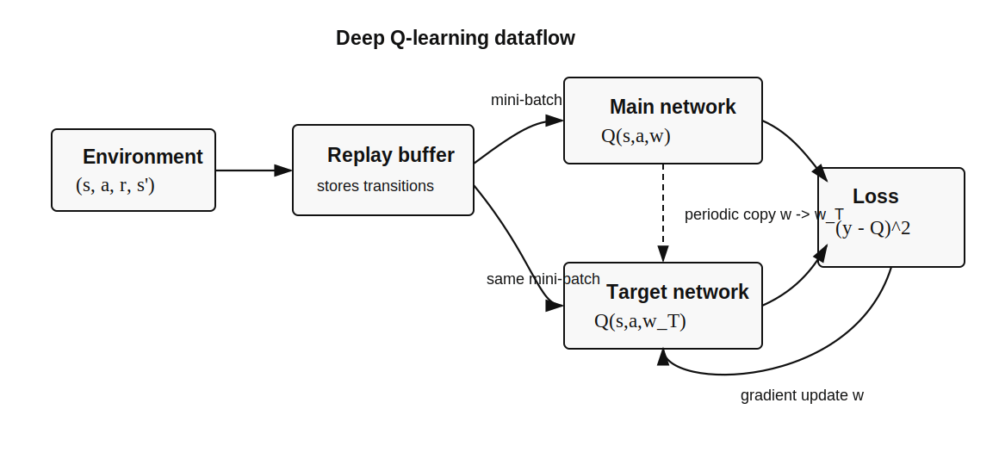

<small>图 7：DQN 的两个稳定化组件。Replay buffer 改变数据使用方式，target network 改变 target 的变化速度。</small>

DQN 可以被理解成“Q-learning + 神经网络 + 两个稳定化技巧”。主网络 \(Q(s,a,w)\) 负责当前预测，目标网络 \(Q(s,a,w_T)\) 负责构造相对稳定的 target：

\[
y=r+\gamma\max_{a'}Q(s',a',w_T).
\]

训练时最小化

\[
(y-Q(s,a,w))^2.
\]

如果没有 target network，target 会随着主网络每一步更新而移动；如果没有 replay buffer，样本高度相关且分布随策略快速漂移。两者都不是改变 Bellman 目标本身，而是让神经网络优化更接近一个可训练的监督学习问题。

函数近似解决了 value-based 方法的规模问题，但策略仍然是从 \(q(s,a)\) 间接导出的。如果动作连续，或者我们希望显式学习随机策略，\(\arg\max_a q(s,a)\) 可能很困难。下一节转向直接参数化和优化策略。

---

## 第 10 节：Policy Gradient：直接优化策略

前面的大部分方法都是 value-based：先估计 value，再从 value 导出策略。Policy gradient 走另一条路：直接把策略表示为参数化函数，并直接优化它。

为什么需要 policy-based 方法？一个原因是动作空间可能很大或连续。若动作是机械臂关节角度，\(\max_a q(s,a)\) 可能不是简单枚举能解决的。另一个原因是有些任务本身需要随机策略，比如在博弈或探索任务中，确定性策略可能太容易被利用或过早陷入局部行为。

\[
\pi(a|s,\theta).
\]

一个常见参数化方式是 softmax policy。假设每个动作有一个 preference \(h_\theta(s,a)\)，则

\[
\pi(a|s,\theta)
=
\frac{\exp(h_\theta(s,a))}
{\sum_b\exp(h_\theta(s,b))}.
\]

优化 \(\theta\) 就是在调整各动作概率，而不是先学习完整的 value table。

目标是最大化某个标量指标：

\[
J(\theta).
\]

于是可以使用梯度上升：

\[
\theta_{t+1}
=\theta_t+\alpha\nabla_\theta J(\theta_t).
\]

关键问题变成：\(\nabla_\theta J(\theta)\) 怎么算？

### 10.1 Policy Gradient Theorem

Policy gradient 方法最重要的理论结果是 policy gradient theorem。其核心形式为：

\[
\nabla_\theta J(\theta)
=
\sum_{s\in\mathcal{S}}\eta(s)
\sum_{a\in\mathcal{A}}
\nabla_\theta\pi(a|s,\theta)q_\pi(s,a),
\]

也可以写成期望形式：

\[
\nabla_\theta J(\theta)
=
\mathbb{E}_{S\sim\eta,A\sim\pi}
\left[
\nabla_\theta\ln\pi(A|S,\theta)
\cdot q_\pi(S,A)
\right].
\]

这条公式可以拆成两部分：

- \(\nabla_\theta\ln\pi(A|S,\theta)\)：怎样改变参数，才能提高这次所选动作的概率。
- \(q_\pi(S,A)\)：这次动作的长期结果有多好。

前者提供更新方向，后者提供方向的权重。策略梯度并不是盲目提高所有采样动作的概率，而是更强调高价值动作。

\(\eta(s)\) 表示不同状态在目标函数中的权重或访问分布。它提醒我们：策略梯度并不是对所有理论上可能的状态同等优化，而是更关注当前策略实际会访问、或目标函数特别强调的状态。

这里使用了 log-derivative trick：

\[
\nabla_\theta\pi(a|s,\theta)
=
\pi(a|s,\theta)\nabla_\theta\ln\pi(a|s,\theta).
\]

这个定理很重要，因为它把策略目标的梯度写成了可采样的形式。只要能采样 \(S,A\)，并估计 \(q_\pi(S,A)\)，就可以做随机梯度上升。

这个公式的直觉是：如果动作 \(A\) 的 \(q_\pi(S,A)\) 高，就沿着增加 \(\log\pi(A|S,\theta)\) 的方向更新；如果它低，更新幅度就小，或者在带 baseline 的版本中变成负向更新。\(\nabla_\theta\log\pi\) 是“怎样改变参数才能提高这次实际采到的动作概率”，\(q_\pi\) 则告诉我们“这次动作值不值得被提高概率”。

这也解释了为什么 policy gradient 需要 value 估计。它虽然是直接优化策略，但梯度权重仍依赖 \(q_\pi\) 或 advantage。没有这个权重，算法只知道“发生了什么动作”，不知道这个动作好不好。

### 10.2 REINFORCE

把真实梯度替换成单样本随机梯度：

\[
\theta_{t+1}
=\theta_t+\alpha
\nabla_\theta\ln\pi(a_t|s_t,\theta_t)
\cdot q_t(s_t,a_t).
\]

如果 \(q_t(s_t,a_t)\) 用 Monte Carlo return 估计：

\[
q_t(s_t,a_t)=G_t,
\]

就得到 REINFORCE：

\[
\theta
\leftarrow
\theta+\alpha
\nabla_\theta\ln\pi(a_t|s_t,\theta)
\cdot G_t.
\]

一条 episode 中，每个时间步都可以用从该步开始的 return 更新：

\[
G_t=\sum_{k=t}^{T-1}\gamma^{k-t}r_{k+1}.
\]

直觉上，如果某个动作后续 return 高，就提高该动作在该状态下的概率；如果 return 低，就降低它的概率。这个思路非常直接，但 MC 估计方差较大，因此需要 baseline 和 actor-critic。

REINFORCE 的优点是简单、无偏、和策略参数化形式兼容。缺点也同样明显：一条 trajectory 的 return 可能波动很大，导致梯度方差很高。比如同一个动作本身是好的，但后续因为环境随机性或之后的动作失误导致 return 很差，REINFORCE 仍可能错误惩罚这一步动作。baseline 和 critic 的作用，就是尽量把“动作本身的贡献”和“轨迹噪声”分离开。

REINFORCE 已经能直接学习策略，但它又回到了类似 MC 的问题：必须依赖完整 return，更新方差很高。自然的下一步是引入一个 value estimator，在线判断某次动作比预期好还是差，这就是 actor-critic。

---

## 第 11 节：Actor-Critic：策略梯度和价值学习的合流

Actor-Critic 仍然属于 policy gradient 方法。它的名字强调结构：

- Actor：策略 \(\pi(a|s,\theta)\)，负责选择动作并更新策略参数。
- Critic：价值函数 \(v(s,w)\) 或 \(q(s,a,w)\)，负责评价当前动作或状态。

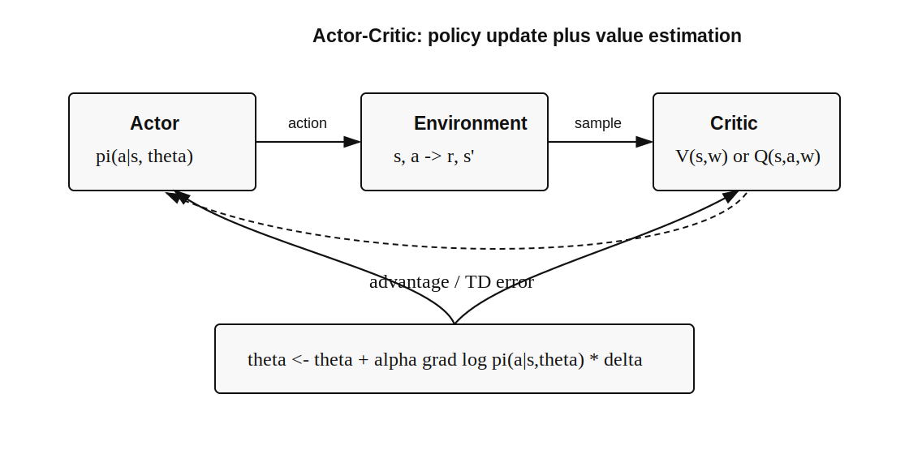

<small>图 8：Actor-Critic 把 policy update 和 value estimation 放在同一个闭环中。Critic 给出 advantage 或 TD error，Actor 用它更新策略。</small>

一个完整 actor-critic step 可以这样读：

1. Actor 根据当前策略 \(\pi(a|s,\theta)\) 在状态 \(s_t\) 采样动作 \(a_t\)。
2. 环境返回 \(r_{t+1}\) 和 \(s_{t+1}\)。
3. Critic 计算 TD error 或 advantage，判断这次动作比预期好还是差。
4. Actor 用这个信号调整动作概率。
5. Critic 同时用这次样本更新自己的价值估计。

这比 REINFORCE 更在线：不必等 episode 完整结束，也不必只依赖高方差的完整 return。

### 11.1 Q Actor-Critic

从 policy gradient update 出发：

\[
\theta_{t+1}
=\theta_t+\alpha_\theta
\nabla_\theta\ln\pi(a_t|s_t,\theta_t)
\cdot q_t(s_t,a_t).
\]

如果 \(q_t\) 不再用 MC return，而是由 TD 方法和函数近似估计：

\[
q(s,a,w)\approx q_\pi(s,a),
\]

就得到最简单的 actor-critic。Actor 更新：

\[
\theta_{t+1}
=\theta_t+\alpha_\theta
\nabla_\theta\ln\pi(a_t|s_t,\theta_t)
\cdot q(s_t,a_t,w_t).
\]

Critic 可以使用 Sarsa 风格更新：

\[
w_{t+1}
=w_t+\alpha_w
\left[
r_{t+1}
+\gamma q(s_{t+1},a_{t+1},w_t)
-q(s_t,a_t,w_t)
\right]
\cdot\nabla_w q(s_t,a_t,w_t).
\]

这就是“policy-based plus value-based”：策略直接优化，价值函数负责提供低方差的学习信号。

QAC 是最直观的 actor-critic，因为 actor update 中直接使用 \(q(s,a,w)\)。不过它需要 critic 学一个 action-value function。若动作空间大或连续，学习 \(q(s,a)\) 可能更困难；因此很多 actor-critic 方法使用 state-value function \(v(s,w)\) 和 advantage。

### 11.2 Baseline invariance

Policy gradient 有一个关键性质：可以减去只依赖状态的 baseline，而不改变梯度期望。

\[
\mathbb{E}_{S,A}
\left[
\nabla_\theta\ln\pi(A|S,\theta)q_\pi(S,A)
\right]
=
\mathbb{E}_{S,A}
\left[
\nabla_\theta\ln\pi(A|S,\theta)
(q_\pi(S,A)-b(S))
\right].
\]

原因是：

\[
\begin{aligned}
\mathbb{E}_{A\sim\pi}
\left[
\nabla_\theta\ln\pi(A|S,\theta)b(S)
\right]
&=
b(S)\sum_a\pi(a|S,\theta)
\nabla_\theta\ln\pi(a|S,\theta)\\
&=
b(S)\sum_a\nabla_\theta\pi(a|S,\theta)\\
&=
b(S)\nabla_\theta\sum_a\pi(a|S,\theta)\\
&=
b(S)\nabla_\theta 1\\
&=0.
\end{aligned}
\]

baseline 不改变期望，但可以降低方差。

这个性质特别漂亮：baseline 可以随状态变化，但不能依赖动作。若 baseline 依赖动作，它就会改变不同动作之间的相对权重，从而改变梯度方向。选择 \(v_\pi(s)\) 作为 baseline 的直觉是，把“这个状态本来就容易得到高回报”的部分扣掉，只保留“这个动作相对平均水平到底好多少”。

### 11.3 Advantage Actor-Critic

最常用的 baseline 是状态价值：

\[
b(s)=v_\pi(s).
\]

于是得到 advantage：

\[
A_\pi(s,a)=q_\pi(s,a)-v_\pi(s).
\]

它表示动作 \(a\) 相对于该状态平均动作水平的优势。如果 \(A_\pi(s,a)>0\)，这个动作比策略平均水平更好；如果小于 0，则更差。

Policy gradient 更新变成：

\[
\theta_{t+1}
=\theta_t+\alpha_\theta
\nabla_\theta\ln\pi(a_t|s_t,\theta_t)
\cdot A_t.
\]

在 A2C 中，advantage 常用 TD error 近似：

\[
A_t
\approx
\delta_t
=r_{t+1}+\gamma v(s_{t+1},w_t)-v(s_t,w_t).
\]

因此 Actor 更新：

\[
\theta_{t+1}
=\theta_t+\alpha_\theta
\nabla_\theta\ln\pi(a_t|s_t,\theta_t)
\cdot\delta_t.
\]

Critic 更新：

\[
w_{t+1}
=w_t+\alpha_w
\delta_t\cdot\nabla_w v(s_t,w_t).
\]

这就是 actor-critic 的核心闭环：Critic 用 TD 学 value，Actor 用 Critic 给出的 TD error 或 advantage 学 policy。

用 TD error 近似 advantage 的好处是只需要一个 state-value critic：

\[
\delta_t=r_{t+1}+\gamma v(s_{t+1},w_t)-v(s_t,w_t).
\]

如果 \(\delta_t>0\)，说明实际结果比 critic 对当前状态的预期更好，actor 会提高 \(a_t\) 的概率；如果 \(\delta_t<0\)，说明结果低于预期，actor 会降低它的概率。这使得 TD error 同时承担两种角色：critic 的学习误差，以及 actor 的策略改进信号。

### 11.4 Off-policy Actor-Critic

如果样本来自行为策略 \(\beta(a|s)\)，但我们要优化目标策略 \(\pi(a|s,\theta)\)，就需要 importance sampling：

\[
\rho_t
=
\frac{\pi(a_t|s_t,\theta)}
{\beta(a_t|s_t)}.
\]

Actor 更新变成：

\[
\theta_{t+1}
=\theta_t+\alpha_\theta
\rho_t\cdot\delta_t
\cdot\nabla_\theta\ln\pi(a_t|s_t,\theta_t).
\]

Critic 更新也可以乘上同样的修正：

\[
w_{t+1}
=w_t+\alpha_w
\rho_t\cdot\delta_t
\cdot\nabla_w v(s_t,w_t).
\]

这说明 off-policy 学习的核心困难不是“能不能用别的策略数据”，而是“如何修正不同策略诱导的数据分布差异”。

在工程系统中，off-policy actor-critic 非常有吸引力，因为它允许复用旧数据或由多个 actor 异步采集的数据。但 importance ratio 也会引入新的方差问题：如果目标策略和行为策略差异太大，\(\rho_t\) 可能极端大，训练会不稳定。因此实际算法常会配合 ratio clipping、trust region、replay 策略或更复杂的 off-policy correction。

---

## 第 12 节：PPO：给策略更新加一道护栏

Actor-Critic 解决了 REINFORCE 方差过大的问题，但还留下一个实际困难：**同一批数据上，策略究竟可以更新多远？**

如果更新太小，采集一批轨迹后只迈一小步，样本利用率很低；如果在同一批数据上反复更新太多次，新策略可能已经和采样时的旧策略相差很大，原先的 advantage 也不再可靠。PPO（Proximal Policy Optimization）要解决的正是这个矛盾：允许对一批 on-policy 数据做多轮 minibatch 更新，同时抑制动作概率发生过大的变化。

### 12.1 从策略梯度到 probability ratio

设采集轨迹时使用旧策略 \(\pi_{\theta_{\mathrm{old}}}\)，正在更新的新策略为 \(\pi_\theta\)。样本来自旧策略，但我们想评估新策略，因此引入 importance ratio：

\[
r_t(\theta)
=
\frac{\pi_\theta(a_t|s_t)}
{\pi_{\theta_{\mathrm{old}}}(a_t|s_t)}.
\]

它直接描述某个动作的概率变化：\(r_t=1\) 表示新旧策略一致，\(r_t>1\) 表示新策略更倾向这个动作，\(r_t<1\) 表示新策略降低了它的概率。

这个比率来自一个直接的换分布过程。对任意样本函数 \(f(s,a)\)，

\[
\begin{aligned}
\mathbb E_{a\sim\pi_\theta(\cdot|s)}[f(s,a)]
&=\sum_a\pi_\theta(a|s)f(s,a)\\
&=\sum_a\pi_{\theta_{\mathrm{old}}}(a|s)
\frac{\pi_\theta(a|s)}
{\pi_{\theta_{\mathrm{old}}}(a|s)}
f(s,a)\\
&=\mathbb E_{a\sim\pi_{\theta_{\mathrm{old}}}(\cdot|s)}
\left[r_t(\theta)f(s,a)\right].
\end{aligned}
\]

因此，虽然动作由旧策略采样，乘上 ratio 后仍可构造与新策略有关的估计。不过当新旧策略差异太大时，ratio 会产生高方差，这正是 PPO 随后要控制的问题。

旧策略数据上的 surrogate objective 为：

\[
L^{\mathrm{PG}}(\theta)
=
\mathbb{E}_t
\left[
r_t(\theta)\hat A_t
\right].
\]

若 \(\hat A_t>0\)，最大化目标会提高该动作的概率；若 \(\hat A_t<0\)，则会降低它的概率。但这个目标没有限制 \(r_t\) 能离 1 多远，少数 advantage 很大的样本可能让策略一次变化过猛。

### 12.2 Clipped surrogate objective

PPO-Clip 把 probability ratio 的有效改进范围限制在 \(1-\epsilon\) 到 \(1+\epsilon\) 附近：

\[
L^{\mathrm{CLIP}}(\theta)
=
\mathbb{E}_t
\left[
\min
\left(
r_t(\theta)\hat A_t,\,
\operatorname{clip}
\bigl(r_t(\theta),1-\epsilon,1+\epsilon\bigr)\hat A_t
\right)
\right].
\]

当 \(\hat A_t>0\) 时，这个动作比平均水平好，策略应提高它的概率；但 \(r_t>1+\epsilon\) 后，目标不再继续奖励这种增长。当 \(\hat A_t<0\) 时，策略应降低动作概率；但 \(r_t<1-\epsilon\) 后，目标不再鼓励继续大幅压低。

Clipping 并没有把参数 \(\theta\) 锁在一个硬边界里，而是截断“把概率推得更远”所能带来的目标收益。这样仍可使用普通一阶梯度与 minibatch，又不容易因单批数据上的过度优化而破坏策略。

### 12.3 从 TD error 到 GAE

PPO 仍需要估计 \(\hat A_t\)。一步 TD error 为：

\[
\delta_t
=
r_{t+1}
+\gamma V_\phi(s_{t+1})
-V_\phi(s_t).
\]

它方差较低，但 bootstrap bias 较强；完整 Monte Carlo return 偏差较小，方差却更大。GAE（Generalized Advantage Estimation）在两者之间折中：

\[
\hat A_t^{\mathrm{GAE}(\gamma,\lambda)}
=
\sum_{l=0}^{T-t-1}
(\gamma\lambda)^l\delta_{t+l}.
\]

\(\lambda=0\) 时接近一步 TD；\(\lambda\) 接近 1 时纳入更长时间范围的奖励。因此 \(\lambda\) 调节 advantage estimation 的 bias-variance trade-off，\(\gamma\) 仍表示任务对远期奖励的重视程度。

### 12.4 一次完整的 PPO 更新

PPO 通常同时训练 actor 与 value critic：

1. 固定 \(\pi_{\theta_{\mathrm{old}}}\)，与环境交互并收集一批 rollout。
2. 用奖励和 \(V_\phi(s)\) 计算 return 与 GAE advantage。
3. 把 rollout 切成 minibatch，对 clipped objective 做若干轮优化。
4. 同时拟合 value target，并加入 entropy bonus 保持探索。
5. 更新旧策略快照，再采集下一批数据。

常见的联合目标可概括为：

\[
\max_{\theta,\phi}\quad
L^{\mathrm{CLIP}}(\theta)
-c_v L^{\mathrm{value}}(\phi)
+c_e\mathcal{H}\bigl(\pi_\theta(\cdot|s)\bigr).
\]

PPO 没有离开 Actor-Critic：actor 仍是策略，critic 仍估计 value，advantage 仍连接二者。它主要改造的是 actor 的更新目标。

---

## 第 13 节：从 PPO-based RLHF 到 DPO 与 GRPO

把 PPO 用于大语言模型时，强化学习的基本对象只是换了含义：

| 经典强化学习 | 语言模型训练中的对应物 |
|---|---|
| state \(s_t\) | prompt 与已生成的 token 前缀 |
| action \(a_t\) | 下一个 token |
| policy \(\pi_\theta(a_t|s_t)\) | next-token distribution |
| trajectory | 一整段 response |
| reward | 对 response 的偏好、正确性或规则评分 |
| episode | 从 prompt 到 response 结束 |

语言模型的动作空间是巨大词表，episode 可能包含数百个 token，而许多任务只在完整回答结束后给出一个标量奖励。奖励稀疏、序列很长，因此 credit assignment 和稳定更新都更困难。

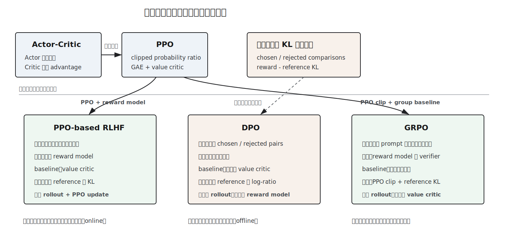

<small>图 9：PPO-based RLHF 与 GRPO 延续在线 rollout 和策略更新；DPO 从带 KL 正则的偏好目标出发，直接使用离线偏好对训练。三者不应被理解为一条简单的替代链。</small>

### 13.1 PPO-based RLHF：先学习奖励，再优化策略

经典 PPO-based RLHF 通常包含三个阶段：

1. 用高质量示范数据做 supervised fine-tuning（SFT），得到初始策略。
2. 收集人类对多个回答的偏好比较，训练 reward model \(r_\psi(x,y)\)。
3. 让当前策略生成回答，用 reward model 打分，再通过 PPO 更新策略。

只最大化 reward model 分数可能导致 reward hacking，策略也可能快速偏离原本可靠的语言分布。因此目标通常加入相对 reference policy 的 KL 惩罚：

\[
\max_\theta\quad
\mathbb{E}_{x,\,y\sim\pi_\theta(\cdot|x)}
\left[
r_\psi(x,y)
-\beta
\log\frac{\pi_\theta(y|x)}{\pi_{\mathrm{ref}}(y|x)}
\right].
\]

第一项推动回答获得更高偏好分数；第二项约束新策略不要离参考模型太远。对自回归模型，

\[
\log\pi_\theta(y|x)
=
\sum_{t=1}^{|y|}
\log\pi_\theta(y_t|x,y_{<t}),
\]

所以 sequence-level 约束可以分解到 token log-probability 上。PPO-based RLHF 能使用任意可计算奖励并在线探索，但系统较复杂：需要 policy、reference model、reward model、value model，以及持续的 rollout 与训练。

### 13.2 DPO：把偏好优化化成分类问题

DPO（Direct Preference Optimization）使用离线偏好对：

\[
\mathcal{D}
=
\{(x,y_w,y_l)\},
\]

其中 \(y_w\) 是 preferred response，\(y_l\) 是 rejected response。它不在训练循环中用 reward model 给新回答打分，而是直接提高 \(y_w\) 相对 \(y_l\) 的概率。

先考虑带 KL 正则的单个 prompt 优化问题：

\[
\max_{\pi}\quad
\mathbb{E}_{y\sim\pi(\cdot|x)}[r(x,y)]
-\beta
D_{\mathrm{KL}}
\left(
\pi(\cdot|x)\,\|\,\pi_{\mathrm{ref}}(\cdot|x)
\right).
\]

对约束 \(\sum_y\pi(y|x)=1\) 引入拉格朗日乘子并求极值，得到：

\[
\mathcal L(\pi,\lambda)
=
\sum_y\pi(y|x)r(x,y)
-\beta\sum_y\pi(y|x)
\log\frac{\pi(y|x)}{\pi_{\mathrm{ref}}(y|x)}
+\lambda\left(\sum_y\pi(y|x)-1\right).
\]

对每个 \(\pi(y|x)\) 求偏导并令其为 0：

\[
\frac{\partial\mathcal L}{\partial\pi(y|x)}
=
r(x,y)
-\beta\left[
\log\frac{\pi(y|x)}{\pi_{\mathrm{ref}}(y|x)}+1
\right]
+\lambda
=0.
\]

整理后可知，\(\pi(y|x)\) 与
\(\pi_{\mathrm{ref}}(y|x)\exp(r(x,y)/\beta)\) 成正比；再利用概率归一化条件吸收与 \(y\) 无关的常数，得到：

\[
\pi^*(y|x)
=
\frac{1}{Z(x)}
\pi_{\mathrm{ref}}(y|x)
\exp\left(\frac{r(x,y)}{\beta}\right).
\]

把它改写成 reward：

\[
r(x,y)
=
\beta\log
\frac{\pi^*(y|x)}
{\pi_{\mathrm{ref}}(y|x)}
+\beta\log Z(x).
\]

再用 Bradley-Terry model 表示偏好概率：

\[
p(y_w\succ y_l|x)
=
\sigma\bigl(r(x,y_w)-r(x,y_l)\bigr).
\]

代入 reward 表达式时，两个回答共享的 \(\beta\log Z(x)\) 抵消。用待训练策略 \(\pi_\theta\) 代替未知的最优策略，就得到：

\[
\begin{aligned}
L_{\mathrm{DPO}}(\theta)
=-\mathbb{E}_{(x,y_w,y_l)\sim\mathcal D}
\log\sigma\Bigg(
\beta\Bigg[
&\log\frac{\pi_\theta(y_w|x)}
{\pi_{\mathrm{ref}}(y_w|x)}\\
-&\log\frac{\pi_\theta(y_l|x)}
{\pi_{\mathrm{ref}}(y_l|x)}
\Bigg]
\Bigg).
\end{aligned}
\]

这个目标提高 chosen response 相对 reference 的 log-ratio，同时降低 rejected response 的 log-ratio。Reference policy 充当锚点，\(\beta\) 控制偏好拟合与偏离 reference 的尺度。

DPO 与 RL 有明确的数学联系，但它不是标准的在线 Actor-Critic：训练时没有环境 rollout、显式 reward model 或 value critic。它把特定的 KL-regularized preference objective 转成监督式二分类损失，系统更简单；相应地，它主要受限于已有偏好数据的覆盖范围，不能像在线 RL 那样持续探索。

### 13.3 GRPO：用同组回答构造相对 advantage

GRPO（Group Relative Policy Optimization）保留“当前策略采样回答，再根据奖励更新”的在线过程，但去掉单独的 value critic。对同一个 prompt \(x\)，先从旧策略采样一组回答：

\[
y_1,\ldots,y_G
\sim
\pi_{\theta_{\mathrm{old}}}(\cdot|x),
\]

再由 reward model、规则验证器或可执行测试得到分数 \(R_1,\ldots,R_G\)。组内均值可充当 baseline：

\[
\bar R
=
\frac{1}{G}\sum_{i=1}^{G}R_i,
\qquad
\hat A_i
=
\frac{R_i-\bar R}
{\operatorname{std}(R_1,\ldots,R_G)+\varepsilon}.
\]

真正影响更新的不是绝对分数，而是某个回答相对同一 prompt 下其他回答好多少。这与 Actor-Critic 的 advantage 思想一致；区别是 baseline 不由 value network 预测，而由采样组的统计量给出。

随后使用 PPO 风格的 clipped ratio。简化到 response 层面：

\[
r_i(\theta)
=
\frac{\pi_\theta(y_i|x)}
{\pi_{\theta_{\mathrm{old}}}(y_i|x)},
\]

\[
\max_\theta\quad
\mathbb{E}
\left[
\frac{1}{G}\sum_{i=1}^{G}
\min\left(
r_i(\theta)\hat A_i,\,
\operatorname{clip}(r_i(\theta),1-\epsilon,1+\epsilon)\hat A_i
\right)
-\beta D_{\mathrm{KL}}(\pi_\theta\|\pi_{\mathrm{ref}})
\right].
\]

实际实现通常在 token 粒度计算 ratio 和 KL，而组内 reward 决定整条 response 的相对 advantage。GRPO 省去了 value model 的显存和训练成本，适合数学、代码等可用答案或测试验证的任务。不过它仍需为每个 prompt 生成多个回答；组内样本太少或奖励几乎相同时，relative advantage 会很噪。

### 13.4 三条路径到底有什么不同

| 方法 | 数据来源 | 学习信号 | 需要 critic | 在线采样 | 主要用途 |
|---|---|---|---:|---:|---|
| PPO | 当前策略与环境交互 | reward + GAE advantage | 是 | 是 | 通用策略优化 |
| PPO-based RLHF | 当前 LLM 生成回答 | reward model + KL | 通常是 | 是 | 人类偏好对齐 |
| DPO | 固定的 chosen/rejected pairs | pairwise preference loss | 否 | 否 | 离线偏好优化 |
| GRPO | 同一 prompt 的一组在线回答 | group-relative reward | 否 | 是 | 可验证任务与推理训练 |

它们不是按时间简单替代彼此。PPO 是通用策略优化器；PPO-based RLHF 是 PPO 在偏好奖励场景中的系统组合；DPO 用离线目标换掉 reward-model rollout 环；GRPO 保留在线采样与奖励优化，但用组内比较替代 value critic。选择哪一种，取决于奖励能否在线计算、是否需要探索、偏好数据是否充足，以及系统能承担多少模型和 rollout 成本。

---

## 第 14 节：一张总表与学习路线

下面用一张表把核心方法按“是否需要模型、是否 bootstrap、是否直接优化策略”串起来。

| 方法 | 是否需要模型 | 是否使用样本 | 是否 bootstrap | 学习对象 | 核心公式 |
|---|---:|---:|---:|---|---|
| Bellman evaluation | 是 | 否 | 是 | \(v_\pi\) | \(v_\pi=r_\pi+\gamma P_\pi v_\pi\) |
| Value iteration | 是 | 否 | 是 | \(v_*\) | \(v_{k+1}=\max_\pi(r_\pi+\gamma P_\pi v_k)\) |
| Policy iteration | 是 | 否 | 是 | \(\pi,v_\pi\) | evaluation + improvement |
| Monte Carlo | 否 | 是 | 否 | \(v_\pi,q_\pi\) | \(q(s,a)\approx \text{avg}(G_t)\) |
| TD | 否 | 是 | 是 | \(v_\pi\) | \(v\leftarrow v+\alpha[r+\gamma v'-v]\) |
| Sarsa | 否 | 是 | 是 | \(q_\pi\) | \(q\leftarrow q+\alpha[r+\gamma q'-q]\) |
| Q-learning | 否 | 是 | 是 | \(q_*\) | \(q\leftarrow q+\alpha[r+\gamma\max q'-q]\) |
| Function approximation | 否 | 是 | 通常是 | \(\hat v,\hat q\) | \(w\leftarrow w+\alpha\delta\nabla_w \hat v\) |
| Policy gradient | 否 | 是 | 可选 | \(\pi_\theta\) | \(\nabla J=\mathbb{E}[\nabla\log\pi\,q]\) |
| Actor-Critic | 否 | 是 | 是 | \(\pi_\theta,v_w\) | \(\theta\leftarrow\theta+\alpha\nabla\log\pi\,\delta\) |
| PPO | 否 | 是 | 是 | \(\pi_\theta,v_\phi\) | \(\min(r_t\hat A_t,\operatorname{clip}(r_t)\hat A_t)\) |
| DPO | 否 | 离线偏好对 | 否 | \(\pi_\theta\) | chosen/rejected log-ratio classification |
| GRPO | 否 | 在线成组采样 | 否 | \(\pi_\theta\) | PPO clip + group-relative advantage |

如果把这套理论压成学习路线，可以按下面顺序理解。

第一步，先理解 MDP 和 return。RL 所有方法都服务于同一个目标：最大化长期回报。

第二步，理解 state value 和 action value。它们把随机轨迹的长期结果压缩成可比较的函数。

第三步，理解 Bellman 方程。它说明 value 不是孤立定义的，而是满足一步递推关系。

第四步，理解 BOE。最优控制就是把普通 Bellman 方程中的策略平均替换成对动作取最大。

第五步，理解 GPI。策略评价和策略改进的相互作用，是很多算法的共同骨架。

第六步，从模型切到样本。MC 用完整 return 的样本平均估计 value；TD 用一步样本加 bootstrap 估计 Bellman target。

第七步，从表格切到函数。函数近似牺牲精确表示，换来泛化能力和可扩展性。

第八步，从 value-based 切到 policy-based。Policy gradient 不再通过 value 间接导出策略，而是直接更新策略参数。

第九步，理解 actor-critic。它不是一类完全独立的思想，而是 policy gradient 和 TD value learning 的结合。

第十步，理解 PPO。它保留 actor-critic 的结构，用 probability ratio 和 clipping 控制策略更新幅度，并通过 GAE 改善 advantage estimation。

第十一步，把语言模型看成序列策略。PPO-based RLHF、DPO 和 GRPO 都在优化回答偏好，但分别采用“显式奖励加在线 PPO”“离线偏好分类”和“在线组内相对奖励”三种路径。

---

## 结论

强化学习基础理论的主线并不散。它从一个递推式开始：

\[
G_t=R_{t+1}+\gamma G_{t+1},
\]

然后发展出 Bellman 方程：

\[
v_\pi=\mathcal{T}_\pi v_\pi,
\]

再发展出 Bellman 最优性方程：

\[
v_*=\mathcal{T}_*v_*.
\]

有模型时，我们用动态规划求这些方程；无模型时，我们用采样和随机逼近求它们；状态空间变大时，我们用函数近似表示它们；直接优化策略时，我们用 policy gradient，把 value 变成梯度估计中的权重；actor-critic 用 TD 学到的 value 或 advantage 驱动 policy update；PPO 再用 clipped probability ratio 限制更新幅度。

所以，RL 的许多算法虽然形式不同，但背后的骨架高度一致：

\[
\text{estimate value}
\quad\longleftrightarrow\quad
\text{improve policy}.
\]

到了大语言模型阶段，PPO-based RLHF 仍沿用“采样、评价、改进策略”的闭环；DPO 把带 KL 约束的偏好目标化成离线分类损失；GRPO 则用同一 prompt 下的组内相对奖励替代 value critic。三者表面上都在提高优质回答的概率，数据产生方式、奖励表示和优化过程却不同。

掌握从 Bellman、TD、policy gradient、Actor-Critic 到 PPO 的主线，再看 DQN、A2C、SAC、RLHF 或大规模 rollout infra，就不会只看到算法名，而能判断每种系统究竟在估计什么、优化什么，以及用什么办法控制偏差、方差和策略漂移。

---

## 参考资料

- Shiyu Zhao, [*Mathematical Foundations of Reinforcement Learning* GitHub repository](https://github.com/MathFoundationRL/Book-Mathematical-Foundation-of-Reinforcement-Learning)
- Shiyu Zhao, [Book-all-in-one.pdf](https://github.com/MathFoundationRL/Book-Mathematical-Foundation-of-Reinforcement-Learning/blob/main/Book-all-in-one.pdf)
- Shiyu Zhao, [Lecture slides](https://github.com/MathFoundationRL/Book-Mathematical-Foundation-of-Reinforcement-Learning/tree/main/Lecture%20slides)
- Sutton and Barto, [*Reinforcement Learning: An Introduction*, 2nd edition](http://incompleteideas.net/book/the-book-2nd.html)
- John Schulman et al., [*Proximal Policy Optimization Algorithms*](https://arxiv.org/abs/1707.06347)
- John Schulman et al., [*High-Dimensional Continuous Control Using Generalized Advantage Estimation*](https://arxiv.org/abs/1506.02438)
- Long Ouyang et al., [*Training Language Models to Follow Instructions with Human Feedback*](https://arxiv.org/abs/2203.02155)
- Rafael Rafailov et al., [*Direct Preference Optimization: Your Language Model is Secretly a Reward Model*](https://arxiv.org/abs/2305.18290)
- Zhihong Shao et al., [*DeepSeekMath: Pushing the Limits of Mathematical Reasoning in Open Language Models*](https://arxiv.org/abs/2402.03300)
